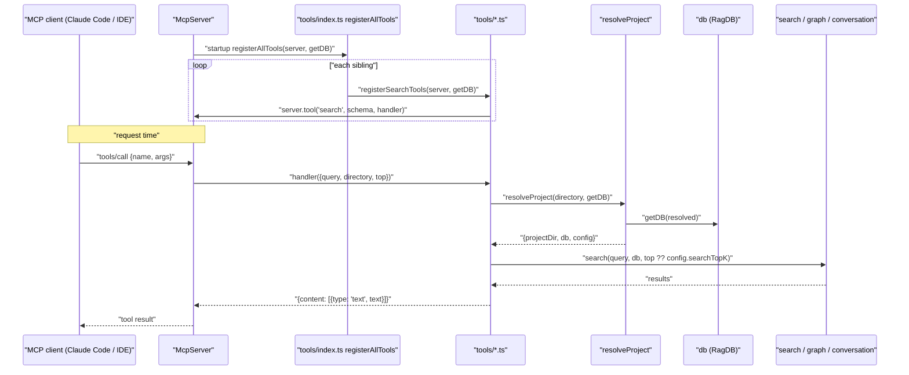
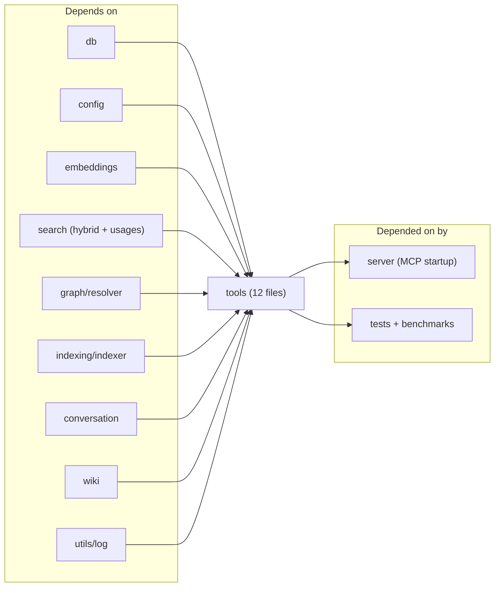

# tools

The MCP-tool registration layer. `src/tools/index.ts` exposes two things: `resolveProject(directory, getDB)` — the shared helper every tool handler uses to turn an optional `directory` arg into a `{ projectDir, db, config }` trio — and `registerAllTools(server, getDB, getConnectedDBs?, writeStatus?)`, which fans out to eleven `register*` helpers in sibling files. Each helper calls `server.tool(name, description, zodSchema, handler)` once per MCP tool it owns.

Entry file: `src/tools/index.ts`.

## Public API

Seven top-level exports — all from `src/tools/index.ts`:

```ts
export type GetDB = (dir: string) => RagDB;
export type WriteStatus = (status: string) => void;

export interface ConnectedDBInfo {
  projectDir: string;
  openedAt: Date;
  lastAccessed: Date;
}

export async function resolveProject(
  directory: string | undefined,
  getDB: GetDB,
): Promise<{ projectDir: string; db: RagDB; config: RagConfig }>

export function registerAllTools(
  server: McpServer,
  getDB: (dir: string) => RagDB,
  getConnectedDBs?: () => ConnectedDBInfo[],
  writeStatus?: WriteStatus,
): void

// Git helpers (used by git-tools.ts and file_history)
export async function findGitRoot(dir: string): Promise<string | null>
export async function runGit(args: string[], cwd: string): Promise<string | null>
```

Each sibling file exports exactly one `register*` function that takes `(server, getDB, ...)`. The handler closures inside each file are the MCP tool surface.

## How it works



1. **Server start.** `registerAllTools` runs once; each sibling registers its tools synchronously with the SDK. No tool logic runs at this stage — only schema definitions.
2. **`resolveProject` is the canonical entry.** Every handler calls it first. It picks the directory from `args.directory`, `process.env.RAG_PROJECT_DIR`, or `process.cwd()`, `resolve()`s the result, verifies it exists, loads the config, and applies the embedding config before the first embed.
3. **`getDB` caches DB connections.** The server passes a closure that opens a new `RagDB` the first time a directory is seen and reuses it afterwards. That's why `resolveProject` can call `getDB(resolved)` unconditionally without paying for repeated schema loads.
4. **Handlers return typed text.** The SDK expects `{ content: [{ type: "text", text }] }`. Handlers build that from domain results — no streaming, no structured output. Error messages take the same path; zod validation failures come from the SDK before the handler runs.

## Per-file breakdown

### `index.ts` — orchestrator and project resolver

Owns `resolveProject`, `registerAllTools`, `findGitRoot`, `runGit`, and the `GetDB` / `WriteStatus` / `ConnectedDBInfo` types used by every sibling. Doesn't register any MCP tools itself — it's the wiring file plus the `git` subprocess helpers used by `git-tools.ts` and `file_history`.

### `search.ts` — `search`, `read_relevant`, `search_symbols`, `find_usages`, `write_relevant`

The five search-surface tools. `search` calls `search()` from `search/hybrid`; `read_relevant` calls `searchChunks()` and formats chunks as `path:startLine-endLine\n<snippet>` blocks with any matching annotations interpolated as `[NOTE]` prefixes. `search_symbols` goes through `db.searchSymbols`. `find_usages` uses the `search/usages` helpers (`escapeRegex`, `sanitizeFTS`) plus an FTS match → within-chunk regex pipeline. `write_relevant` is the "where should this new code go?" tool — runs a search and returns the top-ranked file with an anchor chunk.

### `index-tools.ts` — `index_files`, `index_status`, `remove_file`

Wraps `indexDirectory` and `db.removeFile`. Threads `writeStatus` down so the IDE's `.mimirs/status` file updates during long reindex runs.

### `graph-tools.ts` — `project_map`, `depends_on`, `depended_on_by`, `impact_analysis`, `diff_context`

Wraps `generateProjectMap` from `graph/resolver`. `project_map` accepts `directory`, `focus`, `zoom` (`file` | `directory`), and `format` (`text` | `json`) — there is no `maxNodes` option; large graphs render fully and callers who want a trimmed view pass `focus` (plus the resolver's `maxHops` default of 2) or switch to `zoom: "directory"`. `depends_on` / `depended_on_by` are the file-level forward / reverse edge queries; they call `db.getImportsForFile` / `db.getImportersOf` directly. `impact_analysis` computes direct callers, transitive dependents, co-change history, and test coverage for a symbol or file. `diff_context` is the PR-review helper.

### `conversation-tools.ts` — `search_conversation`

The MCP counterpart to `mimirs conversation search`. Calls `db.searchConversation` with an embedded query.

### `checkpoint-tools.ts` — `create_checkpoint`, `list_checkpoints`, `search_checkpoints`

Creates and queries `conversation_checkpoints` rows. The `create_checkpoint` handler is what CLAUDE.md instructs the agent to call at the end of every task — the persistence seam between sessions.

### `annotation-tools.ts` — `annotate`, `get_annotations`, `delete_annotation`

Writes and reads `annotations`. Notes surface inline in `read_relevant` output via a left-join in the chunk query.

### `analytics-tools.ts` — `search_analytics`

Returns aggregated query-log data: top queries, zero-result rate, median latency. Consumed by meta-queries like "tell me what the agent has been searching for".

### `git-tools.ts` — `git_context`, `file_history`

`git_context` runs `git status` + `git log -n 20` (via the `runGit` helper exported from `index.ts`) and intersects with the index so the agent knows which changed files are already searchable. `file_history` returns the commit history for one path.

### `git-history-tools.ts` — `search_commits`

Wraps `db.searchGitCommits` with `author` / `since` / `until` / `path` filters.

### `server-info-tools.ts` — `server_info`

Returns metadata about the running MCP server: index size, connected DBs (when `getConnectedDBs` is supplied), embedding model. Used by `doctor`-like flows.

### `wiki-tools.ts` — `generate_wiki`

The four-phase wiki generator. `init` produces the `_discovery.json` / `_classified.json` / `_manifest.json` / `_content.json` artifacts via `runWikiPlanning`; `page: N` returns the payload for one page (candidate sections, exemplar path for aggregates, link map, semantic queries) via `getPagePayload`; `section: '<name>'` / `'library:<name>'` fetches specific data blobs; `finalize: true` runs the linking pass + validation; `resume: true` checks which pages are already on disk; `incremental: true` diffs the working tree against `lastGitRef` via `classifyStaleness`. The file also owns `WRITING_RULES` — the prose the agent reads about how to write wiki content. Incremental responses (both the "nothing to regenerate" path and the normal stale/new/removed listing) append `INDEX_FRESHNESS_NOTE`, a reminder that the planner reads the code index — if an expected change is missing, re-run `index_files()` and then `generate_wiki(incremental: true)` again.

## Dependencies and Dependents



Fan-out: 9 upstream domain modules. Fan-in: 13 dependents (primarily the server startup plus the full test surface — every tool has at least one integration test that imports its `register*` helper directly). The module is the widest join point in the codebase between MCP schemas and domain logic.

## Internals

- **Zod schemas enforce MCP contract, not domain invariants.** `query: z.string().min(1).max(2000)` is a boundary check; the handler still re-validates anything security-sensitive. The 2000-char cap is a hedge against runaway prompts, not a semantic limit.
- **`getConnectedDBs` is optional for a reason.** Single-root servers don't need it; the multi-root `mimirs serve` invocation wires it up to surface each connected project in `server_info`. All tools work when it's absent.
- **`resolveProject` is synchronous about directory validation but async about config.** If the directory doesn't exist, it throws before `loadConfig` would return defaults — a deliberate fail-fast.
- **No tool re-exports handler closures.** Everything is registered in-place against `server`. Tests that want to exercise tool logic import the `register*` function and pass a stub `McpServer` that records `server.tool` calls.
- **`findGitRoot` / `runGit` are shared subprocess helpers.** Both live in `index.ts` because both `git-tools.ts` and `git-history-tools.ts` need them without creating an intra-module import cycle.

## Configuration

- `process.env.RAG_PROJECT_DIR` — fallback project directory when no `directory` arg is passed.
- `config.searchTopK` — default `top` for `search` / `read_relevant` when the client omits it.
- `config.hybridWeight` / `config.generated` / `config.parentGroupingMinCount` — forwarded from `resolveProject` into the search and chunk-grouping code paths.
- `writeStatus` callback (optional) — when supplied, `index_files` writes progress lines into `.mimirs/status` so the IDE can display them.

## Known issues

- **Tool descriptions are load-bearing prompts.** The strings passed as the second argument to `server.tool` are what the agent reads to decide when to call a tool. Changing wording subtly (e.g. "searches files" → "searches documents") can silently shift which tools the agent picks. Treat as agent-facing UX text, not documentation.
- **`resolveProject` loads the config on every call.** `loadConfig` is cheap (a single JSON read), but on tool-heavy flows (many `read_relevant` calls in a row) this adds up. No in-memory cache — intentional, so config edits take effect immediately, but watch it on benchmarks.
- **Zod-rejected calls don't log.** The SDK returns the validation error to the client directly; `search_analytics` won't see them. If an IDE is passing malformed inputs, the only evidence is the client-side tool error.
- **`generate_wiki` writes to disk during `init` / `finalize`.** Other tools are read-only. If a new tool's job is only to inspect state, treat adding a disk write as a new capability rather than a refactor.

## See also

- [Architecture](../architecture.md)
- [Data Flows](../data-flows.md)
- [Conventions](../guides/conventions.md)
- [Testing](../guides/testing.md)
