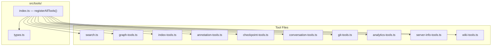
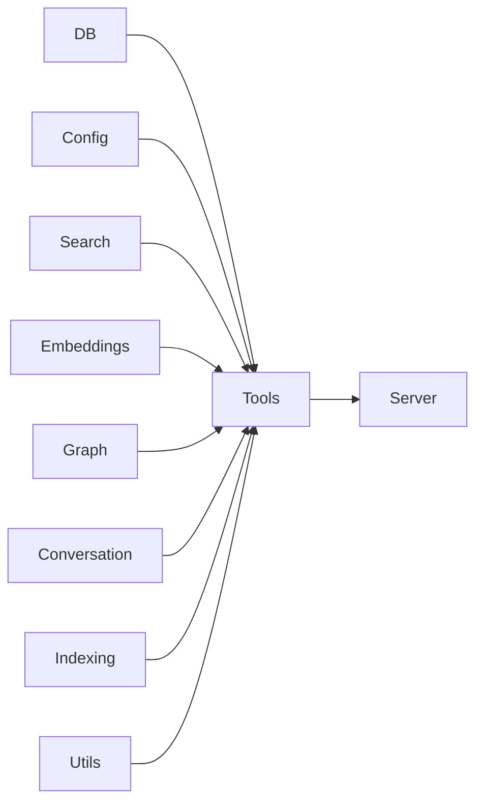

# Tools Module

The Tools module (`src/tools/`) defines all MCP tools that local-rag exposes
to AI agents. Each tool file registers one or more tools with the MCP server,
providing the agent with search, indexing, graph, annotation, and context
capabilities.

## Structure

## Entry Point -- `index.ts`

Exports:

- **`registerAllTools(server, getDB, getConnectedDBs?, writeStatus?)`** --
  Registers all tool files with the MCP server. Called once during server
  startup.
- **`resolveProject(directory, getDB)`** -- Resolves a project directory to
  its `RagDB` instance. Used by tools that accept a `directory` parameter.

### Types (`types.ts`)

- **`GetDB`** -- Function type for retrieving a `RagDB` instance.
- **`WriteStatus`** -- Function type for writing server status messages.

## Tools Overview

| Tool | File | Description |
|------|------|-------------|
| `search` | `search.ts` | Semantic + keyword search over indexed files |
| `read_relevant` | `search.ts` | Retrieve actual content of relevant chunks |
| `search_symbols` | `search.ts` | Find symbols (functions, classes, types) by name |
| `write_relevant` | `search.ts` | Find best insertion point for new code |
| `project_map` | `graph-tools.ts` | Generate dependency graph at file or directory level |
| `find_usages` | `graph-tools.ts` | Find all call sites of a symbol |
| `depends_on` | `graph-tools.ts` | List files imported by a given file |
| `depended_on_by` | `graph-tools.ts` | List files that import a given file |
| `index_files` | `index-tools.ts` | Index or re-index project files |
| `index_status` | `index-tools.ts` | Show indexing statistics |
| `remove_file` | `index-tools.ts` | Remove a file from the index |
| `annotate` | `annotation-tools.ts` | Attach a persistent note to a file or symbol |
| `get_annotations` | `annotation-tools.ts` | Retrieve annotations for a file or search all |
| `create_checkpoint` | `checkpoint-tools.ts` | Mark a project milestone |
| `list_checkpoints` | `checkpoint-tools.ts` | List recent checkpoints |
| `search_checkpoints` | `checkpoint-tools.ts` | Search checkpoints semantically |
| `search_conversation` | `conversation-tools.ts` | Search past conversation history |
| `git_context` | `git-tools.ts` | Show recent commits, modified files, and index state |
| `search_analytics` | `analytics-tools.ts` | View search query trends and gaps |
| `server_info` | `server-info-tools.ts` | Show server status and connected databases |
| `generate_wiki` | `wiki-tools.ts` | Generate project wiki from the index |

## Dependencies and Dependents

- **Depends on:** DB, Config, Search, Embeddings, Graph, Conversation, Indexing, Utils
- **Depended on by:** Server

## See Also

- [Tools Internals](internals.md) -- detailed breakdown of each tool file
- [Server module](../server/) -- registers tools via `registerAllTools()`
- [Search module](../search/) -- search logic used by search tools
- [Graph module](../graph/) -- graph logic used by graph tools
- [Architecture overview](../../architecture.md)
