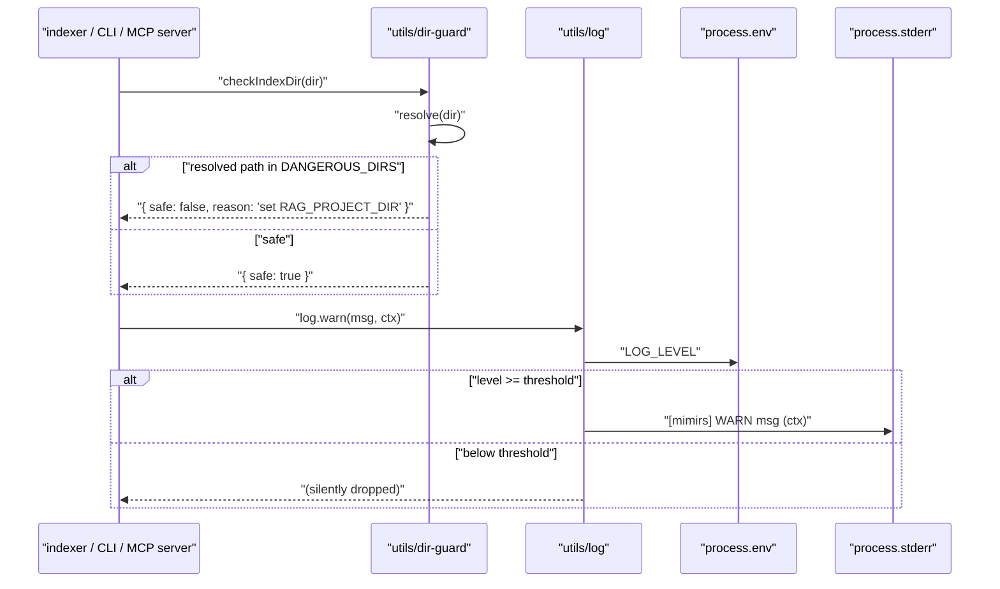
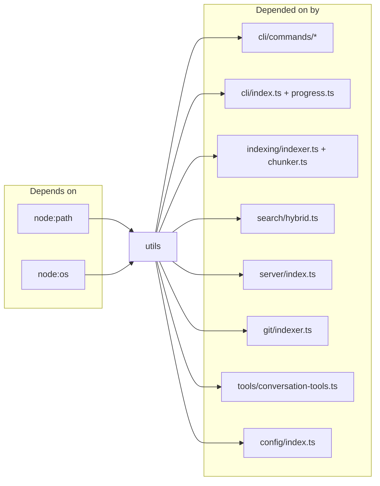

# utils

Two tiny files that the rest of the codebase leans on constantly: `log.ts` centralises every piece of stderr/stdout output, and `dir-guard.ts` refuses to index the handful of system directories that would OOM the process. Fan-in is 27 — every CLI command, the indexer, the search pipeline, the git indexer, the MCP server, and the conversation tools all import from here. Nothing in the module imports anything else in the project; it's pure leaf code.

## Public API

```ts
export interface DirCheckResult {
  safe: boolean;
  reason?: string;
}
```

The surface is intentionally tiny. `log` is an object with `debug` / `warn` / `error` methods that write `[mimirs] LEVEL msg (context)` to stderr, gated by `LOG_LEVEL` (`debug` < `warn` < `error` < `silent`, default `warn`). `cli` is an object with `log` / `error` methods that hit stdout/stderr with no prefix — the split keeps MCP diagnostic noise off the user-facing CLI channel. `checkIndexDir(directory)` returns `{ safe: false, reason }` if the resolved path is in a blocked set (`homedir()`, `/`, `/home`, `/Users`, `/tmp`, `/var`); otherwise `{ safe: true }`.

## How it works



The guard resolves the input to an absolute path before the set lookup, so `./` in `/Users/alice` is caught just like `/Users/alice` is. The logger reads `LOG_LEVEL` on every call (no caching), which means flipping the env var between invocations takes effect immediately. A `process.stderr.on("error", () => {})` handler is installed at module load so EPIPE from a disconnected MCP parent can't crash the process — a small but load-bearing detail on long-running servers.

## Dependencies and Dependents



## Configuration

- `LOG_LEVEL` (env) — `debug` / `warn` / `error` / `silent`. Default `warn`. Checked on every `log.*` call.
- `DANGEROUS_DIRS` — internal constant. The blocked set covers `homedir()`, `/`, `/home`, `/Users`, `/tmp`, `/var`. Adding to the set is a code change — there is no env override, deliberately.

## Known issues

- **`DANGEROUS_DIRS` is POSIX-shaped.** The Linux/macOS system paths are baked in; a Windows user running with `cwd` set to `C:\Users` would not be caught. The guard's purpose is to catch the accidental unset-`RAG_PROJECT_DIR` case on the platforms most people run against, not to be an exhaustive allowlist.
- **`LOG_LEVEL` parsing is strict.** Any value outside the four recognised levels silently falls back to `warn`. There is no warning on misspelled levels (`warning`, `verbose`, etc.).
- **Subdirectories of blocked dirs still pass.** `checkIndexDir` only rejects exact matches — `/Users/alice` (== `homedir()`) is blocked, but `/Users/alice/projects` slides through. That's intentional (those are the real project roots), but not obvious.

## See also

- [Architecture](../architecture.md)
- [Conventions](../guides/conventions.md)
- [Getting Started](../guides/getting-started.md)
