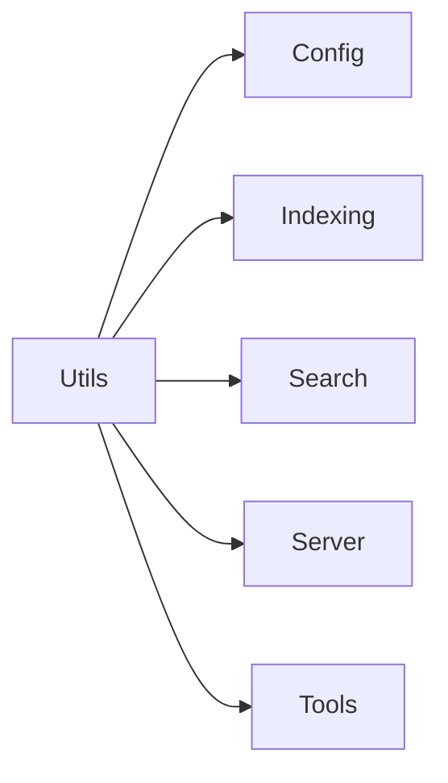

# Utils Module

The Utils module (`src/utils/`) provides lightweight shared utilities used
across the codebase. It is a **leaf module** with no internal dependencies.

## Files

### `log.ts` -- Logger

All project output in one place. Two separate channels:

- **`log`** -- MCP diagnostic channel (stderr, level-gated, `[mimirs]` prefix).
  Used by the server and background tasks to avoid corrupting the stdio protocol.
- **`cli`** -- CLI user-facing output (stdout/stderr, no prefix). Used by
  command handlers for terminal output.

**`log` methods:**

| Method | Description |
|--------|-------------|
| `log.debug(msg, tag)` | Debug messages (only shown when `LOG_LEVEL=debug`) |
| `log.warn(msg, tag)` | Warnings (shown by default) |
| `log.error(msg, tag)` | Errors (always shown unless `LOG_LEVEL=silent`) |

**Configuration via `LOG_LEVEL` environment variable:**

| Value | Behavior |
|-------|----------|
| `"debug"` | All messages (debug, warn, error) |
| `"warn"` | Warnings and errors only (default) |
| `"error"` | Errors only |
| `"silent"` | No output |

**`cli` methods:**

| Method | Description |
|--------|-------------|
| `cli.log(msg?)` | Normal output to stdout. No args = blank line. |
| `cli.error(msg)` | Error output to stderr. |

### `dir-guard.ts` -- Directory Validation

Prevents indexing of system-level directories that would cause excessive
memory usage and take extremely long.

**Exports:**

- **`checkIndexDir(directory)`** -- Returns `{ safe: true }` or
  `{ safe: false, reason }` if the directory is in the dangerous set.

**Blocked directories:** home directory, `/`, `/home`, `/Users`, `/tmp`, `/var`.

When a dangerous directory is detected, the server skips auto-indexing and
the file watcher, logging a warning that directs the user to set
`RAG_PROJECT_DIR` to their actual project path.

## Dependencies and Dependents

- **Depends on:** Nothing (leaf module)
- **Depended on by:** Config, Indexing, Search, Server, Tools

## See Also

- [Config module](../config/) -- uses utils for config loading
- [Server module](../server/) -- logging via `log` goes to stderr;
  `checkIndexDir` guards against dangerous directories
- [Architecture overview](../../architecture.md)
