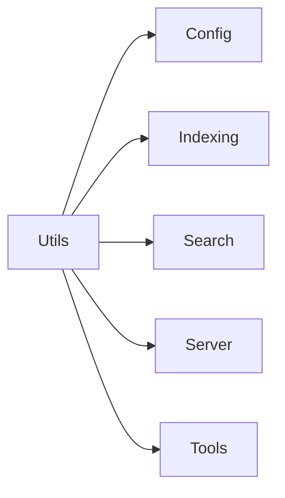

# Utils Module

The Utils module (`src/utils/`) provides lightweight shared utilities used
across the codebase. It is a **leaf module** with no internal dependencies.

## Files

### `log.ts` -- Logger

A lightweight logger that writes to stderr (the MCP diagnostic channel). This
keeps log output separate from the stdio protocol used for MCP communication.

**Exports:**

- **`log`** -- Object with `debug()`, `warn()`, and `error()` methods.

**Configuration via `LOG_LEVEL` environment variable:**

| Value | Behavior |
|-------|----------|
| `"debug"` | All messages (debug, warn, error) |
| `"warn"` | Warnings and errors only (default) |
| `"error"` | Errors only |
| `"silent"` | No output |

### `dir-guard.ts` -- Directory Validation

Validates that the `.mimirs/` index directory is safe to use.

**Exports:**

- **`checkIndexDir`** -- Validates that the `.mimirs/` directory is writable and
  not located inside a temporary directory. Throws with a descriptive error
  if validation fails.

## Dependencies and Dependents

- **Depends on:** Nothing (leaf module)
- **Depended on by:** Config, Indexing, Search, Server, Tools

## See Also

- [Config module](../config/) -- uses utils for config loading
- [Server module](../server/) -- logging via `log` goes to stderr
- [Architecture overview](../../architecture.md)
