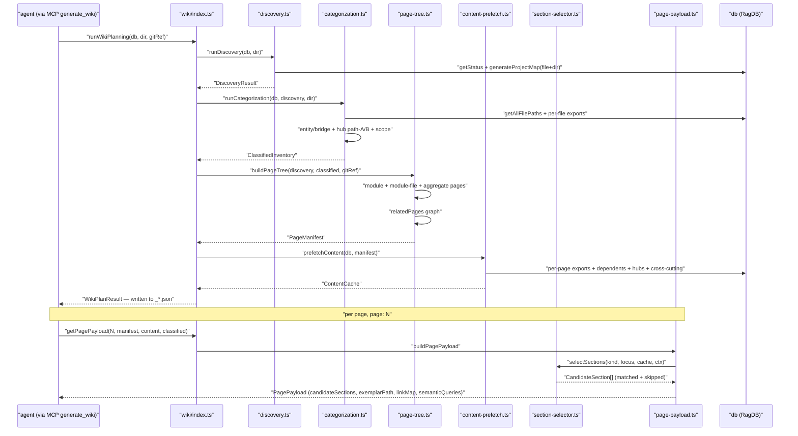

# wiki

The four-phase generator behind `generate_wiki`. Eight files in the module: `index.ts` is the orchestrator (`runWikiPlanning` + `getPagePayload`); `discovery.ts` reads the indexed graph; `categorization.ts` applies the entity/bridge + hub/scope taxonomy and decides which modules qualify; `page-tree.ts` turns classified modules into `ManifestPage` entries; `content-prefetch.ts` grabs signatures + neighborhoods ahead of agent calls; `page-payload.ts` builds per-page payloads (candidate sections, link map, semantic queries); `section-selector.ts` filters the section library against a page's cache; `types.ts` is the shared shape file. The MCP handler in `tools/wiki-tools.ts` is the only external caller.

Entry file: `src/wiki/index.ts`.

## Public API

```ts
// Phase 1-4 orchestration
runWikiPlanning(db, projectDir, gitRef): WikiPlanResult

// Phase 5: per-page payload
getPagePayload(pageIndex, manifest, content, classified): PagePayload

// Re-exported phases (used by tests and the wiki-tools handler)
runDiscovery(db, projectDir): DiscoveryResult
runCategorization(db, discovery, projectDir): ClassifiedInventory
buildPageTree(discovery, classified, gitRef): PageManifest
prefetchContent(db, manifest, discovery, classified, projectDir): ContentCache
buildPagePayload(pageIndex, manifest, content, classified): PagePayload

// Section library (Stage C)
selectSections(kind, focus, prefetched, ctx): CandidateSection[]
```

Every phase operates on typed shapes from `types.ts` — `DiscoveryResult`, `ClassifiedModule`, `PageManifest`, `ManifestPage` (with `kind: "module" | "file" | "aggregate"` and optional `focus: "architecture" | "data-flows" | "getting-started" | "conventions" | "testing" | "index" | "module-file"`), `PageContentCache`, `PagePayload`, `CandidateSection`.

## How it works



### Phase 1: Discovery

`runDiscovery` calls `db.getStatus()` then `generateProjectMap` twice — once file-level, once directory-level — with `maxNodes` scaled to `sqrt(fileCount) * 12 + 30` (file) or `sqrt(fileCount) * 8 + 20` (directory). Directory boundaries are grouped and each becomes a `DiscoveryModule` with `entryFile` (matched against `/^(index|main|mod|lib|__init__)\./`), workspace-root hints (`package.json`, `Cargo.toml`, `go.mod`, `pyproject.toml`), and raw graph data.

### Phase 2: Categorization

`runCategorization` walks every `DiscoveryModule` and:
- tags each file as `entity` (named-concept exports) or `bridge` (pure adapter between modules),
- assigns a hub path — `A` (aggregator, many imports / few exports) or `B` (provider, many importers / few imports),
- assigns a scope — `cross-cutting` (referenced by ≥3 modules), `shared` (2 modules), or `local` (one).

`qualifiesAsModulePage` then decides if a directory produces a page. The threshold is `value >= MIN_MODULE_VALUE` (8) **or** a structural override: a cross-cutting symbol host with `fileCount >= 2`, or a module with `entryFile != null` and `fanIn >= 3`. The `reason` string on every `ClassifiedModule` records which rule qualified it — useful for diagnosing why a page did or didn't show up.

### Phase 3: Page tree

`buildPageTree` emits three kinds of pages:

- `kind: "module"` — one per qualifying directory.
- `kind: "file"` with `focus: "module-file"` — sub-pages under a module, produced when the module has `fileCount >= 10` or `exportCount >= 20` (up to `MAX_SUB_PAGES = 5` top files by `exports >= 5 || fanIn >= 3`).
- `kind: "aggregate"` with `focus: "architecture" | "data-flows" | "getting-started" | "conventions" | "testing" | "index"` — the narrative pages.

`computeRelatedPages` then builds a title-keyed graph so every page knows its siblings. The tree's `version: 2` replaces the older `type`-enum-based v1 manifest.

### Phase 4: Content prefetch

`prefetchContent` runs once per plan and populates a `ContentCache` keyed by page path. Per page it stores: full export signatures (via `truncateToSignature`), dependent lists, dependency neighborhood, hub analysis, cross-cutting inventory, entry-point notes, and — for `brief`-depth pages — inline child-file summaries. The prefetch saves the agent from making N `read_relevant` calls during writing; it already has the material.

### Phase 5: Per-page payload

`buildPagePayload` reads the manifest entry + cache + classified data for a specific page index and returns a `PagePayload` containing:

- `candidateSections` — `{ name, matched, reason, exampleBody }[]` — produced by `selectSections(kind, focus, cache, ctx)`. Only sections whose `applies` predicate fires are `matched: true`; the rest come back with a reason so the agent knows why a shape was filtered.
- `exemplarPath?` — set only for aggregate pages; points to `src/wiki/exemplars/<focus>.md`.
- `linkMap` — title → relative path. The agent is instructed to use only these links, which is why renames that change titles break cross-references.
- `semanticQueries` — a handful of `read_relevant` queries the agent can run to fill gaps (e.g. "module purpose responsibilities overview").
- `breadcrumbs` and `relatedPages` — computed by `computeRelatedPages` during phase 3.

## Per-file breakdown

### `index.ts` — orchestrator

Owns `runWikiPlanning` and `getPagePayload`. Re-exports every phase function plus the type aliases. No additional logic — the whole file is a wiring sheet.

### `discovery.ts` — Phase 1

Builds file-level and directory-level graphs with `maxNodes` scaled by file count. Groups files by directory, identifies entry files by naming convention, and flags workspace roots. Surfaces warnings (e.g. "index is empty") without throwing.

### `categorization.ts` — Phase 2

Where `MIN_MODULE_VALUE = 8` lives. Also home to the hub-path and scope classification, `qualifiesAsModulePage` (with the structural override for cross-cutting hosts and entry-with-fanIn modules), and the `reason` string generator. Entry/bridge distinction happens here via export-shape heuristics.

### `page-tree.ts` — Phase 3

`FILE_THRESHOLD = 10`, `EXPORT_THRESHOLD = 20`, `FILE_EXPORT_THRESHOLD = 5`, `FAN_IN_THRESHOLD = 3`, `MAX_SUB_PAGES = 5`. Produces the `_manifest.json` artifact with `version: 2`.

### `content-prefetch.ts` — Phase 4

The largest file in the module. `truncateToSignature` keeps exports to their declaration line(s), dropping bodies. For brief pages with ≤2 child files, inline-children summaries are pre-embedded in the cache so the agent doesn't need to fetch them separately. Cross-cutting and hub analysis blocks are computed once and attached to every page that mentions them.

### `page-payload.ts` — Phase 5

Hosts `buildLinkMap` (title-keyed, relative path per page), `buildSemanticQueries` (keyed on `focus ?? kind`), `buildBreadcrumbs`. Delegates section selection to `section-selector.ts`.

### `section-selector.ts` — Stage C section library

Parses `src/wiki/sections/*.md` front-matter at first call, caches the `SectionDef[]`. `SECTION_DEFS` names 15 sections (overview, public-api, how-it-works-sequence, dependency-graph, dependency-table, hub-analysis, cross-cutting-inventory, entry-points, per-file-breakdown, key-exports-table, usage-examples, internals, configuration, known-issues, see-also). Each has an `eligibleFor(kind, focus)` gate and an `applies(cache, ctx)` predicate. `AGGREGATE_FOCI_WITH_EXEMPLAR` lists the six aggregate foci that get an exemplar page.

### `types.ts` — shared shapes

Single source of truth for `PageKind` / `PageFocus`, every `*Result`, `ManifestPage`, `PageContentCache`, `CandidateSection`, and `WikiPlanResult`. Changed in Stage B to drop the eight-value `PageType` enum.

## Internals

- **`_discovery.json` / `_classified.json` / `_manifest.json` / `_content.json` are the artifacts.** `runWikiPlanning` doesn't write them — the wiki-tools handler does, after calling `runWikiPlanning`. This lets tests build plans in memory without I/O.
- **`getPagePayload` is pure.** It reads from precomputed artifacts and doesn't touch `RagDB`. That's what makes `generate_wiki(page: N)` cheap and parallelisable.
- **Section predicates are data-driven, not prose-driven.** A predicate like `(p) => (p.dependencies?.length ?? 0) + (p.dependents?.length ?? 0) >= 3` is what decides whether `dependency-graph` appears. Predicates must stay simple so they can be reasoned about against the prefetched cache.
- **Exemplars are full example pages with `<!-- adapt -->` comments**, not section templates. Aggregate pages that don't compose from snippets (architecture prose, data-flow narratives) are anchored by these exemplars so the agent preserves voice and shape.

## Configuration

- `MIN_MODULE_VALUE = 8` (in `categorization.ts`) — value threshold for module qualification. Override rules admit cross-cutting hosts and entry-with-fanIn modules at lower values.
- `MAX_SUB_PAGES = 5` (in `page-tree.ts`) — hard cap on sub-pages per module.
- `FILE_THRESHOLD = 10` / `EXPORT_THRESHOLD = 20` — module size at which sub-page splitting kicks in.
- `FILE_EXPORT_THRESHOLD = 5` / `FAN_IN_THRESHOLD = 3` — per-file qualification for a sub-page.
- `ENTRY_FILE_PATTERN` / `WORKSPACE_ROOTS` (in `discovery.ts`) — heuristics for entry-file detection and workspace-root hinting.

## Known issues

- **`applies` predicates drift from reality as prefetch data evolves.** The closer the predicate stays to simple membership + length checks on `PageContentCache`, the less the risk. Predicates that inspect nested structure break silently when prefetch changes shape.
- **Link map is title-keyed.** Renaming a page's title without updating `linkMap` breaks every inbound link. The generator regenerates the link map, but agent-written content referencing an old title doesn't auto-rewrite.
- **`runWikiPlanning` recomputes everything every call.** No incremental mode — changing one file still re-runs discovery + categorization + tree + prefetch. Cheap enough for mid-sized repos; noticeable on very large ones.
- **`version: 2` is a hard reset.** A v1 manifest on disk gets overwritten; there's no translator. This is deliberate (regen is cheap) but bites if a user edits the manifest by hand expecting v1 to survive.

## See also

- [Architecture](../architecture.md)
- [Data Flows](../data-flows.md)
- [Conventions](../guides/conventions.md)
- [Testing](../guides/testing.md)
