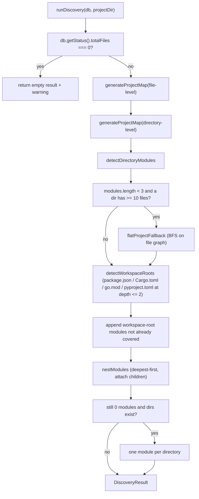

# discovery

Phase 1 of the wiki pipeline: turn the raw graph index into a module inventory. `runDiscovery(db, projectDir)` pulls two `generateProjectMap` JSON snapshots (file-level + directory-level), detects which directories behave as modules using a mix of entry-file naming, external fan-in, and internal cohesion, then falls back through progressively weaker heuristics for flat projects, monorepos, and tiny projects. The result, a `DiscoveryResult`, is the input every later phase (`categorization`, `page-tree`, `content-prefetch`, `page-payload`) reads from. Re-exported from `src/wiki/index.ts` and exercised by `tests/wiki/discovery.test.ts` and `tests/wiki/categorization.test.ts`.

**Source:** `src/wiki/discovery.ts`

## Public API

```ts
export function runDiscovery(db: RagDB, projectDir: string): DiscoveryResult;
```

Shape documented in [types](types.md) — `DiscoveryResult` carries `fileCount`, `chunkCount`, `lastIndexed`, the detected `modules[]` (each with an optional nested `children` array after nesting), both `graphData` levels (kept around so later phases don't have to re-generate the map), and a `warnings[]` list.

`ENTRY_FILE_PATTERN` and `WORKSPACE_ROOTS` are file-private constants — not exported but documented below because they gate the heuristics.

## The walk



### Node-cap sizing

`computeMaxNodes(fileCount, level)` scales the `maxNodes` cap passed to `generateProjectMap` with the project size:

- directory level: `round(sqrt(fileCount) * 8 + 20)`
- file level: `round(sqrt(fileCount) * 12 + 30)`

Both caps act as a safety net — if the resulting JSON is truncated or invalid, the catch block pushes a warning and substitutes an empty graph rather than aborting discovery.

### `detectDirectoryModules`

For each directory in the directory-level graph, count intra-directory edges (both endpoints in the same dir), then mark it as a module when at least one of:

- **Has an entry file** — `ENTRY_FILE_PATTERN = /^(index|main|mod|lib|__init__)\./` matches `basename(f)`.
- **Has external consumers** — `dir.fanIn > 0` in the directory graph.
- **Internal cohesion plus exports** — `intraEdgeCounts.get(dir.path) >= 2` and `dir.totalExports > 0`.

Matches are turned into `DiscoveryModule` via `buildModuleFromDir`, which copies the directory's fan counts directly and computes `internalEdges` by counting file-level edges whose endpoints are both in the module.

### `flatProjectFallback`

Triggers when fewer than 3 modules were detected *and* the largest directory has ≥10 files — the signal that the project is flat enough to need graph-based grouping rather than directory-based. Behaviour:

1. Sort file-level nodes by `fanIn` descending.
2. Seed-expand: for each unassigned node, BFS across the file graph's edges in both directions, claiming every connected file into the same module.
3. Any file left unassigned after all BFS passes goes into a sentinel module named `"utilities"` at path `"."`.

Each BFS group becomes a module built with `buildModuleFromFiles`, which rolls up per-node fan counts and subtracts internal edges twice (once for each endpoint) so cross-module fan-in/fan-out is not double-counted.

### Monorepo detection

`detectWorkspaceRoots(allPaths, projectDir)` looks for any file whose `basename` is in `WORKSPACE_ROOTS = ["package.json", "Cargo.toml", "go.mod", "pyproject.toml"]`, computes the workspace's relative directory, and keeps it only when the relative depth is `>= 1` and `<= 2`. The root-level manifest is excluded (depth 0) so a single-package project doesn't get promoted. Duplicates are removed via `new Set(roots)`.

Each surviving root becomes a module via `buildModuleFromFiles`, but only if no existing module already covers it — the `exists` check uses `m.path === root || root.startsWith(m.path + "/")`. A warning `Monorepo detected: N workspace roots` is pushed so callers know the shape is unusual.

### Nesting

`nestModules` sorts modules deepest-first by path depth, then for every pair `(i, j)` with `i` before `j` in the sorted list, if `sorted[i].path.startsWith(sorted[j].path + "/")`, attach `i` to `j.children` and mark it as nested. The final filter drops every nested module from the top-level list. The result is a tree rather than a flat array — aggregate pages walk the `children` recursively.

### Tiny-project fallback

If after all of the above the module list is still empty but the directory graph has directories, every directory becomes its own module (via `buildModuleFromFiles`) and a warning is pushed. This keeps the rest of the pipeline functional on projects too small for any of the heuristics above to fire.

## Dependencies

| Direction | Target | Notes |
|---|---|---|
| Imports | `path` | `basename`, `dirname` |
| Imports | `../db` | `RagDB` type plus `.getStatus()` and `.getAllFilePaths()` for the two-phase queries |
| Imports | `../graph/resolver` | `generateProjectMap` — the JSON-producing graph serializer |
| Imports | `./types` | `DiscoveryResult`, `DiscoveryModule`, `FileLevelGraph`, `FileLevelNode`, `FileLevelEdge`, `DirectoryLevelGraph` |
| Imported by | `src/wiki/index.ts` | Re-exports `runDiscovery`; the orchestrator calls it first |
| Imported by | `tests/wiki/discovery.test.ts` | Heuristic-by-heuristic fixtures |
| Imported by | `tests/wiki/categorization.test.ts` | Upstream dependency for classification tests |

## See also

- [wiki](index.md)
- [types](types.md)
- [section-selector](section-selector.md)
- [staleness](staleness.md)
- [Architecture](../../architecture.md)
- [Data Flows](../../data-flows.md)
