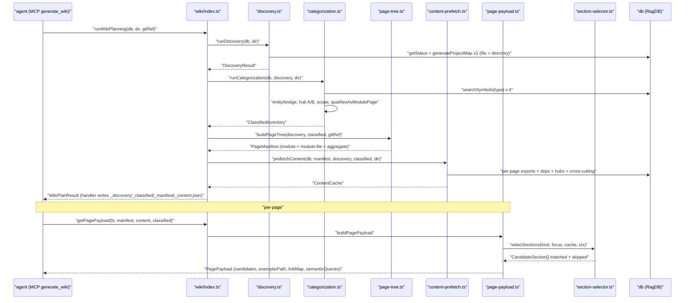
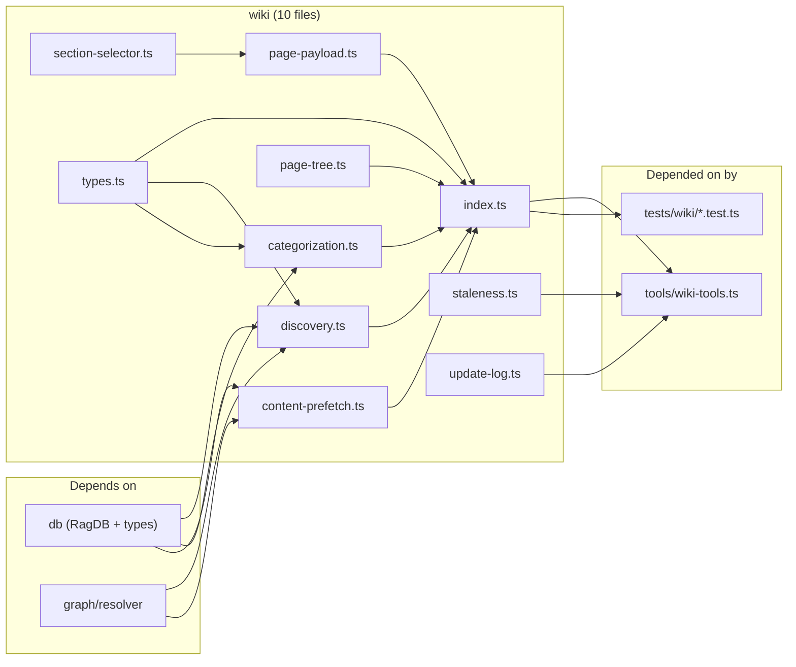

# wiki

The four-phase generator behind the `generate_wiki` MCP tool. Ten files under `src/wiki/`: `index.ts` is the orchestrator (`runWikiPlanning` + `getPagePayload`); `discovery.ts` reads the indexed graph into `DiscoveryResult`; `categorization.ts` applies the entity/bridge + hub path-A/B + scope taxonomy and decides which modules qualify; `page-tree.ts` emits the `PageManifest`; `content-prefetch.ts` runs the DB-heavy queries once per plan; `page-payload.ts` builds the per-page payload (candidate sections, link map, semantic queries, breadcrumbs); `section-selector.ts` filters the 15-entry section library against a page's prefetched cache; `staleness.ts` + `update-log.ts` back incremental mode; `types.ts` holds every shared shape. The MCP handler in `src/tools/wiki-tools.ts` is the only production caller — everything else is tests.

Entry file: `src/wiki/index.ts`.

## Public API

```ts
// Phase 1-4 orchestration (writes no files — caller persists _*.json artifacts)
runWikiPlanning(db: RagDB, projectDir: string, gitRef: string): WikiPlanResult

// Phase 5: per-page payload — pure over precomputed artifacts
getPagePayload(pageIndex: number, manifest: PageManifest, content: ContentCache, classified: ClassifiedInventory): PagePayload

// Re-exported phases (used by tests and the wiki-tools handler)
runDiscovery(db, projectDir): DiscoveryResult
runCategorization(db, discovery, projectDir): ClassifiedInventory
buildPageTree(discovery, classified, gitRef): PageManifest
prefetchContent(db, manifest, discovery, classified, projectDir): ContentCache
buildPagePayload(pageIndex, manifest, content, classified): PagePayload

// Incremental (src/wiki/staleness.ts + update-log.ts)
classifyStaleness(oldManifest, newManifest, newClassified, newEntryPoints, changedFiles): StalenessReport
appendInitLog(wikiDir, gitRef, manifest): void
appendIncrementalLog(wikiDir, sinceRef, newRef, changedFileCount, report): void
```

The top-level `src/wiki/index.ts` re-exports five phase functions plus the `WikiPlanResult` / `PagePayload` type aliases. `src/wiki/types.ts` is the source-of-truth file: 31 exports (23 interfaces, 5 type aliases, 2 log-append functions wrongly counted by the type tree, plus the orchestrator pair). Notable shapes: `PageKind = "module" | "file" | "aggregate"`; `PageFocus = "module-file" | "architecture" | "data-flows" | "getting-started" | "conventions" | "testing" | "index"`; `PageDepth = "full" | "standard" | "brief"`; `SymbolTier = "entity" | "bridge"`; `Scope = "cross-cutting" | "shared" | "local"`; `HubPath = "A" | "B"`.

## How it works



### Phase 1: Discovery (`discovery.ts`)

`runDiscovery` calls `db.getStatus()` then `generateProjectMap` twice — once file-level and once directory-level — sized by `computeMaxNodes(fileCount, level)` (`sqrt(n) * 12 + 30` for files, `sqrt(n) * 8 + 20` for directories). Empty index returns a stub with a `"Index is empty"` warning. Directories become `DiscoveryModule` entries when they hit any of three heuristics: an entry file matching `ENTRY_FILE_PATTERN = /^(index|main|mod|lib|__init__)\./`, external consumers (`fanIn > 0`), or internal cohesion (`>= 2 intra-directory edges` and `totalExports > 0`). Fewer than three detected modules plus a directory of `>= 10` files triggers `flatProjectFallback`, which BFS-clusters the file graph. Monorepo detection runs against `WORKSPACE_ROOTS = ["package.json", "Cargo.toml", "go.mod", "pyproject.toml"]` at depth `<= 2`; any root with `>= 2` siblings promotes unclaimed files to a top-level module. `nestModules` then rolls children under deeper-path parents so the manifest keeps a tree.

### Phase 2: Categorization (`categorization.ts`)

`runCategorization` pulls every exported symbol across six `SYMBOL_TYPES` (`class`, `interface`, `type`, `enum`, `function`, `export`) via `db.searchSymbols(undefined, false, type, max(200, fileCount*2))`, dedupes by `symbolName\0path` keeping the most specific type (priority `class < interface < enum < type < function < export`), then classifies in three steps:

- **Symbols** — `tier = hasChildren ? "bridge" : "entity"`; `scope = referenceModuleCount >= 3 ? "cross-cutting" : === 2 ? "shared" : "local"`.
- **Files** — `pathA` is a crossroads (`fanIn >= 2 && fanOut >= 2 && hasBridge`); `pathB` is foundational (`fanIn >= 5`). A file can be both; path A wins in the tag.
- **Modules** — `value = fanIn * 2 + exports.length + files.length`. `qualifiesAsModulePage` fires if `value >= MIN_MODULE_VALUE` (8), **or** structural overrides: `fileCount >= 2 && crossCuttingCount >= 1`, or `fileCount >= 2 && entryFile != null && fanIn >= 3`. The `reason` string records which rule fired, so a missing wiki page is always diagnosable.

### Phase 3: Page tree (`page-tree.ts`)

`buildPageTree` walks qualifying modules and emits three page kinds, in order:

- `kind: "module"` — one per `qualifiesAsModulePage` directory. Depth is percentile-based when there are `>= 5` qualifying modules (otherwise everything gets `brief` minimum): top importance tier → `full`, middle → `standard`, bottom → `brief`. Importance is `fanIn * 2 + fanOut * 0.5`, complexity is `fileCount + exportCount * 0.5`.
- `kind: "file"` with `focus: "module-file"` — sub-pages under a `full`-depth module when `fileCount >= FILE_THRESHOLD (10)` or `exportCount >= EXPORT_THRESHOLD (20)`. Up to `MAX_SUB_PAGES = 5` top files qualify via `exports >= FILE_EXPORT_THRESHOLD (5)` or `fanIn >= FAN_IN_THRESHOLD (3)`.
- `kind: "aggregate"` with `focus` in `{ "architecture", "data-flows", "getting-started", "conventions", "testing", "index" }` — the narrative pages, unconditional.

`computeRelatedPages` then wires a title-keyed graph so every page knows its siblings. The manifest carries `version: 2` — the older `PageType`-enum v1 is incompatible and unmigrated.

### Phase 4: Content prefetch (`content-prefetch.ts`)

`prefetchContent` fills a `ContentCache` keyed by wiki path. Per page it stores: truncated export signatures (`truncateToSignature` drops function/class bodies but preserves interface/type/enum shapes; Python splits at trailing `:`, brace-languages track depth and break at the first `{`), a dependency neighborhood (`projectMap(focus)`), dependents, hub analysis, cross-cutting inventory, entry-point notes, and — for brief-depth pages with `<= 2` children — inline child snippets so the agent doesn't need a follow-up call. `MAX_USAGES = 10` is the cap on `usageSites` attached to any page. The whole prefetch runs once per `runWikiPlanning` call; `getPagePayload` is a pure read afterwards.

### Phase 5: Per-page payload (`page-payload.ts`)

`buildPagePayload(pageIndex, manifest, content, classified)` sorts manifest entries by `order`, pulls the cache entry for the requested page, builds a `linkMap` (title → relative path from this page's directory), and hands the cache + context to `selectSections`. Returns: `candidateSections` (each with `matched`, `reason`, `exampleBody`), `exemplarPath` for aggregate pages, `semanticQueries` keyed on `focus ?? kind`, `additionalTools` breadcrumbs (`read_relevant`, `search_symbols`, `Read`, `depends_on`, `depended_on_by`, conditionally `find_usages`), and the full `prefetched` cache so the agent sees what the selector saw.

## Per-file breakdown

### `index.ts` — orchestrator

Owns `runWikiPlanning` (sequences discovery → categorization → page-tree → prefetch and concatenates warnings) and `getPagePayload` (delegates to `buildPagePayload`). Re-exports every phase function plus `WikiPlanResult` / `PagePayload`. 50 lines, no extra logic — it's a wiring sheet.

### `discovery.ts` — Phase 1

The two constants (`ENTRY_FILE_PATTERN`, `WORKSPACE_ROOTS`) and `computeMaxNodes` live at the top. Exported `runDiscovery` only; the helpers (`detectDirectoryModules`, `buildModuleFromDir`, `buildModuleFromFiles`, `flatProjectFallback`, `detectWorkspaceRoots`, `nestModules`) are file-local. Any graph-parse failure (truncated JSON from `generateProjectMap`) is caught and replaced with an empty graph plus a warning — discovery never throws.

### `categorization.ts` — Phase 2

`MIN_MODULE_VALUE = 8` and the `TYPE_PRIORITY` / `SYMBOL_TYPES` tables live here. Exported `runCategorization` only. The key decision points are `classifySymbol` (tier + scope), `classifyFiles` (hub path A/B), and `classifyModules` (value score + structural overrides). `flattenModules` handles the nested `children?` tree produced in phase 1.

### `page-tree.ts` — Phase 3

Constants: `MAX_SUB_PAGES = 5`, `FILE_THRESHOLD = 10`, `EXPORT_THRESHOLD = 20`, `FILE_EXPORT_THRESHOLD = 5`, `FAN_IN_THRESHOLD = 3`. Exported `buildPageTree` only. Internal: `buildModulePages` (percentile-based depth), `buildModuleFilePages` (sub-page selection), `buildCrossCuttingPages` (the six aggregate foci), and `computeRelatedPages` (title graph). Produces the `_manifest.json` that the handler writes to disk.

### `content-prefetch.ts` — Phase 4

The largest file in the module. Exports `prefetchContent` and the internal `truncateToSignature` helper. `MAX_USAGES = 10`. Runs per-page logic keyed on `page.focus ?? page.kind`, so the switch has the same cases the section selector and semantic-query builder use: `module`, `module-file`, `architecture`, `data-flows`, `getting-started`, `conventions`, `testing`, `index`.

### `page-payload.ts` — Phase 5

Hosts `buildPagePayload`, `buildSemanticQueries` (eight focus-keyed branches — one per aggregate focus plus `module` / `module-file`), `buildBreadcrumbs` (always emits `read_relevant` + `search_symbols`; emits `Read` + `depends_on` + `depended_on_by` for module/file pages; emits `find_usages` only when `usageSites.length >= MAX_USAGES_SHOWN (10)`), and `buildLinkMap` (title-keyed relative paths). Section selection is delegated to `section-selector.ts`.

### `section-selector.ts` — Stage C section library

`SECTION_DEFS` is a 16-entry array (`overview`, `public-api`, `how-it-works-sequence`, `dependency-graph`, `dependency-table`, `hub-analysis`, `cross-cutting-inventory`, `entry-points`, `per-file-breakdown`, `key-exports-table`, `usage-examples`, `internals`, `configuration`, `known-issues`, `module-inventory`, `test-structure`, `see-also`). Each has `eligibleFor(kind, focus)`, `applies(cache, ctx)`, and `rationale(cache, ctx, matched)`. Bodies are lazy-loaded from `src/wiki/sections/<name>.md` (front-matter stripped), cached in a module-level `bodyCache`. `exemplarPathFor(kind, focus)` returns the absolute path to an `exemplars/<focus>.md` file for the six entries in `AGGREGATE_FOCI_WITH_EXEMPLAR`.

### `staleness.ts` — incremental classification

`classifyStaleness(oldManifest, newManifest, newClassified, newEntryPoints, changedFiles)` returns `{ stale, added, removed }` `PageDelta[]` triples. Rules: module-file pages stale when `sourceFiles[0]` is in `changedFiles`; module pages stale when any module file is in `changedFiles` or depth shifted; aggregate pages stale when the module-page path set changed or any changed file is a hub / entry point. Export: `PageDelta`, `StalenessReport`, `classifyStaleness`.

### `update-log.ts` — append-only `_update-log.md`

`appendInitLog` writes the full-regen header with per-tier page counts. `appendIncrementalLog` writes a section block for each of `stale` (with triggers), `added`, `removed`. Both use ISO timestamps and append to `wikiDir/_update-log.md`. No LLM involvement — the log is deterministic.

### `types.ts` — shared shapes

Single source of truth for every cross-phase shape. 31 exports: `CandidateSection` (twice — intentional, the selector redeclares it for internal use), the graph shapes (`FileLevelNode`, `FileLevelEdge`, `FileLevelGraph`, `DirectoryEntry`, `DirectoryEdge`, `DirectoryLevelGraph`), discovery (`DiscoveryModule`, `DiscoveryResult`), categorization (`ClassifiedSymbol`, `ClassifiedFile`, `ClassifiedModule`, `ClassifiedInventory`), page tree (`ManifestPage`, `PageManifest`, `PageDepth`, `PageKind`, `PageFocus`), prefetch (`PageContentCache`, `ContentCache`), payload (`SemanticQuery`, `ToolBreadcrumb`, `CandidateSection`, `PagePayload`), staleness (`PageDelta`, `StalenessReport`), and the orchestrator's `WikiPlanResult`.

## Dependencies and Dependents



Fan-in: 2 external callers (`tools/wiki-tools.ts`, `tests/wiki/*`). Fan-out: 2 real dependencies — `src/db` and `src/graph/resolver`. Everything else in the 11-entry dependency list is internal (phase files + `types.ts`). The tight external surface is why the module can be tested almost entirely against an in-memory `RagDB` plus synthetic discovery results.

## Internals

- **`runWikiPlanning` doesn't touch the filesystem.** The four JSON artifacts (`_discovery.json`, `_classified.json`, `_manifest.json`, `_content.json`) are written by the MCP handler in `tools/wiki-tools.ts` after planning returns. Tests construct a plan, assert on the in-memory shapes, and never hit disk.
- **`getPagePayload` is pure.** It reads the precomputed artifacts (manifest + content cache + classified inventory) and does no DB work, which is what makes `generate_wiki(page: N)` cheap — every page call is O(1) in the page count.
- **Section predicates are data-driven.** A predicate like `(p) => (p.dependencies?.length ?? 0) + (p.dependents?.length ?? 0) >= 3` for `dependency-graph` reads from the prefetched cache only. Keeping predicates to simple membership + length checks is deliberate — richer predicates break silently when prefetch changes shape.
- **Exemplars vs sections.** `sections/<name>.md` are snippet templates chosen by predicate. `exemplars/<focus>.md` are full adapted example pages used as anchor prose for aggregate pages — not composed from section snippets. Only the six aggregate foci in `AGGREGATE_FOCI_WITH_EXEMPLAR` have exemplars.
- **`linkMap` is title-keyed.** Renaming a page title silently breaks every inbound link until the affected pages regenerate. Pages that the agent wrote referencing an old title don't auto-rewrite.
- **Deduplication priority is inverted from intuition.** In `TYPE_PRIORITY`, `class` is `0` (most specific) and `export` is `5` (least). The lower number wins — so a name that shows up as both `class` and `export` lands as `class`. This matters when a symbol is both exported from a barrel and declared in the same file.
- **Hub path A wins ties.** A file that's both a crossroads (A) and foundational (B) is tagged `A`. The motivation: path-A hubs are rarer and more interesting to document.
- **`version: 2` is a hard reset.** A v1 manifest on disk gets overwritten; there's no translator. Regeneration is cheap enough (<5s on mid-sized repos) that this is intentional.

## Configuration

- `MIN_MODULE_VALUE = 8` (in `categorization.ts`) — value threshold for `qualifiesAsModulePage`. Structural overrides admit cross-cutting hosts and `entry + fanIn >= 3` modules below this.
- `MAX_SUB_PAGES = 5` (in `page-tree.ts`) — hard cap on module-file sub-pages per module.
- `FILE_THRESHOLD = 10` / `EXPORT_THRESHOLD = 20` (in `page-tree.ts`) — module size at which sub-page splitting kicks in.
- `FILE_EXPORT_THRESHOLD = 5` / `FAN_IN_THRESHOLD = 3` (in `page-tree.ts`) — per-file qualification for a sub-page.
- `MAX_USAGES = 10` (in `content-prefetch.ts`) — cap on `usageSites` attached to any page.
- `ENTRY_FILE_PATTERN` / `WORKSPACE_ROOTS` (in `discovery.ts`) — heuristics for entry-file detection and monorepo workspace-root hinting.
- `AGGREGATE_FOCI_WITH_EXEMPLAR` (in `section-selector.ts`) — the six aggregate foci that resolve to an exemplar file. A new focus without an exemplar falls back to the section-snippet assembly path.
- `SECTIONS_DIR` / `EXEMPLARS_DIR` (derived from `import.meta.dir`) — the on-disk templates that `section-selector` reads lazily.

## Known issues

- **`applies` predicates drift from the cache.** If `content-prefetch.ts` stops populating a field, every predicate that reads it silently reports `matched: false`. Predicates and prefetch fields are coupled by convention, not types — add a predicate only after verifying the field is populated.
- **Link map churn under title renames.** Renaming a page's title updates the link map on next regen, but any existing agent-written content that embeds the old title in prose doesn't auto-rewrite. Watch for this when merging a title change with prebuilt wiki content.
- **`runWikiPlanning` has no partial mode.** Changing one file still re-runs discovery + categorization + tree + prefetch. Incremental mode lives in `staleness.ts` but operates on the output of a fresh `runWikiPlanning` — the planning itself is always full.
- **Empty-index graceful path is narrow.** `runDiscovery` returns an empty `DiscoveryResult` when `status.totalFiles === 0`, but subsequent phases still run and produce empty inventories with warnings. Callers that treat warnings as errors will see noise.
- **`CandidateSection` is declared twice.** Once in `types.ts` (shared shape) and once in `section-selector.ts` (with identical fields but a slightly different JSDoc). A consumer importing from the wrong module gets a structurally-identical-but-nominally-different type. Consolidate on one declaration when touching either file.

## See also

- [types](types.md)
- [section-selector](section-selector.md)
- [staleness](staleness.md)
- [discovery](discovery.md)
- [Architecture](../../architecture.md)
- [Data Flows](../../data-flows.md)
- [Conventions](../../guides/conventions.md)
- [Testing](../../guides/testing.md)
- [Index](../../index.md)
