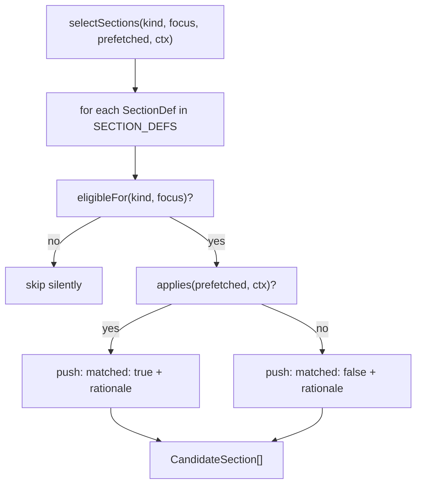

# section-selector

Deterministic rule engine that decides which section-library templates belong on a given wiki page. Given a page's `kind`, `focus`, and its prefetched `PageContentCache`, it walks a fixed table of `SectionDef` entries and returns one `CandidateSection` per eligible section — each tagged `matched: true/false` plus a short rationale. `src/wiki/page-payload.ts` calls it once per page to assemble the candidate list that ships in the `PagePayload`.

The selector is intentionally the *only* place where "should this page have a public-api section?" is decided — adding a new section type means adding one `SectionDef` row here (and a matching `sections/<name>.md` example body) without touching any caller.

**Source:** `src/wiki/section-selector.ts`

## Public API

```ts
export interface CandidateSection {
  name: string;
  reason: string;
  matched: boolean;
  exampleBody: string;
}

export interface SelectionContext {
  relatedPagesCount: number;
  linkMapSize: number;
}

export function selectSections(
  kind: PageKind,
  focus: PageFocus | undefined,
  prefetched: PageContentCache,
  ctx: SelectionContext,
): CandidateSection[];

export function exemplarPathFor(
  kind: PageKind,
  focus: PageFocus | undefined,
): string | undefined;
```

`CandidateSection` is also re-exported from [types](types.md) with the same structural shape.

## How selection works

Each `SectionDef` row carries three predicates:

- **`eligibleFor(kind, focus)`** — whether the section *could* apply to this page's shape at all (e.g. `per-file-breakdown` only for `kind === "module"`). Ineligible sections are dropped silently; they never appear in the output.
- **`applies(prefetched, ctx)`** — whether the prefetched data supports including the section. A `public-api` section requires `exports.length >= 1`; `dependency-graph` requires `dependencies + dependents >= 3`. Eligible-but-not-applicable sections are still returned with `matched: false` so the calling agent sees what was skipped and why.
- **`rationale(prefetched, ctx, matched)`** — a short explanation string attached to `reason` (e.g. `"25 exports with signatures"` vs `"only 2 edges — prefer dependency-table"`).



## The section table

The built-in `SECTION_DEFS` list has 17 entries, evaluated in declaration order. The predicates that drive them:

| Section | Eligible for | Applies when |
|---|---|---|
| `overview` | any page | always |
| `public-api` | module or file | `exports.length >= 1` |
| `how-it-works-sequence` | module, or `data-flows` focus | `files.length >= 2` or `entryPoints.length >= 1` |
| `dependency-graph` | module or file | `dependencies + dependents >= 3` |
| `dependency-table` | module or file | `1 <= dependencies + dependents < 3` |
| `hub-analysis` | `architecture` focus, or module-file/module-kind pages | `hubs.length >= 1` |
| `cross-cutting-inventory` | `architecture` / `data-flows` focus | `crossCuttingSymbols.length >= 1` |
| `entry-points` | `architecture` / `getting-started` | `entryPoints.length >= 1` |
| `per-file-breakdown` | module kind | `files.length >= 3` and `exports.length >= 5` |
| `key-exports-table` | module or file | `exports.length >= 3` and not (`files >= 3 && exports >= 5`) |
| `usage-examples` | module or file | `usageSites.length >= 1` |
| `internals` | module kind | `files.length >= 10` or `exports.length >= 15` |
| `configuration` | `getting-started` focus / module-file | always (author judges) |
| `known-issues` | `getting-started` focus / module-file | always (author judges) |
| `module-inventory` | `architecture` / `getting-started` / `index` | `modules.length >= 1` |
| `test-structure` | `testing` focus | `testFiles.length >= 1` |
| `see-also` | any page | `relatedPagesCount >= 1` or `linkMapSize >= 1` |

The "prefer X over Y" coupling between `dependency-graph` and `dependency-table` (and between `per-file-breakdown` and `key-exports-table`) is implemented in the predicates themselves — both rows will fire eligibility, but only one will match on a given page.

## Section body loading

`loadSectionBody(name)` reads `./sections/<name>.md` relative to `import.meta.dir`, strips YAML front-matter, and memoizes the result in a module-level `bodyCache` `Map`. Missing files are cached as empty strings so a typo never retries a filesystem read.

`stripFrontMatter` is a conservative two-liner: if the file starts with `---`, skip to the closing `\n---` line and return everything after it.

## Aggregate exemplars

`exemplarPathFor(kind, focus)` returns the absolute path to `./exemplars/<focus>.md` — but only when `kind === "aggregate"` and `focus` is in `AGGREGATE_FOCI_WITH_EXEMPLAR` (`architecture`, `data-flows`, `getting-started`, `conventions`, `testing`, `index`). The caller uses this to attach a full reference page to the payload for aggregate-kind pages. Module-file pages never get an exemplar path.

## Dependencies

| Direction | Target | Notes |
|---|---|---|
| Imports | `./types` | `PageContentCache`, `PageKind`, `PageFocus` |
| Imports | `fs` / `path` | `readFileSync`, `existsSync`, `join` — for section body loading |
| Imported by | `src/wiki/page-payload.ts` | Calls both `selectSections` and `exemplarPathFor` while assembling a `PagePayload` |
| Imported by | `tests/wiki/section-selector.test.ts` | Unit tests for the predicate matrix |

## See also

- [wiki](index.md)
- [types](types.md)
- [staleness](staleness.md)
- [discovery](discovery.md)
- [Architecture](../../architecture.md)
