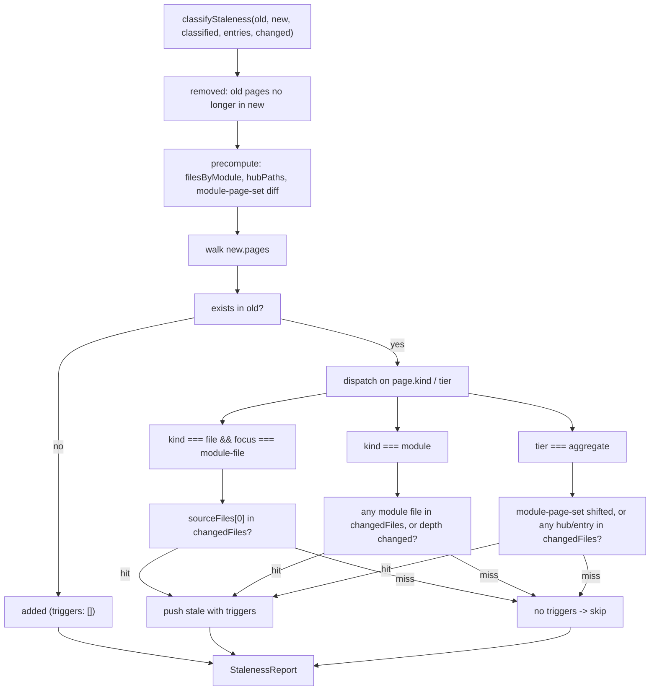

# staleness

Incremental-update brain for the wiki generator. Given an old manifest, a fresh manifest, the new classification inventory, the set of current entry points, and a `changedFiles` set (usually sourced from `git diff` against `lastGitRef`), `classifyStaleness` returns three lists: pages that have become `stale`, pages that were `added`, and pages that were `removed`. Callers (`src/tools/wiki-tools.ts`, `src/wiki/update-log.ts`) use that report to regenerate only what moved — without it, every incremental run would rewrite the whole wiki.

**Source:** `src/wiki/staleness.ts`

## Public API

```ts
export interface PageDelta {
  wikiPath: string;
  order: number;
  page: ManifestPage;
  /** Files that caused this page to be marked stale. Empty for "new" pages. */
  triggers: string[];
}

export interface StalenessReport {
  stale: PageDelta[];
  added: PageDelta[];
  removed: { wikiPath: string; page: ManifestPage }[];
}

export function classifyStaleness(
  oldManifest: PageManifest,
  newManifest: PageManifest,
  newClassified: ClassifiedInventory,
  newEntryPoints: Set<string>,
  changedFiles: Set<string>,
): StalenessReport;
```

`triggers` on a `PageDelta` is a breadcrumb trail — for a module-file page, it holds the single source path that changed; for a module page, every changed file inside the module; for an aggregate page, either a sentinel string like `"module page set changed"` or the specific hub / entry-point file paths that triggered the rewrite.

## Classification rules

The algorithm is a straight walk over the new manifest's pages, with a few precomputed sets to avoid quadratic lookups:



### Per-kind behaviour

- **Module-file pages** (`kind === "file"` && `focus === "module-file"`) — stale if `sourceFiles[0]` is in `changedFiles`. A single-source page so the check is direct.
- **Module pages** (`kind === "module"`) — stale if *any* file in the module is in `changedFiles`. The module's file list is looked up by title in a `filesByModuleName` map built from `newClassified.modules`; if the title doesn't resolve (rare), the manifest's `sourceFiles` is used as a fallback. Also stale if `page.depth !== old.depth` — a depth upgrade/downgrade forces a rewrite even without source edits, with a synthetic trigger string `"depth changed: <old> → <new>"`.
- **Aggregate pages** (`tier === "aggregate"`) — stale if **either** the module-page set changed between manifests (computed once with `setsEqual`), **or** any changed file is a hub (`classified.files.isHub`) or an entry point (`newEntryPoints.has(f)`). Hubs and entry points shape cross-cutting narratives (architecture, data flows), so a change in them re-scopes the aggregate even if no hub file's own page would otherwise restale.

### Added and removed

Removed pages come from the initial `for (const [wikiPath, page] of Object.entries(oldManifest.pages))` loop — if the wiki path is missing from `newManifest.pages`, it's pushed to `removed`. Added pages come from the same new-manifest walk, short-circuiting with `triggers: []` when the wiki path doesn't exist in the old manifest.

## Helpers

`setsEqual<T>(a, b)` is a straight equality check: same size, and every element of `a` is in `b`. Used once to compute `modulePageSetChanged`.

## Dependencies

| Direction | Target | Notes |
|---|---|---|
| Imports | `./types` | `PageManifest`, `ManifestPage`, `ClassifiedInventory` |
| Imported by | `src/tools/wiki-tools.ts` | Called from the `generate_wiki(incremental: true)` branch |
| Imported by | `src/wiki/update-log.ts` | Formats the `StalenessReport` into `wiki/updates.log` entries |
| Imported by | `tests/wiki/staleness.test.ts` | Unit tests for each kind's staleness rule |

## See also

- [wiki](index.md)
- [types](types.md)
- [section-selector](section-selector.md)
- [discovery](discovery.md)
- [Architecture](../../architecture.md)
- [Data Flows](../../data-flows.md)
