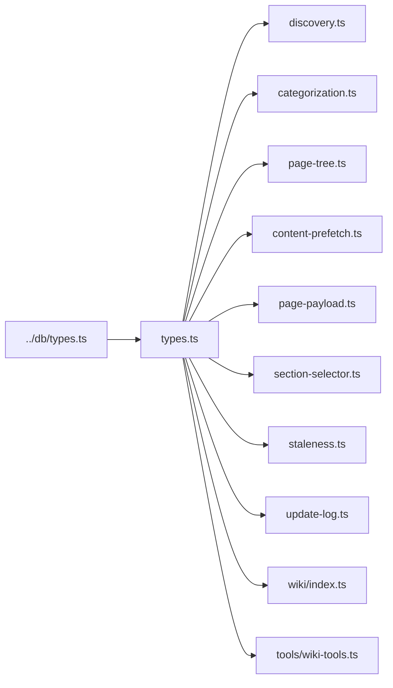

# types

Single-file home for the 25 interfaces and type aliases that flow through the wiki generation pipeline. Nothing here executes — `src/wiki/types.ts` is pure declarations shared by every other file in `src/wiki/*` plus `src/tools/wiki-tools.ts`. It is by far the heaviest hub in the module: `fanIn: 67`, `fanOut: 1` (one import of `SymbolResult` from `../db/types`). Adding a field to a shape here propagates through discovery, categorization, page-tree construction, content prefetch, page payloads, staleness classification, and the MCP tool wrapper.

**Source:** `src/wiki/types.ts`

## What's in here

The file is organized by pipeline phase, with comment banners separating each group:

1. **Graph shapes** — the JSON payloads parsed out of `generateProjectMap`.
2. **Phase 1: Discovery** — module inventory and the combined `DiscoveryResult`.
3. **Phase 2: Categorization** — symbol/file/module classifications.
4. **Phase 3: Page Tree** — the `ManifestPage` / `PageManifest` structure.
5. **Phase 4: Content Pre-fetch** — `PageContentCache` (one blob per wiki page).
6. **Page Payload** — the shape returned by `generate_wiki(page: N)`.
7. **Orchestrator result** — `WikiPlanResult`, the top-level bundle.

## Key exports

| Group | Type | Purpose |
|---|---|---|
| Graph | `FileLevelNode` / `FileLevelEdge` / `FileLevelGraph` | File-scoped graph from the project map JSON |
| Graph | `DirectoryEntry` / `DirectoryEdge` / `DirectoryLevelGraph` | Directory-scoped graph (used for module detection) |
| Phase 1 | `DiscoveryModule` | One detected module — name, path, entry file, files, exports, fan counts, internal edges, optional nested `children` |
| Phase 1 | `DiscoveryResult` | Full output of `runDiscovery` — counts, modules, both graph levels, warnings |
| Phase 2 | `SymbolTier` | `"entity"` or `"bridge"` — which of the two classification tiers a symbol belongs to |
| Phase 2 | `Scope` | `"cross-cutting" \| "shared" \| "local"` — how widely a symbol is referenced |
| Phase 2 | `ClassifiedSymbol` | Symbol with tier, scope, reference counts, and snippet |
| Phase 2 | `HubPath` | `"A" \| "B"` — which of the two hub-detection paths marked a file as a hub |
| Phase 2 | `ClassifiedFile` | Per-file fan counts, hub flag, bridges, entities |
| Phase 2 | `ClassifiedModule` | Module with `qualifiesAsModulePage`, hubs, bridges, value score |
| Phase 2 | `ClassifiedInventory` | Bundle of all three — symbols, files, modules, warnings |
| Phase 3 | `PageDepth` | `"full" \| "standard" \| "brief"` — how much detail the page should carry |
| Phase 3 | `PageKind` | `"module" \| "file" \| "aggregate"` — structural shape |
| Phase 3 | `PageFocus` | `"module-file" \| "architecture" \| "data-flows" \| "getting-started" \| "conventions" \| "testing" \| "index"` |
| Phase 3 | `ManifestPage` | One planned page — kind, focus, tier, title, depth, source files, related pages, order |
| Phase 3 | `PageManifest` | `version: 2` bundle: pages keyed by wiki path, plus `generatedAt` and `lastGitRef` for incremental staleness checks |
| Phase 4 | `PageContentCache` | The per-page prefetched blob — exports, dependencies, dependents, overview, children, plus cross-cutting extras (`modules`, `hubs`, `entryPoints`, `crossCuttingSymbols`, `testFiles`) |
| Phase 4 | `ContentCache` | `Record<string, PageContentCache>` — whole-plan cache |
| Payload | `SemanticQuery` / `ToolBreadcrumb` | Suggested follow-up calls embedded in the payload |
| Payload | `CandidateSection` | Section-library candidate — `name`, `reason`, `matched`, `exampleBody` |
| Payload | `PagePayload` | What `generate_wiki(page: N)` returns — wikiPath, kind, focus, depth, exemplar, prefetched, candidate sections, semantic queries, related pages, link map |
| Result | `WikiPlanResult` | Top-level bundle of `discovery`, `classified`, `manifest`, `content`, `warnings` |

## Notable shapes

`PageContentCache` is the largest interface here — every caller extends it with the slices it needs and leaves the rest undefined. Section eligibility predicates in [section-selector](section-selector.md) read through this same shape, so field renames here ripple into the `applies` predicates.

`PageManifest` pins `version: 2` as a literal — older manifests are rejected on load. `lastGitRef` is the anchor for incremental regeneration: [staleness](staleness.md) diffs the working tree against that ref to decide which pages need rewriting.

`CandidateSection` is exported from both this file and [section-selector](section-selector.md); the duplicate exists so the selector can live without a circular import on the payload shape. Both definitions are structurally identical.

## Dependency graph

`fanIn: 67` (67 distinct type references across 10+ files) | `fanOut: 1` (imports `SymbolResult` from `../db/types`)

## See also

- [wiki](index.md)
- [section-selector](section-selector.md)
- [staleness](staleness.md)
- [discovery](discovery.md)
- [db/types](../db/types.md)
- [Architecture](../../architecture.md)
