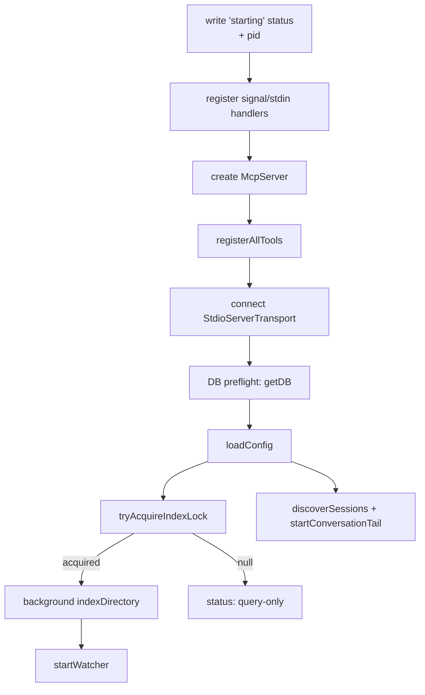

# Runtime lifecycle

This page is for anyone changing how the long-running mimirs MCP server boots, stays ready, or shuts down. It walks the process from the first byte written to the status file through serving tool calls and into clean (or crashing) shutdown, and names the ordering constraints you must not break. The per-tool behavior that happens *while* the server is ready lives on the individual tool flow pages; this page is about the process around them.

## Two ways the server starts, one boot function

A human or editor launches the server with `mimirs serve`. The CLI command resolves the project directory and then **dynamically imports** `startServer` rather than importing it statically, then calls it (`src/cli/commands/serve.ts:4-52`). The dynamic import is deliberate: `src/server/index.ts` has top-level await and native dependencies (`bun:sqlite`, `sqlite-vec`); a static import that failed at module-load time would crash the whole CLI before any handler ran, leaving no status file and no error log. By importing inside a `try`, a module-load failure still writes `.mimirs/server-error.log` and an `error` status before re-throwing (`src/cli/commands/serve.ts:13-49`). Everything else in the lifecycle is `startServer` (`src/server/index.ts:88`). See [mimirs serve](cli/serve.md) and the boot detail on [mimirs serve](server/start.md).

## Boot order and why it is fixed

The boot sequence is carefully ordered so the server is observable and crash-safe from its first instruction. The order is: write a `starting` status, register signal handlers, create the `McpServer`, register tools, connect the transport, preflight the database, load config, acquire the index lock, kick off background indexing, start the file watcher, and tail the conversation. Each step has a reason it sits where it does.

The very first thing `startServer` does is write `starting` to `.mimirs/status`, overwriting any stale `interrupted` left by a previous instance, stamped with `pid:<n>` so this instance owns the file (`src/server/index.ts:88-110`). Immediately after, before any work that could fail, it registers the shutdown handlers (`src/server/index.ts:152-173`) — so a crash during the *rest* of startup still records `interrupted` instead of leaving a stale status. Only then does it create the `McpServer` and call `registerAllTools` (`src/server/index.ts:181-190`).

### Transport connects before slow work

The single most important ordering rule: the stdio transport is connected *immediately* after tool registration, before config I/O, session scanning, and indexing (`src/server/index.ts:199-207`). The reason is in the code comment — the MCP client's `initialize` handshake must be answered before any slow startup work, or the client times out, closes the pipes, and the server's later writes hit `EPIPE`. If you add startup work, it must go *after* the transport connect, not before. Each phase updates the status file (`creating server`, `tools registered`, `connecting transport`, `transport connected`) so an external observer can see exactly where boot is (`src/server/index.ts:179-207`).

### Database preflight and the per-project cache

After the transport is up, the server opens the database as a preflight to catch a missing Homebrew SQLite or a read-only filesystem early (`src/server/index.ts:214-217`). Databases are not opened eagerly per request; they are lazily created and cached. `getDB` resolves the directory, returns the cached `RagDB` from `dbMap` if present, and otherwise constructs one and stores it with open/access timestamps (`src/server/index.ts:34-51`). Connections are kept open for the process lifetime on purpose — background indexing and the watcher hold references — so nothing closes a database mid-session; cleanup happens only on exit (`src/server/index.ts:20-22`). Preflight failures split two ways: transient errors (`database is locked`, `SQLITE_BUSY`) are *not* cached, so the next tool call retries `getDB`; permanent ones (missing SQLite, `EROFS`/`EACCES`) are cached in `permanentError` so every later tool call returns a clear fix instead of an opaque failure, and startup indexing is skipped entirely (`src/server/index.ts:218-256`, `src/server/index.ts:34-37`).

### Index lock gates the background work

Config is loaded (`src/server/index.ts:258`), then the server tries to take the process-level index lock. Only the lock holder runs the background indexer and the file watcher; if another mimirs process already holds the lock, this instance writes a `done` status with `mode: query-only` and serves reads against the existing index (`src/server/index.ts:266-352`). This is what makes it safe to run one server per editor window — see the lock contract in [the architecture overview](architecture.md). When held, `indexDirectory` runs in the background (never blocking the already-connected transport), reporting per-file progress into the status file, and on completion starts the file watcher (`src/server/index.ts:285-346`).

## Staying ready: the watcher and conversation tail

Once booted, the server is event-driven. The file watcher (`startWatcher`) debounces filesystem events and runs them through a serial queue so concurrent `indexFile` and graph-rebuild work never interleave — while one cycle runs, new events accumulate into `nextBatch` and are processed next (`src/indexing/watcher.ts:32-56`). Removed files are pruned and changed files re-indexed incrementally, keeping the index current without a full re-scan. Separately, the server discovers conversation sessions and tails the most recent one's JSONL, appending turns as the session grows, and back-indexes older un-indexed sessions in the background (`src/server/index.ts:354-386`). Both are background loops that the cleanup path must tear down. Explicit re-indexing requested via a tool call goes through [index_files](tools/index-files.md), which shares the same indexer and lock.

## Shutdown triggers and status rewrites

The server has one cleanup path reached by every shutdown trigger. The complete set of triggers, all registered before any failable startup work:

- **stdin `end`** — the IDE window closed and the pipe reached EOF; reason `"stdin closed"` (`src/server/index.ts:154-157`).
- **stdin `error`** — pipe error; reason `"stdin error"` (`src/server/index.ts:158-160`).
- **SIGINT**, **SIGTERM**, **SIGHUP** — each calls `cleanup` with its signal name (`src/server/index.ts:161-163`).
- **uncaughtException** — logged and passed to `cleanup` with the message and stack (`src/server/index.ts:164-167`).
- **unhandledRejection** — same, with the rejection reason (`src/server/index.ts:168-173`).

`cleanup` sets a `shuttingDown` flag (which makes `writeStatus` a no-op so nothing races the exit status), writes the exit status, closes the watcher and conversation watcher, releases the index lock, closes every cached database, and exits (`src/server/index.ts:140-150`). The exit status write is guarded: `writeExitStatus` only writes `interrupted` if this instance still owns the status file (the `pid:<n>` marker matches) and the file has not already reached `done` or `error` — so a freshly started replacement instance's status is never clobbered (`src/server/index.ts:119-138`). The invariant: an instance only ever rewrites status it owns.

## Crash diagnostics

A client that loses the stdio pipe sees only "Connection closed" with no detail, so crashes are written to disk. If tool registration or transport connection throws, `writeStartupError` writes `.mimirs/server-error.log` with the message, full stack, and a `bunx mimirs doctor` hint, plus an `error` status, before re-throwing (`src/server/index.ts:62-86`, `src/server/index.ts:191-211`). The earlier module-load failure path in the CLI writes the same log for failures that happen before `startServer` even runs (`src/cli/commands/serve.ts:20-44`). When debugging a server that "won't start," that file plus the status file are the two places to look.

## Key source files

- `src/server/index.ts` — `startServer`: the whole boot order, the `dbMap` cache and lazy `getDB`, the index-lock gate, the background indexing/watcher/conversation kickoff, every shutdown handler, `cleanup`, `writeExitStatus`, and `writeStartupError`.
- `src/cli/commands/serve.ts` — `serveCommand`: the dynamic-import wrapper that protects the CLI from native-module load failures and writes diagnostics when they occur.
- `src/indexing/watcher.ts` — `startWatcher`: the debounced, serially-queued file watcher that keeps the index current while the server is ready.
- `src/utils/index-lock.ts` — `tryAcquireIndexLock`: the PID-file lock that decides whether this instance indexes or serves query-only.
