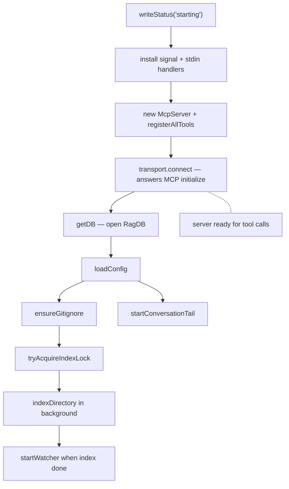

# Runtime lifecycle

This page covers what the long-running mimirs MCP server does between launch and exit: boot order, why the order matters, what runs in the background, and how the process shuts down cleanly. It's for someone debugging a server that didn't come up, didn't stay up, or didn't index what they expected.

## Boot order, and why it's that order

The server's boot is split into phases by `startServer` in `src/server/index.ts:88-387`. The order is deliberate; reordering breaks observability and recovery.

The very first thing the process does is write `starting` to `.mimirs/status` (`src/server/index.ts:110`). The status file is the only signal the user has if the server crashes before transport, so it must be written before anything that can fail.

Next, signal and stdin handlers are installed at `src/server/index.ts:154-173`. They are installed before tool registration, transport connect, or DB open — so a crash during any of those phases still produces an `interrupted` status with a real reason. Without this ordering, the user would see a stale `starting` and have no signal that the process died.

Tool registration runs in a `try/catch` that writes `server-error.log` and a status update on failure (`src/server/index.ts:182-197`). Then the transport is connected immediately (`src/server/index.ts:203-212`). The comment at `src/server/index.ts:199-202` is load-bearing: the MCP client's `initialize` handshake has a timeout, and the server has slow startup work ahead (config I/O, session discovery, indexing). Connecting before that work means the client never times out, and any later stderr write will not hit a closed pipe.

DB preflight (`src/server/index.ts:214-256`) is the first call that can fail with platform-specific errors — missing Homebrew SQLite on macOS, EROFS/EACCES on read-only filesystems. The server distinguishes transient errors ("database is locked", "SQLITE_BUSY") from permanent ones. Transient errors are not cached so the next tool call retries `getDB`; permanent errors are cached in `permanentError` so every subsequent tool call returns the same clear message.

After preflight, `loadConfig` (`src/server/index.ts:258`) reads `.mimirs/config.json`, then `ensureGitignore` writes a `.mimirs/` entry into the project's `.gitignore` so the index isn't accidentally committed.

## The index lock decides who indexes

`tryAcquireIndexLock` at `src/server/index.ts:269` is the gate. Multiple mimirs servers may be alive against one project — one per IDE window is normal. Only the lock holder runs the indexer and watcher. Non-holders write `mode: query-only` and answer search/read tools against whatever the holder has already produced (`src/server/index.ts:270-277`). The lock implementation lives at `src/utils/index-lock.ts:28-65`; it's a PID file at `.mimirs/index.lock`, with stale locks (PID gone) reclaimed automatically and reentrant counting inside one process.

## Background work after ready

Once the lock is held, the server kicks off `indexDirectory` and does not await it (`src/server/index.ts:285-322`). The progress callback updates `.mimirs/status` after every file so external observers see incremental progress. When the indexer's promise resolves, the server writes a `done` status and starts the file watcher (`src/server/index.ts:335-346`). If the indexer rejects, the status becomes `error` with the message (`src/server/index.ts:347-350`).

The watcher (`src/indexing/watcher.ts:16-117`) is debounced (2 seconds) and serialized: events for the same file collapse into one re-index, and the per-cycle queue ensures `indexFile` and `buildPathToIdMap` never run concurrently. Each event also re-resolves the file's importers' symbol refs, so a rename in one file updates `find_usages` for everything that called into it.

Conversation tailing is independent of the index lock (`src/server/index.ts:354-385`). The server discovers Claude Code session JSONL files, tails the most recent one with `startConversationTail`, and indexes any older sessions whose `mtime` is newer than the row in `conversation_sessions`. This is what lets `search_conversation` find decisions from earlier today.

See [mimirs serve](cli/serve.md) for the CLI wrapper and [index_files](tools/index-files.md) for the on-demand variant that uses the same lock.

## Per-project DB cache

`getDB` (`src/server/index.ts:34-51`) keeps a `Map<string, DBEntry>` of open `RagDB` instances keyed by absolute path. The cache is intentionally never evicted while the process lives. The reason is at `src/server/index.ts:20-22`: background tasks like the watcher hold references to a `RagDB` for the server's lifetime. If we closed it, the watcher would write to a closed connection on the next file change. Cleanup happens only in `cleanup` (`src/server/index.ts:140-150`) on process exit. The `server_info` tool surfaces the cache so users can see which projects are open and when they were last touched (`src/tools/server-info-tools.ts:59-69`).

## Shutdown paths

Five things can end the server, and they all funnel through one `cleanup` function:

- `stdin end` (`src/server/index.ts:154-157`) — the IDE window closed.
- `stdin error` (`src/server/index.ts:158-160`) — the pipe broke.
- `SIGINT` / `SIGTERM` / `SIGHUP` (`src/server/index.ts:161-163`) — process signals.
- `uncaughtException` (`src/server/index.ts:164-167`) — anything thrown out of an async boundary.
- `unhandledRejection` (`src/server/index.ts:168-173`) — a promise rejection nobody caught.

`cleanup` at `src/server/index.ts:140-150` sets `shuttingDown` (so later status writes are suppressed), writes an `interrupted` line via `writeExitStatus`, closes the watcher and conversation watcher, releases the index lock, closes every cached DB, and calls `process.exit(0)`.

`writeExitStatus` (`src/server/index.ts:119-138`) has one safety: it reads the current status file and only overwrites if the instance id matches. If another mimirs server started while this one was dying, that other instance's status must not get clobbered with `interrupted`.

## Crash diagnostics

When a startup-phase error happens before transport is connected — typically a missing native dep on macOS — the MCP client sees `Connection closed` with no message. The fix is `writeStartupError` at `src/server/index.ts:62-86`: it writes the error and stack to `.mimirs/server-error.log` with a pointer to `bunx mimirs doctor`. The `serve` CLI has the same shape at `src/cli/commands/serve.ts:13-49` for module-load failures that happen before `startServer` is even called.

## Key source files

- `src/server/index.ts` — `startServer`, the DB cache, the status-file dance, the signal handlers, and the background indexer/watcher.
- `src/cli/commands/serve.ts` — the CLI wrapper that dynamically imports the server to keep `mimirs doctor` working when natives are broken.
- `src/indexing/watcher.ts` — debounced, serialized watcher that the lock-holding server runs.
- `src/utils/index-lock.ts` — process-level PID lock that decides which instance indexes.
- `src/cli/index.ts` — command dispatcher that routes `mimirs serve` to the wrapper above.
