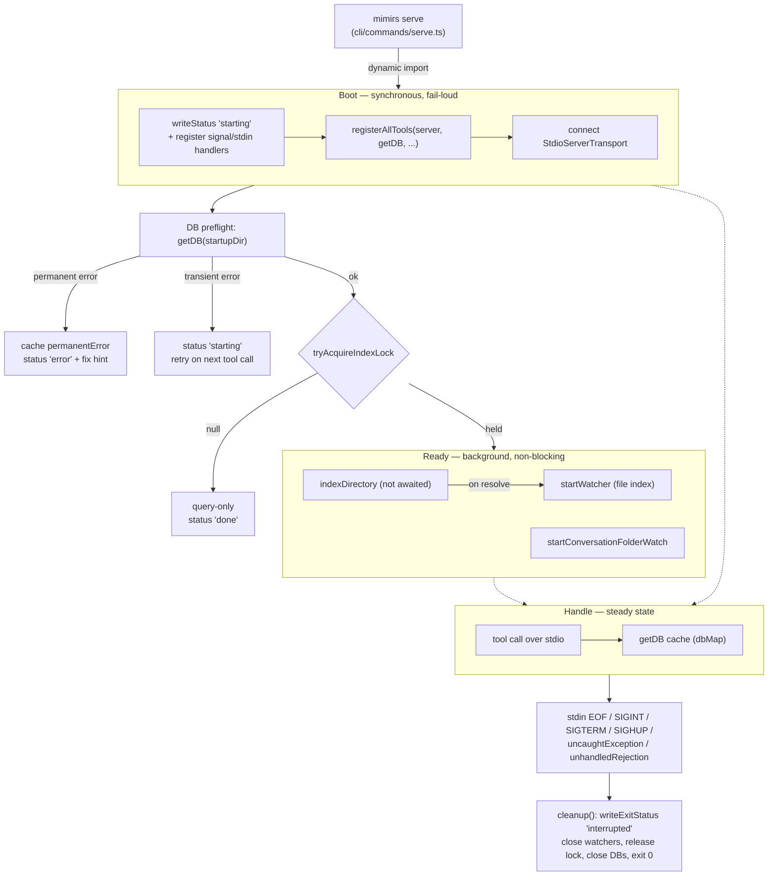

# Runtime Lifecycle

mimirs runs as one long-lived process per project: an MCP server spawned by an editor or agent that answers tool calls over stdio and, in the background, keeps the project's SQLite index fresh. This overview is the map of that process — from the first byte written to disk on boot, through the steady state where it serves tool calls and watches files, to the cleanup that runs when the client closes the pipe. It is written for a maintainer who needs to know *where* a lifecycle behavior lives before changing it: which line writes status, which guard skips indexing, which lock elects the single writer, and which handler closes the database. The step-by-step of each individual phase lives on the linked pages below; this page ties them into one picture and names the invariants that hold across all of them.

The whole lifecycle is driven by a single async function, `startServer` in `src/server/index.ts`, which the [serve](cli/serve.md) command hands off to after it has safely loaded the server module. Everything that follows — status writes, tool registration, transport, the database, the index lock, and the watchers — is set up inside that one call, and torn down by the `cleanup` closure defined alongside it (`src/server/index.ts:88-365`).

## Boot: status first, handlers second, transport third

The ordering of the boot sequence is the most load-bearing design decision in the lifecycle, and it is deliberate. `startServer` writes a `starting` status line as its very first action, before it does anything else, so that a stale `interrupted` left by a previous instance is overwritten immediately and an IDE polling the status file never sees old state (`src/server/index.ts:100-110`). The status file is the single source of truth a client reads to show "indexing 30%" or "ready"; every later phase rewrites it through the same `writeStatus` closure.

Immediately after the first status write — and crucially *before* any real work — the signal and stdin handlers are registered (`src/server/index.ts:154-173`). This is what guarantees that a crash *during* boot still records an exit reason instead of leaving a misleading `starting`. The cleanup targets (`watcher`, `convWatcher`, `indexLock`) are declared as `null` at this point and only assigned much later; `cleanup` tolerates the nulls by skipping them, so registering the handlers early is safe (`src/server/index.ts:115-117`, `src/server/index.ts:144-146`).

Only then does the server construct the `McpServer`, register every tool, and connect the transport. Tool registration is a thin fan-out: `registerAllTools` calls one `registerXTools(server, getDB, ...)` per group — search, indexing, graph, conversation, checkpoints, annotations, analytics, git, git history, server info, and wiki (`src/tools/index.ts:53-63`). Two process-state callbacks are threaded through so that tool handlers never have to import the server module: `getDB`, which lazily opens and caches one database per project directory, and `writeStatus`, which lets the indexing tools push progress into the same status file the boot phases use (`src/server/index.ts:189`). If registration throws, the server writes a crash log, sets status to `error` with `phase: tool registration failed`, and rethrows — boot aborts before the transport is ever connected (`src/server/index.ts:191-197`).

The transport is connected the instant tools are registered, before config, the database, or any project file is touched (`src/server/index.ts:203-207`). The reason is spelled out in the source comment: the client's `initialize` handshake must be answered before slow startup work, or the client times out, closes the pipes, and the server's later writes hit `EPIPE`. Answering the handshake first means the client sees a live server immediately and the heavy work happens behind it. **Invariant: nothing slow or fallible (config I/O, SQLite open, file scanning, model loading) may run before `server.connect(transport)`.** A maintainer adding startup work must place it after this line, never before.

The full step-by-step of this boot path — including the CLI dispatch and the dynamic-import fault isolation that precedes it — is on [Start the MCP server](server/start.md) and [serve](cli/serve.md).

## Ready: DB preflight, the index lock, then background work

Once the transport is up, the server transitions toward its ready state. The first step is a database preflight: it calls `getDB(startupDir)` once to force the SQLite connection open early, so a broken native build (for example, missing Homebrew SQLite on macOS) or an unwritable index directory surfaces here with a clear message instead of failing cryptically on the first real tool call (`src/server/index.ts:214-217`). The `RagDB` constructor is where `RAG_DB_DIR` is resolved and where `EROFS`/`EACCES` write failures are turned into actionable errors (`src/db/index.ts:101-123`).

With the database open, background work is gated on a per-project lock. Multiple mimirs servers can point at the same `.mimirs/index.db` — one MCP server per IDE window is common — and concurrent indexers racing on the same file double-insert chunk rows. To prevent that, exactly one instance per directory is elected the writer; the rest serve queries only. `tryAcquireIndexLock` writes the current PID to `.mimirs/index.lock` with the exclusive `wx` flag, returns `null` if a *live* process already holds it, reclaims a lock left by a dead PID automatically, and is reentrant within one process via a refcount (`src/utils/index-lock.ts:28-65`). Liveness is decided by `isPidAlive`, which sends signal `0` to the recorded PID: only an `ESRCH` ("no such process") result counts as dead, so a stale lock is reclaimed. An `EPERM` result — the process exists but is owned by another user — is treated as **alive**, so a second user's server cannot reclaim a live cross-user lock and double-index the shared `.mimirs` (`src/utils/index-lock.ts:91-103`). The startup path only enters the indexing block when the lock is held; a query-only instance writes a terminal `done` status reading `mode: query-only (another mimirs process owns indexing)` and starts no watchers (`src/server/index.ts:265-272`). The same lock is acquired a second time, reentrantly, inside `indexDirectory` itself, so a full index run invoked outside the server (the [index_files](tools/index-files.md) tool, the CLI) is protected too (`src/indexing/indexer.ts:818-831`). **Invariant: all index *writes* — the background full index and both watchers — happen only behind `tryAcquireIndexLock`.** Reads are never gated.

When the lock is held, the server kicks off `indexDirectory(...)` **without awaiting it**, so boot returns and the index builds in the background while tools are already answerable (`src/server/index.ts:286`). The progress callback translates indexer messages into status lines — counting `file:done` events into a `processed/total` percentage and surfacing scan and model-loading messages verbatim (`src/server/index.ts:286-322`). Only when that promise resolves does the server read the post-run totals from `getStatus`, write a `done` block, and *then* start the file watcher (`src/server/index.ts:323-347`). The conversation-folder watcher, by contrast, is started right after kicking off the index — not gated on its completion — so transcript backfill runs in parallel (`src/server/index.ts:358-362`).

Both watchers protect the long-lived process from a single bad file. The file watcher debounces each path for two seconds, then drains a serial queue so concurrent `indexFile` runs never interleave; crucially, each file's re-index is wrapped in its own `try/catch` inside the queue, and the unawaited `processQueue()` is given a `.catch(() => {})` (`src/indexing/watcher.ts:38-87`, `src/indexing/watcher.ts:116-118`). The reason is spelled out in the source: a transient `SQLITE_BUSY` on one file must not reject the queue promise, because an unhandled rejection would escalate to the server's `unhandledRejection` handler and tear down *every* project the process serves. The hiccup is reported through `onEvent` as `Watch update failed for <file>` and the next file proceeds. The conversation watcher backfills every existing transcript through the same serial queue it uses for live events, so two indexing runs over one file can never overlap (`src/conversation/indexer.ts:149-200`). Both watchers are described in detail on [Start the MCP server](server/start.md); the transcript index they keep current is the subject of [conversation](cli/conversation.md).

## Handle: tool calls served over stdio through the connection cache

In steady state the process does two things at once: it answers MCP tool calls over stdio, and its background watchers keep the index fresh. The handling side is simple by design. Every tool handler resolves its target project through the `getDB` callback that was threaded in at registration, and `getDB` is backed by a `Map` keyed on the resolved project directory (`src/server/index.ts:28`, `src/server/index.ts:34-51`). The first call for a directory constructs a `RagDB`; every later call returns the cached entry and bumps its `lastAccessed` timestamp. **Connections are never evicted.** The source comment states the reason directly: closing a database that a background task (the auto-index or a watcher) still holds would break that task, so all connections stay open for the life of the process and are closed only on exit (`src/server/index.ts:20-22`). A single server can therefore hold several open databases at once — the common case being a tool call that passes an explicit `directory` different from the one being indexed.

The cache doubles as the lifecycle's observability seam. `getConnectedDBs` exports the map as a list of `{ projectDir, openedAt, lastAccessed }` records (`src/server/index.ts:53-60`), and that function is handed to the server-info tools at registration so a caller can ask which projects this process currently holds open (`src/tools/index.ts:54`, `src/tools/server-info-tools.ts:60-68`). A maintainer adding lifecycle telemetry — idle timeouts, connection limits, eviction — should start from `dbMap` and `getConnectedDBs`, because they are the only place the set of live connections is materialized.

The `getDB` accessor also enforces the permanent-error contract described in the next section: its first line throws the cached `permanentError` if one was set during preflight, so a fatal misconfiguration produces the same clear message on every tool call rather than a fresh cryptic failure each time (`src/server/index.ts:34-37`).

## Permanent vs transient: how a startup error decides the rest of the run

Not every startup failure is fatal, and the lifecycle treats the two classes differently. When the DB preflight throws, the error message is inspected: a message containing `database is locked` or `SQLITE_BUSY` is classified **transient**, anything else is **permanent** (`src/server/index.ts:218-235`).

A transient error means another process was briefly holding the database. It is logged but **not** cached, status is left as `starting` with a "Will retry on next tool call" note, and `startServer` returns early — skipping background indexing, which needs a stable open DB. Because nothing was cached, the next tool call simply re-runs `getDB`, which may now succeed (`src/server/index.ts:227-230`, `src/server/index.ts:255`). The server stays connected throughout, so recovery is automatic.

A permanent error — a filesystem permission failure, a missing native library — is cached in the module-level `permanentError` string, and status is written as `error` with a targeted fix hint chosen from the message: `brew install sqlite` for the macOS case, "set `RAG_DB_DIR` to a writable directory" for `EROFS`/`EACCES`, or a generic README pointer otherwise (`src/server/index.ts:221-225`, `src/server/index.ts:231-247`). The server still stays connected, but every subsequent tool call hits the guard at the top of `getDB` and gets the same clear message until the environment is fixed (`src/server/index.ts:34-37`). **Invariant: only transient errors are left uncached so they can self-heal; a permanent error deliberately fails fast and identically on every call.** This is also why a transient classification must never be widened carelessly — caching a genuinely permanent failure as retryable would loop the client forever, while mis-classifying a transient lock as permanent would wedge a recoverable server.

A separate boot-level guard runs even earlier: `checkIndexDir` refuses to index system-level directories — the user's home directory, `/`, `/home`, `/Users`, `/tmp`, `/var`, `/usr`, `/etc`, `/opt`, `/bin`, `/sbin`, `/private`, `/Library`, `/System`, and `/Applications` — which would otherwise OOM the process (`src/utils/dir-guard.ts:10-26`). It checks both the resolved path and its symlink-resolved real path, so a symlink pointing at `/` cannot slip past, and it expands a leading `~` first (`src/utils/dir-guard.ts:36-63`). When the resolved project directory is one of these, the status path is set to `null` so *no* status file is written, and the entire index/watch block is skipped — the server still registers tools and answers queries, it just never indexes (`src/server/index.ts:92-95`, `src/server/index.ts:175-177`).

## Shutdown: every exit route funnels through one cleanup

The process exits cleanly through a single closure, `cleanup`, no matter how the exit was triggered. Seven distinct routes are wired to it during the early handler-registration step: stdin `end` (the MCP client closing the pipe, typically because the editor window closed), stdin `error`, the OS signals `SIGINT`, `SIGTERM`, and `SIGHUP`, an `uncaughtException`, and an `unhandledRejection` (`src/server/index.ts:154-173`). Funneling all of them through one function means the teardown order is identical regardless of cause.

`cleanup` first sets `shuttingDown = true`, which neutralizes any further `writeStatus` calls (the closure short-circuits once shutdown has begun), then writes the exit status, closes both watchers, releases the index lock, closes every open database in `dbMap`, clears the map, and calls `process.exit(0)` (`src/server/index.ts:140-150`). The exit-status write is guarded by `writeExitStatus`, which is careful about ownership: it reads the current status file and refuses to overwrite it unless the file still carries this instance's `pid:<n>` and is not already a terminal `done` or `error` (`src/server/index.ts:119-138`). This is what prevents one instance from clobbering another instance's status with a spurious `interrupted` — a real hazard when several IDE windows spawn servers against the same project. **Invariant: an instance only ever writes status that it owns**, enforced both here and in the `writeStatus` closure that stamps every line with the instance id (`src/server/index.ts:100-108`). Releasing the lock is similarly defensive: the token unlinks `.mimirs/index.lock` only if the file still contains this process's PID (`src/utils/index-lock.ts:67-89`).

A maintainer adding a new resource that must be released on shutdown should add it to the `cleanup` body and, if it is created during ready-state, declare it as a nullable alongside `watcher`/`convWatcher`/`indexLock` so the early-registered handlers can clean it up even if a crash happens before it was assigned.

## Where to change things

- **Add a tool to the running server:** add a `registerX` import and one call in `registerAllTools` (`src/tools/index.ts:53-63`). The handler receives `getDB` (and optionally `writeStatus`) for free; it must not import `src/server/index.ts`.
- **Add a boot phase or slow startup step:** place it *after* `server.connect(transport)` (`src/server/index.ts:206`), and if it can fail, write an `error` status and a crash log on the way out, matching the existing tool-registration and transport blocks.
- **Change how connections are managed (eviction, limits, idle close):** edit `getDB`/`dbMap` and surface state through `getConnectedDBs` (`src/server/index.ts:28-60`); respect the invariant that a DB still used by a background task is never closed.
- **Add a shutdown-released resource:** declare it nullable near `src/server/index.ts:115-117` and release it in `cleanup` (`src/server/index.ts:140-150`).
- **Reclassify a startup error:** the transient/permanent split is one expression at `src/server/index.ts:220`; widen it only when the new condition is genuinely retryable on the next tool call.

## Key source files

- `src/server/index.ts` — `startServer`, the whole lifecycle: status writes, handler registration, tool registration, transport, DB preflight, the permanent/transient split, lock gating, background index and watchers, the `getDB` connection cache, and `cleanup`.
- `src/cli/commands/serve.ts` — `serveCommand`, the entry point that dynamically imports the server module and hands off to `startServer`.
- `src/tools/index.ts` — `registerAllTools`, the fan-out that attaches every tool group and threads `getDB`/`writeStatus` through.
- `src/indexing/watcher.ts` — `startWatcher`, the debounced, serialized recursive file watcher started after the first full index completes; its per-file `try/catch` isolation keeps a transient `SQLITE_BUSY` on one file from crashing the whole server.
- `src/conversation/indexer.ts` — `startConversationFolderWatch`, the transcript-folder backfill-and-tail watcher started in parallel with the file index.
- `src/utils/index-lock.ts` — `tryAcquireIndexLock`, the per-project lock that elects the single indexing instance, reclaims stale (`ESRCH`) locks, and treats an `EPERM` cross-user PID as still alive.
- `src/utils/dir-guard.ts` — `checkIndexDir`, the guard that refuses to index system-level directories.
- `src/db/index.ts` — the `RagDB` constructor, where `RAG_DB_DIR` is resolved and write failures surface as the permanent errors the preflight catches.
- `src/tools/server-info-tools.ts` — where `getConnectedDBs` is consumed to report the live connection set.

## Related pages

- [Start the MCP server](server/start.md) — the boot sequence step by step, with the full status-phase example.
- [serve](cli/serve.md) — the CLI layer that loads the server module and isolates module-load failures.
- [index_files](tools/index-files.md) — the same background index run, triggered on demand instead of at boot.
- [conversation](cli/conversation.md) — the transcript index the conversation-folder watcher keeps current.
