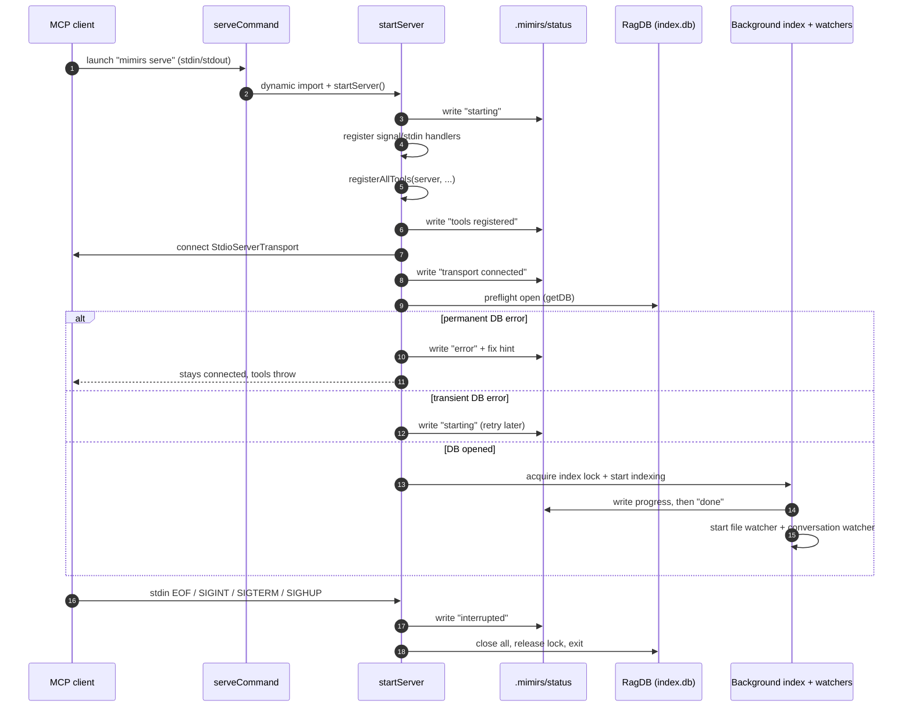

# Start the MCP server

The `serve` command boots the long-lived process that an editor or agent talks to over stdio. It is the only entry point that turns a project directory into a live MCP endpoint: it registers every tool, answers the MCP handshake, opens the project's SQLite index, and then keeps the index fresh in the background by re-scanning the project and tailing conversation transcripts.

The startup path is deliberately ordered so that the slow, fallible work (opening native SQLite, scanning the whole project, loading the embedding model) happens *after* the client is already connected. A boot that crashes still leaves a readable trail: a `.mimirs/status` file recording the phase it reached, and a `.mimirs/server-error.log` with the stack. This page walks the boot from `mimirs serve` to a running watcher, and names every branch that can change the outcome.

## When you would use it

This is what your MCP client (an IDE extension, an agent runtime) actually launches. The generated MCP config runs `mimirs@latest serve` with `RAG_PROJECT_DIR` pointed at the project (`src/cli/setup.ts:222`). You rarely run `mimirs serve` by hand — but when the index seems stale, the tools return errors, or the client reports "connection closed", the boot order and the status file are where you look first.

## The boot sequence



1. The MCP client launches the process. The CLI dispatch in `src/cli/index.ts:107` matches the `serve` verb and calls `serveCommand()`.
2. `serveCommand` reads the project directory from `RAG_PROJECT_DIR` (falling back to `process.cwd()`), prints a startup line to stderr, then **dynamically** imports the server module. The dynamic import is load-bearing: `src/server/index.ts` has a top-level `await import("../../package.json")` and pulls in native modules (`bun:sqlite`, `sqlite-vec`). A static import that failed at module-load time would crash the CLI before any handler ran, leaving no status file and no log (`src/cli/commands/serve.ts:8-14`).
3. `startServer()` writes the first status line, `starting`, as the very first action — overwriting any stale `interrupted` left by a previous instance (`src/server/index.ts:88-110`).
4. It registers shutdown handlers *before* doing real work, so a crash mid-boot still records an exit reason (`src/server/index.ts:152-173`).
5. It constructs the `McpServer` and calls `registerAllTools`, wiring up every tool group, then writes `tools registered` (`src/server/index.ts:181-190`).
6. It connects the stdio transport **immediately**, so the client's `initialize` handshake is answered before any slow work, then writes `transport connected` (`src/server/index.ts:199-207`).
7. It opens the project's SQLite database as a preflight check. Failures here branch on whether the error is permanent or transient (see [Branches and failure cases](#branches-and-failure-cases)).
8. With the DB open and the directory safe, it tries to acquire a per-project index lock. The lock holder runs the background full index, writes progress to status, and on completion starts the file watcher and the conversation-folder watcher (`src/server/index.ts:269-362`).
9. On stdin EOF or a termination signal, the cleanup handler writes `interrupted`, closes the watchers and DB, releases the lock, and exits (`src/server/index.ts:140-163`).

## Inputs

| name | type | required | description |
| --- | --- | --- | --- |
| `RAG_PROJECT_DIR` | env var | no | The project to serve. Read in both `serveCommand` and `startServer`; falls back to `process.cwd()` when unset (`src/server/index.ts:91`). If the resolved directory is a system-level path like `$HOME` or `/`, indexing and watching are skipped (see the home-directory guard below). |
| `RAG_DB_DIR` | env var | no | Where the SQLite index lives. When set, `RagDB` writes `index.db` there instead of `<project>/.mimirs`; when a write fails, the error hint tells the user to set this (`src/db/index.ts:103-104`, `src/server/index.ts:224`). |
| stdin EOF | process signal | n/a | The MCP client closing the pipe (for example, the editor window closing) fires `stdin.on("end")`, which triggers a clean shutdown (`src/server/index.ts:154-157`). |
| `SIGINT` / `SIGTERM` / `SIGHUP` | OS signal | n/a | Each is wired to `cleanup` with the signal name as the reason (`src/server/index.ts:161-163`). |

## Outputs

| output | where it lands / shape / description |
| --- | --- |
| `.mimirs/status` | A small text file rewritten at each phase: `starting` (with version and timestamp), `tools registered`, `transport connected`, indexing progress like `12/40 files (30%)`, a final `done` block with totals, or `error` / `interrupted`. Each line set ends with `pid:<n>` so an instance only overwrites its own status (`src/server/index.ts:100-138`). |
| Registered MCP tools | Every tool group attached to the `McpServer` and served over stdio once the transport connects (`src/server/index.ts:189`, `src/tools/index.ts:39-56`). |
| Index rows in `index.db` | The background full index inserts/updates file and chunk rows (plus vector and FTS entries), prunes deleted files, and resolves imports and symbol references (`src/server/index.ts:285-332`, `src/indexing/indexer.ts:745-793`). |
| `.mimirs/server-error.log` | On a startup crash, the message, stack, and the hint `bunx mimirs doctor` are written here so the failure is visible outside stderr (`src/server/index.ts:62-86`, `src/cli/commands/serve.ts:20-35`). |

## Tool registration

`registerAllTools` is a thin fan-out: it calls one `registerXTools(server, getDB, ...)` per group — search, indexing, graph, conversation, checkpoints, annotations, analytics, git, git history, server info, and wiki (`src/tools/index.ts:39-56`). Two callbacks are threaded through so tools can reach process state without importing the server: `getDB`, which lazily opens (and caches) one `RagDB` per project directory, and `writeStatus`, which lets the indexing tools push progress into the same status file the boot phases use. The connected-DB list is passed to the server-info tools so they can report open connections.

Registration is wrapped in a `try/catch`. If it throws, the server writes the crash log, sets status to `error` with `phase: tool registration failed`, and rethrows — the boot stops before the transport connects (`src/server/index.ts:191-197`).

## Transport before slow work

The order is intentional. `StdioServerTransport` is connected right after tools are registered, and only then does the server touch config, the database, or the project files (`src/server/index.ts:199-207`). The comment in source spells out the failure this avoids: if the client's `initialize` handshake is not answered before slow startup work, the client may time out, close the pipes, and the server's later stderr writes hit `EPIPE`. Answering the handshake first means the client sees a live server immediately, and the heavy indexing happens in the background without blocking any tool call.

## DB preflight: permanent vs transient

After the transport is up, the server opens the database once as a preflight, by calling `getDB(startupDir)` (`src/server/index.ts:215-217`). This catches a broken native SQLite (for example, missing Homebrew SQLite on macOS) or an unwritable index directory early, with a clear message, rather than letting the first tool call fail cryptically.

The error handling splits on whether the failure can be retried:

| Error class | Detection | What happens | Status written |
| --- | --- | --- | --- |
| Transient | message contains `database is locked` or `SQLITE_BUSY` | Not cached. The next tool call re-runs `getDB`, which may succeed. | `starting` + `Will retry on next tool call` |
| Permanent | anything else (permission failure, missing native lib) | Cached in `permanentError`; every later tool call hits the guard at the top of `getDB` and gets the same clear message | `error` + a targeted fix hint |

The fix hint is chosen from the message: `brew install sqlite` for the macOS case, "set `RAG_DB_DIR` to a writable directory" for `EROFS`/`EACCES`, or a generic README pointer otherwise (`src/server/index.ts:218-256`). In both error cases the function `return`s early — startup indexing is skipped because it needs an open DB. The transient path keeps the server connected so a retry can recover; the permanent path keeps it connected too, but every tool call throws the cached error until the environment is fixed (`src/server/index.ts:34-37`).

## The index lock gates all background work

Multiple MCP servers can run against the same `.mimirs/index.db` — one per IDE window is common. Concurrent indexers racing on the same file double-insert chunk rows. To prevent that, exactly one server per project directory performs indexing and watching; the rest serve queries only.

This is enforced by `tryAcquireIndexLock`, which writes the current PID to `.mimirs/index.lock` with the exclusive `wx` flag. If a live process already holds it, the call returns `null`; a lock left by a dead PID is reclaimed automatically, and the lock is reentrant within one process via a refcount (`src/utils/index-lock.ts:28-65`). The startup path only enters the indexing block when the lock is held (`src/server/index.ts:269-279`). A query-only instance writes a terminal `done` status reading `mode: query-only (another mimirs process owns indexing)` and does nothing further with the project files.

The same lock is acquired a second time, reentrantly, inside `indexDirectory` itself, so a single full-index run is also protected even when invoked outside the server (`src/indexing/indexer.ts:722-730`).

## Background full index, then watchers

When the lock is acquired, the server kicks off `indexDirectory(startupDir, startupDb, startupConfig, onProgress)` **without awaiting it** — the boot returns and the index builds in the background (`src/server/index.ts:285`). The progress callback translates indexer messages into status lines: it counts `file:done` events into a `processed/total` percentage, surfaces `scanning files` and `Loading embedding model` messages verbatim, and parses `Found N files to index` to seed the total (`src/server/index.ts:285-321`).

Inside `indexDirectory` the work is: re-check the directory is safe to index, acquire the (reentrant) lock, collect matching files, eagerly load the embedding model, process each file into chunks, prune files that no longer exist, then resolve imports and symbol references across the project (`src/indexing/indexer.ts:734-793`).

When the index promise resolves, the server reads the DB totals and writes a `done` block (`indexed`/`skipped`/`pruned` counts plus total files and chunks), then starts the file watcher (`src/server/index.ts:322-346`). `startWatcher` does a recursive `fs.watch` on the project, filters events through the configured include/exclude globs, debounces each path by two seconds, and funnels indexing through a serial queue so re-index and graph-resolution work never interleave. Each settled event either re-indexes the file (and re-resolves imports for it and its importers) or removes a deleted file (`src/indexing/watcher.ts:16-117`).

Independently of the file index — it is started right after kicking off `indexDirectory`, not gated on its completion — the server starts a conversation-folder watcher with `startConversationFolderWatch` against the project's Claude Code transcripts directory (`src/server/index.ts:357-361`). On startup it backfills every existing `*.jsonl` transcript from its stored byte offset, then watches the folder so live sessions and any later session stay current. Both the backfill and live events drain through one serial queue, and re-reading the offset from the DB on every pass makes the work idempotent: a pass that finds no new bytes returns 0 and changes nothing, so `turn_count` can never desync (`src/conversation/indexer.ts:97-117`, `src/conversation/indexer.ts:162-233`). This is what lets one agent's findings become searchable to another in near real time.

## State changes

### `.mimirs/status` — none → written, at every phase

`writeStatus` rewrites the status file with the given text plus the instance id `pid:<n>`. It is a no-op once shutdown has begun, and it best-effort-creates `.mimirs/` first (`src/server/index.ts:100-108`). It is called for every boot phase (`starting`, `creating server`, `tools registered`, `connecting transport`, `transport connected`), for each chunk of indexing progress, and for the final `done` / `error` / `interrupted` line. This is the single source of truth an IDE polls to show "indexing 30%" or "ready", which is why it matters that an instance only overwrites status that carries its own pid.

### `.mimirs/index.lock` — none → acquired (one instance only)

`tryAcquireIndexLock(startupDir)` either returns a lock token or `null` (`src/server/index.ts:269`). Acquiring it is what grants this instance the right to write the index and run watchers; failing to acquire it downgrades the instance to query-only. The token is released during cleanup, which unlinks the lock file only if it still contains this process's PID (`src/utils/index-lock.ts:67-89`). This change matters because it is the boundary between "this server keeps the index fresh" and "this server only reads" — get it wrong and two processes corrupt the chunk table.

### `index.db` file/chunk rows — none/stale → indexed

The background `indexDirectory` run inserts and updates file and chunk rows (and their vector and FTS entries), prunes files that no longer exist, and resolves cross-file import and symbol edges (`src/server/index.ts:285-332`, `src/indexing/indexer.ts:745-793`). The result counts (`indexed`, `skipped`, `pruned`) and the post-run totals from `getStatus` are written into the `done` status line. After this completes, the file watcher keeps these rows in sync as the project changes.

## Branches and failure cases

- **Server module fails to load.** The dynamic import in `serveCommand` is wrapped in `try/catch`; on failure it writes `server-error.log` and a `status` of `error` with `phase: module load failed`, then rethrows (`src/cli/commands/serve.ts:13-49`).
- **Home-directory / system-directory trap.** `checkIndexDir` rejects `$HOME`, `/`, `/Users`, `/tmp`, and similar (`src/utils/dir-guard.ts:9-39`). When the resolved project dir is one of these, `isHomeDirTrap` is true: the status path is set to `null` (so *no* status file is written), and the entire index/watch block is skipped — the server still registers tools and serves queries (`src/server/index.ts:92-95`, `src/server/index.ts:175-260`).
- **Tool registration throws.** Caught before the transport connects; writes `error` status and the crash log, then rethrows so boot aborts (`src/server/index.ts:191-197`).
- **Transport connect throws.** Caught with its own `error` status (`phase: transport failed`) and crash log, then rethrows (`src/server/index.ts:208-212`).
- **DB preflight — transient lock.** Logged as transient, not cached; status stays `starting`; indexing is skipped this boot but tool calls retry `getDB` (`src/server/index.ts:227-230`, `src/server/index.ts:255`).
- **DB preflight — permanent failure.** Cached in `permanentError`; every tool call throws the cached message with a fix hint; status is `error` (`src/server/index.ts:231-235`).
- **Index lock held by another process.** `tryAcquireIndexLock` returns `null`; the instance writes a `done` / `query-only` status and skips indexing and the file watcher (`src/server/index.ts:269-277`). Note the conversation-folder watcher is inside the same `if (indexLock)` block, so a query-only instance does not tail transcripts either.
- **Background index rejects.** The `.catch` on the index promise writes an `error` status and logs a warning, but does not crash the server — tools keep working against whatever was already indexed (`src/server/index.ts:347-350`).
- **Conversations folder missing.** Both the backfill scan and the `fs.watch` are wrapped so a non-existent transcripts directory is tolerated; the watch (when it can be created) picks the folder up once it appears (`src/conversation/indexer.ts:193-223`).
- **Shutdown.** stdin `end`, stdin `error`, `SIGINT`, `SIGTERM`, `SIGHUP`, an uncaught exception, and an unhandled rejection all route to `cleanup`, which sets `shuttingDown`, writes `interrupted` (only over this instance's own non-terminal status), closes both watchers, releases the lock, closes every open DB, and exits 0 (`src/server/index.ts:140-173`). `writeExitStatus` refuses to clobber a status that another instance owns or that already reads `done`/`error` (`src/server/index.ts:119-138`).

## Example: lifecycle phases

A clean boot rewrites `.mimirs/status` through roughly this sequence (values are illustrative):

```
starting / version: <v> / started: <iso>
starting / phase: creating server
starting / phase: tools registered
starting / phase: connecting transport
starting / phase: transport connected
0/40 files
12/40 files (30%)
done / version: <v> / finished: <iso>
     indexed: 12, skipped: 28, pruned: 0
     total files: 40, total chunks: 512
```

A second server on the same project instead lands on a single terminal line:

```
done / version: <v> / mode: query-only (another mimirs process owns indexing)
```

## Key source files

- `src/cli/commands/serve.ts` — the `serve` entry point; dynamically imports the server and records module-load failures.
- `src/server/index.ts` — `startServer`, the whole boot sequence: status writes, tool registration, transport, DB preflight, lock gating, background index and watchers, and shutdown handlers.
- `src/tools/index.ts` — `registerAllTools`, the fan-out that attaches every tool group to the MCP server.
- `src/indexing/indexer.ts` — `indexDirectory`, the background full-index run that populates `index.db`.
- `src/indexing/watcher.ts` — `startWatcher`, the debounced recursive file watcher that keeps the index fresh.
- `src/conversation/indexer.ts` — `startConversationFolderWatch`, the transcript-folder backfill-and-tail watcher.
- `src/utils/index-lock.ts` — `tryAcquireIndexLock`, the per-project lock that elects the single indexing instance.
- `src/utils/dir-guard.ts` — `checkIndexDir`, the guard that refuses to index system-level directories.
- `src/db/index.ts` — the `RagDB` constructor, where `RAG_DB_DIR` is resolved and write failures surface.

## Related flows

- [index_files](../tools/index-files.md) and [Index command](../cli/index.md) — the same `indexDirectory` run, triggered on demand instead of at boot.
- [Conversation search](../cli/conversation.md) — the transcript index that the conversation-folder watcher keeps current.
- [doctor](../cli/doctor.md) — the diagnostic the startup error hints point users toward.
