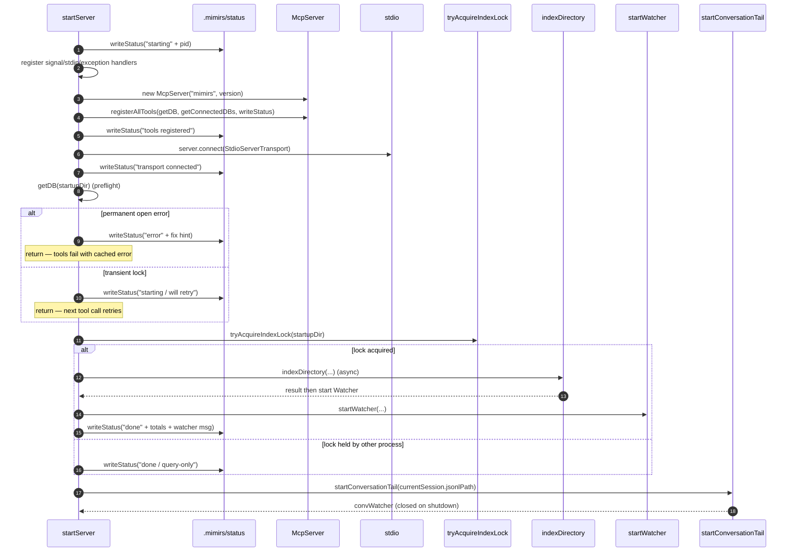

# Server: MCP stdio start

`startServer` boots the mimirs MCP server over a stdio transport. Most lifecycle complexity here is about *not* breaking the MCP handshake: the protocol expects an `initialize` reply within a short timeout, but mimirs also needs to do slow work (load config, scan files, embed chunks, watch for changes). The boot sequence is structured so the transport is wired up first and everything heavy runs in the background while clients can already call tools.

Beyond that, the boot deals with three things you would expect a long-running indexer to deal with: a process-level lock so two concurrent servers do not race on the same DB, a tailable conversation log so live agent turns become searchable, and a status file plus error log so an editor extension can show the user what is happening when the server fails to start.

## Lifecycle

1. The first thing `startServer` does is determine `startupDir` from `RAG_PROJECT_DIR` or `cwd()`, run `checkIndexDir` to refuse home-directory traps, and write `starting` to `.mimirs/status` along with `pid:<process.pid>` as an instance tag (`src/server/index.ts:88-110`). The instance tag is later used so two competing servers do not clobber each other's status.
2. Shutdown handlers (`SIGINT`, `SIGTERM`, `SIGHUP`, `stdin end`, `stdin error`, `uncaughtException`, `unhandledRejection`) are registered *before* any heavy startup work — a crash during init still writes an `interrupted` status with a reason and closes any watchers (`src/server/index.ts:152-173`).
3. The `McpServer` is constructed and `registerAllTools` wires up every MCP tool category (search, index, graph, conversation, checkpoint, annotation, analytics, git, git-history, server-info, wiki). On failure the error is written to `.mimirs/server-error.log` and status becomes `error` (`src/server/index.ts:181-197`).
4. The stdio transport is connected *immediately* after registration and *before* any DB open, config load, or indexing. The comment in source spells this out: without an early `connect`, the MCP client's `initialize` would time out, the pipes would close, and the server's later stderr writes would hit `EPIPE` (`src/server/index.ts:199-212`).
5. Preflight DB open: `getDB(startupDir)` is called once now to catch permanent failures (e.g. missing Homebrew SQLite, EROFS, EACCES) early. Transient "database is locked" / `SQLITE_BUSY` is not cached so the next tool call may still succeed; permanent failures are cached in `permanentError` and rethrown by every subsequent `getDB` call. Either way startup indexing is skipped (`src/server/index.ts:215-256`).
6. `ensureGitignore` is fire-and-forget — it adds `.mimirs/` to the project's `.gitignore` if missing. Failures only log a warning.
7. `tryAcquireIndexLock(startupDir)` writes `pid` to `.mimirs/index.lock` with `flag: "wx"` (exclusive create). If another live process already holds the lock, the call returns `null` and the server runs in *query-only mode*: status becomes `done / mode: query-only`, no `indexDirectory` is launched, and no watcher is started. Stale locks (PID gone) are reclaimed automatically (`src/utils/index-lock.ts:28-65`).
8. When the lock is held, `indexDirectory` runs in the background. Its progress callback parses messages like `file:done`, `scanning files`, `Loading embedding model`, and `Found N files to index` to update `.mimirs/status` with percentages so an IDE extension can render a progress bar (`src/server/index.ts:285-321`).
9. After indexing finishes, `startWatcher` is attached. It debounces filesystem events by 2 seconds, queues `index`/`remove` actions, and re-resolves imports + symbol refs for the changed file and its importers (`src/indexing/watcher.ts:10-117`). Each watcher message is also written into the status file so the lifecycle stays visible.
10. `discoverSessions(startupDir)` finds Claude session JSONL files for this project. The most recent session is *tailed* via `startConversationTail` — it watches the JSONL for appends and indexes new turns with a 2-second debounce (`src/conversation/indexer.ts:91-147`). Older sessions are indexed once each in the background if their mtime is newer than the stored record.

## Inputs

| Input | Where it comes from | Effect |
|---|---|---|
| `RAG_PROJECT_DIR` | environment | Project directory the server attaches to. Falls back to `process.cwd()`. |
| `RAG_DB_DIR` | environment | Override for where the SQLite DB and lock live (defaults to `<project>/.mimirs/`). Used by `RagDB`; the fix-hint in the DB open error path explicitly mentions setting it to a writable dir when EROFS/EACCES strikes (`src/server/index.ts:222-225`). |
| `LOG_LEVEL` | environment | Controls verbosity of the `log` helper used throughout (debug/info/warn/error). |

The server has no positional or flag arguments — it is launched by an MCP client (Claude, Cursor, etc.) as a subprocess and communicates entirely over stdio plus the status/error files.

## Outputs

- **Registered MCP tools** — every tool from `registerAllTools` becomes callable after step 3 of the lifecycle, even while indexing is still running.
- **Background index** — `indexDirectory` runs once on boot; chunks land in `.mimirs/index.db`.
- **Watcher** — `startWatcher` keeps the index in sync until shutdown.
- **Conversation tail** — `startConversationTail` for the current session plus best-effort indexing of older sessions.
- **`.mimirs/status`** — written at every phase: `starting / phase: …`, `0/N files (P%)`, `done / version: … / total files: N, total chunks: M`, `watcher: …`, or `error / …`.
- **`.mimirs/server-error.log`** — written on any startup crash, with a stack trace plus the recovery hint `To diagnose: bunx mimirs doctor` (`src/server/index.ts:62-86`).

## State changes

### `.mimirs/status` file

Before boot the file usually carries the *previous* run's last value, often `interrupted` if the editor was closed. The first thing `startServer` does is overwrite it with `starting + pid` so a watching extension immediately sees a new instance is up. Status is rewritten through every phase: tool registration, transport connect, indexing progress (`N/M files (P%)`), watcher messages, and finally `done` with totals — or `error` if init failed. On shutdown, `writeExitStatus` writes `interrupted` *only if* the file still carries this instance's pid tag, to avoid clobbering a newer instance's status (`src/server/index.ts:119-138`).

### Process-level index lock

Before boot: `null`. After acquiring: this process owns `.mimirs/index.lock` containing its pid. The lock is reentrant within the process (refcount kept in `heldLocks`) so the server can hold it for its lifetime while `indexDirectory` internally also acquires it. On shutdown `cleanup` calls `indexLock.release()` which unlinks the file iff the pid still matches (`src/utils/index-lock.ts:67-89`). When the lock is held by another live process, this server does not start `indexDirectory` or `startWatcher` and stays in query-only mode.

### RAG index for the project

Before boot: previous snapshot in `.mimirs/index.db`. After boot: refreshed by `indexDirectory` and kept current by `startWatcher`, which on every debounced file event runs `indexFile`, rebuilds the path-to-id map, re-resolves imports, and re-resolves symbol refs for the file and its importers (`src/indexing/watcher.ts:37-78`). Query-only instances do not modify the index.

### Conversation index for the current session

Before boot: turns from previous tail runs already in the `turns` table (or empty). After boot: the most recent session's JSONL is tailed; `startConversationTail` persists `readOffset` + `turnCount` per session in `sessions` so a restart resumes from the right place (`src/conversation/indexer.ts:91-127`). Older sessions are re-indexed in the background only if their mtime is newer than what was last stored.

## Branches and failure cases

- **Home-directory trap**: `checkIndexDir` flags directories where running a global index would be a foot-gun (e.g. the user's `$HOME`). When unsafe, `isHomeDirTrap` is set, `statusPath` is `null` (so nothing is written under there), auto-index and watcher are skipped entirely, and the server runs in tools-only mode (`src/server/index.ts:92-96`, `src/server/index.ts:175-177`, `src/server/index.ts:260-352`).
- **Permanent DB open error**: cached in `permanentError`. Every `getDB` call rethrows the same error so callers get a clear message instead of cryptic crashes. `permanentError` is set for things like missing native SQLite (`brew install sqlite`), EROFS/EACCES (`set RAG_DB_DIR`), or other non-transient failures (`src/server/index.ts:34-38`, `src/server/index.ts:218-235`).
- **Transient DB open error**: `database is locked` / `SQLITE_BUSY` is not cached. The startup returns early but the next tool call retries `getDB` and may succeed (`src/server/index.ts:227-230`).
- **Lock already held**: the server runs query-only. Background indexing and watcher are skipped; the conversation tail still runs because it only writes to the DB through the shared `getDB`, and `getDB` opens the same SQLite file safely from a query-only side.
- **Tool registration crash**: the error is written to `.mimirs/server-error.log` *before* the transport is even connected, so the MCP client sees only "Connection closed" — the log is the user-visible diagnostic.
- **Transport connect failure**: the error log is written and status flipped to `error`; `startServer` throws.
- **Indexing failure mid-run**: caught by `.catch` on the `indexDirectory` promise, status becomes `error` with the message, watcher is *not* started, but already-registered tools keep working.
- **Watcher errors**: not caught here; they bubble through `log.debug` callbacks. A crashed `fs.watch` would close on its own and the IDE would have to restart the server.

## Crash logging

`writeStartupError` is called only when init fails before the watcher starts. It writes `.mimirs/server-error.log` with the error message, full stack, and the hint to run `bunx mimirs doctor`. The file is a best-effort write — if `mkdirSync` or `writeFileSync` fail, the error is silently swallowed because there is nowhere left to log it (`src/server/index.ts:62-86`).

## Example phase sequence

A normal boot writes these to `.mimirs/status` in order:

1. `starting / version: <v> / started: <iso>`
2. `starting / version: <v> / phase: creating server`
3. `starting / version: <v> / phase: tools registered`
4. `starting / version: <v> / phase: connecting transport`
5. `starting / version: <v> / phase: transport connected`
6. `0/N files`
7. `K/N files (P%)` (repeated)
8. `done / version: <v> / finished: <iso> / indexed: X, skipped: Y, pruned: Z / total files: N, total chunks: M`
9. `done / ... / watcher: Watching <dir> for changes`

A second instance launching against the same project would skip indexing and emit `done / version: <v> / mode: query-only (another mimirs process owns indexing)`.

On shutdown the file becomes `interrupted / version: <v> / stopped: <iso> / reason: <SIGINT|stdin closed|…> / pid:<pid>`.

## Related flows

- [cli/serve](../cli/serve.md) — the CLI entry that calls `startServer`.
- [tools/index-files](../tools/index-files.md) — manual re-index via the same `indexDirectory` used at boot.
- [tools/search-conversation](../tools/search-conversation.md) — reads the conversation index this boot fills.
- [tools/server-info](../tools/server-info.md) — exposes `getConnectedDBs` and the status this boot writes.

## Key source files

- `src/server/index.ts` — `startServer`, `getDB`, `getConnectedDBs`, `writeStartupError`, status writes.
- `src/tools/index.ts` — `registerAllTools` wires every tool category to the server.
- `src/indexing/indexer.ts` — `indexDirectory` runs the background scan + embed.
- `src/indexing/watcher.ts` — `startWatcher` keeps the index live.
- `src/conversation/indexer.ts` — `indexConversation`, `startConversationTail`.
- `src/utils/index-lock.ts` — `tryAcquireIndexLock`, reentrant per-directory refcount.
