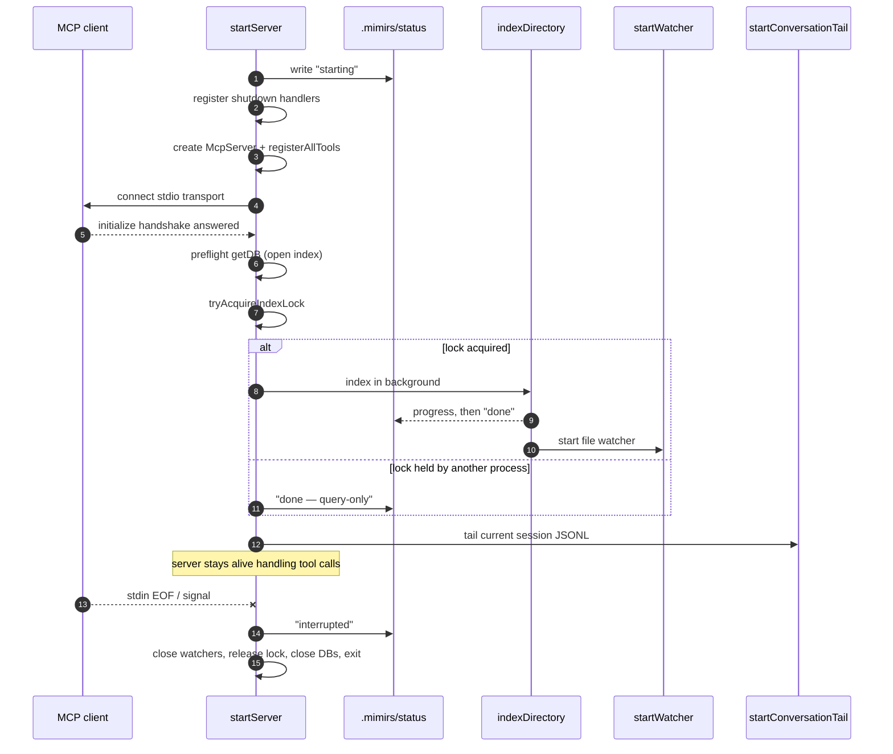

# Server: MCP stdio start

When an editor or agent launches `mimirs serve`, it starts a long-running MCP server that speaks over stdio. That server is what answers tool calls like search, read_relevant, and the rest. This page traces its whole life: how it boots, the order it does startup work in, how it keeps the index fresh while running, and how it shuts down. Everything here lives in `startServer` in `src/server/index.ts:88-387`.

The central design tension is that an MCP client expects a fast `initialize` handshake, but the server also has slow work to do (loading an embedding model, scanning files, indexing). The server resolves this by connecting the transport *first* and doing the slow work *after*, in the background. If it indexed before connecting, the client could time out, close the pipes, and the server's later writes would hit EPIPE (`src/server/index.ts:199-203`).

## Lifecycle at a glance

The server moves through four broad stages: **boot** (register tools, connect transport), **ready** (transport connected, tools answerable), **handle** (serve tool calls while indexing and watching in the background), and **shutdown** (release the lock, close DBs, exit). Each phase is written to a status file so an external client can see where the server is.



1. Before anything else, the server writes a `starting` status so any stale status from a previous instance is overwritten right away (`src/server/index.ts:88-110`).
2. Signal, stdin, and crash handlers are registered immediately, so even a crash *during* startup writes a clean exit status instead of leaving the file stale (`src/server/index.ts:112-173`).
3. An `McpServer` is created and every tool is registered via `registerAllTools`, which is handed the DB accessor, the connected-DB lister, and the status writer (`src/server/index.ts:181-190`, `src/tools/index.ts:39`).
4. The stdio transport is connected immediately so the client's `initialize` is answered before slow work begins (`src/server/index.ts:203-207`).
5. A preflight `getDB` opens the index to catch fatal problems (e.g. missing SQLite) early (`src/server/index.ts:215-217`).
6. `tryAcquireIndexLock` decides whether this process owns indexing for the project (`src/server/index.ts:269`).
7. If it holds the lock, `indexDirectory` runs in the background and, on completion, starts a file watcher (`src/server/index.ts:285-346`).
8. If another process already holds the lock, this one skips indexing and reports query-only mode (`src/server/index.ts:270-277`).
9. Regardless of the lock, the server discovers conversation sessions and tails the current one, indexing older sessions in the background (`src/server/index.ts:354-385`).
10. The server then stays alive handling tool calls until stdin closes or a signal arrives, at which point `cleanup` runs (`src/server/index.ts:140-150`).

## Boot phases written to the status file

The server keeps an external breadcrumb at `.mimirs/status`. Every meaningful step calls `writeStatus`, which writes the phase text plus an instance id (`pid:<pid>`) so a reader can tell which process owns the file (`src/server/index.ts:96-110`). The phases written in order are: the initial `starting`, then `phase: creating server`, `phase: tools registered`, `phase: connecting transport`, `phase: transport connected`, then indexing progress like `0/N files` and `processedFiles/totalFiles (pct%)`, and finally `done` with version, indexed/skipped/pruned counts, and total file/chunk counts (`src/server/index.ts:179-207`, `285-331`). When the watcher later reacts to a file change, it rewrites a `done` status with a `watcher:` line so clients see ongoing activity (`src/server/index.ts:335-346`).

If the project directory is the home directory or otherwise unsafe (`checkIndexDir`), no status path is set and status writes are skipped entirely; auto-index and the watcher are also skipped (`src/server/index.ts:91-95`, `175-177`).

## Transport-first ordering

Tool registration and transport connect happen before any config I/O, session discovery, or indexing. This is deliberate: connecting first means the client's handshake is answered quickly, avoiding a timeout that would close the pipes and break later writes (`src/server/index.ts:199-207`). Both the registration block and the connect block are wrapped in try/catch; a failure in either writes a crash log and an `error` status, then rethrows (`src/server/index.ts:191-212`).

## Process-level index lock and query-only fallback

A single project can have several mimirs servers pointed at it — one per IDE window, for example. They share one `.mimirs/index.db`, and if more than one ran the indexer they would double-insert chunk rows. To prevent that, indexing is gated by a per-directory file lock at `.mimirs/index.lock` containing the holder's PID (`src/utils/index-lock.ts:18-30`). `tryAcquireIndexLock` returns a lock token if it can claim it, or `null` if another *live* process holds it; stale locks whose PID is dead are reclaimed automatically (`src/utils/index-lock.ts:40-64`,`91-98`). The lock is reentrant within one process via a refcount, so the server can hold it for its lifetime while `indexDirectory` also wraps each run (`src/utils/index-lock.ts:9-15`,`34-38`).

When the server gets the lock, it runs the background indexer and watcher. When it does not, it logs that another process owns indexing, writes a `done` status marked `mode: query-only`, and skips all indexing work — but it still registers tools and serves queries against the shared DB (`src/server/index.ts:269-277`).

## Background index and watcher

Indexing never blocks startup. After the transport is connected and the lock is held, `indexDirectory` is invoked without `await`; its progress callback drives the status file (`src/server/index.ts:285-321`). The callback recognizes several message kinds — `file:done` increments a counter, `scanning files` and model-loading messages are surfaced verbatim, and a `Found N files to index` message seeds the total (`src/server/index.ts:286-315`). When indexing resolves, the server writes the final `done` status from the DB's `getStatus()` and only then calls `startWatcher`, so the watcher starts after the initial pass completes (`src/server/index.ts:322-346`). If indexing rejects, the server writes an `error` status and logs a warning but stays up (`src/server/index.ts:347-350`).

## Conversation tailing for the current session

After indexing is arranged, the server discovers the project's conversation sessions via `discoverSessions` and, if any exist, tails the most recent one — assumed to be the current session — with `startConversationTail`, which follows the session's JSONL file and indexes new turns as it grows (`src/server/index.ts:354-366`). Older sessions are checked against the DB and re-indexed in the background only when missing or stale (`src/server/index.ts:368-384`). Conversation tailing runs regardless of the index lock, so query-only instances still tail too.

Note a known race here: conversation tailing is **not** guarded by the index lock. If a second process indexes the same turns first, `indexConversation` can return `turnsIndexed: 0` while the DB read offset still advances, and `startConversationTail` only advances its in-memory offset/turn index when `turnsIndexed > 0` — so a duplicate-only pass can leave local state stale and later cycles may assign wrong turn indexes or reprocess old bytes (`src/conversation/indexer.ts:90`).

## Shutdown handlers

Shutdown is centralized in `cleanup`, which sets a `shuttingDown` flag, writes an `interrupted` exit status, closes both watchers, releases the index lock, closes every open DB, and exits 0 (`src/server/index.ts:140-150`). It is wired to several triggers (`src/server/index.ts:154-173`):

| Trigger | Reason string | Why it fires |
| --- | --- | --- |
| stdin `end` | `stdin closed` | IDE window closed; the client end of the pipe is gone |
| stdin `error` | `stdin error` | Pipe error |
| `SIGINT` / `SIGTERM` / `SIGHUP` | the signal name | Manual or OS-initiated termination |
| `uncaughtException` | `uncaught exception: …` | A thrown error nothing handled |
| `unhandledRejection` | `unhandled rejection: …` | A rejected promise nothing caught |

`writeExitStatus` only overwrites the status file if this instance still owns it and the status is not already `done` or `error`, so a newer instance's status is never clobbered (`src/server/index.ts:119-138`).

## Permanent vs transient DB open errors

The preflight `getDB` can fail. The server classifies the error: messages containing `database is locked` or `SQLITE_BUSY` are **transient** — another process briefly held the DB — so the error is not cached and the next tool call retries `getDB`; status is written as `starting` with a "Will retry" note (`src/server/index.ts:218-247`). Any other failure is **permanent**: it is stored in `permanentError` so every later tool call throws a clear message via the `getDB` guard, and status is written as `error` with a targeted fix (`brew install sqlite`, set `RAG_DB_DIR`, or check the README) (`src/server/index.ts:35-37`,`221-234`). In both cases startup indexing is skipped because it needs an open DB, and `startServer` returns early (`src/server/index.ts:252-255`).

## Crash logging to .mimirs/server-error.log

If startup throws before or during transport connect, the MCP client would otherwise just see "Connection closed" with no detail. `writeStartupError` writes the message, stack, and a "run `bunx mimirs doctor`" hint to `.mimirs/server-error.log` so the failure is diagnosable outside stderr (`src/server/index.ts:62-86`). It is called from both the tool-registration and transport-connect catch blocks (`src/server/index.ts:194`,`209`).

## Inputs

| Name | Type | Required | Description |
| --- | --- | --- | --- |
| `RAG_PROJECT_DIR` | env path | no | Project directory to serve. Falls back to `process.cwd()`. Drives the status path, index location, and session discovery (`src/server/index.ts:91`). |
| `RAG_DB_DIR` | env path | no | Overrides where the index database lives. Read inside `RagDB`; when set, a write failure suggests pointing it at a writable directory (`src/db/index.ts:97-112`). |
| `LOG_LEVEL` | env string | no | Log verbosity; defaults to `warn`. Read by the logger (`src/utils/log.ts:20`). |

## Outputs

| Output | Where it lands / shape / description |
| --- | --- |
| Registered MCP tools | Attached to the `McpServer` and answerable over stdio after connect (`src/server/index.ts:189`, `src/tools/index.ts:39`). |
| Background index | Updated `.mimirs/index.db` from `indexDirectory`, only when the lock is held (`src/server/index.ts:285-331`). |
| File watcher | A `Watcher` that re-indexes on file change and updates status; started after the initial index (`src/server/index.ts:335-346`). |
| Conversation tail | A second `Watcher` following the current session's JSONL, appending turns to the DB (`src/server/index.ts:361-366`). |
| `.mimirs/status` updates | Phase text plus instance id, written at every lifecycle step (`src/server/index.ts:100-110`). |
| `.mimirs/server-error.log` | Crash diagnostics, only on a startup failure (`src/server/index.ts:62-86`). |

## State changes

| State | Before | After | Why it matters |
| --- | --- | --- | --- |
| `.mimirs/status` | Stale text, often `interrupted` from a prior run | `starting` → phase lines → `done` (with totals and watcher progress) | Lets editors and `doctor` show the server's real state (`src/server/index.ts:100-110`,`322-348`). |
| Index lock | None / stale PID | Held by this PID, or `null` if another live process owns it | Only the holder indexes and watches; others run query-only, preventing double-inserts (`src/server/index.ts:269-280`, `src/utils/index-lock.ts:28-64`). |
| RAG index | Previous snapshot | Refreshed by the background index, then kept current by the watcher | Search results reflect the current code (`src/server/index.ts:285-346`). |
| Conversation index | Previously indexed turns (or empty) | Turns appended as the session JSONL grows | `search_conversation` can recall the live session (`src/server/index.ts:354-385`). |

## Branches and failure cases

- **Unsafe directory (home-dir trap)** — `checkIndexDir` returns unsafe: no status path, auto-index and watcher skipped; tools still register and the conversation tail still runs (`src/server/index.ts:91-95`,`175-177`,`260`).
- **Tool registration throws** — crash log + `error` status, rethrow (`src/server/index.ts:191-197`).
- **Transport connect throws** — crash log + `error` status, rethrow (`src/server/index.ts:208-212`).
- **Permanent DB open error** — cached in `permanentError`, `error` status with a fix, indexing skipped, early return (`src/server/index.ts:231-255`).
- **Transient DB open error** — not cached, `starting` status with retry note, indexing skipped, early return; next tool call retries (`src/server/index.ts:227-255`).
- **Lock not acquired** — query-only mode, indexing/watcher skipped, `done` status with `mode: query-only` (`src/server/index.ts:270-277`).
- **Lock acquired** — background index runs, then watcher starts on success (`src/server/index.ts:279-346`).
- **Background indexing rejects** — `error` status + warning log, server stays up (`src/server/index.ts:347-350`).
- **No conversation sessions found** — tailing is skipped entirely (`src/server/index.ts:356`).
- **Older session already current** — skipped; only missing or stale sessions are re-indexed (`src/server/index.ts:370-371`).
- **Shutdown while owning status** — `interrupted` written; if a newer instance owns the file, or status is already `done`/`error`, the write is skipped (`src/server/index.ts:119-138`).

## Example: lifecycle phases

A healthy boot writes this sequence to `.mimirs/status` (instance id appended each time; values synthetic):

```
starting
version: <version>
started: <iso-timestamp>
---
starting
version: <version>
phase: tools registered
---
starting
version: <version>
phase: transport connected
---
0/120 files
---
84/120 files (70%)
---
done
version: <version>
finished: <iso-timestamp>
indexed: 12, skipped: 108, pruned: 0
total files: 120, total chunks: 1450
```

On shutdown (stdin EOF or signal), assuming this instance still owns the file:

```
interrupted
version: <version>
stopped: <iso-timestamp>
reason: stdin closed
pid:<pid>
```

## Related

- [serve](../cli/serve.md) — the CLI command that invokes this boot flow.
- [index_files](../tools/index-files.md) — the tool form of the indexing that runs here in the background.
- [search_conversation](../tools/search-conversation.md) — consumes the conversation turns this flow tails.
- [server_info](../tools/server-info.md) — reports the open DB connections this flow tracks.

## Key source files

- `src/server/index.ts` — the entire boot, ready, handle, and shutdown lifecycle.
- `src/tools/index.ts` — `registerAllTools`, which attaches every MCP tool to the server.
- `src/utils/index-lock.ts` — the process-level lock gating indexing and watching.
- `src/indexing/indexer.ts` — `indexDirectory`, the background indexing pass.
- `src/indexing/watcher.ts` — `startWatcher`, which keeps the index current after the initial pass.
- `src/conversation/indexer.ts` — `startConversationTail` and `indexConversation` for session indexing.
