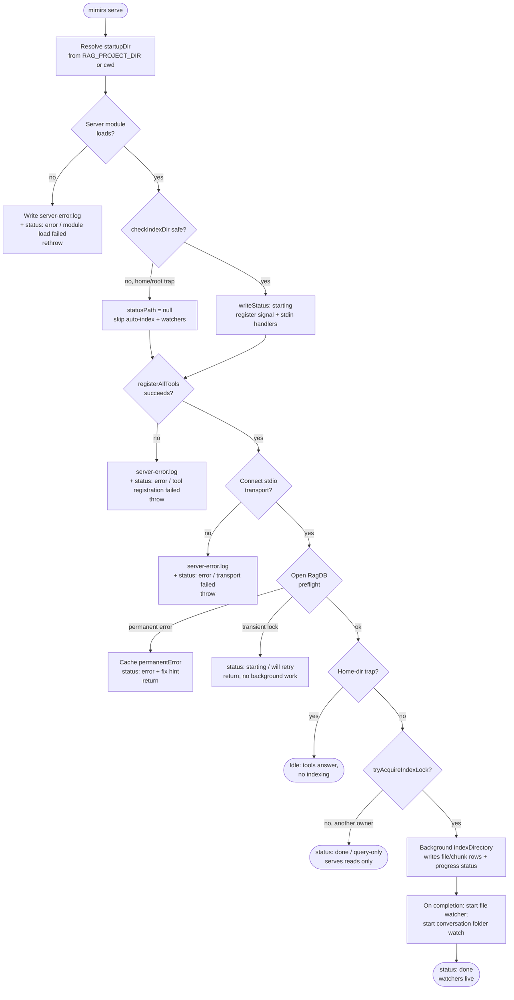

# Start the MCP server

The `serve` command boots the long-lived process that an editor or agent talks to over stdio. It is the one entry point that turns a project directory into a live MCP endpoint: it registers every tool, answers the MCP handshake, opens the project's SQLite index, then keeps that index fresh in the background by re-scanning the project and tailing conversation transcripts.

The boot is deliberately ordered so the slow, fallible work — opening native SQLite, scanning the whole project, loading the embedding model — happens *after* the client is already connected. A boot that crashes still leaves a readable trail: a `.mimirs/status` file recording the phase it reached, and a `.mimirs/server-error.log` holding the stack. This page walks the path from `mimirs serve` to a running watcher and names every branch that can change the outcome.

## When you would use it

This is what your MCP client (an IDE extension, an agent runtime) actually launches; you rarely run `mimirs serve` by hand. But when the index looks stale, tools return errors, or the client reports "Connection closed", the boot order and the status file are the first things to read.

The command itself is intentionally thin. `serveCommand` resolves the project directory from `RAG_PROJECT_DIR` (falling back to the current working directory), prints one line to stderr, then dynamically imports `../../server` and calls `startServer()` `src/cli/commands/serve.ts:4-52`. The import is dynamic on purpose: `src/server/index.ts` has a top-level `await` and pulls in native dependencies (`bun:sqlite`, `sqlite-vec`). A static import that failed at module-load time would crash the whole CLI before any handler ran, leaving no status file. By wrapping the `import()` in a `try/catch`, a load failure instead writes both `.mimirs/server-error.log` and a `.mimirs/status` file whose first line is `error` and whose phase is `module load failed`, then rethrows `src/cli/commands/serve.ts:13-49`.

## The boot sequence

The value here is in the forks, not the call order: each phase either advances or drops the server into a terminal error, a degraded query-only mode, or an idle no-index mode. A flowchart shows those branches directly.



1. **Resolve the directory.** `serveCommand` reads `RAG_PROJECT_DIR`, falling back to `process.cwd()`, and hands off to `startServer()` `src/cli/commands/serve.ts:4-51`.
2. **Module-load gate.** If importing the server module throws (missing native SQLite, broken `sqlite-vec`), the catch block writes diagnostics and an `error` status, then rethrows `src/cli/commands/serve.ts:13-49`.
3. **Directory guard.** `checkIndexDir` rejects system-level directories (`~`, `/`, `/home`, `/Users`, `/tmp`, `/var`). When the directory is unsafe, the server still starts and serves tools, but `statusPath` is set to `null` and all indexing and watching are skipped `src/server/index.ts:92-95`, `src/utils/dir-guard.ts:9-39`.
4. **First status + handlers.** The server writes `starting` to `.mimirs/status` and registers signal/stdin shutdown handlers *before* any slow work, so even a crash mid-boot records `interrupted` `src/server/index.ts:110-173`.
5. **Tool registration.** `registerAllTools` wires every MCP tool onto the server. A failure here writes `error` with phase `tool registration failed` and rethrows `src/server/index.ts:188-197`.
6. **Connect transport.** The stdio transport connects so the client's `initialize` handshake is answered before config I/O or indexing. A failure writes `error` / `transport failed` `src/server/index.ts:199-212`.
7. **DB preflight.** The server opens the project's SQLite DB once up front to surface native/permission problems early, classifying any error as permanent or transient `src/server/index.ts:214-256`.
8. **Index lock.** Only the instance that acquires the per-project lock indexes and watches; others write a `done` / query-only status and serve reads `src/server/index.ts:269-277`.
9. **Background work.** The lock holder runs a full index in the background, then starts the file watcher and the conversation folder watcher `src/server/index.ts:279-362`.

## Inputs

| name | type | required | description |
| --- | --- | --- | --- |
| `RAG_PROJECT_DIR` | env var | no | Absolute path of the project to index and serve. Read in both `serveCommand` and `startServer`; when unset it falls back to the process working directory, which can hit the home/root guard `src/cli/commands/serve.ts:5`, `src/server/index.ts:91`. |
| `RAG_DB_DIR` | env var | no | Directory where `index.db` lives. When unset, the index is stored in `<project>/.mimirs/`. Pointing it at a writable path is the documented fix for read-only or permission errors `src/db/index.ts:101-120`. |
| stdin EOF | process event | n/a | When stdin closes (the IDE window goes away), `stdin.on("end")` treats it as a shutdown and cleans up `src/server/index.ts:154-157`. |
| `SIGINT` / `SIGTERM` / `SIGHUP` | OS signal | n/a | Each triggers the same `cleanup` path — closing watchers, releasing the lock, closing DBs, and exiting `src/server/index.ts:161-163`. |

## Outputs

| output | where it lands / shape / description |
| --- | --- |
| `.mimirs/status` | A small text file rewritten at every phase. First line is one of `starting`, `done`, `error`, or `interrupted`; following lines carry version, phase, progress, or a fix hint. The instance's `pid:<n>` is appended so a second instance does not clobber the first one's status `src/server/index.ts:100-138`. |
| Registered MCP tools over stdio | The full tool set (search, indexing, graph, conversation, checkpoints, annotations, analytics, git, git history, server info, wiki) bound to the server and reachable over the stdio transport `src/tools/index.ts:45-55`. |
| Background index of files/chunks | File and chunk rows (plus vector and full-text entries) written to `index.db`; deleted files pruned; imports and symbol references resolved `src/server/index.ts:285-332`, `src/indexing/indexer.ts:745-793`. |
| `.mimirs/server-error.log` | On a startup failure, a timestamped log with the error message, stack, and a pointer to `mimirs doctor`. Written so the failure is visible outside stderr, which the client may have already closed `src/server/index.ts:62-86`. |

## Tool registration

`registerAllTools` is a thin fan-out: it calls one `registerXTools(server, getDB, ...)` per group — search, indexing, graph, conversation, checkpoints, annotations, analytics, git, git history, server info, and wiki `src/tools/index.ts:39-56`. Two callbacks are threaded through so tools can reach process state without importing the server: `getDB`, which lazily opens and caches one `RagDB` per project directory `src/server/index.ts:34-51`, and `writeStatus`, which lets the indexing tools push their own progress into the same status file the boot phases use (only the indexing group receives it) `src/tools/index.ts:46`. The connected-DB accessor is passed to the server-info group so it can report open connections `src/tools/index.ts:54`. Registration is wrapped so any throw becomes an `error` status before the transport ever connects `src/server/index.ts:188-197`.

## Transport before slow work

Connecting `StdioServerTransport` is the last thing that happens before the DB preflight, and it happens before config loading and indexing `src/server/index.ts:203-207`. The reason is in the source comment: if the client's `initialize` handshake is not answered before slow startup work, the client may time out, close the pipes, and the server's later stderr writes hit `EPIPE`. Answering the handshake first means the client sees a live server immediately while the heavy indexing runs in the background without blocking any tool call.

## DB preflight: permanent vs transient

After the transport is up, the server opens the database once by calling `getDB(startupDir)` `src/server/index.ts:215-217`. This surfaces a broken native SQLite (for example, missing Homebrew SQLite on macOS) or an unwritable index directory early, with a clear message, instead of letting the first tool call fail cryptically. The handling splits on whether the failure can be retried:

| Error class | Detection | What happens | Status written |
| --- | --- | --- | --- |
| Transient | message contains `database is locked` or `SQLITE_BUSY` | Not cached; the next tool call re-runs `getDB`, which may succeed | `starting` + `Will retry on next tool call` |
| Permanent | anything else (permission failure, missing native lib) | Cached in `permanentError`; every later tool call hits the guard at the top of `getDB` and gets the same message | `error` + a targeted fix hint |

The fix hint is chosen from the message: `brew install sqlite` for the macOS case, "set `RAG_DB_DIR` to a writable directory" for `EROFS`/`EACCES`, or a generic README pointer otherwise `src/server/index.ts:221-225`. In both error cases the function `return`s early, so startup indexing is skipped — it needs an open DB `src/server/index.ts:254-255`. The transient path keeps the server connected so a retry can recover; the permanent path keeps it connected too, but every tool call throws the cached error until the environment is fixed `src/server/index.ts:34-37`.

## State changes

### `.mimirs/status` — none → written, at every phase

Before boot there may be a stale `interrupted` line from a previous instance. The first thing `startServer` does is overwrite it with `starting` `src/server/index.ts:88-110`. `writeStatus` then rewrites the file at every phase boundary — `creating server`, `tools registered`, `connecting transport`, `transport connected` — and again on each indexing progress tick (`0/N files`, `processedFiles/totalFiles (pct%)`) `src/server/index.ts:179-321`. On clean completion it becomes `done` with index counts; on failure it becomes `error`; on shutdown it becomes `interrupted`. The write appends `pid:<n>` and no-ops once shutdown begins, so a late progress callback can never overwrite the final line `src/server/index.ts:100-108`. This is the single source of truth an IDE polls to show "indexing 30%" or "ready", and it is what the [index_status](../tools/index-status.md) tool reports.

### `.mimirs/index.lock` — none → acquired (one instance only)

Before background work, the server calls `tryAcquireIndexLock(startupDir)`. The lock is a file containing the owner PID, written with the exclusive `wx` flag. If a live process already holds it, the call returns `null` and this instance runs query-only; a lock left by a dead PID is reclaimed automatically `src/server/index.ts:269-277`, `src/utils/index-lock.ts:28-65`. The lock is reentrant within one process via a refcount, so `indexDirectory` can also acquire it during the same lifetime without unlinking it out from under the server `src/utils/index-lock.ts:34-38`, `src/indexing/indexer.ts:722-730`. It is released in `cleanup` on shutdown, which unlinks the file only if it still holds this process's PID `src/server/index.ts:146`, `src/utils/index-lock.ts:73-83`. This is the boundary between "this server keeps the index fresh" and "this server only reads" — get it wrong and two processes double-insert into the chunk table.

### `index.db` file/chunk rows — none/stale → indexed

The lock holder calls `indexDirectory(startupDir, startupDb, startupConfig, ...)` in the background. That re-checks the directory is safe, acquires the reentrant lock, collects matching files, eagerly loads the embedding model, and for each file inserts or updates its `files` row and `chunks` — with vector (`vec_chunks`) and full-text (`fts_chunks`) entries kept in sync by triggers `src/indexing/indexer.ts:732-770`, `src/db/index.ts:191-220`. Files that no longer exist on disk are pruned, then imports and symbol references are resolved across the project `src/indexing/indexer.ts:774-793`. The result counts (`indexed`, `skipped`, `pruned`) and the post-run totals from `getStatus` go into the `done` status line `src/server/index.ts:322-331`. The same engine powers the [index_files](../tools/index-files.md) tool and the [index command](../cli/index.md).

## Background full index, then watchers

When the lock is acquired, the server kicks off `indexDirectory(...)` **without awaiting it** — the boot returns and the index builds in the background `src/server/index.ts:285`. The progress callback translates indexer messages into status lines: it counts `file:done` events into a `processed/total` percentage, surfaces `scanning files` and `Loading embedding model` messages verbatim, and parses `Found N files to index` to seed the total `src/server/index.ts:285-321`.

When the index promise resolves, the server reads the DB totals, writes the `done` block, and starts the **file watcher** `src/server/index.ts:322-346`. `startWatcher` does a recursive `fs.watch` on the project, filters events through the configured include/exclude globs, debounces each path by two seconds (`DEBOUNCE_MS = 2000`), and funnels indexing through a serial queue so re-index and graph-resolution never interleave. Each settled event either re-indexes the file (re-resolving imports and symbol refs for it and its importers) or removes a deleted file `src/indexing/watcher.ts:10-117`.

The **conversation folder watcher** is started inside the same lock block but outside the index promise's `.then`, so it does not wait for the code index to finish `src/server/index.ts:357-361`. `startConversationFolderWatch` watches the project's transcript folder — `~/.claude/projects/<encoded-path>/`, where the encoded path is the absolute project dir with `/` replaced by `-` `src/conversation/parser.ts:293-296`. On startup it backfills every existing `*.jsonl` transcript through a serial queue, then watches the folder so the live session and any session that changes later get indexed from their stored byte offset as they grow `src/conversation/indexer.ts:162-225`. Indexing is idempotent: each pass re-reads the offset from the session row, so overlapping or repeated runs can never desync `turn_count` `src/conversation/indexer.ts:89-117`. This is what lets one agent's findings become searchable to another in near real time; the same data backs the [conversation search command](../cli/conversation.md).

## Branches and failure cases

| Branch | Trigger | What happens |
| --- | --- | --- |
| Module load failure | Dynamic `import("../../server")` throws | `server-error.log` written, status `error` / `module load failed`, error rethrown — no server starts `src/cli/commands/serve.ts:13-49`. |
| Home/root directory trap | `checkIndexDir` finds a dangerous dir | `statusPath` becomes `null` (no status writes), and auto-index + both watchers are skipped; the server still registers tools and serves queries `src/server/index.ts:92-95`, `src/server/index.ts:175-177`, `src/server/index.ts:260`. |
| Tool registration failure | `registerAllTools` throws | `server-error.log` written, status `error` / `tool registration failed`, error rethrown before the transport connects `src/server/index.ts:191-197`. |
| Transport connect failure | `server.connect(transport)` rejects | `server-error.log` written, status `error` / `transport failed`, error rethrown `src/server/index.ts:208-212`. |
| Permanent DB error | `getDB` throws a non-retryable message (`EROFS`, `EACCES`, missing Homebrew SQLite) | `permanentError` cached so every later tool call gets the same message; status `error` with a targeted fix hint; `startServer` returns without indexing `src/server/index.ts:218-255`. |
| Transient DB error | `getDB` throws `database is locked` or `SQLITE_BUSY` | Error *not* cached; status stays `starting` with "Will retry on next tool call"; background indexing skipped this boot, but the next tool call retries `getDB()` `src/server/index.ts:220-255`. |
| Query-only mode | `tryAcquireIndexLock` returns `null` (another live owner) | Status `done` / `query-only`; this instance serves reads but never indexes or tails transcripts — both watchers live inside the lock block `src/server/index.ts:270-277`, `src/server/index.ts:279-362`. |
| Indexing failure | The background `indexDirectory(...)` promise rejects | The `.catch` writes status `error` with the message and logs a warning; the **file** watcher is never started, so file changes stop being picked up — but tools keep working against what was already indexed `src/server/index.ts:347-350`. |
| Conversations folder missing | Transcript directory does not exist yet | The backfill scan and `fs.watch` are wrapped; a missing folder is tolerated, and the watch (when creatable) picks it up once it appears `src/conversation/indexer.ts:193-223`. |
| Shutdown | stdin EOF/error, `SIGINT`/`SIGTERM`/`SIGHUP`, uncaught exception, or unhandled rejection | `cleanup` sets `shuttingDown`, writes `interrupted` (only if this PID still owns the file and it is not already `done`/`error`), closes both watchers, releases the lock, closes all DBs, and exits 0 `src/server/index.ts:140-173`, `src/server/index.ts:119-138`. |

## Example: lifecycle phases

A clean boot that acquires the lock rewrites `.mimirs/status` through roughly this sequence (the `<...>` placeholders stand in for real values; each entry is actually one file write of `<status>\n<details>\npid:<n>`):

```
starting / version: <v> / started: <iso>
starting / phase: creating server
starting / phase: tools registered
starting / phase: connecting transport
starting / phase: transport connected
0/<N> files
<k>/<N> files (<pct>%)
done / finished: <iso> / indexed: <i>, skipped: <s>, pruned: <p> / total files: <f>, total chunks: <c>
```

A second server on the same project instead lands on a single terminal line `src/server/index.ts:272-276`:

```
done / version: <v> / mode: query-only (another mimirs process owns indexing)
```

## Open questions

- When the background index rejects, the `.catch` writes an `error` status and never starts the file watcher, but the conversation folder watcher is started independently (outside the index promise's `.then`) and keeps running `src/server/index.ts:347-362`. Whether that asymmetry — tailing transcripts while code indexing is broken — is intended is worth confirming before reordering this block.

## Key source files

| Path | Role |
| --- | --- |
| `src/cli/commands/serve.ts` | CLI entry point; resolves the directory and dynamically imports/starts the server. |
| `src/server/index.ts` | The boot orchestrator: status writes, handler registration, tool registration, transport, DB preflight, lock, background index, watchers, shutdown. |
| `src/tools/index.ts` | `registerAllTools` — binds every MCP tool to the server. |
| `src/indexing/indexer.ts` | `indexDirectory` — the full-project scan that writes file/chunk rows and resolves graph edges. |
| `src/indexing/watcher.ts` | `startWatcher` — the debounced, serialized file watcher. |
| `src/conversation/indexer.ts` | `startConversationFolderWatch` — backfills and tails conversation transcripts. |
| `src/utils/index-lock.ts` | Per-project, reentrant indexing lock used to elect the single indexing instance. |
| `src/utils/dir-guard.ts` | `checkIndexDir` — rejects system-level directories. |
| `src/db/index.ts` | `RagDB` — opens `index.db` (honoring `RAG_DB_DIR`) and owns the schema. |

## Related

- [index command](../cli/index.md) — the same indexing engine run as a one-shot CLI command.
- [index_files](../tools/index-files.md) and [index_status](../tools/index-status.md) — the MCP tools that re-index and report status while the server runs.
- [conversation search](../cli/conversation.md) — uses the transcripts this boot keeps current.
- [doctor](../cli/doctor.md) — the diagnostic the startup error log points users toward.
