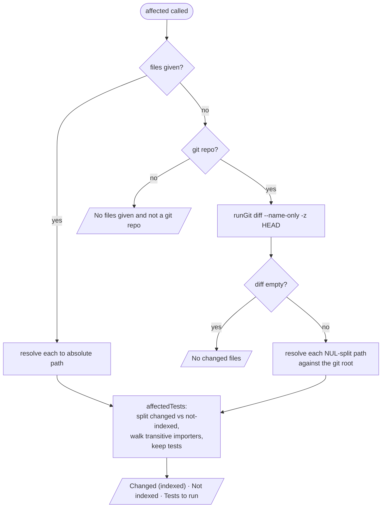

# Tool: affected

`affected` answers a focused question for a change you are about to make or have just made: *which test files should I run?* You hand it a set of changed files — or let it read your uncommitted git diff — and it walks the import graph to find every test that transitively imports any of those files, then reports them. It is the interactive counterpart of the [`affected` CLI command](../cli/affected.md): same engine, but callable mid-conversation so an agent can scope a test run to a change instead of running the whole suite.

Use it after editing a few files and before running tests, when "run everything" is too slow and "guess which tests matter" is too risky. It works at the file level — which tests *import* the changed files — so it pairs naturally with [`impact`](impact.md), which gives the symbol-level blast radius and its own precise/broad test split, and with [`dependents`](dependents.md), which lists the direct importers of a single file.

## What runs when you call it



1. The caller invokes the tool with an optional `files` array and an optional `directory`. The handler is registered inside `registerGraphTools` (`src/tools/graph-tools.ts:352-399`).
2. When `files` is given and non-empty, each entry is resolved to an absolute path against the project directory and used directly (`src/tools/graph-tools.ts:369-370`).
3. When `files` is omitted, the tool falls back to the working-tree diff. It first finds the git root; if there is none, it returns a message asking for `files` or a git repo (`src/tools/graph-tools.ts:371-375`).
4. Inside a repo, it runs `git diff --name-only -z HEAD`, splits the NUL-separated output, and resolves each path against the git root. An empty diff returns a "no changed files" message (`src/tools/graph-tools.ts:378-383`).
5. The absolute changed paths go to `affectedTests`, which splits them into indexed and not-indexed, walks the transitive importer closure, and keeps the test files (`src/tools/graph-tools.ts:386`, `src/graph/trace.ts:598-623`).
6. The handler renders three sections: the changed files that are indexed, any changed files not in the index, and the tests to run (`src/tools/graph-tools.ts:387-397`).

## Where the changed files come from

The tool has two input modes, and the choice of which absolute base path to resolve against differs between them — a detail that matters because the index stores absolute paths and a mismatch means nothing is found.

When you pass `files` explicitly, each is resolved against the **project directory** (`src/tools/graph-tools.ts:369-370`). When you omit `files`, the tool reads git and resolves each diff path against the **git root**, which is where git reports paths from (`src/tools/graph-tools.ts:383`). Using the git root rather than the project directory here is deliberate: a project indexed from a subdirectory of a larger repo would otherwise resolve diff paths against the wrong base.

The git read is `git diff --name-only -z HEAD` — the names of every file that differs from the `HEAD` commit, covering both staged and unstaged working-tree changes (`src/tools/graph-tools.ts:378`). The `-z` flag is the load-bearing part: it makes git emit paths separated by NUL bytes and *unquoted*. Without it, git C-quotes any path containing a space or special character (wrapping it in quotes and escaping), and a newline-based split would mangle those paths so they never match the index. Splitting on `\0` and dropping empties sidesteps that entirely (`src/tools/graph-tools.ts:379`). The `runGit` helper returns trimmed stdout on a clean exit and `null` on any failure, and it drains both stdout and stderr concurrently so a chatty git (broken-ref warnings) can't deadlock by filling the stderr pipe (`src/git/exec.ts:13-33`).

## Resolving tests: the transitive importer closure

The core work happens in `affectedTests` (`src/graph/trace.ts:598-623`). It first builds a lookup from file id to path over every node in the graph, then classifies each changed path: a path that the index knows (`getFileByPath` returns a record) is counted as **changed and indexed** and its file id is collected; a path the index has never seen is set aside as **not indexed** and ignored for the walk (`src/graph/trace.ts:606-614`). Splitting these is what lets the tool tell you honestly that a changed file contributed nothing because it simply isn't in the index, rather than silently producing fewer tests.

From the indexed changed file ids, it computes the **transitive importer closure** — every file that imports any changed file, plus every file that imports *those*, and so on (`src/graph/trace.ts:617`). That walk is `transitiveImporters`, a breadth-first expansion over reverse-import edges (`getImportersOf`) seeded with the changed files and guarded by a visited set, so it terminates without needing a depth cap (`src/graph/trace.ts:540-556`). The same closure walk backs the "broad" tests in [`impact`](impact.md), which keeps the two tools consistent about what "reaches this file" means.

Finally it filters that closure to the files that look like tests. A path counts as a test when it matches the shared patterns in `isTestPath` — a `tests/`, `__tests__/`, `spec/`, or `test_` path segment, or a `.test.`/`.spec.` filename suffix (`src/graph/trace.ts:619`, `src/utils/test-paths.ts:9-19`). The surviving paths are made project-relative and sorted before they are returned (`src/graph/trace.ts:602`, `src/graph/trace.ts:622`).

## The three reported sets

The handler renders the result as three labeled sections, so the answer is both the tests *and* the reasoning behind them (`src/tools/graph-tools.ts:387-397`):

| section | what it lists | why it's shown |
| --- | --- | --- |
| Changed (indexed) | the changed files the index knows, comma-joined, or `none` | confirms which inputs actually drove the walk |
| Not indexed (ignored) | changed files with no index record — only printed when non-empty | flags inputs that contributed nothing, hinting the index may be stale or the path is excluded |
| Tests to run | the test files that transitively import a changed file, one per line, with a count | the actual answer; reads "none found …" when the closure contains no tests |

The "Not indexed" line appearing is a useful signal in its own right: if a file you just edited shows up there, the index is behind and a re-index would change the answer.

## Inputs

| name | type | required | description |
| --- | --- | --- | --- |
| `files` | string[] | no | Changed file paths, relative to the project. Omit to use the git working-tree diff against `HEAD` (`src/tools/graph-tools.ts:356-359`). |
| `directory` | string | no | Project whose index to query. Defaults to `RAG_PROJECT_DIR` or the current working directory (`src/tools/index.ts:38-39`). |

## Outputs

| output | where it lands / shape / description |
| --- | --- |
| Changed indexed files | The `Changed (indexed): …` section — the comma-joined changed paths found in the index, or `none` (`src/tools/graph-tools.ts:388`). |
| Tests to run | The `Tests to run (N): …` section — one test path per line, or a "none found" line when the closure has no tests (`src/tools/graph-tools.ts:392-396`). |
| Changed files not in index | The `Not indexed (ignored): …` section, printed only when at least one changed path is absent from the index (`src/tools/graph-tools.ts:389-391`). |

This tool reads the index and shells out to `git` to read the diff. It opens no source files, runs no parser, and writes nothing back to the database or the repo, so it produces no persistent state changes.

## Branches and failure cases

- **Explicit files given.** When `files` is non-empty, the git path is skipped entirely and the paths are resolved against the project directory (`src/tools/graph-tools.ts:369-370`).
- **No files, not a git repo.** With `files` omitted and no git root, the tool returns "No files given and not a git repository. Pass `files`, or run inside a git repo." (`src/tools/graph-tools.ts:372-375`).
- **No files, empty diff.** Inside a repo with nothing changed against `HEAD`, the split diff is empty and the tool returns "No changed files (git diff against HEAD is empty)." (`src/tools/graph-tools.ts:380-382`).
- **Changed file not indexed.** A changed path with no index record is listed under "Not indexed (ignored)" and excluded from the importer walk (`src/graph/trace.ts:611-613`, `src/tools/graph-tools.ts:389-391`).
- **No tests reach the change.** When the transitive closure contains no test files, the tests section reads "none found (nothing indexed transitively imports the changed files)." (`src/tools/graph-tools.ts:395`).
- **Paths with spaces or special characters.** Handled by the `-z` NUL-separated diff parse, which avoids git's C-quoting of such paths (`src/tools/graph-tools.ts:376-379`).
- **Missing directory.** A non-existent `directory` makes `resolveProject` throw before any work runs (`src/tools/index.ts:45-47`).

## Example

Scope a test run to two edited files:

```json
{
  "files": ["src/example/search.ts", "src/example/hybrid.ts"]
}
```

Or omit `files` to let it read your uncommitted diff:

```json
{}
```

Illustrative text output (paths are synthetic):

```
Changed (indexed): src/example/search.ts, src/example/hybrid.ts

Not indexed (ignored): docs/notes.md

Tests to run (2):
  tests/example/search.test.ts
  tests/example/hybrid.test.ts
```

## Key source files

- `src/tools/graph-tools.ts` — registers the `affected` MCP tool, picks the explicit-files vs git-diff input mode, parses the `-z` diff, and renders the three sections (`src/tools/graph-tools.ts:352-399`).
- `src/graph/trace.ts` — `affectedTests` (split indexed vs not-indexed, run the closure, keep tests) and `transitiveImporters` (the breadth-first reverse-import walk) (`src/graph/trace.ts:540-556`, `src/graph/trace.ts:598-623`).
- `src/git/exec.ts` — `findGitRoot` and `runGit`, the shared git subprocess helpers that locate the repo root and read the diff without deadlocking or throwing (`src/git/exec.ts:13-38`).
- `src/utils/test-paths.ts` — `isTestPath` and the shared patterns that decide what counts as a test file.
- `src/db/graph.ts` — the store: `getFileByPath` (index lookup per changed file), `getImportersOf` (reverse-import edges), `getGraph` (the file-id-to-path map).
- `src/tools/index.ts` — `resolveProject`, which opens the project index before the walk.
