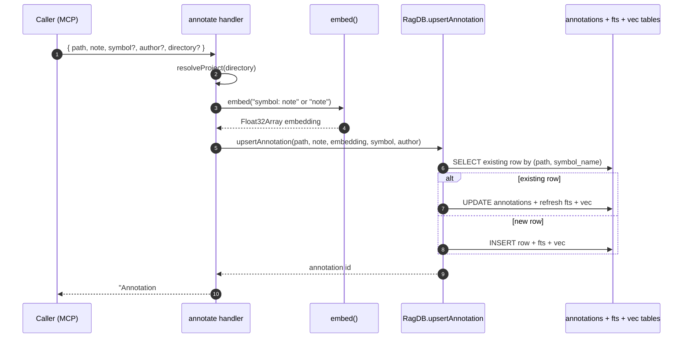

# Tool: annotate

`annotate` attaches a persistent note to a file (and optionally a symbol inside it). The note is embedded so it can later be retrieved semantically by `get_annotations`, and it surfaces inline as a `[NOTE]` block in `read_relevant` results. The handler is registered in `src/tools/annotation-tools.ts:8-39` and writes through `db.upsertAnnotation`, which is defined in `src/db/annotations.ts:4-66`.

The intended use is the moment an agent reads code that contains a known bug, a race condition, a fragile area, a non-obvious constraint, or a workaround. Writing a short note now means the next session — or the next agent on a different machine — sees the warning attached to the file without having to re-derive it.

## Flow



1. The MCP client calls the tool with `path`, `note`, and optional `symbol`, `author`, and `directory`. The schema lives at `src/tools/annotation-tools.ts:11-26`.
2. `resolveProject` resolves the project directory to a `RagDB` instance, so the right database is used when the caller works across multiple projects.
3. The handler builds the embedding text: when a `symbol` is given it prefixes it as `${symbol}: ${note}`, otherwise it just embeds the note (`src/tools/annotation-tools.ts:30-31`). The prefix gives the symbol name semantic weight in vector search.
4. `embed` returns a `Float32Array`. The call is `await`ed, so the handler does not return until the embedding is ready.
5. `upsertAnnotation` runs inside a `db.transaction` (`src/db/annotations.ts:14-65`). It first looks up an existing row keyed by `(path, symbol_name)` — with a null-aware branch for file-level notes (`src/db/annotations.ts:16-28`).
6. If a row exists, the FTS row is removed, the `annotations` row is updated, the FTS index is re-inserted, and the vector row is replaced (`src/db/annotations.ts:32-47`). If no row exists, a fresh row is inserted into all three tables (`src/db/annotations.ts:48-61`).
7. The handler returns a one-line confirmation string: `Annotation #<id> saved for <path>` or `… for <path>  •  <symbol>` (`src/tools/annotation-tools.ts:34-37`).

## Inputs

| Input | Required | Notes |
|---|---|---|
| `path` | yes | File path relative to project root. 1–500 chars (`src/tools/annotation-tools.ts:12`). |
| `note` | yes | Note text, 1–2000 chars (`src/tools/annotation-tools.ts:13`). |
| `symbol` | no | Symbol name (function, class, etc.). Omit for a file-level note. The pair `(path, symbol)` is the upsert key. |
| `author` | no | Free-form label. Defaults to `"agent"` (`src/tools/annotation-tools.ts:32`). |
| `directory` | no | Project directory. Defaults to `RAG_PROJECT_DIR` env or cwd, resolved by `resolveProject`. |

## Outputs

| Output | Where | Notes |
|---|---|---|
| Confirmation text | MCP response | `Annotation #<id> saved for <target>` where target is `path` or `path  •  symbol`. |
| `annotations` row | SQLite | Inserted or updated row with `note`, `author`, `created_at`, `updated_at`. |
| `fts_annotations` row | SQLite | FTS index keeps the note searchable by keyword. |
| `vec_annotations` row | SQLite | Vector row with the embedding, joined later by `searchAnnotations`. |

## State changes

`annotations` row — `null` or previous note for `(path, symbol)` → upserted note with refreshed embedding, FTS, and author. The transaction in `src/db/annotations.ts:14-65` makes the three tables move together: if the embedding write failed in the middle of an update, the FTS row and the annotations row would not be left out of sync.

## Why the note is embedded

Embedding the note (with the symbol prefixed when present) means `get_annotations` can rank notes by semantic relevance to a query, not only by exact file path. It also means `read_relevant` can surface notes for files that come back in search results, because the same chunks come from the same code locations. The embedding lives in `vec_annotations` and is rewritten on every update so stale vectors never linger.

## Upsert behavior

The lookup uses `path = ? AND symbol_name = ?` when a `symbol` is supplied, and `path = ? AND symbol_name IS NULL` for file-level notes (`src/db/annotations.ts:16-28`). Calling `annotate` twice with the same `(path, symbol)` therefore overwrites the previous note rather than producing duplicates. To keep multiple distinct notes on one file, pass a different `symbol` value (or call once at file level and again at a specific symbol).

## How the note surfaces later

`read_relevant` batch-loads annotations per file from the same `getAnnotations` helper and prints matching ones as `[NOTE]` blocks above the chunk. That is why the embedding text uses `symbol: note` rather than `note` alone — when a chunk corresponds to a function, the symbol prefix helps the note bubble up for the right chunk. See `tools/read-relevant.md` for the surfacing logic.

## Branches and failure cases

- Missing `path` or `note` rejected by Zod before the handler runs.
- `note` longer than 2000 chars rejected by Zod (`src/tools/annotation-tools.ts:13`).
- `embed` can throw if the embedding model is unavailable; the error propagates to the MCP client and no row is written.
- The DB write is wrapped in a transaction (`src/db/annotations.ts:14`, `:62-65`), so a partial state across the three tables is not visible to readers.

## Example

```json
{
  "name": "annotate",
  "arguments": {
    "path": "src/example.ts",
    "symbol": "computeScore",
    "note": "computeScore double-counts ties; see issue 42. Avoid changing the comparator until that lands.",
    "author": "agent"
  }
}
```

Response text:

```
Annotation #17 saved for src/example.ts  •  computeScore
```

## Key source files

- `src/tools/annotation-tools.ts` — MCP tool registration and handler (`registerAnnotationTools` at line 7).
- `src/db/annotations.ts` — `upsertAnnotation` plus the FTS/vector triple-write under one transaction.
- `src/embeddings/embed.ts` — used to embed the note text.
- `src/db/index.ts` — exposes `RagDB.upsertAnnotation` as the entry point used by the handler.

## Related flows

- [get_annotations](get-annotations.md) — reads back the notes written here.
- [delete_annotation](delete-annotation.md) — removes a note once the underlying problem is gone.
- [read_relevant](read-relevant.md) — surfaces these notes inline as `[NOTE]` blocks above relevant chunks.
