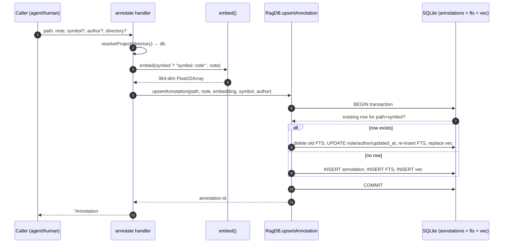

# Tool: annotate

`annotate` attaches a persistent note to a file or a specific symbol. The note is stored in the project database and embedded so it can be found by meaning later. Its main payoff is automatic: the next time anyone runs [read_relevant](read-relevant.md) and a result lands on the annotated file (and matching symbol, if you gave one), the note is printed inline as a `[NOTE]` block right above the code. This is how a known bug, a fragile spot, a non-obvious constraint, or a workaround survives across sessions instead of living only in one conversation.

Calling `annotate` again with the same path and symbol does not create a second note — it overwrites the existing one. That makes the tool safe to call repeatedly as understanding of a piece of code evolves.

The tool is registered as `annotate` and its handler lives in `src/tools/annotation-tools.ts:8-39`.

## When to use it

Reach for `annotate` the moment you learn something about code that a future reader would want flagged before they touch it:

- a known bug or race condition,
- code that is fragile and should not be changed yet,
- an architectural constraint that is not obvious from the code itself,
- a workaround that needs context to make sense.

A note tied to a `symbol` (a function or class name) only shows up when a search result actually matches that symbol; a file-level note (no symbol) shows up for any result in that file. This is enforced when results are rendered — see `src/tools/search.ts:194-196`.

## Inputs

| name | type | required | description |
| --- | --- | --- | --- |
| `path` | string (1–500 chars) | yes | File path the note applies to, relative to the project root. Stored verbatim, so it must match the path form that search emits for the note to surface inline. |
| `note` | string (1–2000 chars) | yes | The note text that will be shown and embedded. |
| `symbol` | string | no | Symbol name (function, class, etc.) the note applies to. Omit for a file-level note. |
| `author` | string | no | Label for who wrote the note, e.g. `agent` or `human`. Defaults to `agent` when omitted. |
| `directory` | string | no | Project directory to act on. Defaults to the `RAG_PROJECT_DIR` environment variable, then the current working directory. |

The defaulting for `author` happens at the handler boundary: `author ?? "agent"` is passed down, so the stored row never has a null author when this tool is the writer (`src/tools/annotation-tools.ts:32`). The `directory` default and validation are handled by the shared `resolveProject` helper (`src/tools/index.ts:22-37`), which resolves the path to an absolute form and throws `Directory does not exist` if it is missing.

## Outputs

| output | where it lands / shape / description |
| --- | --- |
| Confirmation text | The tool returns one text content block: `Annotation #<id> saved for <target>`, where `<target>` is `path  •  symbol` if a symbol was given, otherwise just `path` (`src/tools/annotation-tools.ts:34-37`). |
| Annotation row | An inserted or updated row in the `annotations` table, plus matching full-text and vector entries. This is the durable result; see [State changes](#state-changes). |

The `id` in the confirmation is the row id. It is what [delete_annotation](delete-annotation.md) expects later, and what [get_annotations](get-annotations.md) prints next to each note.

## How it works



1. The caller invokes `annotate` with at least a `path` and a `note`. The other fields are optional.
2. The handler calls `resolveProject(directory, getDB)`, which resolves the directory to an absolute path, verifies it exists, loads config, and hands back the `RagDB` for that project (`src/tools/index.ts:22-37`).
3. The text to embed is built. If a `symbol` was provided, the note is prefixed with the symbol name as `"<symbol>: <note>"`; otherwise the raw note is used (`src/tools/annotation-tools.ts:30`). Prefixing the symbol makes a symbol-scoped note easier to find by meaning later, because the symbol name becomes part of the embedded text.
4. `embed()` turns that text into a normalized 384-dimension vector. It lazily loads the embedding model (`Xenova/all-MiniLM-L6-v2` by default) and runs mean pooling with normalization (`src/embeddings/embed.ts:78-86`). This is an async step and is the slowest part of the call, because it may have to load the model on first use.
5. `ragDb.upsertAnnotation(path, note, embedding, symbol ?? null, author ?? "agent")` writes the note. The whole write runs in a single SQLite transaction (`src/db/annotations.ts:14-64`).
6. Inside the transaction, the code first checks whether a row already exists for this exact `path` plus `symbol_name` (using `IS NULL` matching when no symbol was given). The presence or absence of that row decides the branch.
7. If a row exists, it is updated in place and its full-text and vector entries are refreshed (see [State changes](#state-changes)). If not, a new row is inserted along with fresh full-text and vector entries.
8. The transaction commits and the row id is returned up the chain.
9. The handler formats a human-readable target and returns the confirmation string `Annotation #<id> saved for <target>`.

## State changes

### Annotation row (inserted or updated)

The single state change is a row in the `annotations` table, kept in sync with two companion virtual tables: `fts_annotations` (an FTS5 full-text index over the note) and `vec_annotations` (a `vec0` vector table holding the embedding). All three are created on database setup (`src/db/index.ts:399-419`), and the vector column width is tied to the active embedding dimension via `embedding FLOAT[${getEmbeddingDim()}]`.

The write is keyed by `path` + `symbol_name`, not by id. The lookup uses two different queries depending on whether a symbol was given (`src/db/annotations.ts:16-28`):

| Case | Existing-row query | Effect |
| --- | --- | --- |
| Symbol given | `WHERE path = ? AND symbol_name = ?` | One note per (file, symbol) pair. |
| No symbol | `WHERE path = ? AND symbol_name IS NULL` | One file-level note per file. |

**Before → after, new note (no matching row):** a fresh row is inserted into `annotations` with both `created_at` and `updated_at` set to the same `now` ISO timestamp; its id comes from `last_insert_rowid()`. A matching FTS row and a vector row are then inserted (`src/db/annotations.ts:48-61`).

**Before → after, existing note (matching row found):** the old note is removed from the FTS index using the FTS5 `'delete'` command (which needs the old `note` text), the row's `note`, `author`, and `updated_at` are updated while `created_at` is left untouched, the new note text is re-inserted into FTS, and the vector row is deleted and re-inserted with the new embedding (`src/db/annotations.ts:32-47`). The result is that re-annotating the same target keeps one row, keeps the original creation time, and fully refreshes both indexes so search stays consistent.

Why the transaction matters: the row, its full-text entry, and its vector entry must move together. Wrapping all the writes in one transaction (`db.transaction(...)` then `tx()`) means a failure cannot leave, for example, a stale vector pointing at an updated note (`src/db/annotations.ts:14-65`).

### How the note becomes visible later

The state written here is read back by [read_relevant](read-relevant.md). After ranking results, that tool batch-fetches annotations for every unique result path with `getAnnotations(relPath)`, then for each result keeps only annotations whose `symbolName` is null or equals the result's matched entity name, and prints each kept note as `[NOTE] ...` (with the symbol in parentheses when present) directly above the code chunk (`src/tools/search.ts:171-204`). This is the payoff of writing the note: no extra call is needed to see it again.

## Branches and failure cases

- **New vs. existing note.** The core branch is whether a row already exists for `path` + `symbol_name`. New rows are inserted; existing rows are updated in place. Both paths return the relevant id (`src/db/annotations.ts:32-61`).
- **Symbol-scoped vs. file-level.** Whether `symbol` is provided changes both the existing-row lookup (`= ?` vs `IS NULL`) and the embedded text (prefixed with the symbol or not). It also changes the confirmation target string and, later, whether the note surfaces for a given search result.
- **Author defaulting.** When `author` is omitted, the handler substitutes `"agent"` before calling the store, so notes written through this tool always carry an author (`src/tools/annotation-tools.ts:32`).
- **Missing or invalid directory.** `resolveProject` resolves the directory and throws `Directory does not exist: <path>` if it is not present, surfacing as a tool error before any write happens (`src/tools/index.ts:30-32`).
- **Input validation.** Schema constraints reject empty or oversized input before the handler runs: `path` must be 1–500 characters and `note` must be 1–2000 characters (`src/tools/annotation-tools.ts:12-13`).
- **Embedding model load.** `embed()` must load the model on first use. If the cached model is corrupted, `getEmbedder` deletes the cache directory and retries the load once; other load errors propagate (`src/embeddings/embed.ts:61-72`). A propagated error here aborts the call before any row is written.
- **No partial writes.** Because the row plus its FTS and vector entries are written inside one transaction, an error mid-write rolls the whole thing back rather than leaving the indexes out of sync (`src/db/annotations.ts:14-65`).

## Example

Annotate a specific function with a caveat:

```json
{
  "path": "src/db/annotations.ts",
  "note": "FTS delete needs the OLD note text before UPDATE — don't reorder these statements.",
  "symbol": "upsertAnnotation",
  "author": "agent"
}
```

The tool would reply with something like:

```
Annotation #7 saved for src/db/annotations.ts  •  upsertAnnotation
```

A file-level note simply omits `symbol`:

```json
{
  "path": "src/tools/index.ts",
  "note": "resolveProject is the single choke point for directory validation; keep new tools routing through it."
}
```

Later, when a [read_relevant](read-relevant.md) result lands on `src/db/annotations.ts` and matches the `upsertAnnotation` entity, the first note is shown inline as:

```
[0.81] src/db/annotations.ts:4-66  •  upsertAnnotation
[NOTE (upsertAnnotation)] FTS delete needs the OLD note text before UPDATE — don't reorder these statements.
<the chunk content follows>
```

## Related tools

| Tool | Relationship |
| --- | --- |
| [get_annotations](get-annotations.md) | Reads notes back, by file path or by semantic query over `vec_annotations`. |
| [delete_annotation](delete-annotation.md) | Removes a note by the id this tool returns. |
| [read_relevant](read-relevant.md) | Where notes surface automatically as `[NOTE]` blocks above matching code. |
| [mimirs annotations](../cli/annotations.md) | CLI command that lists stored notes, optionally filtered by path. |

## Key source files

- `src/tools/annotation-tools.ts` — registers the `annotate` tool (and its `get_annotations` / `delete_annotation` siblings); builds the embed text, calls the store, formats the reply.
- `src/db/annotations.ts` — `upsertAnnotation` and the rest of the annotation SQL: the keyed upsert plus its FTS and vector bookkeeping.
- `src/db/index.ts` — defines the `annotations`, `fts_annotations`, and `vec_annotations` tables and exposes the thin `RagDB.upsertAnnotation` wrapper.
- `src/embeddings/embed.ts` — `embed()` produces the normalized vector stored for the note.
- `src/tools/index.ts` — `resolveProject` resolves and validates the target directory and hands back the database.
- `src/tools/search.ts` — renders stored notes inline in `read_relevant` output.
