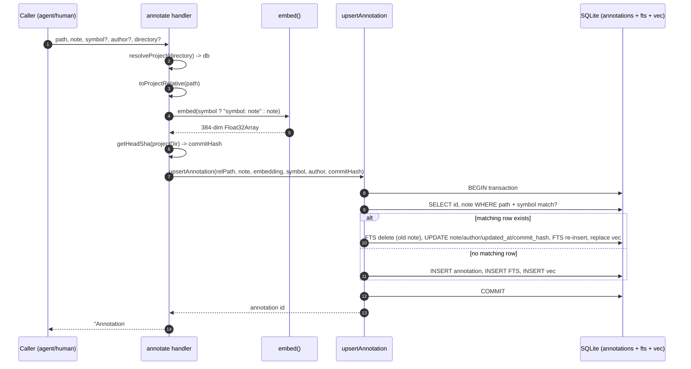

# Tool: annotate

`annotate` attaches a persistent note to a file or to a specific symbol inside that file. The note is stored in the project database and embedded so it can be found by meaning later. Its main payoff is automatic: the next time anyone runs [read_relevant](read-relevant.md) and a result lands on the annotated file — and matches the symbol, if you gave one — the note is printed inline as a `[NOTE]` block directly above the code. This is how a known bug, a fragile spot, a non-obvious constraint, or a workaround survives across sessions instead of living only in one conversation.

Calling `annotate` again with the same `path` and `symbol` does not create a second note — it overwrites the existing one. That makes the tool safe to call repeatedly as understanding of a piece of code evolves.

The tool is registered under the name `annotate`, and its handler lives in `src/tools/annotation-tools.ts:11-50` alongside its `get_annotations` and `delete_annotation` siblings.

## When to use it

Reach for `annotate` the moment you learn something about code that a future reader would want flagged before they touch it. The tool description spells out the intended triggers (`src/tools/annotation-tools.ts:13`):

- a known bug or race condition,
- code that is fragile and should not be changed yet,
- an architectural constraint that is not obvious from the code itself,
- a workaround that needs context to make sense.

A note tied to a `symbol` (a function or class name) only shows up when a search result actually matches that symbol; a file-level note (no symbol) shows up for any result in that file. That filtering happens where results are rendered, not where the note is written — see [State changes](#state-changes) below.

## Inputs

| name | type | required | description |
| --- | --- | --- | --- |
| `path` | string (1–500 chars) | yes | File path the note applies to, relative to the project root. The handler canonicalizes it to the project-relative, forward-slash form before storing, so feeding back an absolute path that a tool printed still resolves correctly. |
| `note` | string (1–2000 chars) | yes | The note text that will be shown and embedded. |
| `symbol` | string | no | Symbol name (function, class, etc.) the note applies to. Omit for a file-level note. |
| `author` | string | no | Label for who wrote the note, e.g. `agent` or `human`. Defaults to `agent` when omitted. |
| `directory` | string | no | Project directory to act on. Defaults to the `RAG_PROJECT_DIR` environment variable, then the current working directory. |

The size limits on `path` and `note` are Zod schema constraints, so empty or oversized input is rejected before the handler body runs (`src/tools/annotation-tools.ts:15-16`). The `author` default is applied at the handler boundary: `author ?? "agent"` is passed down, so a note written through this tool never lands with a null author (`src/tools/annotation-tools.ts:43`). The `directory` default and validation are handled by the shared `resolveProject` helper, which resolves the path to an absolute form and throws `Directory does not exist` if it is missing (`src/tools/index.ts:38-47`).

## Path canonicalization

The handler does not store the raw `path` it was given. Because other tools display absolute paths in their results, agents naturally feed those absolute paths back into `annotate` — and a verbatim absolute path would never match `read_relevant`'s project-relative lookup, so the note would silently never surface. To prevent that, the handler runs the path through `toProjectRelative`, which trims it, normalizes separators to forward slashes, converts an in-project absolute path to a relative one, and strips a leading `./` (`src/tools/annotation-tools.ts:36`, `src/utils/path.ts:28-39`). The `RagDB.upsertAnnotation` wrapper canonicalizes again at the database boundary as a second line of defense (`src/db/index.ts:1176-1182`).

## Outputs

| output | where it lands / shape / description |
| --- | --- |
| Confirmation text | One text content block: `Annotation #<id> saved for <target>`, where `<target>` is `path  •  symbol` if a symbol was given, otherwise just `path` (`src/tools/annotation-tools.ts:45-48`). |
| Annotation row | An inserted or updated row in the `annotations` table, kept in sync with a full-text entry and a vector entry. This is the durable result; see [State changes](#state-changes). |

The `id` in the confirmation is the row id. It is what [delete_annotation](delete-annotation.md) expects later, and what [get_annotations](get-annotations.md) prints next to each note.

## How it works



1. The caller invokes `annotate` with at least a `path` and a `note`; the other fields are optional.
2. The handler calls `resolveProject(directory, getDB)`, which resolves the directory to an absolute path, verifies it exists, loads config, applies the embedding config, and hands back the `RagDB` for that project (`src/tools/index.ts:33-72`).
3. The supplied `path` is canonicalized to a project-relative form with `toProjectRelative` so it will match later relative lookups (`src/tools/annotation-tools.ts:36`).
4. The text to embed is built. If a `symbol` was provided, the note is prefixed with the symbol name as `"<symbol>: <note>"`; otherwise the raw note is used (`src/tools/annotation-tools.ts:38`). Prefixing the symbol makes a symbol-scoped note easier to find by meaning later, because the symbol name becomes part of the embedded text.
5. `embed()` turns that text into a normalized 384-dimension vector. It lazily loads the embedding model (`Xenova/all-MiniLM-L6-v2` by default) and runs the model with the configured pooling and normalization (`src/embeddings/embed.ts:274-282`). This is an async step and is the slowest part of the call, because it may have to load the model on first use.
6. The handler stamps the current `HEAD` commit with `getHeadSha(projectDir)`, so a later read can tell whether the annotated file has changed since the note was written; it is `null` off-git (`src/tools/annotation-tools.ts:42`).
7. `ragDb.upsertAnnotation(relPath, note, embedding, symbol ?? null, author ?? "agent", commitHash)` writes the note. `RagDB.upsertAnnotation` is a thin wrapper that re-canonicalizes the path and forwards to the implementation, and the whole write runs inside a single SQLite transaction (`src/db/index.ts:1176-1182`, `src/db/annotations.ts:16-66`).
8. Inside the transaction the code first runs a `SELECT` to see whether a row already exists for this exact `path` plus `symbol_name`. The presence or absence of that row decides the branch (`src/db/annotations.ts:17-30`).
9. If a matching row exists, it is updated in place and its full-text and vector entries are refreshed. If not, a new row is inserted along with fresh full-text and vector entries (see [State changes](#state-changes)).
10. The transaction commits and the row id is returned up the chain (`src/db/annotations.ts:66-67`).
11. The handler formats a human-readable target and returns the confirmation string `Annotation #<id> saved for <target>` (`src/tools/annotation-tools.ts:45-48`).

## State changes

### Annotation row (inserted or updated)

The single durable change is a row in the `annotations` table, kept in sync with two companion virtual tables: `fts_annotations` (an FTS5 full-text index over the note, content-backed by the `annotations` table) and `vec_annotations` (a `vec0` vector table holding the embedding). All three are created on database setup, and the vector column width is tied to the active embedding dimension via `embedding FLOAT[${getEmbeddingDim()}]` (`src/db/index.ts:541-561`). The base table's `commit_hash` column is added by a migration on existing databases (`src/db/index.ts:587-591`).

The write is keyed by `path` + `symbol_name`, not by id. The existing-row lookup uses two different queries depending on whether a symbol was given (`src/db/annotations.ts:18-30`):

| Case | Existing-row query | Effect |
| --- | --- | --- |
| Symbol given | `WHERE path = ? AND symbol_name = ?` | One note per (file, symbol) pair. |
| No symbol | `WHERE path = ? AND symbol_name IS NULL` | One file-level note per file. |

**New note (no matching row):** a fresh row is inserted into `annotations` with both `created_at` and `updated_at` set to the same `now` ISO timestamp, plus the stamped `commit_hash`; its id comes from `last_insert_rowid()`. A matching FTS row and a vector row are then inserted (`src/db/annotations.ts:50-63`).

**Existing note (matching row found):** the old note is first removed from the FTS index using the FTS5 `'delete'` command, which needs the *old* `note` text — that is why the lookup also selects `note`. The row's `note`, `author`, `updated_at`, and `commit_hash` are then updated while `created_at` is left untouched, the new note text is re-inserted into FTS, and the vector row is deleted and re-inserted with the new embedding (`src/db/annotations.ts:34-49`). The result is that re-annotating the same target keeps one row, preserves the original creation time, and fully refreshes both indexes so search stays consistent.

Why the transaction matters: the row, its full-text entry, and its vector entry must move together. Wrapping all the writes in one transaction means a failure cannot leave, for example, a stale vector pointing at an updated note (`src/db/annotations.ts:16-66`).

### How the note becomes visible later

The state written here is read back by [read_relevant](read-relevant.md). After ranking results, that tool batch-fetches annotations for every unique result path with `getAnnotationsForPaths(uniqueRelPaths)`, groups them by relative path, then for each result keeps only annotations whose `symbolName` is null or equals the result's matched entity name, and prints each kept note as `[NOTE] ...` (with the symbol in parentheses when present) directly above the code chunk (`src/tools/search.ts:188-234`). A note whose stamped commit shows the file has since changed gets an extra `⚠ stale` mark on its inline tag (`src/tools/search.ts:228-230`). This is the payoff of writing the note: no extra call is needed to see it again.

Note that the surfacing filter compares the stored `path` against the result path normalized *relative to the project directory* (`src/tools/search.ts:220`). That is why the handler canonicalizes the `path` input to that same relative form — a note saved under a raw absolute path would not match a relative result path and would silently never surface.

## Branches and failure cases

- **New vs. existing note.** The core branch is whether a row already exists for `path` + `symbol_name`. New rows are inserted; existing rows are updated in place. Both paths set `annotationId` and return it (`src/db/annotations.ts:34-63`).
- **Symbol-scoped vs. file-level.** Whether `symbol` is provided changes the existing-row lookup (`= ?` vs `IS NULL`), the embedded text (prefixed with the symbol or not), the confirmation target string, and later whether the note surfaces for a given search result.
- **Author defaulting.** When `author` is omitted the handler substitutes `"agent"` before calling the store, so notes written through this tool always carry an author (`src/tools/annotation-tools.ts:43`). The store itself accepts a null author and would persist it, but this tool never passes one.
- **Off-git project.** `getHeadSha` returns `null` when the directory is not a git repository, so the note is stored with a null `commit_hash` and simply carries no staleness signal later (`src/tools/annotation-tools.ts:42`).
- **Missing or invalid directory.** `resolveProject` resolves the directory and throws `Directory does not exist: <path>` if it is not present, surfacing as a tool error before any embedding or write happens (`src/tools/index.ts:44-47`).
- **Input validation.** Schema constraints reject empty or oversized input before the handler runs: `path` must be 1–500 characters and `note` must be 1–2000 characters (`src/tools/annotation-tools.ts:15-16`).
- **Embedding model load.** `embed()` must load the model on first use. If the cached model is corrupted (`Protobuf parsing failed` or `Load model`), `getEmbedder` deletes the model cache directory and retries the load once; other load errors propagate (`src/embeddings/embed.ts:246-257`). A propagated error here aborts the call before any row is written.
- **No partial writes.** Because the row plus its FTS and vector entries are written inside one transaction, an error mid-write rolls the whole thing back rather than leaving the indexes out of sync (`src/db/annotations.ts:16-66`).

## Example

Annotate a specific function with a caveat:

```json
{
  "path": "src/db/annotations.ts",
  "note": "FTS delete needs the OLD note text before UPDATE — don't reorder these statements.",
  "symbol": "upsertAnnotation",
  "author": "agent"
}
```

The tool replies with a single confirmation line, where the id is whatever row was written:

```text
Annotation #7 saved for src/db/annotations.ts  •  upsertAnnotation
```

A file-level note simply omits `symbol`:

```json
{
  "path": "src/tools/index.ts",
  "note": "resolveProject is the single choke point for directory validation; keep new tools routing through it."
}
```

Later, when a [read_relevant](read-relevant.md) result lands on `src/db/annotations.ts` and matches the `upsertAnnotation` entity, the first note is shown inline above the code:

```text
[0.81] src/db/annotations.ts:4-66  •  upsertAnnotation
[NOTE (upsertAnnotation)] FTS delete needs the OLD note text before UPDATE — don't reorder these statements.
<the chunk content follows>
```

## Related tools

| Tool | Relationship |
| --- | --- |
| [get_annotations](get-annotations.md) | Reads notes back, by file path or by semantic query over `vec_annotations`. |
| [delete_annotation](delete-annotation.md) | Removes a note by the id this tool returns. |
| [read_relevant](read-relevant.md) | Where notes surface automatically as `[NOTE]` blocks above matching code. |
| [mimirs annotations](../cli/annotations.md) | CLI command that lists stored notes, optionally filtered by path. |

## Key source files

- `src/tools/annotation-tools.ts` — registers the `annotate` tool (and its `get_annotations` / `delete_annotation` siblings); canonicalizes the path, builds the embed text, stamps the commit, calls the store, formats the reply.
- `src/db/annotations.ts` — `upsertAnnotation` and the rest of the annotation SQL: the keyed upsert plus its FTS and vector bookkeeping.
- `src/utils/path.ts` — `toProjectRelative` canonicalizes the supplied path so the note can match later relative lookups.
- `src/db/index.ts` — defines the `annotations`, `fts_annotations`, and `vec_annotations` tables and exposes the thin `RagDB.upsertAnnotation` wrapper.
- `src/embeddings/embed.ts` — `embed()` produces the normalized vector stored for the note.
- `src/tools/index.ts` — `resolveProject` resolves and validates the target directory and hands back the database.
- `src/tools/search.ts` — renders stored notes inline in `read_relevant` output, with a stale mark when the annotated file has changed.
