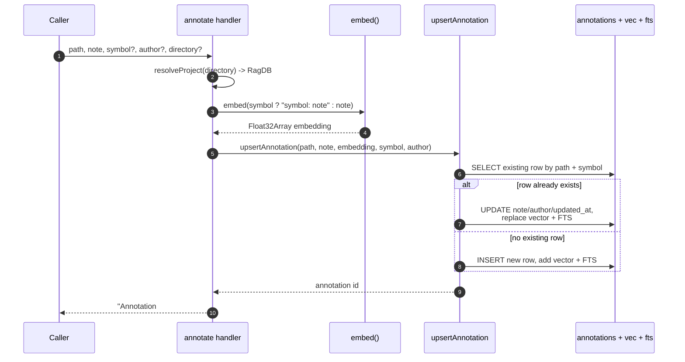

# Tool: annotate

`annotate` attaches a persistent note to a file or a symbol inside a file. The note is stored in the project's local index and later surfaces automatically, inline, when someone runs [read_relevant](read-relevant.md) over code in that file. It is the mechanism for leaving durable warnings that outlive a single session — "this function has a known race condition", "don't refactor until the auth rewrite lands", "this workaround exists because the upstream library is broken".

Use it the moment you read code and notice something worth remembering: a bug, fragile code, a non-obvious constraint, or a workaround that needs context. A later session reading the same file will see the note without having to ask for it.

The handler is registered in `src/tools/annotation-tools.ts:8-39`. It embeds the note text, then upserts a row keyed by file path plus optional symbol.

## How it works



1. The caller invokes the tool with a `path` and `note`, plus optional `symbol`, `author`, and `directory`. The schema requires `path` (1–500 chars) and `note` (1–2000 chars) (`src/tools/annotation-tools.ts:11-26`).
2. `resolveProject` turns the optional `directory` into the project's `RagDB` handle. When omitted it falls back to the `RAG_PROJECT_DIR` environment variable or the current working directory (`src/tools/annotation-tools.ts:28`).
3. The text to embed is built. If a `symbol` was given, the embedded text is `` `${symbol}: ${note}` ``; otherwise it is the bare note. This biases the vector toward the symbol name so later semantic search over notes ranks it correctly (`src/tools/annotation-tools.ts:30-31`).
4. `embed` returns the vector for that text.
5. `upsertAnnotation` is called with the path, note, embedding, the symbol (or `null`), and the author (defaulting to `"agent"`) (`src/tools/annotation-tools.ts:32`).
6. Inside a single transaction, it first looks for an existing row. The lookup branches on whether a symbol was supplied: with a symbol it matches `path = ? AND symbol_name = ?`; without one it matches `path = ? AND symbol_name IS NULL` (`src/db/annotations.ts:15-28`).
7. If a row exists, the note, author, and `updated_at` are updated in place, and the full-text and vector index entries for that row are deleted and re-inserted so search stays consistent (`src/db/annotations.ts:32-47`).
8. If no row exists, a new row is inserted with both `created_at` and `updated_at` set to now, and matching vector and full-text rows are added (`src/db/annotations.ts:48-61`).
9. The handler returns a one-line confirmation containing the id and a human-readable target (the path, or `` `path  •  symbol` `` when a symbol was given) (`src/tools/annotation-tools.ts:34-37`).

## Inputs

| name | type | required | description |
|------|------|----------|-------------|
| `path` | string (1–500) | yes | File path the note applies to, relative to the project root. This is the key used when notes are matched against [read_relevant](read-relevant.md) results, so it must match the indexed relative path. |
| `note` | string (1–2000) | yes | The note text. Stored verbatim and also embedded for semantic search. |
| `symbol` | string | no | A symbol name (function, class, etc.) the note applies to. Omit for a file-level note. Determines which key the upsert matches and whether the note surfaces only on a matching code chunk. |
| `author` | string | no | A label for who wrote the note, e.g. `agent` or `human`. Defaults to `agent` when omitted. |
| `directory` | string | no | Project directory to operate on. Defaults to the `RAG_PROJECT_DIR` env var or the current working directory. |

## Outputs

| output | where it lands / shape / description |
|--------|--------------------------------------|
| Confirmation text | Returned to the caller as a single text block: `Annotation #<id> saved for <target>`, where `<target>` is the path, or `path  •  symbol` when a symbol was supplied (`src/tools/annotation-tools.ts:34-37`). |
| `annotations` row | Inserted or updated in the `annotations` table with `path`, `symbol_name`, `note`, `author`, `created_at`, and `updated_at` (`src/db/annotations.ts:38-52`). |
| Vector entry | A row in `vec_annotations` holding the embedding, used by semantic search over notes (`src/db/annotations.ts:43-45`, `src/db/annotations.ts:57-60`). |
| Full-text entry | A row in `fts_annotations` over the note text (`src/db/annotations.ts:41`, `src/db/annotations.ts:56`). |

## State changes

**`annotations` row for a `path` + `symbol` key**

- Before: no row for that key, or a previous note under the same key.
- After: a row whose `note`, `author`, and `updated_at` reflect this call, with matching vector and full-text entries.

This is an upsert, not an append. A second call with the same `path` and the same `symbol` (or both file-level, i.e. no symbol) overwrites the earlier note rather than creating a second row — the lookup at `src/db/annotations.ts:15-28` finds the existing row and the `UPDATE` branch at `src/db/annotations.ts:37-40` replaces its contents. Two notes can coexist on the same file only if they target different symbols, or one is file-level and the other is symbol-scoped.

The write matters because the note becomes visible to future readers without any extra step. When [read_relevant](read-relevant.md) returns chunks, it fetches the annotations for each result's file and prints any that apply as `[NOTE]` lines above the chunk content. A file-level note (no symbol) shows on every chunk of that file; a symbol-scoped note shows only on the chunk whose entity matches the symbol name (`src/tools/search.ts:170-203`).

## Branches and failure cases

- **Symbol given vs file-level.** The presence of `symbol` selects which existing-row lookup runs and what gets embedded. A symbol-scoped note and a file-level note on the same path are distinct rows (`src/db/annotations.ts:15-28`, `src/tools/annotation-tools.ts:30`).
- **Existing row vs new row.** Inside `upsertAnnotation` the two paths diverge: update-in-place (preserving the original `created_at`) versus a fresh insert (`src/db/annotations.ts:32-61`).
- **Author default.** When `author` is omitted the handler passes `"agent"`, so the stored row is never authored by an empty value through this tool (`src/tools/annotation-tools.ts:32`).
- **Directory resolution.** An invalid or unwritable project directory surfaces as an error from `resolveProject` / the underlying `RagDB` open, not from this handler's own logic.
- **No empty-result branch.** Unlike the read tools, `annotate` always performs a write and always returns the confirmation line; there is no "nothing found" path.
- **Atomicity.** Both the update and insert paths run inside one SQLite transaction, so the base row and its vector and full-text entries move together (`src/db/annotations.ts:14`, `src/db/annotations.ts:62-64`).

## Example

Arguments to attach a symbol-scoped note:

```json
{
  "path": "src/example.ts",
  "symbol": "parseConfig",
  "note": "Returns undefined on malformed YAML instead of throwing — callers must null-check.",
  "author": "agent"
}
```

Returned text:

```
Annotation #7 saved for src/example.ts  •  parseConfig
```

Calling again later with the same `path` and `symbol` but a revised `note` updates annotation `#7` in place rather than creating `#8`.

## Related tools

- [get_annotations](get-annotations.md) — read notes back for a file or search across all notes.
- [delete_annotation](delete-annotation.md) — remove a note by its id once it no longer applies.
- [read_relevant](read-relevant.md) — where saved notes surface inline as `[NOTE]` lines on matching chunks.

## Key source files

- `src/tools/annotation-tools.ts` — registers the `annotate` tool, builds the embed text, and formats the confirmation.
- `src/db/annotations.ts` — `upsertAnnotation` and the SQL that performs the keyed upsert plus vector and full-text maintenance.
- `src/db/index.ts` — the `RagDB` class that exposes `upsertAnnotation` as a method and defines the `annotations`, `vec_annotations`, and `fts_annotations` tables.
- `src/tools/search.ts` — consumes annotations and renders the `[NOTE]` blocks in `read_relevant` output (`src/tools/search.ts:170-203`).
