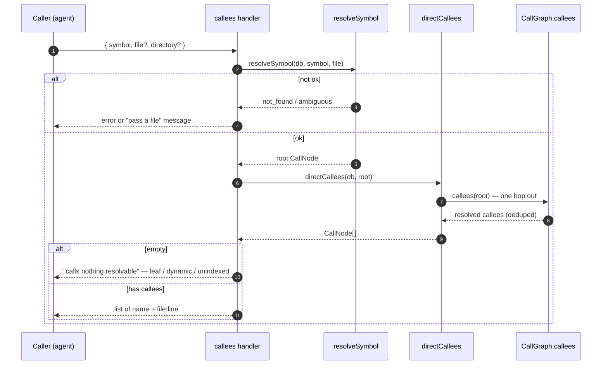

# Tool: callees

`callees` answers the question you ask right before editing a function: *what does this thing call?* You give it a function or method name and it returns the list of functions and methods that symbol invokes directly — one hop outward — with each call resolved to the file and line where that callee is defined. It is the forward complement of [`usages`](usages.md): where `usages` walks one hop *in* (who references this symbol), `callees` walks one hop *out* (what this symbol depends on). Reach for it to see a function's immediate dependencies before changing its body, without reading the whole file.

This is the flat, single-hop, outward view. For the transitive *callers* of a symbol and the tests to run, use [`impact`](impact.md); for the connecting path between two specific symbols, use [`trace`](trace.md); for file-level imports rather than symbol calls, use [`depends_on`](depends-on.md).

## What runs when you call it



1. The caller invokes the tool with a required `symbol`, an optional `file` to disambiguate, and an optional `directory`. The handler is registered inside `registerGraphTools` (`src/tools/graph-tools.ts:313-350`).
2. `resolveSymbol` looks the name up among callable definitions, optionally narrowed by `file`, and returns `ok` with a single node, `not_found`, or `ambiguous`. Anything but `ok` returns the resolve error and stops (`src/tools/graph-tools.ts:330-333`).
3. With one node resolved, `directCallees` asks the call graph for the symbol's outgoing edges — the callables it invokes — and deduplicates them by node identity (`src/graph/trace.ts:337-348`).
4. If the deduplicated list is empty, the tool returns a single line explaining the symbol is a leaf, or its calls are dynamic or into unindexed code (`src/tools/graph-tools.ts:336-340`).
5. Otherwise it prints each callee as a `name  path:line` row and appends a tip pointing at `impact` (for who calls it) and `read_relevant` (for its body) (`src/tools/graph-tools.ts:342-348`).

## Resolving the symbol and the `file` disambiguator

A bare name is not enough on its own — the same function name can be defined in several files, and listing the wrong one's callees is worse than refusing. `resolveSymbol` calls `getCallablesByName`, which returns both exported functions and methods and module-private (non-exported) callables of that name; classes, constants, and types are not tracked, so a name that resolves to one of those reads as not-found (`src/graph/trace.ts:189-214`, `src/db/graph.ts:777`). When more than one callable survives, the result is `ambiguous` and the tool lists the candidate files and asks the caller to pass a `file` (`src/tools/graph-tools.ts:26-34`).

The `file` argument narrows the candidate set before that decision. It is matched on a path-segment boundary, not a raw suffix, so `file: "db.ts"` matches `src/db.ts` but not `indexed-db.ts` — a precision detail that prevents the wrong single candidate from surviving silently and being walked as if correct (`src/graph/trace.ts:191-200`).

## One hop out over the static call graph

The actual edge walk lives in `directCallees`, which delegates to the shared `CallGraph` view's `callees` method (`src/graph/trace.ts:337-341`). That method reads the symbol's outgoing reference rows — `getCalleeRefsForExport` for an exported callable, `getCalleeRefsForLocalSymbol` for a module-private one — and turns each into a destination node (`src/graph/trace.ts:81-118`). It is exactly one hop: the callees of those callees are not followed. That single-hop scope is what separates `callees` from `trace` and `impact`, which walk transitively.

Resolving each reference to a *definition* is the step that makes the output useful. For each outgoing reference, the graph first tries the cross-file resolution recorded during indexing (`resolvedExportId`): if the reference resolves to a known export, that export's file and start line become the callee's location (`src/graph/trace.ts:92-95`). When there is no resolved export — typically a same-file private helper the chunker placed but the export table never saw — it falls back to `getLocalCallable` to find that local definition in the same file (`src/graph/trace.ts:96-108`). Either way the callee carries a real `filePath` and `startLine`, which the handler renders project-relative as `name  path:line` (`src/tools/graph-tools.ts:344-345`).

The list is deduplicated twice over. The `CallGraph.callees` method already collapses duplicate destinations into a map keyed by node identity and drops self-edges, so a function that calls the same helper five times yields one callee, and a recursive call to itself is not listed (`src/graph/trace.ts:89-115`). `directCallees` then keeps its own `seen` set as a second guard before emitting the final list (`src/graph/trace.ts:339-346`).

## The leaf / dynamic-dispatch / unindexed result

When nothing resolvable comes back, the tool does not pretend the function calls nothing — it names the three reasons that can be true and leaves the reader to tell which applies (`src/tools/graph-tools.ts:336-340`):

- **Leaf.** The function genuinely calls no other tracked callable — a pure computation, a small accessor.
- **Dynamic dispatch.** Its calls go through a value, an interface dispatched to an implementation, or a dependency-injected service. None of those has a statically resolvable edge, so the walk drops them. This is the same static-resolution limit that bounds [`trace`](trace.md) and [`impact`](impact.md) (`src/graph/trace.ts:11-14`).
- **Unindexed code.** Its calls land in files outside the index — third-party packages, generated code, an excluded path — which have no callable rows to resolve to.

Concretely, a reference is dropped whenever it neither resolves to a known export nor matches a same-file local callable; the node-building loop simply produces no node for it (`src/graph/trace.ts:92-113`). The empty-result message is the tool being honest about that boundary rather than reporting a misleading zero.

## Inputs

| name | type | required | description |
| --- | --- | --- | --- |
| `symbol` | string (1–200 chars) | yes | Function or method name whose callees to list. Resolved to a callable via `getCallablesByName`; classes, constants, and types are not tracked (`src/tools/graph-tools.ts:317`, `src/db/graph.ts:777`). |
| `file` | string | no | Project-relative path used to disambiguate when the name is defined in several places. Matched on a path-segment boundary (`src/tools/graph-tools.ts:318-321`, `src/graph/trace.ts:191-200`). |
| `directory` | string | no | Project whose index to query. Defaults to `RAG_PROJECT_DIR` or the current working directory (`src/tools/index.ts:38-39`). |

## Outputs

| output | where it lands / shape / description |
| --- | --- |
| List of directly-called symbols | On success, a text block: a `"<symbol>" directly calls N symbols:` header, then one indented `name  path:line` row per callee, and a closing tip pointing at `impact` and `read_relevant`. The location omits `:line` when the callee has no recorded start line (`src/tools/graph-tools.ts:342-348`). |
| Empty / leaf message | When no callee resolves, a single line saying the symbol "calls nothing resolvable — it's a leaf, or its calls are dynamic / into unindexed code" (`src/tools/graph-tools.ts:336-340`). |
| Resolve error | When the symbol is missing or defined in several places, the not-found or ambiguous message instead of a callee list (`src/tools/graph-tools.ts:330-333`). |

This tool only reads the index; it opens no files, runs no parser, and writes nothing back to the database, so it produces no persistent state changes.

## Branches and failure cases

- **Symbol not found.** `resolveSymbol` returns `not_found` when no callable matches the name (after any `file` filter); the tool returns the "No callable named …" line, which reminds the caller that only functions and methods are tracked (`src/tools/graph-tools.ts:36-45`, `src/tools/graph-tools.ts:330-333`).
- **Ambiguous symbol.** More than one distinct definition returns `ambiguous`; the tool lists up to 15 candidate paths and asks for a `file` (`src/tools/graph-tools.ts:26-34`).
- **No resolvable callees.** An empty callee list returns the leaf / dynamic / unindexed message rather than an empty section (`src/tools/graph-tools.ts:336-340`).
- **Self-calls and duplicates.** A recursive self-call is excluded and repeated calls to the same callee collapse to one entry (`src/graph/trace.ts:110-115`, `src/graph/trace.ts:339-346`).
- **Dynamic / unindexed edges.** Calls that don't resolve to an indexed export or a same-file local are silently dropped from the list — they are the reason an otherwise busy function can come back empty (`src/graph/trace.ts:92-113`).
- **Missing directory.** A non-existent `directory` makes `resolveProject` throw before any walk runs (`src/tools/index.ts:45-47`).

## Example

List what a function calls before editing it:

```json
{
  "symbol": "resolveProject",
  "file": "src/tools/index.ts"
}
```

Illustrative text output (names and line numbers are synthetic):

```
"resolveProject" directly calls 3 symbols:

  loadConfig  src/example/config.ts:40
  getDB  src/example/db.ts:18
  applyEmbeddingConfigFromDisk  src/example/config.ts:120

── Tip: call impact("resolveProject") for who calls it, or read_relevant("resolveProject") for its body. ──
```

## Key source files

- `src/tools/graph-tools.ts` — registers the `callees` MCP tool, resolves the project and symbol, handles the empty case, and renders the callee list (`src/tools/graph-tools.ts:313-350`).
- `src/graph/trace.ts` — `directCallees` (the one-hop walk and dedup) and the `CallGraph.callees` edge resolver that maps each outgoing reference to its definition file and line (`src/graph/trace.ts:81-118`, `src/graph/trace.ts:337-348`).
- `src/db/graph.ts` — the store: `getCallablesByName` (symbol resolution), `getCalleeRefsForExport`/`getCalleeRefsForLocalSymbol` (outgoing edges), `getLocalCallable` (same-file fallback resolution).
- `src/tools/index.ts` — `resolveProject`, which opens the project index before the walk.
