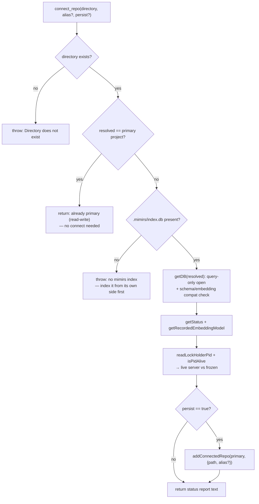

# Tool: connect_repo

`connect_repo` attaches another repository's mimirs index to the running server
so its code can be searched alongside the primary project. It opens that repo
**query-only** — no indexing, no writes — because the other repo's own mimirs
server is responsible for keeping its index fresh. After a successful connect,
the model passes that repo's path (or its alias, when persisted) as the
`directory` argument to read tools like [search](./search.md) and
[read_relevant](./read-relevant.md), and the server routes the query to the
attached database. The tool itself returns a status report: the index's size,
when it was last indexed, its embedding model, and whether a live server is
maintaining it (`src/tools/server-info-tools.ts:90-166`).

The connection is in-memory and lasts the server's lifetime by default. Passing
`persist: true` also writes it into `.mimirs/config.json` so future sessions
auto-attach it — the same persistent list managed from the CLI by
[connect](../cli/connect.md). All currently attached databases show up in
[server_info](./server-info.md).



1. **Resolve and existence-check.** The `directory` argument is resolved to an
   absolute path; a non-existent path throws immediately
   (`src/tools/server-info-tools.ts:107-110`).
2. **Primary-project short-circuit.** If the resolved path is this server's own
   primary project (`RAG_PROJECT_DIR` or cwd), there is nothing to connect — it
   is already attached read-write. The tool says so and returns
   (`src/tools/server-info-tools.ts:111-119`).
3. **Require an existing index.** A foreign repo must already have
   `.mimirs/index.db`; mimirs will not index it from this side. A missing index
   throws an error telling you to index it from its own side first
   (`src/tools/server-info-tools.ts:120-125`).
4. **Open query-only and validate.** `getDB(resolved)` opens the foreign
   directory read-only and, as part of construction, validates that its schema
   and embedding model/dim are compatible with this server's — an incompatible
   index cannot be searched with this server's query embedder
   (`src/tools/server-info-tools.ts:127-129`).
5. **Read status and recorded model.** `getStatus()` yields file and chunk
   counts and the last-indexed timestamp; `getRecordedEmbeddingModel()` reports
   the model the index was built with (or notes a pre-stamp index)
   (`src/tools/server-info-tools.ts:130-131`).
6. **Determine freshness.** `readLockHolderPid` plus `isPidAlive` decide whether
   a live mimirs server holds the foreign repo's index lock. With one, results
   stay current; without one, the index is frozen at its last index and the
   report says so (`src/tools/server-info-tools.ts:133-136`).
7. **Optionally persist.** When `persist` is true, `addConnectedRepo` saves the
   connection (with the alias if given) into the *primary* project's
   `.mimirs/config.json`, deduping against existing entries
   (`src/tools/server-info-tools.ts:138-144`).
8. **Return the report.** The tool assembles a plain-text block: the connected
   path, the size/last-indexed/model lines, the freshness line, a usage hint
   naming what to pass as `directory`, and the persist note when applicable
   (`src/tools/server-info-tools.ts:146-164`).

## Inputs

| name | type | required | description |
| --- | --- | --- | --- |
| `directory` | string | yes | Path to the repo to connect; must already have a `.mimirs/index.db` (`src/tools/server-info-tools.ts:94-96`). |
| `alias` | string | no | Short name usable as the `directory` of read tools; only takes effect when `persist` is true (`src/tools/server-info-tools.ts:97-100,147`). |
| `persist` | boolean | no | Save the connection to `connectedRepos` in `.mimirs/config.json` so future sessions auto-attach it. Default false — connection lasts this server's lifetime only (`src/tools/server-info-tools.ts:101-104`). |

## Outputs

| output | where it lands / shape / description |
| --- | --- |
| Status report | Returned as the tool's text content: files, chunks, last_indexed, embedding model, freshness, and a usage hint (`src/tools/server-info-tools.ts:146-164`). |
| Saved connection | When `persist` is true, a `{ path, alias? }` entry appended to `connectedRepos` in the primary project's `.mimirs/config.json` (`src/tools/server-info-tools.ts:140`). |

## State changes

| Item | Before | After | Why it matters |
| --- | --- | --- | --- |
| Connected database handle | not attached | attached (query-only) | The foreign repo's `index.db` is opened read-only and registered with the server, so subsequent read-tool calls can target it by `directory`. Opened by `getDB(resolved)` (`src/tools/server-info-tools.ts:129`). |
| `connectedRepos` entry (persist only) | absent | saved | With `persist`, the connection auto-attaches in every future session. Written by `addConnectedRepo` (`src/tools/server-info-tools.ts:140`). |

## Branches and failure cases

- **Directory does not exist** — throws before any open
  (`src/tools/server-info-tools.ts:108-110`).
- **Directory is the primary project** — returns a "no connect needed" message;
  it is already attached read-write (`src/tools/server-info-tools.ts:112-118`).
- **No `.mimirs/index.db`** — throws, directing you to index the repo from its
  own side (`src/tools/server-info-tools.ts:120-125`).
- **Incompatible schema or embedding model** — the query-only `getDB` open
  throws during validation (`src/tools/server-info-tools.ts:127-129`).
- **Alias given without persist** — the connect succeeds but the report warns the
  alias works only if persisted (`src/tools/server-info-tools.ts:147`).
- **Persist of an already-saved repo** — `addConnectedRepo` returns `"exists"`
  and the note says there was nothing to save
  (`src/tools/server-info-tools.ts:141-143`).

Writes against a connected repo — `annotate`, checkpoints, indexing — are
rejected, because the database is open read-only. Those must run from that repo's
own mimirs server or CLI; the report's closing line states this
(`src/tools/server-info-tools.ts:158`).

## Example

```json
{
  "directory": "../backend",
  "alias": "backend",
  "persist": true
}
```

Then search the connected repo by passing its alias:

```json
{ "query": "how are auth tokens refreshed", "directory": "backend" }
```

## Key source files

- `src/tools/server-info-tools.ts` — the `connect_repo` tool: validation,
  query-only open, status report, and optional persist.
- `src/config/index.ts` — `addConnectedRepo`, the locked atomic write that
  persists the connection.
- `src/db/index.ts` — `getDB` / `RagDB`, which enforces query-only access and
  embedding-compatibility on a foreign index.
