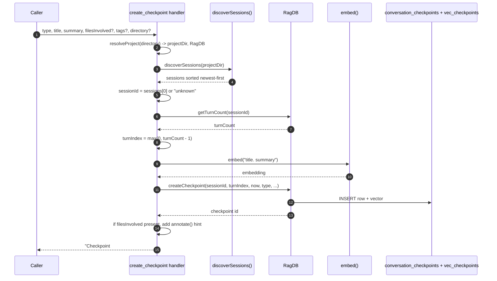

# Tool: create_checkpoint

`create_checkpoint` saves a short, durable record of what happened in a session and why — a decision made, a milestone reached, a blocker hit, a change of direction, or a handoff. The record is stored in the project's local index, tagged to the current session and turn, and embedded so later sessions can find it by meaning. It is the mechanism by which a future session learns what an earlier one did without re-reading the entire transcript.

The recommended pattern is to call it as the final step after completing any user-requested task, before responding — and also when hitting a blocker or changing direction mid-task. That guidance lives in the tool's own description (`src/tools/checkpoint-tools.ts:10`).

The handler is registered in `src/tools/checkpoint-tools.ts:8-78`.

## How it works



1. The caller invokes the tool with a required `type`, `title`, and `summary`, plus optional `filesInvolved`, `tags`, and `directory` (`src/tools/checkpoint-tools.ts:11-33`).
2. `resolveProject` resolves the optional `directory` into both the project path and the `RagDB` handle, falling back to `RAG_PROJECT_DIR` or the current working directory (`src/tools/checkpoint-tools.ts:35`).
3. `discoverSessions` scans `~/.claude/projects/<encoded-project-path>/` for `*.jsonl` transcript files and returns them sorted newest-modified first (`src/conversation/parser.ts:292-323`).
4. The checkpoint is bound to the most recently modified session. If no transcript exists yet, the session id falls back to the literal string `"unknown"` (`src/tools/checkpoint-tools.ts:38-39`).
5. `getTurnCount` counts the indexed turns for that session in `conversation_turns` (`src/tools/checkpoint-tools.ts:42`, `src/db/conversation.ts:117-124`).
6. The turn index is set to `max(0, turnCount - 1)`, i.e. the last indexed turn, clamped so it never goes negative when no turns are indexed yet (`src/tools/checkpoint-tools.ts:43`).
7. The text `` `${title}. ${summary}` `` is embedded so the checkpoint is later findable by semantic search (`src/tools/checkpoint-tools.ts:46-47`).
8. `createCheckpoint` inserts the row and its vector inside one transaction, stamping the current time via `new Date().toISOString()` (`src/tools/checkpoint-tools.ts:49-59`, `src/db/checkpoints.ts:4-48`).
9. If `filesInvolved` was non-empty, a hint is appended reminding the caller to attach any caveats with [annotate](annotate.md) (`src/tools/checkpoint-tools.ts:61-66`).
10. The handler returns a confirmation line `Checkpoint #<id> created: [<type>] <title>`, with the hint joined below it when present (`src/tools/checkpoint-tools.ts:68-76`).

## Allowed checkpoint types

The `type` argument is constrained to one of five values (`src/tools/checkpoint-tools.ts:12-14`). They are free-form labels for the kind of moment being recorded — the code does not branch on them at write time; they exist for later filtering in [list_checkpoints](list-checkpoints.md) and [search_checkpoints](search-checkpoints.md).

| type | typical use |
|------|-------------|
| `decision` | A choice was made between alternatives, e.g. "chose JWT over session cookies". |
| `milestone` | A unit of work was completed. |
| `blocker` | Progress is stuck on something. |
| `direction_change` | The approach shifted mid-task. |
| `handoff` | State is being passed to a future session or person. |

## Inputs

| name | type | required | description |
|------|------|----------|-------------|
| `type` | enum | yes | One of `decision`, `milestone`, `blocker`, `direction_change`, `handoff` (`src/tools/checkpoint-tools.ts:12-14`). |
| `title` | string (1–200) | yes | Short label for the checkpoint (`src/tools/checkpoint-tools.ts:15`). |
| `summary` | string (1–2000) | yes | A 2–3 sentence description of what happened and why. Embedded together with the title for search (`src/tools/checkpoint-tools.ts:16-20`). |
| `filesInvolved` | string[] | no | Files relevant to this checkpoint. Stored on the row and, when non-empty, triggers the annotate hint in the response. Defaults to an empty array (`src/tools/checkpoint-tools.ts:21-24`, `src/tools/checkpoint-tools.ts:55`). |
| `tags` | string[] | no | Free-form tags for later filtering. Defaults to an empty array (`src/tools/checkpoint-tools.ts:25-28`, `src/tools/checkpoint-tools.ts:56`). |
| `directory` | string | no | Project directory to operate on. Defaults to `RAG_PROJECT_DIR` or the current working directory (`src/tools/checkpoint-tools.ts:29-32`). |

## Outputs

| output | where it lands / shape / description |
|--------|--------------------------------------|
| Confirmation text | A single text block: `Checkpoint #<id> created: [<type>] <title>`. When `filesInvolved` was non-empty, a second paragraph appends an annotate reminder (`src/tools/checkpoint-tools.ts:68-76`). |
| `conversation_checkpoints` row | Inserted with `session_id`, `turn_index`, `timestamp`, `type`, `title`, `summary`, and JSON-encoded `files_involved` and `tags` (`src/db/checkpoints.ts:19-34`). |
| Vector entry | A row in `vec_checkpoints` holding the embedding, used by [search_checkpoints](search-checkpoints.md) (`src/db/checkpoints.ts:40-43`). |

## State changes

**`conversation_checkpoints` row**

- Before: no row for this checkpoint.
- After: a new row carrying the session id, the computed turn index, an ISO timestamp, the type, title, summary, files, and tags, plus a matching vector entry.

This matters because the checkpoint is the only durable signal a future session has about what an earlier one decided or got stuck on. The row is what [list_checkpoints](list-checkpoints.md) returns, and the embedded vector is what [search_checkpoints](search-checkpoints.md) ranks against. Both the base row and the vector are written in a single transaction so a checkpoint is never half-persisted (`src/db/checkpoints.ts:18-47`).

Note that `createCheckpoint` always inserts a fresh row — there is no upsert or dedup. Calling it twice with the same title produces two checkpoints.

## Branches and failure cases

- **No transcript yet.** When `discoverSessions` finds no `*.jsonl` files, the session id stored is `"unknown"` rather than failing (`src/tools/checkpoint-tools.ts:38-39`).
- **Turn index clamping.** When the session has zero indexed turns, `turnCount - 1` would be `-1`; the `Math.max(0, ...)` clamp keeps the stored `turnIndex` at `0` (`src/tools/checkpoint-tools.ts:43`).
- **Files-involved hint.** The annotate reminder paragraph is added only when `filesInvolved` is present and non-empty; otherwise the response is the single confirmation line (`src/tools/checkpoint-tools.ts:61-66`).
- **Optional arrays default to empty.** Omitting `filesInvolved` or `tags` stores `[]` for that column, not null (`src/tools/checkpoint-tools.ts:55-56`).
- **Invalid type.** A `type` outside the five-value enum fails schema validation before the handler runs (`src/tools/checkpoint-tools.ts:12-14`).
- **Always writes.** There is no empty-result or query-only branch; every successful call inserts a row and returns a confirmation. Directory or DB errors surface from `resolveProject` / `RagDB`.

## Example

Arguments for a decision checkpoint:

```json
{
  "type": "decision",
  "title": "Chose SQLite vec0 for embeddings",
  "summary": "Picked sqlite-vec over a separate vector DB to keep the index a single file. Tradeoff: no horizontal scaling, but the project is single-user local.",
  "filesInvolved": ["src/example.ts", "src/db/index.ts"],
  "tags": ["storage", "embeddings"]
}
```

Returned text (with the files hint, since `filesInvolved` is non-empty):

```
Checkpoint #12 created: [decision] Chose SQLite vec0 for embeddings

If you noticed any caveats, known issues, or "don't touch" conditions in the files above, call annotate() now to attach them.
```

## Related tools

- [list_checkpoints](list-checkpoints.md) — read checkpoints back, most recent first, optionally filtered by session or type.
- [search_checkpoints](search-checkpoints.md) — find checkpoints by meaning using the embedded title and summary.
- [annotate](annotate.md) — the tool the files hint points you toward for attaching caveats to involved files.

## Key source files

- `src/tools/checkpoint-tools.ts` — registers `create_checkpoint`, binds session and turn, builds the embed text, and formats the response.
- `src/conversation/parser.ts` — `discoverSessions`, which locates the current session's transcript on disk.
- `src/db/conversation.ts` — `getTurnCount`, used to compute the turn index.
- `src/db/checkpoints.ts` — `createCheckpoint`, the transactional insert into `conversation_checkpoints` and `vec_checkpoints`.
- `src/db/index.ts` — the `RagDB` class exposing these methods and defining the checkpoint tables.
