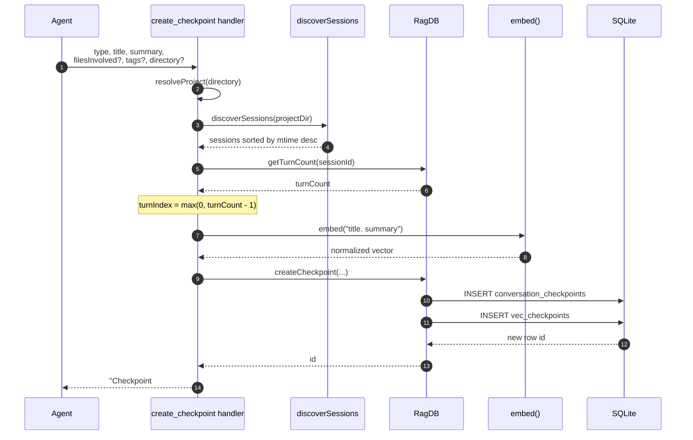

# Tool: create_checkpoint

`create_checkpoint` is the MCP tool an agent calls to leave a durable note for
future sessions: what it decided, what it shipped, what blocked it, or where it
handed off. A Claude session starts with no memory of past sessions, so unless
something is written down, nothing carries over. This tool persists a short,
typed, searchable record into the project's local index so a later session can
recall it with [list_checkpoints](list-checkpoints.md) or
[search_checkpoints](search-checkpoints.md).

The tool is registered alongside its two read-side siblings in
`registerCheckpointTools`, which wires `create_checkpoint`, `list_checkpoints`,
and `search_checkpoints` onto the MCP server in one call
(`src/tools/checkpoint-tools.ts:7-9`). The write handler itself is small: resolve
the project, figure out which session and turn this checkpoint belongs to, embed
the title and summary, insert one row plus its vector, and return a confirmation
string (`src/tools/checkpoint-tools.ts:34-77`).

## When to use it

The tool description tells the agent to call it as the final step after
finishing any user-requested task, and also when hitting a blocker or changing
direction mid-task (`src/tools/checkpoint-tools.ts:10`). The required `type`
names which of those situations the note records:

| `type` | Records |
| --- | --- |
| `decision` | A choice and the reasoning behind it. |
| `milestone` | A unit of completed work. |
| `blocker` | Something that stopped progress. |
| `direction_change` | A pivot away from the previous plan. |
| `handoff` | State left for the next session to pick up. |

The enum is enforced by the argument schema, so any other value is rejected
before the handler runs (`src/tools/checkpoint-tools.ts:12-14`).

## What the flow does



1. The agent calls the tool with a `type`, `title`, and `summary`, optionally a
   list of `filesInvolved`, freeform `tags`, and a project `directory`
   (`src/tools/checkpoint-tools.ts:34`).
2. `resolveProject` turns the optional `directory` into an absolute path,
   falling back to `RAG_PROJECT_DIR` or the current working directory, checks it
   exists, loads the project config, applies its embedding settings, and returns
   the open `RagDB` for that project (`src/tools/checkpoint-tools.ts:35`,
   `src/tools/index.ts:22-37`).
3. The handler discovers the project's conversation transcripts to find which
   session is current. `discoverSessions` globs the Claude Code transcript
   directory for the project and returns the sessions sorted by file
   modification time, most recent first (`src/conversation/parser.ts:302-332`).
4. The most recently modified transcript is taken as the current session; its id
   becomes the checkpoint's `session_id`. If no transcripts exist, the id falls
   back to the literal string `"unknown"` (`src/tools/checkpoint-tools.ts:38-39`).
5. The turn index is read from the database, not the transcript file:
   `getTurnCount` counts the indexed `conversation_turns` rows for that session
   (`src/tools/checkpoint-tools.ts:42`, `src/db/conversation.ts:117-124`).
6. The turn index is set to `max(0, turnCount - 1)`, i.e. the index of the last
   indexed turn, or `0` when the session has no indexed turns yet
   (`src/tools/checkpoint-tools.ts:43`).
7. The title and summary are joined as `"${title}. ${summary}"` and embedded
   into one normalized vector by the local embedding model
   (`src/tools/checkpoint-tools.ts:46-47`, `src/embeddings/embed.ts:94-102`).
8. `RagDB.createCheckpoint` writes the base row and its vector inside a single
   transaction and returns the new id (`src/tools/checkpoint-tools.ts:49-59`,
   `src/db/checkpoints.ts:4-49`).
9. If `filesInvolved` was non-empty, a hint is appended telling the agent to
   call `annotate()` for any caveats it noticed in those files
   (`src/tools/checkpoint-tools.ts:61-66`).
10. The handler returns a single text block: `Checkpoint #<id> created: [<type>]
    <title>`, plus the optional hint (`src/tools/checkpoint-tools.ts:68-76`).

## Resolving the session and turn index

The checkpoint is anchored to a session and a turn so a later reader knows
roughly where in the conversation it was written. Both values are derived inside
the handler, not supplied by the caller.

The session id comes from the file system, not the database. `discoverSessions`
builds the transcript directory path with `getTranscriptsDir`, which encodes the
absolute project path by replacing `/` with `-` and looking under
`~/.claude/projects/<encoded-path>/` (`src/conversation/parser.ts:293-296`). It
globs every `*.jsonl` file there, stats each one, and sorts the results by
`mtime` descending so the freshest transcript is first
(`src/conversation/parser.ts:302-332`). The handler takes `sessions[0]`, which
is the session whose transcript was written to most recently — in practice the
live session (`src/tools/checkpoint-tools.ts:38-39`).

The turn index comes from the database. `getTurnCount` runs `SELECT COUNT(*)`
over `conversation_turns` for that session id (`src/db/conversation.ts:117-124`).
This counts turns that have already been *indexed*, which is different from the
turns that exist in the live transcript. If the current conversation has not been
indexed since the latest turns were written, the count lags and the stored
`turnIndex` points at an earlier turn. The index is only an approximate anchor;
nothing in the create or read path requires it to be exact.

## Embedding the title and summary

The checkpoint is made semantically searchable up front by embedding it at write
time. The handler concatenates the title and summary into a single string and
passes it to `embed`, which loads the configured local feature-extraction model
and returns one mean-pooled, L2-normalized vector
(`src/tools/checkpoint-tools.ts:46-47`, `src/embeddings/embed.ts:94-102`). With
the default model (`Xenova/all-MiniLM-L6-v2`) that vector is 384 dimensions
(`src/embeddings/embed.ts:16-17`); a project configured for a different model
produces a vector of that model's dimension instead. Because the vector is
computed here, [search_checkpoints](search-checkpoints.md) only has to embed the
query at read time and compare it against vectors that already exist.

## Inserting the checkpoint row

`RagDB.createCheckpoint` is a thin wrapper that forwards to the store function in
`src/db/checkpoints.ts` (`src/db/index.ts:870-879`). That function performs both
writes inside one transaction so the row and its vector always land together
(`src/db/checkpoints.ts:4-49`). It first inserts into `conversation_checkpoints`
with the session id, turn index, ISO timestamp, type, title, summary, and the
`filesInvolved` and `tags` arrays serialized to JSON text
(`src/db/checkpoints.ts:21-35`). It then reads `last_insert_rowid()` to capture
the new id (`src/db/checkpoints.ts:37-39`) and inserts the embedding into the
`vec_checkpoints` virtual table keyed by that id, passing the `Float32Array` as a
raw byte buffer (`src/db/checkpoints.ts:41-44`).

The split between the two tables is deliberate. The base table holds the
human-readable columns and the `vec0` virtual table holds the vector, mirroring
how code chunks are stored as `chunks` plus `vec_chunks`. Both tables are created
once in the schema: `conversation_checkpoints` has an `AUTOINCREMENT` primary key
plus indexes on `session_id` and `type`, and `vec_checkpoints` is a `vec0` table
sized to the configured embedding dimension (`src/db/index.ts:323-341`). The
transaction wrapper means a failure midway — for example a dimension mismatch on
the vector insert — rolls back the base-table row too, so you never get a
checkpoint with no vector.

## Inputs

| Name | Type | Required | Description |
| --- | --- | --- | --- |
| `type` | enum: `decision`, `milestone`, `blocker`, `direction_change`, `handoff` | yes | The kind of checkpoint, stored verbatim in the `type` column and echoed in the confirmation (`src/tools/checkpoint-tools.ts:12-14`). |
| `title` | string, 1–200 chars | yes | Short label, e.g. `Chose JWT over session cookies`. Stored and used as the first part of the embedded text (`src/tools/checkpoint-tools.ts:15`). |
| `summary` | string, 1–2000 chars | yes | Two-to-three sentence description of what happened and why. Stored and embedded after the title (`src/tools/checkpoint-tools.ts:16-20`). |
| `filesInvolved` | string[] | no | Files relevant to this checkpoint. Stored as JSON; when non-empty it also triggers the annotate hint (`src/tools/checkpoint-tools.ts:21-24`, `:62-66`). |
| `tags` | string[] | no | Freeform tags for later filtering. Stored as JSON text (`src/tools/checkpoint-tools.ts:25-28`). |
| `directory` | string | no | Project directory; defaults to `RAG_PROJECT_DIR` or the current working directory (`src/tools/checkpoint-tools.ts:29-32`, `src/tools/index.ts:26`). |

The tool does not accept a `sessionId` or `turnIndex` from the caller — both are
derived inside the handler as described above.

## Outputs

| Output | Where it lands / shape / description |
| --- | --- |
| New checkpoint row | One row in `conversation_checkpoints` plus one matching vector in `vec_checkpoints`, written in a single transaction (`src/db/checkpoints.ts:21-44`). |
| Checkpoint id confirmation | A single MCP text block: `Checkpoint #<id> created: [<type>] <title>`, where `<id>` is the new row id (`src/tools/checkpoint-tools.ts:68-76`). |
| Annotate hint (conditional) | When `filesInvolved` is non-empty, an extra paragraph is appended suggesting the agent call `annotate()` for caveats in those files (`src/tools/checkpoint-tools.ts:61-66`). |

## State changes

| Item | Before | After | Why it matters |
| --- | --- | --- | --- |
| Checkpoint record | No row for this note | One new `conversation_checkpoints` row and one `vec_checkpoints` entry sharing the same id | This is the only persistent effect. It is what makes the note visible to `list_checkpoints` and findable by `search_checkpoints` in later sessions. |

The change is performed by `RagDB.createCheckpoint`, which wraps both inserts in
a transaction (`src/tools/checkpoint-tools.ts:49-59`, `src/db/checkpoints.ts:18-47`).
Before the call there is no record of the note anywhere; after a successful call
there is exactly one base row and exactly one vector, and the handler holds the
returned id. Nothing else in the database is touched — no session row, no turn
row, and no annotation are created or updated by this tool.

## Branches and failure cases

- **Project resolution fails.** If the resolved `directory` does not exist on
  disk, `resolveProject` throws `Directory does not exist: <path>` before any
  write happens (`src/tools/index.ts:30-32`). When opening the `RagDB`, an
  embedding-dimension mismatch between the project config and the existing index
  is also caught up front, before any checkpoint write — the guard inspects the
  stored `vec_chunks` table and throws if its dimension differs from the
  configured model (`src/db/index.ts:150-167`).
- **No transcripts found.** When `discoverSessions` finds no `*.jsonl` files —
  the transcript directory does not exist or is empty — it returns an empty
  array, and the handler stores the session id as the literal `"unknown"`
  (`src/tools/checkpoint-tools.ts:38-39`, `src/conversation/parser.ts:325-327`).
  The checkpoint is still written; it just is not tied to a real session id.
- **Session not yet indexed.** If the current session has no indexed turns,
  `getTurnCount` returns `0` and the turn index clamps to `0` via
  `Math.max(0, turnCount - 1)` (`src/tools/checkpoint-tools.ts:42-43`). The
  checkpoint is written normally with `turnIndex = 0`.
- **filesInvolved omitted or empty.** The annotate hint is appended only when
  `filesInvolved` exists and has at least one entry; otherwise the confirmation
  is just the single `Checkpoint #<id> created` line
  (`src/tools/checkpoint-tools.ts:61-66`).
- **Optional arrays defaulted.** When `filesInvolved` or `tags` are not supplied,
  the handler passes empty arrays to the store function, which serializes them as
  `"[]"` (`src/tools/checkpoint-tools.ts:56-57`, `src/db/checkpoints.ts:32-33`).
- **Input validation.** The argument schema enforces the `type` enum, the title
  length (1–200) and the summary length (1–2000); out-of-range or invalid values
  are rejected by the MCP layer before the handler runs
  (`src/tools/checkpoint-tools.ts:12-20`).
- **Vector insert failure.** If inserting into `vec_checkpoints` throws, the
  surrounding transaction rolls back the base-table insert as well, so a partial
  checkpoint is never persisted (`src/db/checkpoints.ts:18-47`).

## Example

Example arguments for a decision checkpoint with two involved files:

```json
{
  "type": "decision",
  "title": "Store checkpoint vectors in a separate vec0 table",
  "summary": "Kept conversation_checkpoints holding the readable columns and put the embedding in vec_checkpoints, mirroring chunks/vec_chunks. Both writes share one transaction so they can't drift.",
  "filesInvolved": ["src/db/checkpoints.ts", "src/tools/checkpoint-tools.ts"],
  "tags": ["schema", "checkpoints"]
}
```

A possible confirmation, with a synthetic id:

```
Checkpoint #42 created: [decision] Store checkpoint vectors in a separate vec0 table

If you noticed any caveats, known issues, or "don't touch" conditions in the files above, call annotate() now to attach them.
```

Because `filesInvolved` here is non-empty, the annotate hint is included; with no
files it would be just the first line.

## Related tools

- [list_checkpoints](list-checkpoints.md) and
  [search_checkpoints](search-checkpoints.md) read back what this tool writes;
  all three are registered together in `registerCheckpointTools`
  (`src/tools/checkpoint-tools.ts:7-159`).
- The [checkpoint CLI command](../cli/checkpoint.md) performs the same insert
  from the terminal instead of over MCP.
- [annotate](annotate.md) is the tool the post-write hint points the agent
  toward when files were involved.

## Key source files

- `src/tools/checkpoint-tools.ts` — registers `create_checkpoint` and its
  handler; the orchestration described on this page.
- `src/db/checkpoints.ts` — the `createCheckpoint` store function and the
  two-table transactional insert.
- `src/db/index.ts` — the `RagDB.createCheckpoint` wrapper and the schema for
  `conversation_checkpoints` and `vec_checkpoints`.
- `src/conversation/parser.ts` — `discoverSessions` and `getTranscriptsDir`,
  which resolve the current session id.
- `src/db/conversation.ts` — `getTurnCount`, which supplies the turn index.
- `src/embeddings/embed.ts` — `embed`, which turns the title and summary into a
  vector.
