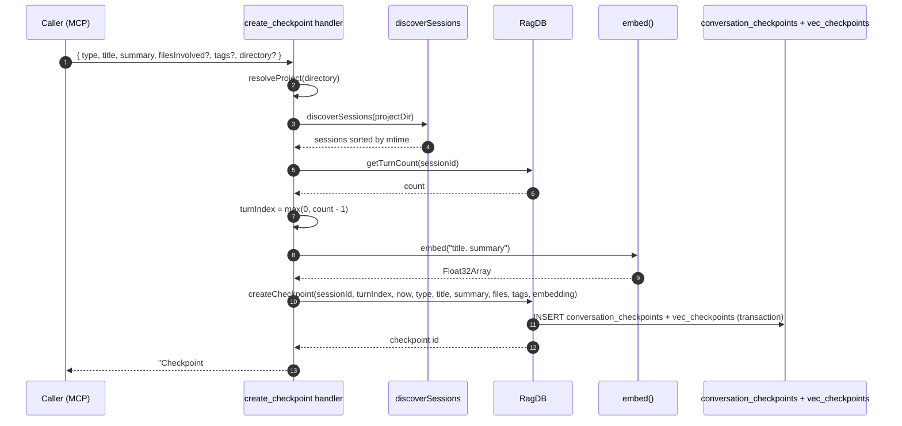

# Tool: create_checkpoint

`create_checkpoint` saves a single durable note about what just happened in a session — a decision, milestone, blocker, change of direction, or handoff. The row is tagged with the current session id and turn index and its `title + summary` is embedded so future sessions can list and semantically search it. The handler is at `src/tools/checkpoint-tools.ts:8-78` and persists through `db.createCheckpoint` in `src/db/checkpoints.ts:4-48`.

The project conventions in `CLAUDE.md` mark this as required: the agent should call it as the final step of any user-requested task, and also when changing direction or hitting a blocker. Without a checkpoint, the next session has no record of what was decided or why.

## Flow



1. The MCP client calls the tool with `type`, `title`, `summary`, and optional `filesInvolved`, `tags`, `directory`. Schema at `src/tools/checkpoint-tools.ts:11-33`.
2. `resolveProject` resolves the project directory and returns the `RagDB` and the absolute `projectDir`.
3. `discoverSessions(projectDir)` scans `~/.claude/projects/<encoded-path>/*.jsonl`, sorts them by mtime descending, and returns them. The newest session is at index 0 (`src/conversation/parser.ts:292-323`).
4. The handler uses `sessions[0].sessionId` if any session exists, otherwise the literal string `"unknown"` (`src/tools/checkpoint-tools.ts:38-39`).
5. `ragDb.getTurnCount(sessionId)` counts rows in `conversation_turns` for that session id (`src/db/conversation.ts`). The handler then sets `turnIndex = max(0, turnCount - 1)` so the checkpoint binds to the most recent indexed turn — never negative (`src/tools/checkpoint-tools.ts:42-43`).
6. The embedding text is `${title}. ${summary}` (`src/tools/checkpoint-tools.ts:46-47`). One embedding covers both fields so search can rank by either.
7. `createCheckpoint` runs a transaction that inserts a `conversation_checkpoints` row (with `files_involved` and `tags` JSON-encoded) and a parallel `vec_checkpoints` row holding the embedding (`src/db/checkpoints.ts:18-44`).
8. The handler returns `Checkpoint #<id> created: [<type>] <title>`. When `filesInvolved` is non-empty it appends a hint nudging the agent to call `annotate` for any caveats noticed in those files (`src/tools/checkpoint-tools.ts:61-66`).

## Inputs

| Input | Required | Notes |
|---|---|---|
| `type` | yes | One of `decision`, `milestone`, `blocker`, `direction_change`, `handoff` (`src/tools/checkpoint-tools.ts:12-14`). |
| `title` | yes | Short label, 1–200 chars. Used in the embedding text. |
| `summary` | yes | 2–3 sentence explanation, 1–2000 chars. Also embedded. |
| `filesInvolved` | no | Array of file paths. JSON-encoded into the row; also triggers the `annotate` hint in the response. |
| `tags` | no | Free-form string array for filtering. JSON-encoded into the row. |
| `directory` | no | Project directory. Defaults to `RAG_PROJECT_DIR` env or cwd. |

## Outputs

| Output | Where | Notes |
|---|---|---|
| `Checkpoint #<id> created: [<type>] <title>` | MCP response | Followed by an optional annotate hint when `filesInvolved` is non-empty. |
| `conversation_checkpoints` row | SQLite | Includes `session_id`, `turn_index`, `timestamp` (ISO), `type`, `title`, `summary`, JSON `files_involved`, JSON `tags`. |
| `vec_checkpoints` row | SQLite | Embedding of `title + summary` so `search_checkpoints` can rank by similarity. |

## Allowed types

The Zod enum at `src/tools/checkpoint-tools.ts:12-14` accepts exactly five values:

- `decision` — a deliberate choice (chose JWT over cookies).
- `milestone` — a meaningful piece of work landed.
- `blocker` — work paused because of an external or unknown dependency.
- `direction_change` — the plan changed mid-task; record the pivot.
- `handoff` — passing context to a future session or another agent.

Any other type value is rejected before the handler runs.

## State changes

`conversation_checkpoints` row — `null` → new row with `(session_id, turn_index, timestamp, type, title, summary, files_involved, tags)`. The companion `vec_checkpoints` row holds the embedding under the same `checkpoint_id`. Both writes share one transaction in `src/db/checkpoints.ts:18-44`, so a failed embedding insert rolls back the row and `search_checkpoints` never sees a half-saved checkpoint.

## Session and turn binding

`discoverSessions` reads JSONL transcripts straight from `~/.claude/projects/<encoded-path>/` and returns them most-recent-first, so the handler tags the checkpoint to the live session even without any explicit session id passed in (`src/conversation/parser.ts:292-323`). If the Claude project directory does not exist yet (a freshly indexed repo with no transcripts), the session list is empty and `sessionId` falls back to `"unknown"` (`src/tools/checkpoint-tools.ts:39`).

The turn index comes from `getTurnCount`, which counts rows in `conversation_turns` for the chosen session id (`src/db/conversation.ts`). If conversation indexing has not run yet, the count is 0 and the handler stores `turnIndex = 0` thanks to the `Math.max(0, ...)` guard. This keeps the row valid but means accurate turn binding depends on the conversation indexer having run on this session.

## Why the title and summary are embedded together

`search_checkpoints` ranks by vector distance against `vec_checkpoints` (`src/db/checkpoints.ts:90-143`). Embedding `${title}. ${summary}` together lets the title give a short keyword anchor while the summary supplies the body of the meaning. A search for "JWT vs session cookies" can match a checkpoint whose title is concise and whose summary explains the trade-off.

## Branches and failure cases

- Wrong `type` value — rejected by the Zod enum before the handler runs.
- Title or summary out of bounds — rejected by Zod min/max.
- No Claude project transcript directory — `discoverSessions` swallows the error and returns `[]`, so the checkpoint is stored under `sessionId = "unknown"`. Later `list_checkpoints` will still show it; only the session filter loses precision.
- Embedding failure — `embed` throws; the DB write never starts and no row is created.
- DB transaction failure — `createCheckpoint` runs both inserts under `db.transaction`, so a failure rolls back the checkpoint row.

## Recommended usage

The tool's own description (`src/tools/checkpoint-tools.ts:10`) and the project memory both treat this as the final step of any task. Call it once the work is done and before responding to the user, with `filesInvolved` set to the touched files. If the response hint nudges you to `annotate`, do it before the next session forgets what you saw.

## Example

```json
{
  "name": "create_checkpoint",
  "arguments": {
    "type": "decision",
    "title": "Chose JWT over session cookies",
    "summary": "Picked JWT for the public API because callers are stateless. Cookies stay for the dashboard. Trade-off: revocation needs a deny-list.",
    "filesInvolved": ["src/auth/jwt.ts", "src/auth/session.ts"],
    "tags": ["auth", "design"]
  }
}
```

Response text:

```
Checkpoint #42 created: [decision] Chose JWT over session cookies

If you noticed any caveats, known issues, or "don't touch" conditions in the files above, call annotate() now to attach them.
```

## Key source files

- `src/tools/checkpoint-tools.ts` — handler at lines 8-78 inside `registerCheckpointTools`.
- `src/conversation/parser.ts` — `discoverSessions` (line 292) for the session id.
- `src/db/conversation.ts` — `getTurnCount` for the turn index.
- `src/db/checkpoints.ts` — `createCheckpoint` for the transactional insert.
- `src/embeddings/embed.ts` — embeds `title + summary` for later search.

## Related flows

- [list_checkpoints](list-checkpoints.md) — read back checkpoints, with optional session and type filters.
- [search_checkpoints](search-checkpoints.md) — vector search over the `title + summary` embedding written here.
- [CLI: checkpoint](../cli/checkpoint.md) — same row format, written from the command line.
