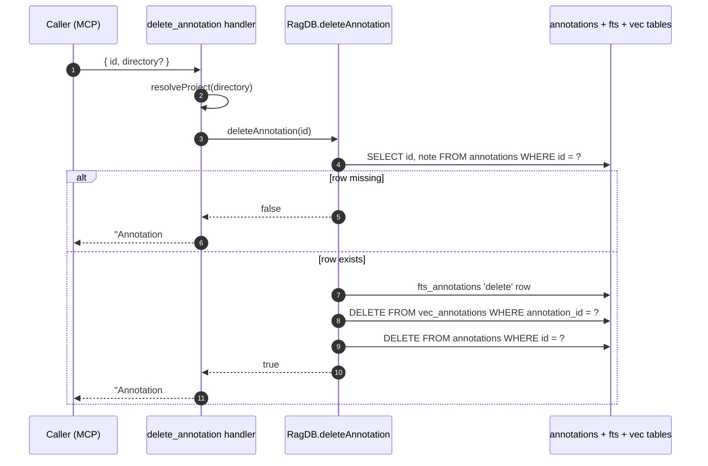

# Tool: delete_annotation

`delete_annotation` removes a single annotation by its numeric id. Use it when the underlying reason for a note is gone — the bug is fixed, the constraint is lifted, or the file or symbol the note pointed at no longer exists. The handler is at `src/tools/annotation-tools.ts:90-114` and calls `db.deleteAnnotation`, defined in `src/db/annotations.ts:175-194`.

The id is the same `#<id>` produced by [`get_annotations`](get-annotations.md), so the normal workflow is: list or search annotations, copy the id, then call this tool.

## Flow



1. Caller invokes the tool with `id` (positive integer) and optional `directory`. Schema at `src/tools/annotation-tools.ts:93-99`.
2. `resolveProject` selects the right `RagDB` for the project.
3. `deleteAnnotation` first reads the existing row so it has the `note` text needed to evict the FTS row (`src/db/annotations.ts:176-180`).
4. If no row matches, the helper returns `false` and the handler responds with `Annotation #<id> not found.` (`src/tools/annotation-tools.ts:104-108`). Nothing else is touched.
5. If the row exists, a transaction removes it from the FTS index, the vector table, and the main `annotations` table in that order (`src/db/annotations.ts:183-193`). The FTS removal uses the `'delete'` command with the original `note` text because FTS5 contentless indexes need the original tokens to undo them.
6. The handler returns `Annotation #<id> deleted.` (`src/tools/annotation-tools.ts:110-112`).

## When to use

- A bug referenced by the note has been fixed — the warning is now misleading.
- A constraint has been lifted (e.g. a workaround is no longer needed).
- The file or symbol the note pointed at was deleted. Stale notes still show up in `get_annotations` and `read_relevant`.
- A note is wrong or obsolete and you want to replace it with a different one on a different symbol — to *edit* a note in place, call `annotate` again with the same `(path, symbol)` instead, which upserts.

## Behavior when id is missing

The SELECT-before-DELETE pattern means a missing id is a fast, harmless no-op: the helper returns `false` and the response is the `not found` message (`src/db/annotations.ts:181`, `src/tools/annotation-tools.ts:104-108`). Nothing is written to any of the three tables, so the database is unchanged.

## Inputs

| Input | Required | Notes |
|---|---|---|
| `id` | yes | Positive integer id. Comes from `get_annotations` output (`#<id>`). Zod requires `int().min(1)` at `src/tools/annotation-tools.ts:94`. |
| `directory` | no | Project directory. Defaults to `RAG_PROJECT_DIR` env or cwd. |

## Outputs

| Output | Notes |
|---|---|
| `Annotation #<id> deleted.` | On a successful delete. |
| `Annotation #<id> not found.` | When the id does not match any row. |

## State changes

`annotations` row — existing row → `null`. The row is removed from `annotations`, the matching FTS5 row is evicted with `INSERT … VALUES ('delete', rowid, note)`, and the vector row is removed from `vec_annotations`. All three writes run inside `db.transaction` so a partial state is not visible to other readers (`src/db/annotations.ts:183-193`). After this point the annotation no longer surfaces as a `[NOTE]` block in `read_relevant`, and `get_annotations` will not return it.

## Branches and failure cases

- Non-integer or zero/negative `id` is rejected by Zod before the handler runs.
- A missing id returns the `not found` message rather than throwing. Callers can retry or list annotations again without special-casing the error.
- Because the helper deletes the FTS row using the stored note text, an externally-corrupted FTS index could fail the transaction. The DB transaction wraps all three writes, so a failure rolls back and the annotation stays intact.

## Example

```json
{
  "name": "delete_annotation",
  "arguments": { "id": 17 }
}
```

On success:

```
Annotation #17 deleted.
```

On miss:

```
Annotation #17 not found.
```

## Key source files

- `src/tools/annotation-tools.ts` — handler at lines 90-114.
- `src/db/annotations.ts` — `deleteAnnotation` at lines 175-194; uses the SELECT-then-DELETE pattern and a transaction across the three tables.
- `src/db/index.ts` — exposes `RagDB.deleteAnnotation` to the handler.

## Related flows

- [annotate](annotate.md) — also the right tool for re-writing a note in place via `(path, symbol)` upsert.
- [get_annotations](get-annotations.md) — produces the `#<id>` values used here.
