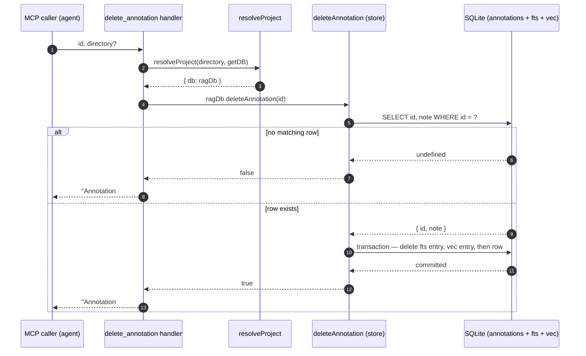

# Tool: delete_annotation

`delete_annotation` retires a single persistent note from the project's annotation store. Annotations are the `[NOTE]` blocks mimirs attaches to a file or symbol — they record bugs, fragile code, non-obvious constraints, or workarounds, and they resurface automatically inside [read_relevant](read-relevant.md) results. Over time some of those notes go stale: the bug gets fixed, the constraint is lifted, or the file the note pointed at is deleted. This tool removes one of them, addressed by its numeric id.

It is the inverse of [annotate](annotate.md), which creates and updates notes, and it depends on [get_annotations](get-annotations.md) to supply the id. There is no "delete by path" or "delete all" mode — deletion is always one row at a time, keyed by the id that `get_annotations` prints as `#<id>` next to each note (`src/tools/annotation-tools.ts:90-114`).

## When you would use it

You read some code, `read_relevant` surfaces a `[NOTE]` warning about a race condition, you fix the race, and now the note is misleading. You call `get_annotations` to find that note's id, then call `delete_annotation` with that id. The note disappears from every future read, every keyword and semantic search over notes, and every inline injection into read results.

## Inputs

| name | type | required | description |
| --- | --- | --- | --- |
| `id` | integer (>= 1) | yes | The annotation's numeric id, taken from `get_annotations` output (shown as `#<id>`). Declared as `z.number().int().min(1)`, so a missing, non-integer, or non-positive id is rejected by the MCP argument layer before the handler body runs (`src/tools/annotation-tools.ts:94`). |
| `directory` | string | no | Project directory to operate on. Defaults to the `RAG_PROJECT_DIR` environment variable, or the current working directory if that is unset (`src/tools/annotation-tools.ts:95-98`). |

## Outputs

| output | where it lands / shape / description |
| --- | --- |
| Confirmation text | The MCP response `content` is a single text block. On success it reads `Annotation #<id> deleted.`; when no row matched, `Annotation #<id> not found.` (`src/tools/annotation-tools.ts:104-112`). |
| Removed annotation row | When the id existed, the matching row in the `annotations` table is gone, along with its full-text and vector-search entries (see [State changes](#state-changes)). |

The tool never throws on a missing id — "not found" is a normal, successful response, not an error. The only thing the caller sees differ between the two cases is the wording of the text block (`src/tools/annotation-tools.ts:103-112`).

## How the flow runs



1. The MCP caller invokes the tool with an `id` and an optional `directory`. The argument schema has already enforced that `id` is an integer of at least 1, so the handler body only runs for structurally valid input (`src/tools/annotation-tools.ts:93-100`).
2. The handler resolves which project to act on. `resolveProject` turns the optional `directory` into an absolute path (falling back to `RAG_PROJECT_DIR` then `process.cwd()`), verifies the directory exists, loads that project's config, applies its embedding settings, and hands back the project's `RagDB` instance (`src/tools/index.ts:21-37`). If the directory does not exist, it throws `Directory does not exist: <path>` and the deletion never starts (`src/tools/index.ts:30-32`).
3. The handler calls `ragDb.deleteAnnotation(id)` and keeps its boolean result (`src/tools/annotation-tools.ts:103`). `RagDB` is a thin facade — this method forwards straight to the annotation store module (`src/db/index.ts:838-840`).
4. The store first runs `SELECT id, note FROM annotations WHERE id = ?` to confirm the row exists and to capture its `note` text (`src/db/annotations.ts:176-180`). The note text is captured because the next step needs it, not just for the existence check.
5. If that lookup returns nothing, the function returns `false` immediately, without opening a transaction or touching any table (`src/db/annotations.ts:181`).
6. If the row exists, one SQLite transaction removes it from all three places it lives: the full-text index, the vector index, and the base table (`src/db/annotations.ts:183-192`). The transaction keeps the three consistent — either all three deletes land or none do.
7. The boolean result flows back up. `true` produces `Annotation #<id> deleted.`; `false` produces `Annotation #<id> not found.` (`src/tools/annotation-tools.ts:104-112`).

## State changes

### Annotation row removed from three tables

An annotation is not stored in a single place. It is one row in the `annotations` base table, mirrored into an FTS5 full-text index (`fts_annotations`) and a `sqlite-vec` vector index (`vec_annotations`) so it can be found by keyword and by meaning (`src/db/index.ts:398-419`). Deleting it has to clear all three, or the search indexes would keep pointing at a row that no longer exists.

Before the call, for an existing id: one row in `annotations`, one matching entry in `fts_annotations`, one vector in `vec_annotations`. After a successful call: none of them remain.

The removal happens inside one transaction, in this order (`src/db/annotations.ts:183-189`):

- The FTS entry is removed with FTS5's external-content delete form: `INSERT INTO fts_annotations(fts_annotations, rowid, note) VALUES ('delete', ?, ?)`. Because `fts_annotations` is declared with `content='annotations'`, it owns no rows of its own to `DELETE`; the special `'delete'` command is how you tell the index to forget a row, and it needs the original `note` text — which is exactly why step 4 selected it (`src/db/annotations.ts:184-187`, `src/db/index.ts:410-414`).
- The vector is removed with `DELETE FROM vec_annotations WHERE annotation_id = ?` (`src/db/annotations.ts:188`).
- Finally the base row is removed with `DELETE FROM annotations WHERE id = ?` (`src/db/annotations.ts:189`).

Why it matters: this is a permanent, irreversible delete. There is no soft-delete flag, no archive, no undo. Once the transaction commits, the note will not appear in `get_annotations`, will not be found by semantic search over annotations, and will never again be injected as a `[NOTE]` block into `read_relevant` output for that file or symbol. Because the work is wrapped in `db.transaction(...)`, a failure partway through rolls all three deletes back, so you cannot end up with a base row whose search-index entries were already dropped (`src/db/annotations.ts:183-192`).

The change is scoped to the single resolved project's database — `.mimirs/index.db` under the project directory, or the directory named by `RAG_DB_DIR` (`src/db/index.ts:101-105`, `src/db/index.ts:134`). Annotations in other projects are untouched.

## Branches and failure cases

| Situation | What happens |
| --- | --- |
| `id` missing, non-integer, or below 1 | Rejected by the argument schema (`z.number().int().min(1)`) before the handler runs; the caller gets a validation error, not a deletion (`src/tools/annotation-tools.ts:94`). |
| `directory` does not exist | `resolveProject` throws `Directory does not exist: <resolved>`; nothing is deleted (`src/tools/index.ts:30-32`). |
| `id` is valid but no row has it | `deleteAnnotation` returns `false` after only the lookup query; the response is `Annotation #<id> not found.` This is treated as a normal success, not an error (`src/db/annotations.ts:181`, `src/tools/annotation-tools.ts:104-107`). |
| `id` exists | The transaction deletes the FTS entry, vector, and row; the response is `Annotation #<id> deleted.` (`src/db/annotations.ts:183-193`, `src/tools/annotation-tools.ts:110-112`). |
| Same id deleted twice | The second call hits the not-found branch — the lookup finds no row — and returns the not-found message. From the caller's point of view the operation is effectively idempotent. |

There is no batch mode, no wildcard, and no "delete by path or symbol" path here. To clear several notes you call the tool once per id. To find those ids, call [get_annotations](get-annotations.md) first.

## Example

Delete annotation 42 in the project at the default directory:

```json
{
  "id": 42
}
```

Delete an annotation in an explicitly named project:

```json
{
  "id": 7,
  "directory": "/Users/example/repos/other-project"
}
```

A successful response (text content):

```
Annotation #42 deleted.
```

When the id no longer exists:

```
Annotation #42 not found.
```

## Key source files

| file | role |
| --- | --- |
| `src/tools/annotation-tools.ts` | Registers the `delete_annotation` MCP tool, resolves the project, calls the store, and formats the deleted / not-found text response (`:90-114`). |
| `src/db/annotations.ts` | `deleteAnnotation` — the lookup-then-transaction logic that removes the row plus its FTS and vector entries (`:175-194`). |
| `src/db/index.ts` | Declares the `annotations`, `fts_annotations`, and `vec_annotations` tables, resolves the per-project database path, and exposes `RagDB.deleteAnnotation` as a thin forwarder to the store (`:398-420`, `:101-134`, `:838-840`). |
| `src/tools/index.ts` | Defines `resolveProject` (directory resolution and validation) and wires `registerAnnotationTools` into the server (`:21-37`, `:50`). |

## Related tools

- [annotate](annotate.md) — creates or updates the notes this tool removes.
- [get_annotations](get-annotations.md) — lists notes with their ids so you know which `id` to delete.
