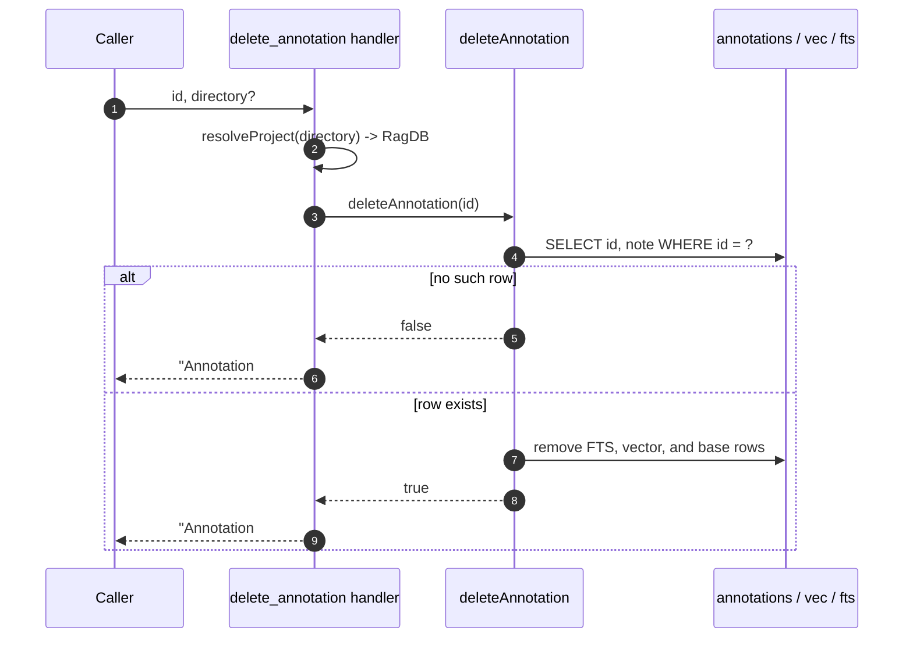

# Tool: delete_annotation

`delete_annotation` removes one persistent note by its numeric id. Notes left by [annotate](annotate.md) stay in the index forever and keep surfacing inline in [read_relevant](read-relevant.md) output, so once the thing a note warned about is gone — a bug got fixed, a constraint was lifted, a file or symbol was deleted — the note becomes noise. This tool retires it.

Because you delete by id, you normally call [get_annotations](get-annotations.md) first to find the id; the inline `[NOTE]` lines in `read_relevant` do not print ids.

The handler is registered in `src/tools/annotation-tools.ts:90-114`.

## How it works



1. The caller invokes the tool with a required `id` and an optional `directory`. The schema requires `id` to be an integer of at least 1 (`src/tools/annotation-tools.ts:93-99`).
2. `resolveProject` resolves the optional `directory` into the project's `RagDB` handle, falling back to `RAG_PROJECT_DIR` or the current working directory (`src/tools/annotation-tools.ts:101`).
3. `deleteAnnotation(id)` is called. It first reads the row's `id` and `note` to confirm the annotation exists (`src/tools/annotation-tools.ts:103`, `src/db/annotations.ts:176-180`).
4. If no row matches, the function returns `false` without touching anything (`src/db/annotations.ts:181`).
5. If the row exists, a transaction removes the full-text index entry for the note, the vector entry, and finally the base `annotations` row (`src/db/annotations.ts:183-192`).
6. The handler maps the boolean to a message: `false` becomes `Annotation #<id> not found.`, `true` becomes `Annotation #<id> deleted.` (`src/tools/annotation-tools.ts:104-112`).

## Inputs

| name | type | required | description |
|------|------|----------|-------------|
| `id` | integer ≥ 1 | yes | The annotation id to delete. This is the `#<id>` shown in [get_annotations](get-annotations.md) output (`src/tools/annotation-tools.ts:94`). |
| `directory` | string | no | Project directory to operate on. Defaults to the `RAG_PROJECT_DIR` env var or the current working directory (`src/tools/annotation-tools.ts:95-98`). |

## Outputs

| output | where it lands / shape / description |
|--------|--------------------------------------|
| Confirmation message | A single text block. On success: `Annotation #<id> deleted.` On a missing id: `Annotation #<id> not found.` (`src/tools/annotation-tools.ts:104-112`). |

## State changes

**`annotations` row for the given id**

- Before: an existing row in `annotations`, with matching entries in `vec_annotations` and `fts_annotations`.
- After: all three are gone — the base row, its vector, and its full-text entry are removed inside one transaction (`src/db/annotations.ts:183-192`).

This matters because the note will no longer surface anywhere. [read_relevant](read-relevant.md) builds its `[NOTE]` lines from live annotation rows, so deleting the row stops the warning from appearing on future reads, and [get_annotations](get-annotations.md) can no longer return it by path or by semantic query. All three storage locations are cleared together so no orphaned vector or full-text entry is left behind (`src/db/annotations.ts:183-192`).

## Branches and failure cases

- **Missing id.** When no row matches the id, `deleteAnnotation` returns `false` before opening the delete transaction, and the handler reports `Annotation #<id> not found.` — nothing is changed (`src/db/annotations.ts:181`, `src/tools/annotation-tools.ts:104-108`).
- **Existing id.** The row and its index entries are removed and the handler reports success (`src/db/annotations.ts:183-193`, `src/tools/annotation-tools.ts:110-112`).
- **Out-of-range id.** An `id` below 1 fails schema validation before the handler runs, since the input requires an integer of at least 1 (`src/tools/annotation-tools.ts:94`).
- **Atomicity.** The full-text, vector, and base deletes run in a single transaction, so a partial delete cannot leave the note half-removed (`src/db/annotations.ts:183-192`).
- **Directory resolution.** An invalid project directory surfaces as an error from `resolveProject` / `RagDB`, not from this handler's own logic.

## Example

Delete a note whose id you got from [get_annotations](get-annotations.md):

```json
{ "id": 7 }
```

Returned text on success:

```
Annotation #7 deleted.
```

If id 7 was already removed or never existed:

```
Annotation #7 not found.
```

## When to use it

Delete a note once the reason for it is gone:

- The bug or race condition it warned about has been fixed.
- The "don't refactor yet" constraint has been lifted.
- The file or symbol it was attached to was deleted, so the note can never match a chunk again.

Find the id with [get_annotations](get-annotations.md) — by path for a single file, or by `query` if you only remember the warning's content — then pass it here.

## Related tools

- [annotate](annotate.md) — creates the notes this tool removes.
- [get_annotations](get-annotations.md) — how you find the id to pass in.
- [read_relevant](read-relevant.md) — where a note stops appearing once deleted.

## Key source files

- `src/tools/annotation-tools.ts` — registers `delete_annotation` and maps the result boolean to a message.
- `src/db/annotations.ts` — `deleteAnnotation`, including the existence check and the transactional removal across the three tables.
- `src/db/index.ts` — the `RagDB` class exposing `deleteAnnotation` and defining the `annotations`, `vec_annotations`, and `fts_annotations` tables.
