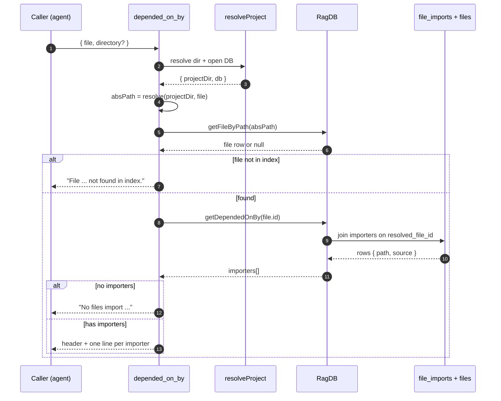

# Tool: depended_on_by

`depended_on_by` answers one question: **if I change this file, which other files will be affected?** It lists every indexed file that imports the file you name — the reverse-dependency set, or "blast radius." Use it before editing a shared module, deleting an export, or renaming a file, so you know who is downstream of the change before you make it.

It is the mirror image of [`depends_on`](depends-on.md), which lists what a file imports. Where `depends_on` walks *outward* (this file's dependencies), `depended_on_by` walks *inward* (this file's dependents). Both read the same import graph that the indexer builds; neither touches disk or re-parses source at call time.

The tool is registered in `src/tools/graph-tools.ts:142-173` and is a thin wrapper over a single SQL query. The interesting behavior is in how the graph it queries gets populated, and in the edges between "no importers" and "file not indexed."

## How the import graph is built

`depended_on_by` only knows about edges that already exist in the database. Those edges are written during indexing, not when the tool runs.

When the indexer processes a file, it stores that file's imports and exports into the `file_imports` and `file_exports` tables via `upsertFileGraph` `src/indexing/indexer.ts:505-510`. At that point each `file_imports` row records the raw import specifier (the string in the `import` statement, e.g. `"../db"`) but its `resolved_file_id` column is still null — the indexer does not yet know which on-disk file that specifier points to.

A later project-wide pass, `resolveImports`, turns specifiers into concrete file ids `src/graph/resolver.ts:23-61`. For each unresolved import it tries bun-chunk's filesystem resolver (which understands `tsconfig` path aliases, plus Python and Rust import styles), and falls back to probing indexed paths with common extensions. Bare/external specifiers like `"zod"` are skipped for JS/TS, so a row only gets a `resolved_file_id` when the target is an indexed file in this project. That resolved column is exactly what `depended_on_by` reads — so the tool reports *resolved, in-project* importers, never external packages.

## What the tool does



1. The caller invokes the tool with a `file` path and an optional `directory`. The arguments are validated by a small Zod schema: `file` is a required string, `directory` an optional string `src/tools/graph-tools.ts:145-151`.
2. `resolveProject` turns the optional `directory` into an absolute project root (falling back to the `RAG_PROJECT_DIR` env var, then the current working directory), verifies it exists, loads the project config, applies the embedding config, and hands back the open `RagDB` for that project `src/tools/index.ts:22-37`.
3. The tool resolves the user-supplied `file` against the project root with `resolve(projectDir, file)`, producing the absolute path the database stores keys by `src/tools/graph-tools.ts:155`.
4. It looks the file up with `getFileByPath(absPath)`. That query normalizes the path to forward slashes before matching `files.path`, so a Windows-style `\` path still matches the stored canonical form `src/db/files.ts:7-13`.
5. If no row matches, the tool returns the message `File "<file>" not found in index.` and stops — see [Branches and failure cases](#branches-and-failure-cases).
6. With a real file id, the tool calls `getDependedOnBy(fileId)`, which runs the reverse-dependency query and returns one `{ path, source }` row per importer `src/db/graph.ts:1013-1023`.
7. If the result is empty, it returns `No files import <file>.` — the file is indexed but nothing in the project imports it (an entry point, or genuinely unused).
8. Otherwise it builds a plain-text block: a header line with the importer count, then one indented line per importer showing that importer's project-relative path and the raw import specifier it used.

## The reverse-dependency query

The actual lookup is a single SQL join `src/db/graph.ts:1013-1023`:

```sql
SELECT f.path, fi.source
FROM file_imports fi
JOIN files f ON f.id = fi.file_id
WHERE fi.resolved_file_id = ?
```

Read it inward-out. The parameter is the target file's id. `file_imports.resolved_file_id = ?` selects every import row that *resolves to* the target. Joining `files` on `fi.file_id` (the importer, not the resolved target) returns the path of the file that *contains* that import statement. So each result row is "this file imports the target, via this specifier."

Two consequences fall out of the join shape:

- The query keys on `resolved_file_id`, which is only set for in-project imports the resolver could match (see above). External-package imports never appear.
- A single importer can produce more than one row if it imports the target with two different specifiers (for example one relative path and one alias that both resolve to the same file). The query does not de-duplicate by file, so the importer would be listed twice with different `source` values.

The exact mirror is `getDependsOn`, which joins on `fi.resolved_file_id` instead and filters `WHERE fi.file_id = ?` `src/db/graph.ts:1001-1011` — same table, opposite direction.

## Inputs

| name | type | required | description |
| --- | --- | --- | --- |
| `file` | string | yes | The file to find importers of, as a path relative to the project root (an absolute path also works, since it is passed through `resolve`). Resolved against `projectDir` and matched against the stored, slash-normalized `files.path`. |
| `directory` | string | no | Project directory whose index to query. Defaults to the `RAG_PROJECT_DIR` environment variable, then the current working directory. Must exist or `resolveProject` throws. |

## Outputs

The tool always returns a single text content block. Its shape depends on the branch taken.

| output | where it lands / shape / description |
| --- | --- |
| Importer list | On success, text: a header `"<file> is imported by N file(s):"` followed by one indented line per importer, each formatted `  <relative path>  (import: <source>)`. `<relative path>` is the importer's path relative to the project root; `<source>` is the literal import specifier from that file `src/tools/graph-tools.ts:166-171`. |
| "not found" message | If the file is not in the index, text: `File "<file>" not found in index.` `src/tools/graph-tools.ts:158`. |
| "no importers" message | If the file is indexed but nothing imports it, text: `No files import <file>.` `src/tools/graph-tools.ts:163`. |

The tool reads the graph only; it does not write to the database, start background work, or change any stored state.

## Branches and failure cases

- **File not in the index.** `getFileByPath` returns null when no `files` row matches the resolved, normalized path. The tool returns `File "<file>" not found in index.` and does no further work `src/tools/graph-tools.ts:157-159`. Common causes: a typo, a path outside the indexed roots, a file the include patterns excluded, or a new file added since the last index run. The fix is to re-run indexing (see [`index_files`](index-files.md)).
- **Indexed but no importers.** The file exists in the index but no resolved import points at it, so the query returns zero rows and the tool returns `No files import <file>.` `src/tools/graph-tools.ts:162-164`. This is the normal result for an entry point (a CLI command file, the server bootstrap) or a genuinely unused module.
- **Importers that resolve to the file.** The success path lists every matching importer. The `import:` annotation shows the raw specifier, which is useful for spotting whether a file is reached by a relative path, an alias, or both.
- **Unresolved imports are invisible.** If a file imports the target but the resolver never linked the specifier to an indexed file id (external package, a not-yet-indexed file, or a resolution miss), there is no row with `resolved_file_id` set, so that importer will not appear. The result reflects the *resolved* graph, not every textual `import` line.
- **Stale index after edits.** The graph is only as current as the last indexing pass. If you add or remove an import and have not re-indexed, the result will not reflect the change. Likewise, removing a file goes through `clearFileGraph`, which nulls the `resolved_file_id` pointers other files held to it before deleting its own rows, so the graph stays consistent `src/db/graph.ts:777-795` (see [`remove_file`](remove-file.md)).
- **Missing or non-existent directory.** If `directory` (or the resolved default) does not exist, `resolveProject` throws `Directory does not exist: <path>` before the tool runs any query `src/tools/index.ts:30-32`.

## File granularity vs. symbol granularity

`depended_on_by` works at file granularity: it tells you *which files* import the target, not *which symbols* inside them are used. If the target file exports ten functions and an importer only uses one, the importer still appears as a single line.

When you need symbol-level precision — every call site of one function or type, with line numbers — use [`find_usages`](find-usages.md) instead. The two are complementary: `depended_on_by` scopes the blast radius to a set of files; `find_usages` pinpoints the exact references within them. For a visual overview of how a file sits in the wider import graph, [`project_map`](project-map.md) renders the neighborhood with fan-in and fan-out counts.

| tool | granularity | answers |
| --- | --- | --- |
| `depended_on_by` | file | which files import this file |
| [`depends_on`](depends-on.md) | file | which files this file imports |
| [`find_usages`](find-usages.md) | symbol | every reference to a named symbol |
| [`project_map`](project-map.md) | file graph | how files connect, with fan-in/fan-out |

## Example

Request arguments:

```json
{ "file": "src/db/graph.ts" }
```

Illustrative response text (paths and specifiers are synthetic):

```
src/db/graph.ts is imported by 2 files:

  src/db/files.ts  (import: ./graph)
  src/db/index.ts  (import: ./graph)
```

The header counts the rows; each line is one importer and the specifier it used to reach the target.

## Key source files

- `src/tools/graph-tools.ts` — registers the `depended_on_by` MCP tool, resolves the project, looks up the file, formats the text output `src/tools/graph-tools.ts:142-173`.
- `src/db/graph.ts` — `getDependedOnBy` runs the reverse-dependency join; `getDependsOn` is its forward mirror; `clearFileGraph` keeps the graph consistent on file removal.
- `src/db/files.ts` — `getFileByPath` resolves a path to a `files` row, normalizing separators first.
- `src/tools/index.ts` — `resolveProject` opens the right project database and applies its config.
- `src/graph/resolver.ts` — `resolveImports` is the pass that fills in `resolved_file_id`, which is the column this tool reads.
