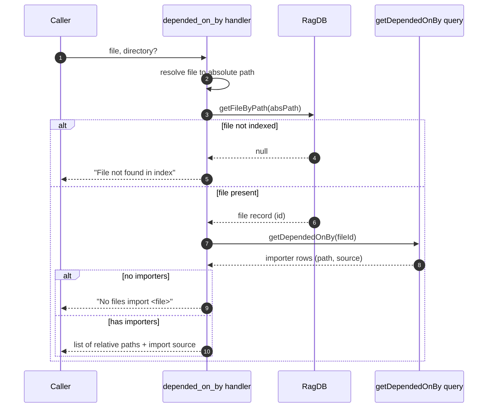

# Tool: depended_on_by

`depended_on_by` lists every file that imports a given file — its reverse dependencies. You give it one file and it returns each indexed file that pulls it in, along with the import source string each importer used. It answers "who depends on this file?" and is the inverse of [depends_on](../tools/depends-on.md).

Its main use is gauging blast radius before a change. Before you rename a module, move it, or alter its public shape, `depended_on_by` shows the full set of files that would need attention. It reads the import edges recorded during indexing rather than re-scanning the tree, so it reflects the resolved graph. The handler is registered in `registerGraphTools` (`src/tools/graph-tools.ts:142-173`); the query lives in `getDependedOnBy` (`src/db/graph.ts:978-987`).

## How it works



1. The caller passes a `file` path (relative to the project) and an optional `directory`. The handler resolves the project and database via `resolveProject` (`src/tools/graph-tools.ts:152-153`).
2. The handler joins the project directory with the supplied `file` to form an absolute path and looks up its index row with `getFileByPath` (`src/tools/graph-tools.ts:155-156`).
3. If no row exists, the file is not in the index and the handler returns `File "<file>" not found in index.` (`src/tools/graph-tools.ts:157-159`).
4. Otherwise it calls `getDependedOnBy` with the file's id. That query reads the `file_imports` table looking for rows whose `resolved_file_id` equals the target file's id, joins each back to the *importing* file's `files` row, and returns the importer's `path` plus the original import `source` string (`src/db/graph.ts:978-987`).
5. If no rows match, the handler returns `No files import <file>.` (`src/tools/graph-tools.ts:162-164`).
6. Otherwise it formats one line per importer: the importer path made relative to the project, followed by the import source string in parentheses (`src/tools/graph-tools.ts:166-171`).

## Inputs

| name | type | required | description |
| --- | --- | --- | --- |
| `file` | string | yes | File path relative to the project root. Joined to the resolved project directory and looked up by absolute path (`src/tools/graph-tools.ts:146`, `src/tools/graph-tools.ts:155-156`). |
| `directory` | string | no | Project directory. Defaults to the `RAG_PROJECT_DIR` environment variable, then the current working directory (`src/tools/graph-tools.ts:147-150`). |

## Outputs

| output | where it lands / shape / description |
| --- | --- |
| Importer list | MCP text content. A header line states how many files import the target, followed by one indented line per importer: the importer path relative to the project and the import source string, formatted as `  <path>  (import: <source>)` (`src/tools/graph-tools.ts:166-169`). |
| File-not-found message | When the target file is not indexed, a single line: `File "<file>" not found in index.` (`src/tools/graph-tools.ts:158`). |
| No-importers message | When nothing imports the file, a single line: `No files import <file>.` (`src/tools/graph-tools.ts:163`). |

The `source` value is the import specifier exactly as written in the importing file (for example `./index` or `../graph/resolver`), preserved from indexing (`src/db/graph.ts:981`). This tool only reads — it changes no state.

## depended_on_by vs find_usages

Both tools help you assess what a change touches, but at different granularity.

| | depended_on_by | find_usages |
| --- | --- | --- |
| Granularity | File level — whole files that import the target | Symbol level — individual references to one named symbol |
| What it reports | Importing file paths and import source strings | Call sites with file path, line number, and the matching source line |
| Best for | "Which files would break if I move or rename this module?" | "Which call sites would break if I change this function's signature?" |
| Backing data | `file_imports` reverse edges (`src/db/graph.ts:978-987`) | `symbol_refs` index with a full-text fallback |
| Source | `src/tools/graph-tools.ts:142-173` | `src/tools/graph-tools.ts:53-107` |

Reach for `depended_on_by` first to scope a file-level change, then [find_usages](../tools/find-usages.md) to pin down the exact lines inside those files.

## depended_on_by vs depends_on

Both query the same `file_imports` table and differ only in direction.

| | depended_on_by | depends_on |
| --- | --- | --- |
| Question | What imports this file? | What does this file import? |
| Direction | Incoming edges | Outgoing edges |
| Query pivot | `WHERE fi.resolved_file_id = ?`, join on `file_id` | `WHERE fi.file_id = ?`, join on `resolved_file_id` |
| Source | `src/db/graph.ts:978-987` | `src/db/graph.ts:966-975` |

## Branches and failure cases

| Condition | Behavior |
| --- | --- |
| File not in index | Returns `File "<file>" not found in index.` before any graph query (`src/tools/graph-tools.ts:157-159`). |
| No files import the target | Returns `No files import <file>.` (`src/tools/graph-tools.ts:162-164`). |
| One or more importers | Lists each, header count pluralized correctly (`src/tools/graph-tools.ts:166`). |
| Unresolved imports | Only edges whose `resolved_file_id` matched this file are counted; an importer whose import never resolved to this file's index row will not appear (`src/db/graph.ts:984`). |
| Stale index | Edges reflect the last index run. Newly added or removed importers show only after [index_files](../tools/index-files.md) re-runs and re-resolves the graph. |

## Example

See who imports a module in the current project:

```json
{ "file": "src/tools/index.ts" }
```

In a specific project:

```json
{
  "file": "src/db/index.ts",
  "directory": "/Users/example/repos/myproject"
}
```

A successful response is shaped like:

```
src/tools/index.ts is imported by 2 files:

  src/tools/graph-tools.ts  (import: ./index)
  src/tools/index-tools.ts  (import: ./index)
```

## Key source files

- `src/tools/graph-tools.ts` — registers `depended_on_by`, resolves the file, and formats the output.
- `src/db/index.ts` — `RagDB.getFileByPath` and `RagDB.getDependedOnBy` delegate to the file and graph stores.
- `src/db/graph.ts` — `getDependedOnBy` runs the reverse `file_imports` join.

## Related tools

- [depends_on](../tools/depends-on.md) is the forward direction — what this file imports.
- [find_usages](../tools/find-usages.md) drills into symbol-level references inside the importing files.
