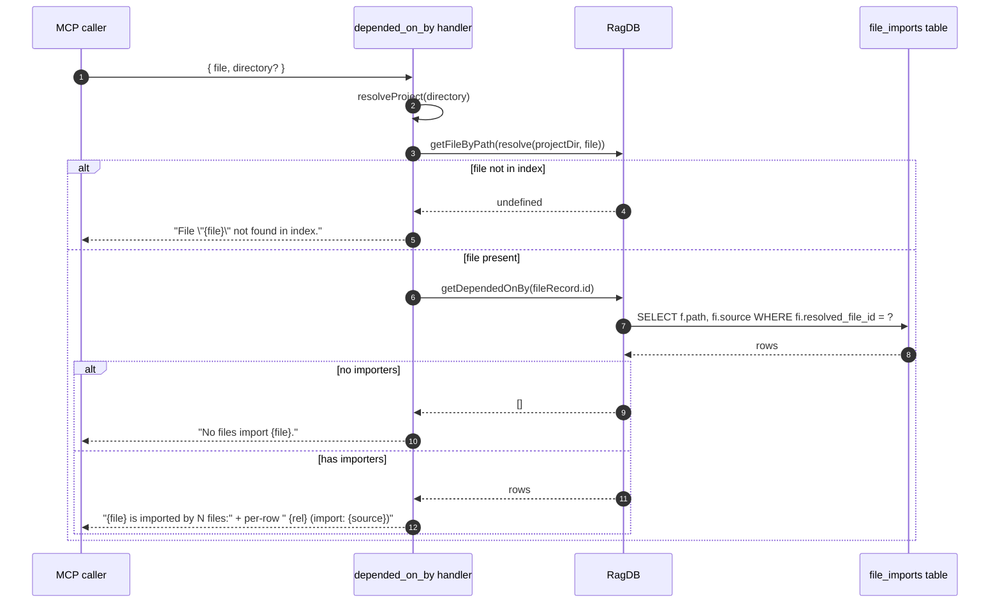

# Tool: depended_on_by

`depended_on_by` lists every indexed file that imports a given file. It is
the reverse edge of `depends_on` — the same `file_imports` table, queried
from the other side. Reach for it when you want the blast radius before
renaming, changing a signature, or deleting a file: every importer is one
hop away from breaking.

It answers a different question from `find_usages`. This tool reports
file-level edges; `find_usages` reports symbol-level call sites. Pair them
when you need both views.

## Flow



1. The caller passes a project-relative `file` and an optional `directory`
   (`src/tools/graph-tools.ts:142-151`).
2. The handler resolves the path against `projectDir` and looks the row up
   in `files` (`src/tools/graph-tools.ts:155-159`).
3. If the row is missing, the response is `File "{file}" not found in index.`
   This is the same error shape as `depends_on`, so callers can handle them
   identically.
4. With a row, `getDependedOnBy(fileId)` runs the reverse query: a join
   against `files` (the importer) where `file_imports.resolved_file_id = ?`
   (`src/db/graph.ts:977-987`).
5. No importers returns `No files import {file}.` — typical for application
   entry points like CLI commands or top-level server files.
6. Non-empty results are formatted one per line as `  {relativePath}  (import:
   {source})`. The `source` is the literal specifier the importer used —
   `./utils/log`, `../db/index`, and so on
   (`src/tools/graph-tools.ts:166-169`).

## Inputs

| Name | Type | Required | Description |
| --- | --- | --- | --- |
| `file` | string | yes | Path relative to the project root. Resolved against `projectDir` before lookup (`src/tools/graph-tools.ts:155`). |
| `directory` | string | no | Project directory. Defaults to `RAG_PROJECT_DIR` or cwd. |

## Outputs

| Output | Shape |
| --- | --- |
| Text response | Header `{file} is imported by N file(s):` then one line per importer: `  {relPath}  (import: {importSource})`. |
| Empty branches | `File "{file}" not found in index.` or `No files import {file}.` |

The underlying query returns `{ path, source }` per row: the importer's
absolute path and the original import specifier. The display uses
`relative(projectDir, importer.path)` for readability
(`src/tools/graph-tools.ts:168`).

## Use case: blast radius before a change

The most common reason to call this tool is to estimate the cost of a
breaking change. Before renaming a function exported from a module, calling
`depended_on_by` on that module is the cheapest "who would I have to update?"
question available. The list is exact in two senses: it only includes files
the resolver could actually pin to this target, and it includes every such
file — re-exports, namespace imports, default imports all show up because
the indexer's resolver pass populates `resolved_file_id` for all three
(`src/graph/resolver.ts:31-61`).

For finer granularity — "which calls to this function?" rather than
"which files import this module?" — switch to `find_usages` with the symbol
name. The two tools complement each other.

## Difference from `find_usages`

`depended_on_by` answers a file-level question: "which files import this
module?" The unit is the file; the edge data comes from `file_imports`.

`find_usages` answers a symbol-level question: "where is this name
referenced?" The unit is the line; the edge data comes from `symbol_refs`.

You typically want both: `depended_on_by` to enumerate the modules that
will be touched by a change, then `find_usages` to find the call sites
inside each one.

## Branches and failure cases

- **File not in index.** Returns the "not found" message and stops.
- **No importers.** Returns `No files import {file}.` This is the expected
  output for top-level files (e.g. `src/server/index.ts`,
  `src/cli/index.ts`) — the project entry points.
- **Unresolved import on the other side.** When the indexer could not
  resolve an import to a file id (e.g. an external package or a path the
  resolver could not pin), that row has `resolved_file_id = NULL` and does
  not appear in the answer. The result is the strict in-project edge set.

## Example

```json
{
  "tool": "depended_on_by",
  "arguments": {
    "file": "src/db/index.ts"
  }
}
```

Illustrative response (paths obviously synthetic):

```
src/db/index.ts is imported by 3 files:

  src/tools/graph-tools.ts  (import: ../db)
  src/tools/index-tools.ts  (import: ../db)
  src/indexing/indexer.ts  (import: ../db)
```

## Key source files

- `src/tools/graph-tools.ts` — MCP handler with lookup and formatting.
- `src/db/graph.ts` — `getDependedOnBy` query against `file_imports`
  joined to `files`.
- `src/graph/resolver.ts` — fills in `resolved_file_id` so the reverse
  lookup has anything to find.

## Related flows

- [Tool: depends_on](./depends-on.md) — outbound direction over the same
  edge table.
- [Tool: find_usages](./find-usages.md) — symbol-level granularity for
  the same "who depends on this?" question.
