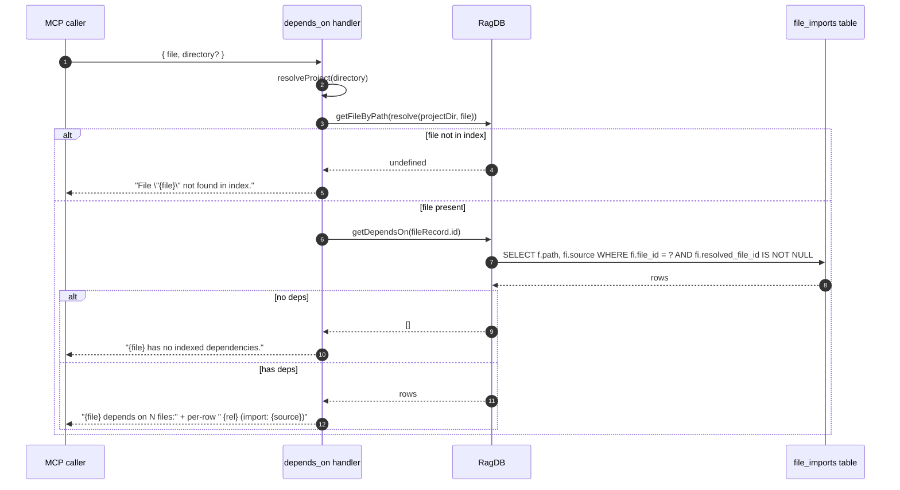

# Tool: depends_on

`depends_on` lists the resolved files that one file imports. It reads the
`file_imports` table directly so the answer reflects what the indexer
resolved, not what a regex over import lines would suggest. Use it when you
want to know what a single file relies on without scanning the file by hand
or building the whole project map.

It is the outbound direction of the import graph. `depended_on_by` is the
inverse — same DB, opposite edge.

## Flow



1. The caller passes a project-relative `file` and an optional `directory`.
   The handler resolves both and opens the DB
   (`src/tools/graph-tools.ts:109-120`).
2. The path is resolved against the project root and looked up via
   `getFileByPath` (`src/tools/graph-tools.ts:122-126`).
3. Missing rows return an explanatory "not found in index" message — useful
   feedback when the path is a typo or the file is excluded by config.
4. With a row, `getDependsOn(fileId)` runs the dependency query: a join
   against `files` where `file_imports.file_id = ?` and `resolved_file_id IS
   NOT NULL` (`src/db/graph.ts:965-975`).
5. Empty results return a "no indexed dependencies" message — common for
   leaf files like type-only modules.
6. Non-empty results are formatted one per line as `  {relativePath}  (import:
   {source})`. The `source` field is the literal import specifier from the
   source code (e.g. `./utils/log`), preserved on the `file_imports` row.

## Inputs

| Name | Type | Required | Description |
| --- | --- | --- | --- |
| `file` | string | yes | Path relative to the project root. The handler `resolve`s it against `projectDir` before looking up the row (`src/tools/graph-tools.ts:122`). |
| `directory` | string | no | Project directory. Defaults to `RAG_PROJECT_DIR` or cwd. |

## Outputs

| Output | Shape |
| --- | --- |
| Text response | Header `{file} depends on N file(s):` then one line per dependency: `  {relPath}  (import: {importSource})`. |
| Empty / missing branches | Single-line message: `File "{file}" not found in index.` or `{file} has no indexed dependencies.` |

Each row in the underlying query carries `{ path, source }` — the resolved
target file's path and the original import specifier. The relative path is
computed against `projectDir` for display (`src/tools/graph-tools.ts:135`).

## Edge data: the import source string

The `source` column on `file_imports` is the literal specifier from the
source file — `./utils/log`, `path`, `../db/index`, etc. — copied in as the
indexer parsed it. The resolver attaches a `resolved_file_id` when the
specifier maps to another indexed file (`src/graph/resolver.ts:23-61`).
`depends_on` only returns rows where this id is non-null, so external
packages like `path`, `zod`, or any unresolved relative import are filtered
out. The result is the strict in-project edge set.

This is also why `depends_on` and `depended_on_by` form clean inverses: both
filter on the same `resolved_file_id IS NOT NULL` predicate, just on
opposite sides of the join (`src/db/graph.ts:965-987`).

## Branches and failure cases

- **File not in index.** Returns `File "{file}" not found in index.` and
  exits. The path is resolved against `projectDir` first, so absolute paths
  work too as long as they match a stored row (`src/tools/graph-tools.ts:122-126`).
- **No resolved dependencies.** Returns `{file} has no indexed dependencies.`
  This is the expected output for type-only files, config files with only
  external imports, or files whose imports the resolver could not pin to an
  indexed file.
- **External imports only.** Treated the same as "no indexed dependencies"
  — the resolver only emits edges for in-project files.

## Example

```json
{
  "tool": "depends_on",
  "arguments": {
    "file": "src/tools/graph-tools.ts"
  }
}
```

Illustrative response:

```
src/tools/graph-tools.ts depends on 2 files:

  src/graph/resolver.ts  (import: ../graph/resolver)
  src/tools/index.ts  (import: ./index)
```

## Key source files

- `src/tools/graph-tools.ts` — MCP handler, lookup and formatting.
- `src/db/graph.ts` — `getDependsOn` query joining `file_imports` to
  `files`.
- `src/graph/resolver.ts` — populates `resolved_file_id` on
  `file_imports`; this tool only sees rows where the resolver succeeded.

## Related flows

- [Tool: depended_on_by](./depended-on-by.md) — the inverse direction over
  the same edge table.
- [Tool: project_map](./project-map.md) — wider view; uses the same edges
  to render a neighborhood or full graph.
