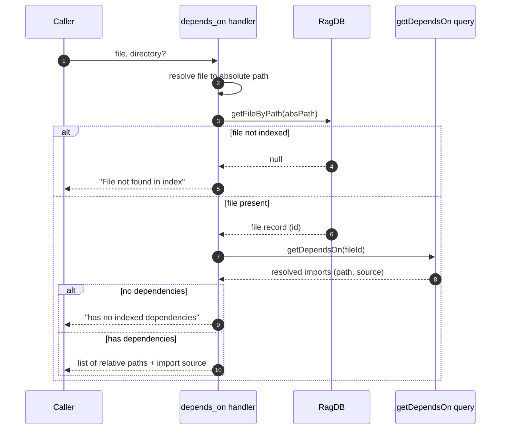

# Tool: depends_on

`depends_on` lists the files a given file imports — its outgoing, resolved dependencies. You give it one file, and it returns every other indexed file that file pulls in, along with the raw import source string from the code. It answers "what does this file rely on?" and is the inverse of [depended_on_by](../tools/depended-on-by.md), which answers "what relies on this file?".

It reads from the import edges recorded during indexing rather than re-parsing the file, so it reflects the *resolved* graph: only imports that point at another file already in the index appear. The handler is registered in `registerGraphTools` (`src/tools/graph-tools.ts:109-140`); the query lives in `getDependsOn` (`src/db/graph.ts:966-975`).

## How it works



1. The caller passes a `file` path (relative to the project) and an optional `directory`. The handler resolves the project and database via `resolveProject` (`src/tools/graph-tools.ts:119-120`).
2. The handler joins the project directory with the supplied `file` to form an absolute path and looks up the file's index row with `getFileByPath` (`src/tools/graph-tools.ts:122-123`).
3. If no row exists, the file is not in the index and the handler returns `File "<file>" not found in index.` (`src/tools/graph-tools.ts:124-126`).
4. Otherwise it calls `getDependsOn` with the file's id. That query reads the `file_imports` table, joining each import to the `files` row it resolves to, and returns the imported file's `path` plus the original `source` string. It only includes rows whose `resolved_file_id IS NOT NULL` — that is, imports that were successfully matched to another indexed file (`src/db/graph.ts:966-975`).
5. If the file imports nothing resolvable, the handler returns `<file> has no indexed dependencies.` (`src/tools/graph-tools.ts:129-131`).
6. Otherwise it formats one line per dependency: the dependency path made relative to the project, followed by the import source string in parentheses (`src/tools/graph-tools.ts:133-138`).

## Inputs

| name | type | required | description |
| --- | --- | --- | --- |
| `file` | string | yes | File path relative to the project root. It is joined to the resolved project directory and looked up by absolute path (`src/tools/graph-tools.ts:113`, `src/tools/graph-tools.ts:122-123`). |
| `directory` | string | no | Project directory. Defaults to the `RAG_PROJECT_DIR` environment variable, then the current working directory (`src/tools/graph-tools.ts:114-117`). |

## Outputs

| output | where it lands / shape / description |
| --- | --- |
| Dependency list | MCP text content. A header line states how many files the target depends on, followed by one indented line per dependency: the dependency path relative to the project and the import source string, formatted as `  <path>  (import: <source>)` (`src/tools/graph-tools.ts:133-136`). |
| File-not-found message | When the target file is not indexed, a single line: `File "<file>" not found in index.` (`src/tools/graph-tools.ts:125`). |
| No-dependencies message | When the file resolves no imports, a single line: `<file> has no indexed dependencies.` (`src/tools/graph-tools.ts:130`). |

The `source` value is the import specifier exactly as written in the code (for example `../db/index` or `zod`), preserved from indexing. This tool only reads — it changes no state.

## Edge data: the import source string

Each returned edge carries two fields from the `file_imports` table: the resolved target file (joined via `resolved_file_id` to `files.path`) and the `source` string. The `source` is the literal module specifier the importing file used. It is useful because the resolved path tells you *which* file is depended on, while the source tells you *how* the import was written — handy for spotting relative-vs-aliased imports or confirming that two edges with different specifiers resolve to the same file (`src/db/graph.ts:969-972`).

## depends_on vs depended_on_by

Both tools query the same `file_imports` table; they differ only in which side of the edge they pivot on.

| | depends_on | depended_on_by |
| --- | --- | --- |
| Question answered | What does this file import? | What imports this file? |
| Direction | Outgoing edges | Incoming edges |
| Query pivot | `WHERE fi.file_id = ?`, join on `resolved_file_id` | `WHERE fi.resolved_file_id = ?`, join on `file_id` |
| Source location | `src/db/graph.ts:966-975` | `src/db/graph.ts:978-987` |
| Use it to | Understand a file's own requirements | Gauge the blast radius before changing a file |

## Branches and failure cases

| Condition | Behavior |
| --- | --- |
| File not in index | Returns `File "<file>" not found in index.` before any graph query (`src/tools/graph-tools.ts:124-126`). |
| File has no resolved imports | Returns `<file> has no indexed dependencies.` — this also happens when every import points at an external package or an unindexed file, since unresolved edges are excluded (`src/tools/graph-tools.ts:129-131`, `src/db/graph.ts:972`). |
| File has resolved imports | Lists each, count in the header pluralized correctly (`src/tools/graph-tools.ts:133`). |
| Unresolved imports | Never appear: the query requires `resolved_file_id IS NOT NULL`, so imports of third-party modules or files outside the index are silently omitted (`src/db/graph.ts:972`). |
| Stale index | Edges reflect the last index run. Imports added or removed since then show only after [index_files](../tools/index-files.md) re-runs and re-resolves the graph. |

## Example

List what a file depends on in the current project:

```json
{ "file": "src/tools/graph-tools.ts" }
```

In a specific project:

```json
{
  "file": "src/server/index.ts",
  "directory": "/Users/example/repos/myproject"
}
```

A successful response is shaped like:

```
src/tools/graph-tools.ts depends on 2 files:

  src/graph/resolver.ts  (import: ../graph/resolver)
  src/tools/index.ts  (import: ./index)
```

## Key source files

- `src/tools/graph-tools.ts` — registers `depends_on`, resolves the file, and formats the output.
- `src/db/index.ts` — `RagDB.getFileByPath` and `RagDB.getDependsOn` delegate to the file and graph stores.
- `src/db/graph.ts` — `getDependsOn` runs the `file_imports` join that produces the resolved outgoing edges.

## Related tools

- [depended_on_by](../tools/depended-on-by.md) is the reverse direction — who imports this file.
- `project_map` visualizes these edges across many files at once instead of for a single file.
