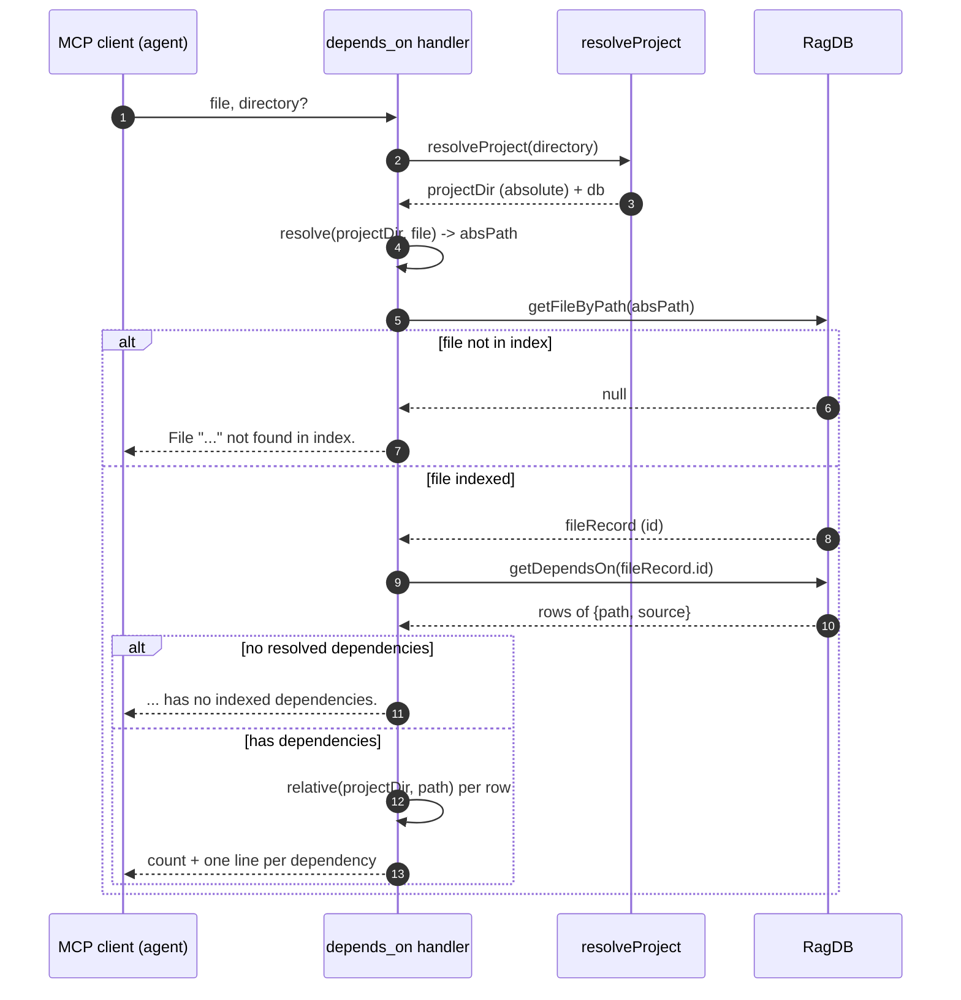

# Tool: depends_on

`depends_on` answers one question about a single file: **what does this file import?** Give it a path and it returns the other indexed files that path pulls in, each tagged with the exact import specifier that created the edge. It reads from the resolved import graph that indexing already built, so it never re-parses source — at call time it does a path lookup and a single SQL join.

This is the forward direction of the dependency graph. For the reverse direction (who imports *this* file) use [dependents](dependents.md). For a whole-neighborhood view instead of a single file's outgoing edges, use [project_map](project-map.md).

Reach for it when you want a fast, exact answer to "if I'm in this file, what am I coupled to?" — for example before deleting a module, when understanding why a file is heavy to load, or to trace a transitive chain one hop at a time.

## How it works

The tool is registered inside `registerGraphTools`, alongside `project_map`, `usages`, `dependents`, `impact`, and `trace`, against the shared MCP server `src/tools/graph-tools.ts:146`. The handler is small because the heavy work — parsing imports and resolving each specifier to a concrete file — already happened during indexing. At request time the handler does only a project lookup, a path lookup, and one query.

The flow is:

1. Resolve which project directory and database to talk to.
2. Turn the caller's `file` into an absolute path and look up its row in the `files` table.
3. If the file isn't indexed, return a plain not-found message and stop.
4. Otherwise read the resolved outgoing import edges for that file id.
5. If there are none, say so; otherwise format one line per dependency.



1. The MCP client invokes the tool with a `file` path and an optional `directory` `src/tools/graph-tools.ts:150`.
2. `resolveProject` picks the working directory (the `directory` argument, else the `RAG_PROJECT_DIR` env var, else the current process directory), resolves it to an absolute path, verifies it exists on disk, loads config, and hands back the absolute project directory plus the `RagDB` handle `src/tools/index.ts:22`.
3. The handler joins the caller's `file` onto the absolute project directory with `resolve(projectDir, file)`, so a relative input like `src/db/graph.ts` becomes a full absolute path `src/tools/graph-tools.ts:159`.
4. `getFileByPath` looks up that absolute path in the `files` table. The lookup runs the path through `normalizePath` first, which rewrites every backslash to a forward slash, so a Windows-style input still matches the stored POSIX-style path `src/db/files.ts:13`.
5. If no row matches, the tool returns `File "<file>" not found in index.` and stops — see the failure cases below `src/tools/graph-tools.ts:161`.
6. With a matching row, the handler calls `getDependsOn(fileRecord.id)` to fetch the resolved outgoing edges `src/tools/graph-tools.ts:165`.
7. If the file imports nothing that resolved to another indexed file, the tool returns `<file> has no indexed dependencies.` `src/tools/graph-tools.ts:166`.
8. Otherwise it builds a header with the dependency count, then one indented line per dependency, converting each stored absolute path back to a project-relative path with `relative(projectDir, dep.path)` and appending the original import specifier `src/tools/graph-tools.ts:170`.

## What "resolved dependencies" means

The list this tool returns is deliberately narrow: it is the set of imports that indexing was able to *resolve* to another file that is itself in the index. The query that produces it is `getDependsOn`, which joins `file_imports` to `files` and keeps only rows whose `resolved_file_id IS NOT NULL` `src/db/graph.ts:1161`:

```sql
SELECT f.path, fi.source
FROM file_imports fi
JOIN files f ON f.id = fi.resolved_file_id
WHERE fi.file_id = ? AND fi.resolved_file_id IS NOT NULL
```

Each row carries two columns: `f.path` is the dependency's stored absolute path, and `fi.source` is the literal import specifier as it appeared in the source (for example `../graph/resolver` or `./index`). The tool surfaces both — the relative path tells you *what file*, and the import source tells you *which statement* created the edge.

Two kinds of imports are intentionally absent from the result:

- **External / bare specifiers** such as `zod` or `@modelcontextprotocol/sdk/...`. The resolver skips bare specifiers (those not starting with `.` or `/`) for most languages, so they never receive a `resolved_file_id` and the `IS NOT NULL` filter drops them. Rust and Python relative imports are an exception and are still attempted, since their syntax does not always start with `./` `src/graph/resolver.ts:36`.
- **Imports of files that aren't indexed.** Even a relative import only resolves if the target file actually exists in the `files` table; the fallback pass probes candidate paths against the set of indexed paths, and a miss leaves `resolved_file_id` as `NULL` `src/graph/resolver.ts:48`.

So `depends_on` reports the *internal* dependency edges of the project, not the package manifest. A file that imports only third-party packages comes back as having no indexed dependencies even though it clearly imports things.

### Where the edges come from

The data this tool reads is written earlier, during indexing, not at query time. When a file is parsed, its raw import statements are stored in `file_imports` with `resolved_file_id` left unset — see the insert in `upsertFileGraph`, which deletes the file's old import rows and re-inserts `source`, `names`, and the default/namespace flags, but never a resolved id `src/db/graph.ts:905`. A later project-wide pass, `resolveImports`, walks every unresolved import, tries to map its specifier to an indexed file — first via the filesystem resolver that understands tsconfig paths plus Python and Rust conventions, then via a fallback that probes extensions and `index` files against indexed paths — and fills in `resolved_file_id` only when it finds a match `src/graph/resolver.ts:24`. The `file_imports` table itself stores `source`, the parsed `names`, the `is_default` / `is_namespace` flags, and the eventual `resolved_file_id` `src/db/index.ts:225`.

`depends_on` is therefore only as complete as the last resolution pass: a freshly added dependency that hasn't been re-indexed and re-resolved won't appear yet. The `RagDB.getDependsOn` method is a thin pass-through to the `graph.ts` query function, which is why the handler can stay so small `src/db/index.ts:812`.

## Inputs

| name | type | required | description |
| --- | --- | --- | --- |
| `file` | string | yes | Path to the file to query. Resolved against the project root, so a project-relative path like `src/db/graph.ts` is the normal form, but an absolute path also works. |
| `directory` | string | no | Project directory to query. Defaults to the `RAG_PROJECT_DIR` environment variable, then the current working directory. The directory must exist or `resolveProject` throws. |

## Outputs

| output | where it lands / shape / description |
| --- | --- |
| Dependency listing | Returned as a single MCP text block. First line: `<file> depends on <N> file(s):`, followed by a blank line. Then one indented line per dependency in the form `  <relative-path>  (import: <source>)`, where `<source>` is the original import specifier. |
| Not-found message | `File "<file>" not found in index.` when the resolved path has no row in the `files` table. |
| Empty message | `<file> has no indexed dependencies.` when the file resolved no internal imports. |

## Branches and failure cases

The handler has exactly three terminal outcomes, decided by two checks:

| Condition | What the tool returns | Source |
| --- | --- | --- |
| The resolved path has no row in `files` | `File "<file>" not found in index.` | `src/tools/graph-tools.ts:161` |
| The file is indexed but `getDependsOn` returns zero rows | `<file> has no indexed dependencies.` | `src/tools/graph-tools.ts:166` |
| The file is indexed and has at least one resolved import | Count header plus one line per dependency | `src/tools/graph-tools.ts:170` |

Additional notes on edges and errors:

- **File-not-in-index handling.** This is the most common surprise. A path that is real on disk but was never indexed — or excluded by config — returns the not-found message rather than an error. The lookup key is the absolute, separator-normalized path, so an input that points outside the project, or a typo, lands here too `src/tools/graph-tools.ts:159`.
- **Empty vs. external-only.** "No indexed dependencies" does not mean the file imports nothing. It means none of its imports resolved to another indexed file. A file whose imports are all third-party packages, or all point at files that aren't in the index, hits this branch.
- **Pluralization.** The header says `1 file` versus `N files` based on the count, a cosmetic branch only `src/tools/graph-tools.ts:170`.
- **Directory resolution can throw.** If `directory` is supplied but doesn't exist on disk, `resolveProject` raises `Directory does not exist: <path>` before any lookup runs `src/tools/index.ts:30`.

## Example

Request arguments:

```json
{
  "file": "src/tools/graph-tools.ts"
}
```

Illustrative response shape (paths and counts are synthetic):

```
src/tools/graph-tools.ts depends on 2 files:

  src/graph/resolver.ts  (import: ../graph/resolver)
  src/tools/index.ts  (import: ./index)
```

Each line pairs the dependency's project-relative path with the import specifier that produced it, so you can see both *what* is depended on and *how* it is imported.

## Key source files

- `src/tools/graph-tools.ts` — registers the `depends_on` MCP tool and holds its handler: the path lookup, the three return branches, and line formatting.
- `src/db/graph.ts` — `getDependsOn` runs the SQL join over `file_imports` that filters to resolved internal edges; `upsertFileGraph` stores the raw import rows during indexing.
- `src/db/index.ts` — the `RagDB.getDependsOn` pass-through method and the `file_imports` table schema.
- `src/db/files.ts` — `getFileByPath`, the normalized-path lookup that decides whether a file is "in the index".
- `src/graph/resolver.ts` — `resolveImports`, the pass that fills `resolved_file_id` so that an import becomes a reported dependency.
