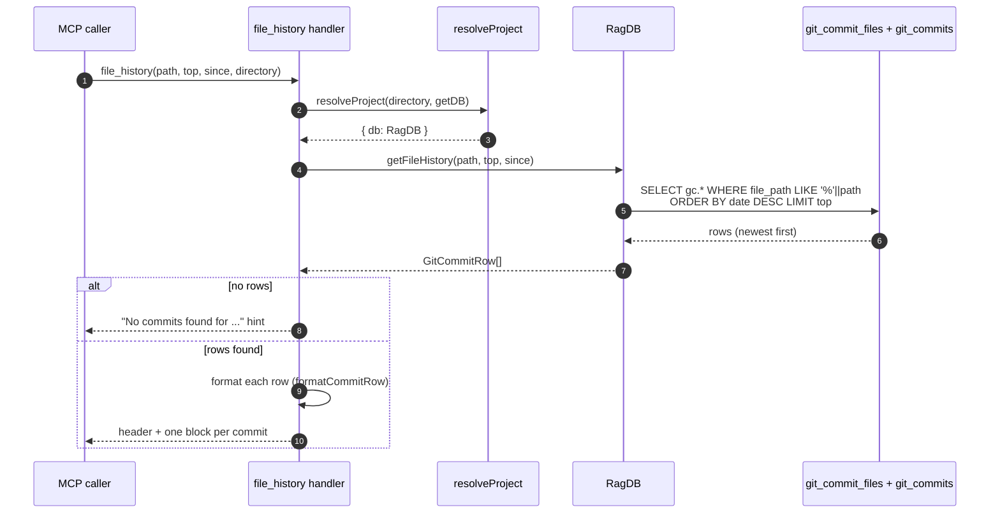

# Tool: file_history

`file_history` answers one question: which commits touched this file, and when. It reads the project's already-indexed git history and returns the matching commits newest-first, so an agent can understand how a file evolved without shelling out to `git log` or walking the repository. Because the data is served from the local SQLite index, it works even when the agent has no git access to the working tree, and it is faster than `git log` on large repositories.

This tool only reads. It never spawns `git`, never touches the working tree, and never modifies the index. The commit rows it returns must have been written earlier by the history indexer (run via `index_files()` or `mimirs history index`). If that has never run for the project, the tool simply returns nothing useful and points the caller at indexing.

The tool is registered alongside `search_commits` in `registerGitHistoryTools` `src/tools/git-history-tools.ts:34`. Where `search_commits` ranks commits by semantic relevance to a query, `file_history` is a plain chronological lookup scoped to one file path.

## When to use it

Use `file_history` when you already know the file and want its change timeline: who last touched it, when it was introduced, how active it has been, or the commit messages around a regression. If instead you want to find *why* something changed across the repo, or you only have a topic rather than a path, reach for [search_commits](search-commits.md), which embeds your query and searches all commit messages and diff summaries.

## The flow



1. The caller invokes the tool with a file `path` and optional `top`, `since`, and `directory` arguments. The argument shape is validated by the Zod schema declared on the tool; `path` is the only required field `src/tools/git-history-tools.ts:115`.
2. The handler resolves which project to read. `resolveProject` turns the optional `directory` (falling back to `RAG_PROJECT_DIR`, then the current working directory) into an absolute path, verifies it exists, loads that project's config, applies the embedding config, and hands back the `RagDB` for that directory `src/tools/index.ts:22`.
3. The handler calls `ragDb.getFileHistory(path, top, since)` `src/tools/git-history-tools.ts:126`. This `RagDB` method is a thin wrapper that forwards to the standalone query function with the same arguments `src/db/index.ts:859`.
4. The query joins `git_commit_files` to `git_commits` and matches the file with a `LIKE '%' || path` suffix pattern, optionally adds a `date >= since` clause, orders by commit date descending, and limits to `top` rows `src/db/git-history.ts:273`.
5. SQLite returns the raw rows, already sorted newest-first by the `ORDER BY gc.date DESC` clause.
6. Each raw row is turned into a `GitCommitRow` by `parseRow`, which decodes the JSON `files_changed` and `refs` columns and coerces the merge flag to a boolean `src/db/git-history.ts:89`.
7. If the result list is empty, the handler returns a single text line telling the caller no commits matched and asking whether git history is indexed `src/tools/git-history-tools.ts:128`.
8. Otherwise the handler builds a Markdown header with the path and commit count, then maps each row through `formatCommitRow` and joins the blocks `src/tools/git-history-tools.ts:137`.
9. The assembled text is returned as a single MCP text content item — there is no structured payload, just formatted Markdown.

## Suffix path matching

The match is deliberately loose. The SQL binds the path as `` `%${filePath}` `` and compares with `LIKE`, so the stored `file_path` only has to *end with* the value you pass `src/db/git-history.ts:277`. The indexer stores project-relative paths (for example `src/db/git-history.ts`), so passing the full relative path matches exactly, while passing just `git-history.ts` matches every indexed file whose path ends in that string. A bare basename is convenient but can pull in unrelated files in different directories that share a name (for example `index.ts`), so prefer the most specific suffix you can give.

Note there is no leading `%`, so the pattern is anchored at the end of the stored path, not a substring match in the middle. A value like `db/git-history.ts` matches `src/db/git-history.ts`; a value like `db/git` does not, because the stored path does not end there.

This is a different matching style from the sibling `search_commits` tool. There, the `path` filter does a plain substring `includes` check against each commit's changed files `src/db/git-history.ts:149`, so `db/git` *would* match in that tool. Only `file_history` uses the end-anchored `LIKE` form.

## Newest-first ordering and the limit

Results come back in reverse chronological order because the query ends with `ORDER BY gc.date DESC` `src/db/git-history.ts:284`. The `date` column is the commit's ISO timestamp stored as text, and string comparison of ISO dates sorts correctly, so the newest commit is always first. The `LIMIT ?` clause caps the row count at `top`, which defaults to 20 when the caller omits it `src/tools/git-history-tools.ts:116`. Because the limit is applied after sorting, you always get the *most recent* `top` commits, not an arbitrary slice.

## The optional `since` filter

When `since` is supplied, the query appends `AND gc.date >= ?` before the ordering and pushes the value into the parameter list `src/db/git-history.ts:279`. This is a direct string comparison against the stored ISO date, so a value like `2025-01-01` keeps only commits on or after that date. The comparison is inclusive of the boundary date. When `since` is omitted the clause is not added at all, so the full history for the file is eligible (still capped by `top`).

## Inputs

| name | type | required | description |
| --- | --- | --- | --- |
| `path` | string | yes | File path to look up, matched as a suffix against indexed commit file paths. Most specific is safest; a bare filename may match files of the same name in other directories `src/tools/git-history-tools.ts:115`. |
| `top` | integer ≥ 1 | no (default 20) | Maximum number of commits to return. Applied as the `LIMIT` after newest-first sorting `src/tools/git-history-tools.ts:116`. |
| `since` | string | no | ISO date (e.g. `2025-01-01`). Keeps only commits with `date >= since`. Omit for the file's full history `src/tools/git-history-tools.ts:118`. |
| `directory` | string | no | Project directory to read. Falls back to `RAG_PROJECT_DIR`, then the current working directory `src/tools/git-history-tools.ts:120`. |

## Outputs

| output | where it lands / shape / description |
| --- | --- |
| Commit history text | A single MCP text content item. A header line `## History for "<path>" (<N> commits)` followed by one block per commit, newest first `src/tools/git-history-tools.ts:137`. |
| Per-commit block | Three lines: rank + bold short hash + date + `@author` (with a `[merge]` tag for merge commits); the first line of the commit message; and a `Files:` line listing up to five changed paths (with `+K more` if there are more) and `(+insertions -deletions)` totals `src/tools/git-history-tools.ts:21`. |
| Empty-result hint | If nothing matched, a single line `No commits found for "<path>". Is git history indexed?` `src/tools/git-history-tools.ts:132`. |

The per-commit block carries no relevance score. That is the visible difference from [search_commits](search-commits.md): `formatCommitRow` omits the score because chronological history has no notion of relevance, whereas `formatCommitResult` (used by `search_commits`) prints a `(0.xx)` score `src/tools/git-history-tools.ts:15`. The date shown in each block is just the date portion of the stored ISO timestamp, taken from before the `T` `src/tools/git-history-tools.ts:23`.

## Branches and failure cases

- **Empty result.** If the query returns zero rows the handler short-circuits and returns the "No commits found" hint instead of an empty list `src/tools/git-history-tools.ts:128`. This single branch covers two real situations the tool cannot tell apart: the file genuinely has no commits matching the path/`since` filter, and the project has no indexed git history at all. The hint deliberately asks "Is git history indexed?" to nudge the caller toward [index_files](index-files.md) or the CLI `mimirs history index`.
- **Unindexed history is not pre-checked.** Unlike `search_commits`, this handler does not call `getGitHistoryStatus()` up front to detect an empty index `src/tools/git-history-tools.ts:58`. It runs the query unconditionally and only the empty-result branch reports the problem, so the failure surfaces the same generic hint whether the index is empty or the path simply did not match.
- **No `since` filter.** When `since` is absent the date clause is skipped and the full history (up to `top`) is eligible `src/db/git-history.ts:279`.
- **Over-broad path.** A short or bare-filename `path` can match unrelated files because of suffix matching; the results then mix commits from several files, which is a behavior to be aware of rather than an error `src/db/git-history.ts:277`.
- **Bad directory.** If `directory` resolves to a path that does not exist, `resolveProject` throws `Directory does not exist: <path>` before any query runs `src/tools/index.ts:31`.
- **Limit floor.** The schema rejects `top` values below 1, so a caller cannot request zero or negative results `src/tools/git-history-tools.ts:116`.

## Where the data comes from

`file_history` is purely a reader; it depends on two tables being populated by the indexer. `git_commits` holds one row per commit with its hash, message, author, date, and aggregate insertion/deletion counts; `git_commit_files` holds one row per (commit, changed file) pair `src/db/index.ts:350`. The join in `getFileHistory` walks `git_commit_files` to find which commits touched a path, then pulls the full commit record from `git_commits`. There is an index on `git_commit_files(file_path)` so the suffix lookup does not scan every row from scratch `src/db/index.ts:374`.

Those rows are written when commit history is indexed — see the [history](../cli/history.md) CLI page for how the indexer walks `git log` and calls `insertCommitBatch` to populate both tables `src/db/git-history.ts:21`. This tool reads them; it never writes, so it has no state changes of its own.

## Example

Look up the ten most recent commits to a file since the start of 2025:

```json
{
  "path": "src/db/git-history.ts",
  "top": 10,
  "since": "2025-01-01"
}
```

A successful response looks like:

```
## History for "src/db/git-history.ts" (2 commits)

1. **a1b2c3d** — 2025-03-14 — @Jane Dev
   feat: batch file-history lookups across paths
   Files: src/db/git-history.ts, src/wiki/bundle.ts (+48 -6)

2. **0f9e8d7** — 2025-01-22 — @Jane Dev [merge]
   refactor: move git history queries into their own module
   Files: src/db/git-history.ts, src/db/index.ts, src/db/types.ts +2 more (+210 -180)
```

The short hashes, dates, authors, and counts above are synthetic placeholders; the line shapes match what `formatCommitRow` emits.

## Key source files

- `src/tools/git-history-tools.ts` — registers the `file_history` MCP tool, validates arguments, calls the query, and formats the response (`formatCommitRow`, lines 111-142).
- `src/db/git-history.ts` — `getFileHistory` builds and runs the suffix-matched, date-ordered SQL query and parses rows into `GitCommitRow` (lines 267-292).
- `src/db/index.ts` — defines the `git_commits` / `git_commit_files` schema and exposes `getFileHistory` as a `RagDB` method.
- `src/tools/index.ts` — `resolveProject` resolves the directory argument to the right `RagDB`.
