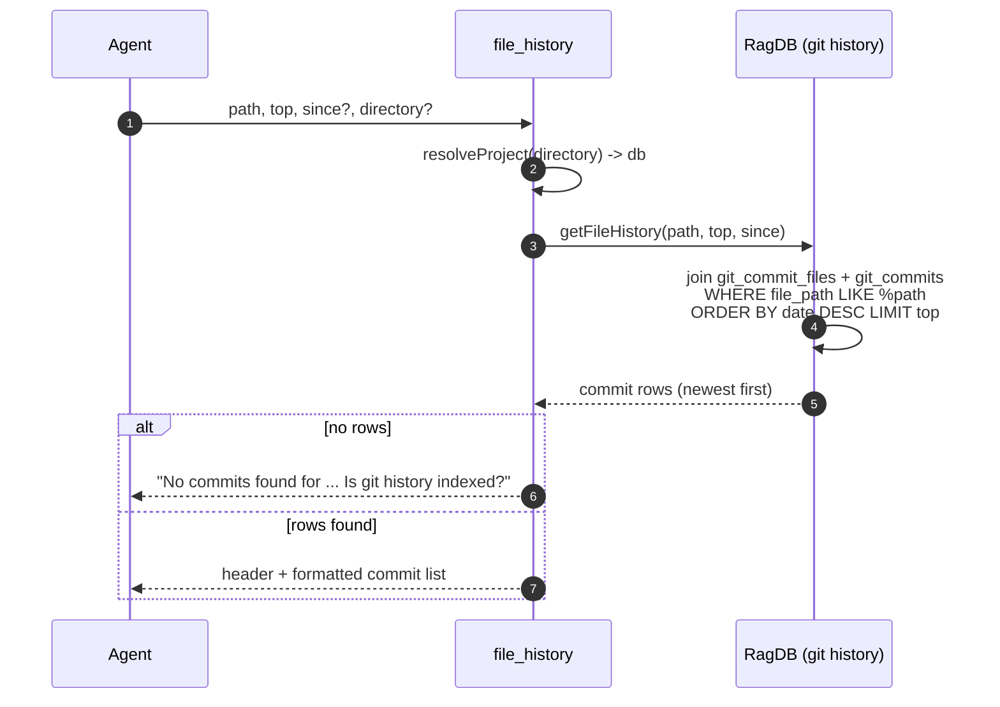

# Tool: file_history

`file_history` answers "how did this one file change over time?". Given a file
path, it returns the commits that touched that file, newest first, with each
commit's message and change stats. It is the fast, index-backed equivalent of
`git log -- <path>`: because the commit data is already stored in the project
database, the tool does not shell out to git at all.

It is most useful for understanding a file's evolution before editing it — who
last changed it, when, and what else moved in those commits.

## How it works

The handler is the second tool registered by `registerGitHistoryTools`,
alongside [search_commits](search-commits.md)
(`src/tools/git-history-tools.ts:111-114`). After resolving the project and
database with `resolveProject` (`src/tools/git-history-tools.ts:124`), it calls
`getFileHistory(path, top, since)` and formats the rows
(`src/tools/git-history-tools.ts:126`).

`getFileHistory` joins the per-file change table `git_commit_files` to the
`git_commits` table and matches the requested path with a trailing-wildcard
`LIKE` pattern, `%<path>` (`src/db/git-history.ts:273-277`). That makes the
match a **suffix** match: passing `db.ts` matches any commit whose changed file
path ends in `db.ts`, and passing `src/db/index.ts` matches that exact tail.
There is no leading wildcard, so the pattern is anchored at the end of the
stored path. Results are ordered by commit date descending and capped at `top`
(`src/db/git-history.ts:284`).



1. The agent calls with a `path` and optional `top`, `since`, and `directory`
   (`src/tools/git-history-tools.ts:114-122`).
2. The project database is resolved
   (`src/tools/git-history-tools.ts:124`).
3. `getFileHistory` runs one SQL query: it matches `file_path LIKE %path`,
   optionally adds `date >= since`, orders by date descending, and limits to
   `top` (`src/db/git-history.ts:273-291`).
4. Each raw row is parsed into a commit record
   (`src/db/git-history.ts:291`).
5. An empty result returns a message that also hints the index may be missing
   (`src/tools/git-history-tools.ts:128-135`).
6. Otherwise a header and one formatted block per commit are returned
   (`src/tools/git-history-tools.ts:137-140`).

## Inputs

| name | type | required | description |
| --- | --- | --- | --- |
| `path` | string | yes | File path; matched as a suffix of stored changed-file paths via `LIKE %path` (`src/tools/git-history-tools.ts:115`, `src/db/git-history.ts:276-277`). |
| `top` | integer ≥ 1 | no | Maximum commits to return; defaults to 20 (`src/tools/git-history-tools.ts:116-117`, `src/db/git-history.ts:284-285`). |
| `since` | string (ISO date) | no | Only commits with `date >= since` (lexical comparison on the ISO date) (`src/tools/git-history-tools.ts:118-119`, `src/db/git-history.ts:279-282`). |
| `directory` | string | no | Project directory; falls back to `RAG_PROJECT_DIR`, then cwd (`src/tools/git-history-tools.ts:120-121`). |

## Outputs

| output | where it lands / shape / description |
| --- | --- |
| Header | `## History for "<path>" (<n> commits)` (`src/tools/git-history-tools.ts:137`). |
| Commit list | One block per commit, newest first, rendered by `formatCommitRow` (`src/tools/git-history-tools.ts:21-32`). Line 1: rank, **short hash**, date (date portion only), `@author`, plus `[merge]` for merge commits. Line 2: first line of the commit message. Line 3: up to 5 changed file paths (`+N more` beyond that) and `(+insertions -deletions)`. |
| Empty / not-indexed message | `No commits found for "<path>". Is git history indexed?` when the query returns nothing (`src/tools/git-history-tools.ts:128-134`). |

Note that, unlike [search_commits](search-commits.md), the formatted line here
carries no relevance score — these rows are sorted by date, not ranked by
similarity, so `formatCommitRow` omits the score that `formatCommitResult`
shows (`src/tools/git-history-tools.ts:21-32` vs
`src/tools/git-history-tools.ts:7-19`).

## file_history vs search_commits

Both tools read the same `git_commits` table but answer different questions.

| | file_history | search_commits |
| --- | --- | --- |
| Question | how did one file change | which commits relate to a query |
| Selection | path suffix match | semantic + keyword relevance |
| Order | commit date, newest first | blended relevance score |
| Embedding | none | query is embedded |
| Source | `src/db/git-history.ts:267-292` | `src/db/git-history.ts:154-225` |

## Branches and failure cases

- **No matching commits / not indexed.** An empty result set returns the
  combined "no commits / is git history indexed?" message; the same message
  appears whether the file truly had no commits or no history has been indexed
  at all (`src/tools/git-history-tools.ts:128-134`).
- **Suffix match breadth.** Because the pattern is `%path` with no leading
  anchor on the directory portion, a short `path` like `index.ts` matches
  every stored path ending in `index.ts`. Pass a longer tail to narrow it
  (`src/db/git-history.ts:277`).
- **`since` filter.** When provided, it adds `gc.date >= since` to the query;
  the comparison is lexical over the stored ISO date string
  (`src/db/git-history.ts:279-282`).
- **`top` cap.** The `LIMIT` is applied in SQL, so only the most recent `top`
  commits are returned even when more match
  (`src/db/git-history.ts:284-285`).

## Example

Example arguments:

```json
{
  "path": "src/db/index.ts",
  "top": 5,
  "since": "2026-01-01"
}
```

Illustrative output (values synthetic):

```
## History for "src/db/index.ts" (2 commits)

1. **<short-sha>** — 2026-03-02 — @winci
   refactor: split RagDB operations into modules
   Files: src/db/index.ts, src/db/files.ts +3 more (+210 -180)

2. **<short-sha>** — 2026-02-14 — @winci
   fix: guard concurrent indexing with a file lock
   Files: src/db/index.ts, src/indexing/indexer.ts (+64 -12)
```

## Key source files

- `src/tools/git-history-tools.ts` — the MCP handler and the `formatCommitRow`
  formatter.
- `src/db/git-history.ts` — `getFileHistory` runs the path-suffix query over
  `git_commit_files` joined to `git_commits`.
- `src/db/index.ts` — `RagDB.getFileHistory` wraps the query.

## Related flows

- [search_commits](search-commits.md) — the relevance-ranked sibling over the
  same commit table.
- [git_context](git-context.md) — working-tree orientation that lists recent
  commits and uncommitted changes.
