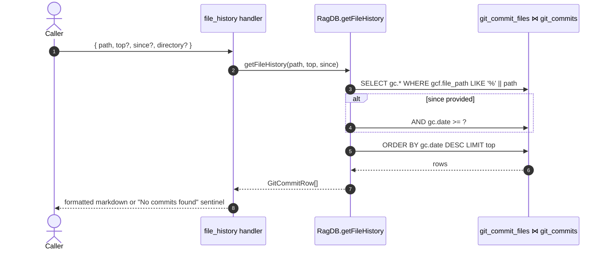

# Tool: file_history

Returns the commits that touched a given file, newest first, served entirely from the indexed `git_commits` / `git_commit_files` tables. The tool never calls `git`. It is the fastest way to ask "how has this file changed?" once history has been indexed, and is the path-scoped counterpart to `search_commits` (which is semantic, not path-keyed).

The handler is a thin wrapper around `RagDB.getFileHistory`. There is no embedding, no FTS, no ranking — just a SQL join with `ORDER BY date DESC LIMIT topK`.

## Flow



1. The caller invokes `file_history` with a required `path` and optional `top`, `since`, and `directory`. The default `top` is 20 `src/tools/git-history-tools.ts:115-117`.
2. The handler resolves the project through `resolveProject(directory, getDB)` to get the `RagDB` for the right project, then calls `ragDb.getFileHistory(path, top, since)` `src/tools/git-history-tools.ts:123-126`.
3. `getFileHistory` in `src/db/git-history.ts` joins `git_commit_files` to `git_commits` on `commit_id`, filtered by `gcf.file_path LIKE ?` with parameter `'%' + path`. The leading `%` makes the match a **suffix match**: `services/auth.ts` matches both `services/auth.ts` and `packages/api/services/auth.ts` `src/db/git-history.ts:267-292`.
4. When `since` is set, the query adds `AND gc.date >= ?`. The compare is a plain string compare against the stored ISO date, so any ISO-8601-ordered prefix (`2025-01-01`, `2025-01-01T00:00:00Z`) works.
5. The query closes with `ORDER BY gc.date DESC LIMIT ?`, so results come back newest first, capped at `top`.
6. Rows are returned as `GitCommitRow` objects (with `filesChanged` and `refs` already JSON-decoded). The handler formats each through `formatCommitRow`: short hash, ISO date, author, merge tag, first message line, and up to five files plus a `+N more` suffix with `+ins/-del` totals `src/tools/git-history-tools.ts:21-32`.
7. When zero rows match, the handler returns the literal `No commits found for "<path>". Is git history indexed?` `src/tools/git-history-tools.ts:128-135`.

## Inputs

| Name | Type | Default | Notes |
| --- | --- | --- | --- |
| `path` | string | required | Suffix-matched against `git_commit_files.file_path` via `LIKE '%' || path`. Use a relative path; project-root paths are stored as recorded by the indexer. There is no exact-match toggle on this tool — use a more specific suffix if you get unwanted matches. |
| `top` | int ≥ 1 | 20 | Forwarded as the SQL `LIMIT`. |
| `since` | string | none | Compared lexicographically against the ISO `date` column. Pass an ISO date or ISO timestamp. |
| `directory` | string | `RAG_PROJECT_DIR` env or cwd | Picks which project's DB the lookup runs against. |

## Outputs

| Output | Shape |
| --- | --- |
| MCP text content | A markdown header `## History for "<path>" (<n> commits)` followed by one block per commit, or the no-results sentinel string. |

Each commit block is three lines: a numbered header `**<shortHash>** — <YYYY-MM-DD> — @<author>`, optionally `[merge]`; the first line of the commit message; and `Files: <up to 5>, +N more (+ins -del)` `src/tools/git-history-tools.ts:21-32`.

## Branches and failure cases

- **No commits indexed for the file.** The SQL returns an empty array and the handler emits the `No commits found for "<path>". Is git history indexed?` sentinel. This same sentinel fires when the project simply has no indexed git history, since both cases hit the same empty-result path `src/tools/git-history-tools.ts:128-135`.
- **Path suffix collisions.** Because the match is `LIKE '%' || path`, a value like `auth.ts` will match every `auth.ts` in the repo. Disambiguate by passing more of the prefix, for example `services/auth.ts`.
- **`top` is forwarded blindly.** There is no upper bound enforced beyond Zod's `min(1)`. Large values translate directly to a larger SQL `LIMIT`.
- **`since` is a string compare, not a date parse.** Any ISO-ordered prefix works; non-ISO strings will compare lexically and silently return unexpected results.

## Example

```json
{
  "name": "file_history",
  "arguments": {
    "path": "src/tools/git-history-tools.ts",
    "top": 5,
    "since": "2025-01-01"
  }
}
```

Illustrative output (synthetic):

```
## History for "src/tools/git-history-tools.ts" (3 commits)

1. **abc1234** — 2026-03-12 — @alice
   feat: add file_history tool
   Files: src/tools/git-history-tools.ts, src/db/git-history.ts +0 more (+42 -3)
```

## Related flows

- [search_commits](search-commits.md) — semantic search over the same `git_commits` rows; use when you remember the topic but not the file.
- [git_context](git-context.md) — what is dirty or recent **in the working tree** (uses live `git`, not the index).

## Key source files

- `src/tools/git-history-tools.ts` — registers `file_history` and `search_commits`; formats commit rows.
- `src/db/git-history.ts` — owns the SQL: `getFileHistory` performs the suffix-LIKE join over `git_commits` / `git_commit_files`.
