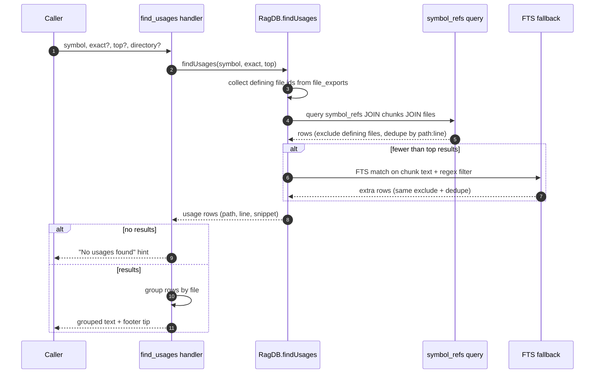

# Tool: find_usages

`find_usages` finds every place a symbol is referenced across the indexed project — call sites, type references, and other mentions — and reports them grouped by file with line numbers and the matching source line. You use it before renaming a function, changing a signature, or removing an export, to see the full set of places a change would touch.

It is more reliable than a text search for this job because it primarily consults a structured reference index built during indexing, rather than matching raw text. That index records resolved identifier references per chunk, so it captures usages that a plain `grep` for the name would miss or mishandle — for example a symbol imported under an alias, or re-exported through a barrel file — and it deliberately excludes hits buried inside comments or string literals. When that structured index has no entry (older indexes, languages without a reference query, or dynamically dispatched names), it falls back to a full-text search over chunk content.

The handler is registered in `registerGraphTools` (`src/tools/graph-tools.ts:53-107`); the matching logic lives in `findUsages` (`src/db/search.ts:425-546`).

## How it works



1. The caller passes a `symbol` name plus optional `exact`, `top`, and `directory`. The handler resolves the project and database via `resolveProject` and calls `findUsages`, defaulting `exact` to `true` and `top` to `30` (`src/tools/graph-tools.ts:68-71`).
2. `findUsages` first collects the set of file ids that *define* (export) the symbol, by looking up `file_exports` by case-insensitive name. These are the symbol's own home files (`src/db/search.ts:426-433`).
3. The primary query reads the `symbol_refs` table, joining to `chunks` (for the surrounding snippet and the chunk's starting line) and `files` (for the path). Exact mode matches `LOWER(sr.name) = LOWER(?)`; non-exact mode matches `LOWER(sr.name) LIKE LOWER(?) || '%'`, a case-insensitive prefix match (`src/db/search.ts:441-465`).
4. Each reference row is filtered: rows in a defining file are skipped, the reference line is converted from the index's 0-indexed line to a 1-indexed file line, and the exact source line is pulled out of the chunk snippet. Results are deduplicated by `path:line` and the loop stops once `top` results are collected (`src/db/search.ts:467-486`).
5. If the reference index produced fewer than `top` results, a fallback runs: a full-text query over chunk text matches the symbol, and a regular expression confirms a word-boundary (exact) or prefix (non-exact) match per line before the row is kept. Defining files are excluded and results are deduplicated against what the primary path already returned (`src/db/search.ts:488-543`).
6. Back in the handler, the rows are grouped into a map keyed by file path, then rendered as a text block: a header with totals, each file path, and its indented `:line  snippet` rows (`src/tools/graph-tools.ts:79-105`).

## Inputs

| name | type | required | description |
| --- | --- | --- | --- |
| `symbol` | string | yes | Symbol name to find references to. Length 1–200 (`src/tools/graph-tools.ts:57`). |
| `exact` | boolean | no | When true (the default), requires a whole-name match — exact equality in the reference index and a word-boundary regex in the fallback. When false, matches names that start with the given prefix (`src/tools/graph-tools.ts:58-61`, `src/db/search.ts:441-465`, `src/db/search.ts:513-515`). |
| `top` | integer | no | Maximum number of usages to return. Minimum 1; defaults to 30 (`src/tools/graph-tools.ts:66`, `src/tools/graph-tools.ts:71`). |
| `directory` | string | no | Project directory. Defaults to the `RAG_PROJECT_DIR` environment variable, then the current working directory (`src/tools/graph-tools.ts:62-65`). |

## Outputs

| output | where it lands / shape / description |
| --- | --- |
| Grouped usage report | MCP text content. A header line states how many usages were found across how many files, then for each file the path is printed followed by indented `:<line>  <matching source line>` entries. A footer suggests following up with `depended_on_by` on a listed file (`src/tools/graph-tools.ts:87-101`). |
| Empty-result message | When nothing matches, a single text line explains the symbol may appear only in its definition file or that the index may need re-running (`src/tools/graph-tools.ts:73-77`). |

Each result row carries a `path`, a `line` (1-indexed file line, or null when the fallback cannot resolve one), and a `snippet` (the trimmed matching source line). This tool only reads — it changes no state.

## Why this beats a text search

| Situation | Plain text search (`grep`) | find_usages |
| --- | --- | --- |
| Symbol imported under an alias | Misses it (the alias name differs) | Resolved references are recorded during indexing, so aliased uses are captured |
| Symbol re-exported through a barrel file | Reports the re-export line as a "usage" | Re-exports are tracked separately from real references |
| Name appears in a comment or string | Reported as a false match | The reference-index path excludes comments and strings; only the fallback can surface them |
| Definition site itself | Reported as a usage | Defining files are filtered out (`src/db/search.ts:468`, `src/db/search.ts:518`) |
| Unsupported language / older index | Works on raw text | Falls back to the same full-text-plus-regex behavior (`src/db/search.ts:488-515`) |

## Branches and failure cases

| Condition | Behavior |
| --- | --- |
| `exact` true (default) | Reference index requires exact case-insensitive name equality; fallback uses a word-boundary regex (`src/db/search.ts:441-451`, `src/db/search.ts:514`). |
| `exact` false | Reference index uses a case-insensitive prefix `LIKE`; fallback regex anchors only at a word boundary at the start (`src/db/search.ts:454-464`, `src/db/search.ts:515`). |
| Reference index satisfies `top` | Fallback is never reached; the primary loop returns as soon as `top` rows are collected (`src/db/search.ts:485`). |
| Reference index returns fewer than `top` | Fallback full-text search runs to top up results, deduplicated against the primary rows (`src/db/search.ts:488-543`). |
| Full-text query errors | The fallback is wrapped in try/catch; on error the already-collected reference results are returned as-is (`src/db/search.ts:509-511`). |
| No matches anywhere | Handler returns the "No usages found" hint text (`src/tools/graph-tools.ts:73-77`). |
| Usages only in the defining file | Those rows are filtered out, so the result can be empty even when the name appears in the codebase — the empty message names this case explicitly (`src/db/search.ts:468`, `src/tools/graph-tools.ts:75`). |
| Stale index | References reflect the last index run; renamed or removed code shows until [index_files](../tools/index-files.md) re-runs. |

## Example

Find every usage of an exported function before changing it:

```json
{ "symbol": "resolveProject" }
```

Prefix match, capped at 10 results, in a specific project:

```json
{
  "symbol": "register",
  "exact": false,
  "top": 10,
  "directory": "/Users/example/repos/myproject"
}
```

A successful response is shaped like:

```
Found 3 usages of "resolveProject" across 2 files:

src/tools/graph-tools.ts
  :30  const { projectDir, db: ragDb } = await resolveProject(directory, getDB);
  :69  const { projectDir, db: ragDb } = await resolveProject(directory, getDB);

src/tools/index-tools.ts
  :25  const { projectDir, db: ragDb, config: baseConfig } = await resolveProject(directory, getDB);

── Tip: call depended_on_by("<file>") on any file above to see its full importer tree. ──
```

## Key source files

- `src/tools/graph-tools.ts` — registers `find_usages`, groups results by file, and formats the text output.
- `src/db/index.ts` — `RagDB.findUsages` delegates to the search layer.
- `src/db/search.ts` — `findUsages` runs the `symbol_refs` query and the full-text fallback.

## Related tools

- `search_symbols` finds where a symbol is *defined*; `find_usages` finds where it is *used*.
- [depended_on_by](../tools/depended-on-by.md) shows the same blast radius at file granularity rather than per call site.
