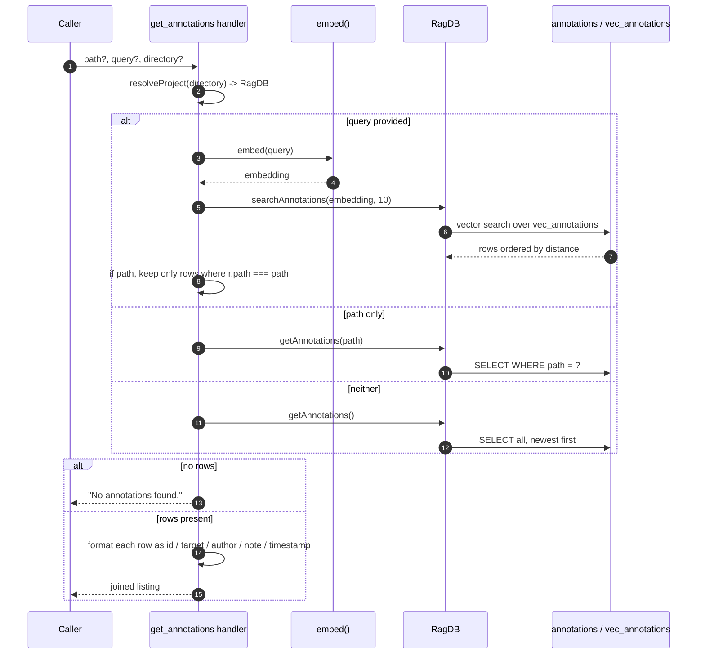

# Tool: get_annotations

`get_annotations` reads back the persistent notes that [annotate](annotate.md) has stored. You use it to pull up the caveats attached to a file before you edit it, or to search across all notes by meaning when you remember a warning but not where it lives. It is the explicit read counterpart to the automatic `[NOTE]` lines that [read_relevant](read-relevant.md) prints — useful when you want the full set of notes for a file, including ones whose symbol does not match any chunk currently being viewed.

The handler is registered in `src/tools/annotation-tools.ts:41-88`. It chooses one of three retrieval modes based on which arguments are present, then formats the rows into a plain-text listing.

## How it works



1. The caller invokes the tool with any combination of optional `path`, `query`, and `directory`. None are required (`src/tools/annotation-tools.ts:44-57`).
2. `resolveProject` resolves the optional `directory` into the project's `RagDB` handle, falling back to `RAG_PROJECT_DIR` or the current working directory (`src/tools/annotation-tools.ts:59`).
3. If `query` is set, the query string is embedded.
4. `searchAnnotations` runs a vector search over `vec_annotations`, joined back to the `annotations` table, returning up to 10 rows ordered by ascending distance and tagged with a `score` of `1 / (1 + distance)` (`src/db/annotations.ts:137-172`).
5. In that query-plus-path case, the results are then filtered in memory to keep only rows whose `path` equals the supplied path — so the path narrows an already-ranked semantic search (`src/tools/annotation-tools.ts:64-65`).
6. If only `path` is set (no query), `getAnnotations(path)` returns every note for that file, ordered by `updated_at` descending (`src/tools/annotation-tools.ts:67`, `src/db/annotations.ts:101-135`).
7. If neither is set, `getAnnotations()` returns all notes across the whole project, again newest-updated first (`src/tools/annotation-tools.ts:69`).
8. When the result set is empty, the handler returns the literal text `No annotations found.` (`src/tools/annotation-tools.ts:72-76`).
9. Otherwise each row is rendered into a multi-line block and the blocks are joined with blank-line separators (`src/tools/annotation-tools.ts:78-86`).

## Three retrieval modes

The handler picks exactly one path based on which arguments are present (`src/tools/annotation-tools.ts:61-70`).

| Arguments given | Function called | What you get back |
|-----------------|-----------------|-------------------|
| `query` (with or without `path`) | `searchAnnotations(embedding, 10)`, then an in-memory `path` filter when `path` is also set | Up to 10 notes ranked by semantic similarity to the query; when `path` is also supplied, only those whose path matches survive |
| `path` only | `getAnnotations(path)` | Every note for that file, newest-updated first |
| neither | `getAnnotations()` | Every note in the project, newest-updated first |

Note the ordering of the checks: `query` is tested first, so supplying both `path` and `query` runs the semantic search and then filters by path — it does not run a path-scoped query. The score-based ranking comes from the search branch; the path-only and project-wide branches are ordered purely by `updated_at` (`src/db/annotations.ts:118`).

## Inputs

| name | type | required | description |
|------|------|----------|-------------|
| `path` | string | no | File path to retrieve annotations for. Alone, it returns all notes for that file. Combined with `query`, it filters the ranked search results down to that path (`src/tools/annotation-tools.ts:45-48`). |
| `query` | string | no | Semantic search query. Embedded and matched against all stored note vectors; finds notes by meaning regardless of which file they are on (`src/tools/annotation-tools.ts:49-52`). |
| `directory` | string | no | Project directory to operate on. Defaults to the `RAG_PROJECT_DIR` env var or the current working directory (`src/tools/annotation-tools.ts:53-56`). |

## Outputs

| output | where it lands / shape / description |
|--------|--------------------------------------|
| Formatted annotation listing | A single text block returned to the caller. Each note renders as `#<id>  <target><author>` on the first line, the note text indented on the second, and `(<updatedAt>)` indented on the third. `<target>` is the path, or `path  •  symbol` when the note is symbol-scoped; `<author>` shows as ` [author]` only when an author is present. Blocks are joined by blank lines (`src/tools/annotation-tools.ts:78-86`). |
| Empty-state text | When no rows match, the block is exactly `No annotations found.` (`src/tools/annotation-tools.ts:72-76`). |

The score from the semantic-search branch is computed but is not printed in this tool's output — the formatting reads only `id`, `path`, `symbolName`, `author`, `note`, and `updatedAt` (`src/tools/annotation-tools.ts:78-83`).

## Branches and failure cases

- **Query branch.** Present `query` always takes priority over `path`, embeds the query, and pulls the top 10 by vector distance (`src/tools/annotation-tools.ts:62-64`).
- **Query + path branch.** After the search, rows are filtered to the exact path. If none of the top 10 are on that path, the result is empty even though notes for that path may exist further down the ranking (`src/tools/annotation-tools.ts:65`).
- **Path-only branch.** Returns all notes for the path, no relevance ranking, newest first (`src/tools/annotation-tools.ts:66-67`).
- **No-argument branch.** Returns every note in the project, newest first — useful for an audit but potentially large (`src/tools/annotation-tools.ts:68-69`).
- **Empty result.** Any branch that yields zero rows returns `No annotations found.` rather than an empty body (`src/tools/annotation-tools.ts:72-76`).
- **Read-only.** This tool never writes; it only queries. Directory resolution errors surface from `resolveProject` / `RagDB`, not from this handler.

## When to use this vs the inline notes in read_relevant

[read_relevant](read-relevant.md) already surfaces notes automatically: for each returned chunk it fetches that file's annotations and prints the relevant ones as `[NOTE]` lines, where "relevant" means file-level notes plus any symbol-scoped note whose symbol matches the chunk's entity (`src/tools/search.ts:170-203`). That is the right surface while you are reading code.

Reach for `get_annotations` when you want notes outside that flow:

- You want **every** note on a file, including symbol-scoped notes for symbols that did not appear in your last `read_relevant` result.
- You remember a caveat but not its file, and want to find it by **meaning** via `query`.
- You are about to [delete an annotation](delete-annotation.md) and need its `id`, which the inline `[NOTE]` lines do not show.

## Example

Search all notes by meaning:

```json
{ "query": "race condition in the indexing watcher" }
```

Get every note for one file:

```json
{ "path": "src/example.ts" }
```

Illustrative output for the path-only call:

```
#7  src/example.ts  •  parseConfig [agent]
  Returns undefined on malformed YAML instead of throwing — callers must null-check.
  (2026-05-20T14:03:11.000Z)

#4  src/example.ts [human]
  Whole module is slated for rewrite; avoid large refactors here.
  (2026-05-18T09:12:44.000Z)
```

## Related tools

- [annotate](annotate.md) — creates and updates the notes this tool reads.
- [delete_annotation](delete-annotation.md) — removes a note by the `id` shown in this listing.
- [read_relevant](read-relevant.md) — surfaces matching notes inline as `[NOTE]` lines while reading code.

## Key source files

- `src/tools/annotation-tools.ts` — registers `get_annotations`, selects the retrieval mode, and formats the listing.
- `src/db/annotations.ts` — `getAnnotations` (path / all) and `searchAnnotations` (vector search) implementations.
- `src/db/index.ts` — the `RagDB` class exposing both query methods over the `annotations` and `vec_annotations` tables.
- `src/tools/search.ts` — the inline `[NOTE]` rendering in `read_relevant` that this tool complements (`src/tools/search.ts:170-203`).
