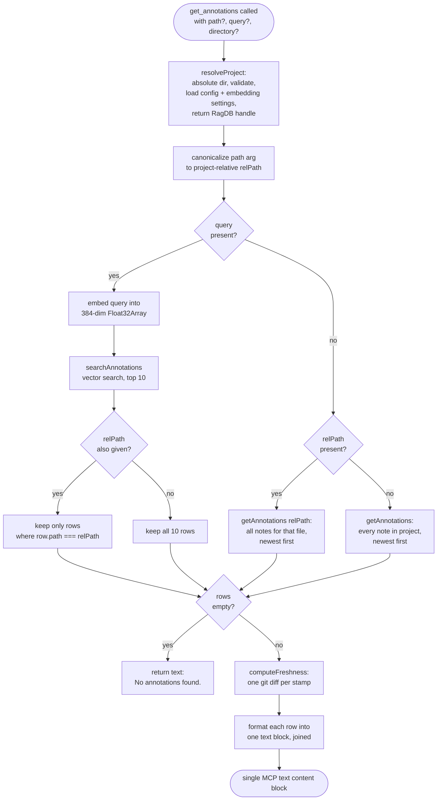

# Tool: get_annotations

`get_annotations` reads back the persistent notes that agents and people pin to files and symbols while working in a project. Those notes are short caveats — a known bug, a race condition, a fragile spot that should not be touched yet, a non-obvious constraint, or a workaround that needs context — written through the [annotate](annotate.md) tool so the warning survives across sessions. `get_annotations` is the read side: you call it to surface those caveats on demand, either by asking for every note on one file or by searching the whole note collection by meaning.

It solves a simple but real problem. Notes left behind are only useful if you can find them again. Inside `read_relevant` they already show up automatically as inline `[NOTE]` blocks next to the code they warn about, but that only covers chunks that happen to rank for your query. `get_annotations` gives direct access: list a file's notes before editing it, or run a semantic search like "concurrency hazards" across every annotation to collect related caveats that live in different files.

The tool is registered alongside its siblings in `registerAnnotationTools`, which wires `annotate`, `get_annotations`, and `delete_annotation` onto the MCP server (`src/tools/annotation-tools.ts:10`). The `get_annotations` registration runs from `src/tools/annotation-tools.ts:52-107`, and the handler body is at `src/tools/annotation-tools.ts:69-106`.

## How it works

The handler takes three optional arguments — `path`, `query`, and `directory` — and chooses one of three retrieval paths based on which of `path` and `query` were supplied. There is no required argument; calling it with nothing is valid and returns every note in the project.



1. The caller invokes the tool with any combination of `path`, `query`, and `directory`. All three are optional and validated by Zod string schemas (`src/tools/annotation-tools.ts:56-67`).
2. The handler resolves which project to read from. `resolveProject` turns the optional `directory` into an absolute path (falling back to the `RAG_PROJECT_DIR` environment variable, then the current working directory), verifies it exists, loads that project's config, applies its embedding settings, and returns the `RagDB` handle for that project (`src/tools/index.ts:33-83`). If the directory does not exist, this throws before any query runs (`src/tools/index.ts:45-47`).
3. The handler canonicalizes the `path` argument into a project-relative `relPath` with `toProjectRelative`, but only when a `path` was supplied (`src/tools/annotation-tools.ts:71`). This is why an absolute path the caller pasted back from another tool's output still matches the relative path the note was stored under.
4. If a `query` was supplied, the handler embeds it. `embed` runs the configured sentence-embedding model (the default is `Xenova/all-MiniLM-L6-v2`, a 384-dimension model) over the query text and returns one mean-pooled, normalized `Float32Array` (`src/embeddings/embed.ts:274-282`).
5. The embedding is passed to `searchAnnotations` with a fixed limit of 10. This runs a vector-similarity search over the stored note embeddings and returns the closest matches, ordered by distance (`src/tools/annotation-tools.ts:75-76`).
6. When both `query` and `path` are given, the ranked search results are filtered in memory down to rows whose `path` exactly equals the canonicalized `relPath`, so you get a relevance-ranked view scoped to one file. When only `query` is given, all ten ranked rows are kept (`src/tools/annotation-tools.ts:77`).
7. If there is no `query` but a `path` was given, the handler skips embedding entirely and asks the database for every note on that exact path (`src/tools/annotation-tools.ts:78-79`).
8. If neither argument was given, it fetches every note in the project (`src/tools/annotation-tools.ts:80-81`).
9. If the chosen path produced no rows, the handler returns the plain string `"No annotations found."` (`src/tools/annotation-tools.ts:84-88`).
10. Otherwise it runs a staleness check over the rows, then formats each note into a human-readable block and returns the joined text (`src/tools/annotation-tools.ts:90-105`).

### Path-only retrieval

When you pass only `path`, the handler calls `ragDb.getAnnotations(relPath)` (`src/tools/annotation-tools.ts:78-79`). That `RagDB` method runs `toProjectRelative` on the argument a second time — harmless on an already-relative path — and forwards to the module function `getAnnotations`, passing the open database handle as its first argument (`src/db/index.ts:1189-1192`). The function builds `SELECT * FROM annotations WHERE 1=1` and, because a `path` was supplied, appends `AND path = ?`, then orders by `updated_at DESC` so the most recently edited note appears first (`src/db/annotations.ts:104-138`). The `symbol_name` column is not filtered here, since the handler passes no `symbolName` — both file-level notes (where `symbol_name` is `NULL`) and symbol-level notes on that file come back together. The match is exact string equality against the stored `path`, and there is no top-K cap on this branch, so it returns every matching note for that file.

### Semantic query across annotations

When you pass `query` (with or without `path`), the handler embeds the query text and calls `ragDb.searchAnnotations(embedding, 10)` (`src/tools/annotation-tools.ts:75-76`). That runs a nearest-neighbour search against `vec_annotations`, a `vec0` virtual table that stores one embedding per note keyed by `annotation_id` (`src/db/index.ts:558-561`). The SQL pulls the 10 nearest rows with `embedding MATCH ?` ordered by `distance`, then joins back to the `annotations` table to recover each note's full row (`src/db/annotations.ts:141-179`). This is why semantic search finds notes by meaning rather than exact wording: a query about "data races" can surface a note that says "this counter is not thread-safe" even though the words differ.

Each note's embedding was computed at write time, not at read time. The `annotate` tool embeds the note text — prefixed with the symbol name when one is given (`${symbol}: ${note}`) — and stores that vector, so symbol-level notes carry their symbol into the searchable text (`src/tools/annotation-tools.ts:38-39`). `searchAnnotations` returns each row with an extra `score` field computed as `1 / (1 + distance)` (`src/db/annotations.ts:177`), but this handler does not display the score — it only relies on the ordering and reformats the rows.

### path + query combination

Supplying both narrows a semantic search to a single file. The search still runs across all notes and returns the global top 10 by relevance; the handler then filters that list in memory, keeping only rows whose `path` equals the canonicalized `relPath` (`src/tools/annotation-tools.ts:77`). Because the filter is applied after the database already limited the result to 10, a file with many notes can lose relevant ones that ranked outside the global top 10 — the limit is enforced before the path filter, not after. For an exhaustive list of one file's notes, prefer path-only retrieval, which has no top-K cap.

The three modes compared:

| supplied arguments | retrieval call | ordering | cap | scope |
| --- | --- | --- | --- | --- |
| `path` only | `getAnnotations(relPath)` | `updated_at DESC` (newest first) | none | one file, all notes |
| `query` only | `searchAnnotations(embedding, 10)` | vector distance (most relevant first) | 10 | whole project |
| `path` + `query` | `searchAnnotations(embedding, 10)`, then in-memory `path` filter | vector distance | 10 before filter | one file, but only notes inside the global top 10 |
| neither | `getAnnotations()` | `updated_at DESC` | none | whole project, all notes |

## Staleness signal

Before formatting, the handler asks `computeFreshness` whether the code each note was written against has moved on (`src/tools/annotation-tools.ts:90-93`). Each annotation row carries the `commitHash` of HEAD when it was last written, and `computeFreshness` runs `git diff --name-only <commitHash>` (one cached call per distinct stamp) to see whether the note's file has changed since — committed or in the working tree (`src/git/staleness.ts:35-86`). The verdict becomes a one-line tag through `freshnessTag`: `✓ current`, `⚠ stale — changed since: ...`, or `⚠ written on a commit not in current history`, and an empty string when there is no signal — legacy notes with no stamp, or non-git projects (`src/git/staleness.ts:88-99`). The tag, when non-empty, is appended on its own indented line under each note, so recall can flag a caveat that may no longer match the current code.

## Inputs

| name | type | required | description |
| --- | --- | --- | --- |
| `path` | string | no | File path to retrieve notes for; an absolute or relative path is canonicalized to project-relative before querying. Used alone for a full list of that file's notes, or with `query` to scope a semantic search to that file. Matched by exact string equality against stored paths (`src/tools/annotation-tools.ts:71`, `src/db/annotations.ts:108-110`). |
| `query` | string | no | Natural-language search text. When present, the handler embeds it and ranks notes by vector similarity across the whole project, capped at the top 10 (`src/tools/annotation-tools.ts:74-77`). |
| `directory` | string | no | Which project to read from. Defaults to the `RAG_PROJECT_DIR` environment variable, then the current working directory. Resolved to an absolute path and checked for existence by `resolveProject` (`src/tools/index.ts:38-47`). |

## Outputs

| output | where it lands / shape / description |
| --- | --- |
| matching annotations | A single MCP text content block. Each note is rendered as `#<id>  <path>` (or `#<id>  <path>  •  <symbolName>` for symbol notes), an optional ` [<author>]` suffix, then the note text and the `updatedAt` timestamp on their own indented lines, with an optional staleness tag and a blank line between notes (`src/tools/annotation-tools.ts:95-103`). |
| empty-result message | When no note matches, the same content block instead carries the literal string `"No annotations found."` (`src/tools/annotation-tools.ts:84-88`). |

The shape of each row comes from `AnnotationRow`: `id`, `path`, `symbolName`, `note`, `author`, `createdAt`, `updatedAt`, and `commitHash` (`src/db/types.ts:47-58`). The handler does not emit `createdAt` or the raw similarity score — only `id`, the target (`path` plus optional `symbolName`), `author`, `note`, `updatedAt`, and the derived freshness tag reach the caller.

## Branches and failure cases

- **No arguments** — both `path` and `query` are absent, so the handler calls `getAnnotations()` with no filter and returns every note in the project, newest first (`src/tools/annotation-tools.ts:80-81`).
- **Path only** — semantic search is skipped entirely; no embedding model is loaded. The database returns every note on that exact path (`src/tools/annotation-tools.ts:78-79`).
- **Query only** — the query is embedded and the global top 10 nearest notes are returned, ranked by similarity (`src/tools/annotation-tools.ts:74-77`).
- **Path and query together** — the top-10 semantic results are filtered in memory to the given path; notes on that file that ranked outside the top 10 are not recovered (`src/tools/annotation-tools.ts:77`).
- **Empty result** — any path that yields zero rows returns the string `"No annotations found."` rather than an empty block or an error (`src/tools/annotation-tools.ts:84-88`).
- **Missing or invalid directory** — `resolveProject` throws `Directory does not exist: <path>` when the resolved directory is absent on disk, so the tool surfaces an error instead of querying (`src/tools/index.ts:45-47`).
- **Path mismatch after canonicalization** — the path filter is exact string equality against `relPath`. Canonicalization fixes the common absolute-vs-relative mismatch, but a path that still differs from the stored value (for example a note written under a different relative root) silently matches nothing and falls into the empty-result branch.
- **Corrupted model cache on the query path** — the first semantic query in a process loads the embedding model. If the cached model file fails to parse (a `Protobuf parsing failed` or `Load model` error), `getEmbedder` deletes the cache directory and retries the load once before giving up (`src/embeddings/embed.ts:246-256`).

## State changes

`get_annotations` is read-only. It runs `SELECT` queries against the `annotations` and `vec_annotations` tables and never inserts, updates, or deletes a row. The notes it returns are created and modified by [annotate](annotate.md) and removed by [delete_annotation](delete-annotation.md); this tool only reads what those two have written. The query-only path lazily loads the embedding model into memory the first time it is needed, which is a process-level singleton cache, not stored state (`src/embeddings/embed.ts:225-272`). The staleness check shells out to `git diff` but writes nothing.

## Example

Retrieve every note attached to one file:

```json
{ "path": "src/db/index.ts" }
```

Search all notes by meaning, regardless of file:

```json
{ "query": "thread safety and concurrency hazards" }
```

Scope a semantic search to a single file:

```json
{ "path": "src/embeddings/embed.ts", "query": "model cache corruption" }
```

A non-empty response renders as text shaped like this (values are illustrative):

```
#7  src/db/index.ts  •  RagDB [agent]
  Constructor throws on EROFS/EACCES — set RAG_DB_DIR to a writable dir.
  (2026-05-30T11:04:18.221Z)
  ⚠ stale — changed since: src/db/index.ts

#3  src/db/index.ts [human]
  WAL mode plus busy_timeout=5000; concurrent writers will retry, not fail.
  (2026-05-28T09:12:50.880Z)
  ✓ current
```

## Key source files

- `src/tools/annotation-tools.ts` — registers the tool and contains the handler that canonicalizes the path, chooses the retrieval path, runs the query, applies the staleness check, and formats the output.
- `src/db/annotations.ts` — the database functions `getAnnotations` (path/symbol filter) and `searchAnnotations` (vector search) that back the two retrieval paths.
- `src/db/index.ts` — the `RagDB` methods that forward to those functions, and the `annotations` / `vec_annotations` table definitions.
- `src/db/types.ts` — defines `AnnotationRow`, the row shape returned to the handler.
- `src/git/staleness.ts` — `computeFreshness` and `freshnessTag`, which decide whether each note's file has changed since the note was written.
- `src/embeddings/embed.ts` — turns the `query` string into the embedding used for semantic search, and owns the lazy model cache.
- `src/tools/index.ts` — `resolveProject`, which resolves the target project directory and database handle before any query runs.

## Related tools

- [annotate](annotate.md) — writes the notes this tool reads, including the symbol-prefixed embedding text that semantic search relies on.
- [delete_annotation](delete-annotation.md) — removes a note by its `id`; the workflow is to find the `id` here first, then delete.
- [annotations CLI](../cli/annotations.md) — the command-line equivalent for listing the same persistent notes outside an MCP session.
