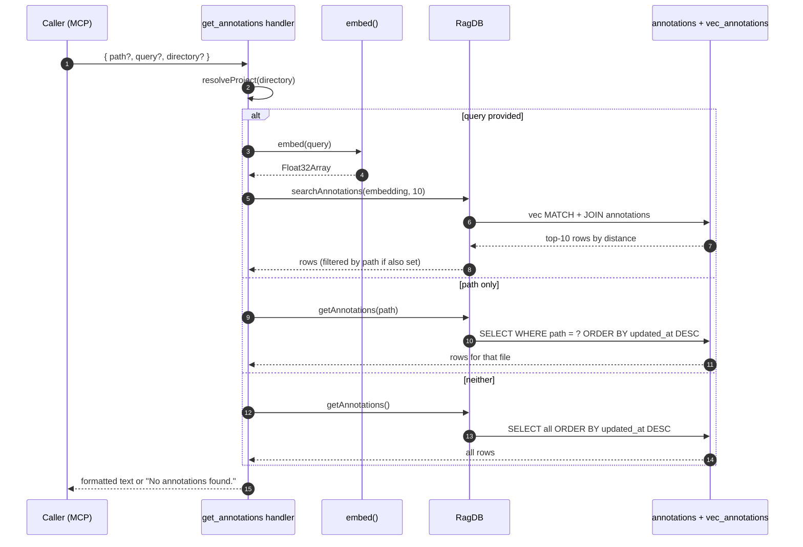

# Tool: get_annotations

`get_annotations` is the read side of the annotation store. It lists or searches the persistent notes written by [`annotate`](annotate.md) so an agent can find caveats and constraints before touching a file. The handler is registered in `src/tools/annotation-tools.ts:41-88` and delegates to two database helpers in `src/db/annotations.ts`: `getAnnotations` for path-scoped or project-wide listing, and `searchAnnotations` for semantic search.

This is the tool to reach for when you want to review every note on a file, or when you remember the gist of a constraint (“something about ties”) but not where the note lives. The `[NOTE]` blocks inside `read_relevant` cover the in-flow case; `get_annotations` covers the explicit lookup case.

## Flow



1. Caller invokes the tool with any combination of `path`, `query`, and `directory`. Schema at `src/tools/annotation-tools.ts:44-57`.
2. `resolveProject` picks the right `RagDB` based on `directory`, `RAG_PROJECT_DIR`, or cwd.
3. The handler branches on `query` first. When `query` is set it embeds the query and calls `ragDb.searchAnnotations(embedding, 10)` (`src/tools/annotation-tools.ts:62-65`). If `path` is also set, results are filtered to that file in JS — this happens after the SQL top-10 cut.
4. When only `path` is set, `ragDb.getAnnotations(path)` returns all rows for that file, ordered by `updated_at DESC` (`src/db/annotations.ts:101-135`).
5. When neither is set, `ragDb.getAnnotations()` returns every annotation in the project, also `updated_at DESC`.
6. Empty results short-circuit with `"No annotations found."` (`src/tools/annotation-tools.ts:72-76`).
7. Otherwise rows are joined into a multi-line string. Each line shows `#id`, `path` (with `• symbol` if present), `[author]`, the note text, and `(updatedAt)` (`src/tools/annotation-tools.ts:78-84`).

## Three modes

- **Path only** — `getAnnotations(path)` returns every note for that file, ordered by most recently updated. Use this before editing a file to see all attached caveats.
- **Query only** — `searchAnnotations` runs a vector similarity search against `vec_annotations`, taking the top 10 by distance, then joins back into `annotations` (`src/db/annotations.ts:137-173`). Use this when you remember the topic but not the file.
- **Path + query** — the vector search runs first, then results are filtered to rows where `r.path === path` in JS (`src/tools/annotation-tools.ts:65`). This combines semantic ranking with a hard path filter. Because filtering happens after the SQL top-10 cut, a file with many notes may lose some hits if they did not make the global top 10.
- **Neither** — `getAnnotations()` with no args lists everything. Useful for a quick project-wide audit.

## Inputs

| Input | Required | Notes |
|---|---|---|
| `path` | no | File path relative to project root. Without `query` it lists all notes for the file; with `query` it post-filters semantic results to that file. |
| `query` | no | Natural-language query. When supplied, `searchAnnotations` ranks by cosine-equivalent distance. |
| `directory` | no | Project directory. Defaults to `RAG_PROJECT_DIR` env or cwd. |

## Outputs

| Output | Notes |
|---|---|
| Formatted annotation listing | One block per row: `#<id>  <path>` (or `path  •  symbol`), optional `[author]`, then the note text, then `(<updatedAt>)` (`src/tools/annotation-tools.ts:78-84`). |
| `No annotations found.` | When the chosen mode returns zero rows. |

The `id` in each block is the same numeric id passed to [`delete_annotation`](delete-annotation.md).

## Output formatting

Each annotation prints as:

```
#<id>  <path>  •  <symbol> [<author>]
  <note text>
  (<updatedAt>)
```

Lines are separated by a blank line (`join("\n\n")`). The symbol bullet (`  •  `) only appears when `symbolName` is set, and `[author]` is omitted when `author` is null (`src/tools/annotation-tools.ts:80-82`). `updatedAt` is the ISO timestamp the row was last touched by an upsert in `src/db/annotations.ts:30,38-39,50-51`.

## When to use vs the inline `[NOTE]` surface

`read_relevant` already prints `[NOTE]` blocks above chunks whose path or symbol matches an annotation, so during normal browsing you do not need to call `get_annotations` at all. Reach for this tool when:

- You want to see every note on a file before editing, including notes on parts of the file that were not in the latest `read_relevant` result.
- You remember the topic of a note (“something about the FTS sync”) but not where it lives, so you search across files by `query`.
- You are auditing or pruning notes and want to list all of them with no filter.

## Branches and failure cases

- All three inputs are optional, so this tool never errors on a missing field.
- The query branch hard-codes `topK = 10` (`src/tools/annotation-tools.ts:64`), so combining `path` and `query` on a project with many global hits may filter to zero — drop the `query` to fall back to a full-file listing.
- Vector search depends on `vec_annotations` having a row for each annotation; `upsertAnnotation` and `deleteAnnotation` both maintain that invariant under a transaction.

## Example

Search by topic, project-wide:

```json
{
  "name": "get_annotations",
  "arguments": {
    "query": "FTS rebuild ordering"
  }
}
```

Sample shape (synthetic values):

```
#7  src/example.ts  •  rebuildFts [agent]
  FTS rows must be deleted before annotations row is updated; otherwise rowid mismatch.
  (2025-01-01T00:00:00.000Z)

#3  src/example-store.ts [agent]
  Search expects vec_annotations row to exist for every annotations row.
  (2024-12-15T00:00:00.000Z)
```

List everything on one file:

```json
{
  "name": "get_annotations",
  "arguments": { "path": "src/example.ts" }
}
```

## Key source files

- `src/tools/annotation-tools.ts` — MCP tool registration and the 3-mode branch (`registerAnnotationTools` at line 7, handler block 41-88).
- `src/db/annotations.ts` — `getAnnotations` (line 101) and `searchAnnotations` (line 137).
- `src/embeddings/embed.ts` — embeds the `query` for vector search.
- `src/db/index.ts` — exposes `RagDB.getAnnotations` / `RagDB.searchAnnotations` to the handler.

## Related flows

- [annotate](annotate.md) — writes the notes this tool reads.
- [delete_annotation](delete-annotation.md) — uses the `#<id>` produced here as its input.
