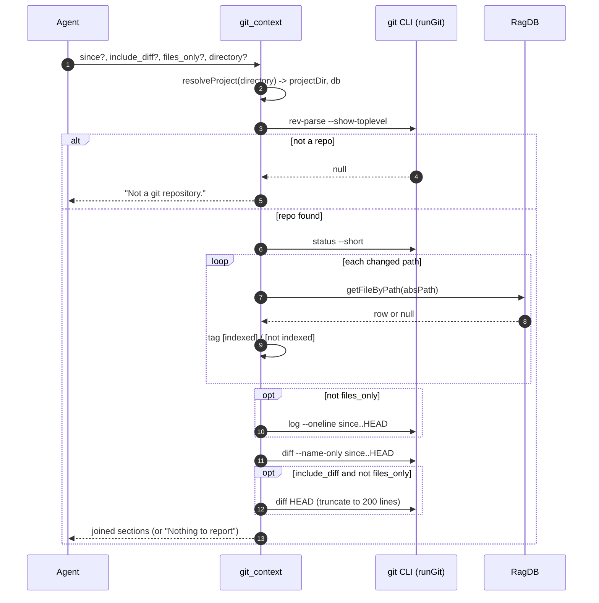

# Tool: git_context

`git_context` gives an agent a fast read on the working tree before it starts
searching or editing. In one call it reports what is uncommitted right now,
what has been committed recently, and which files changed across a range. The
piece that makes it more than a wrapper around `git status` is that every
uncommitted path is tagged with whether the search index already knows about
it, so the agent can tell apart "this file is indexed, I can search it" from
"this file was just created and is not searchable yet."

It is meant to be called at the start of a session to get oriented, so an agent
avoids redundant searches and conflicting edits on files someone is already
working on. The tool reads from `git` and from the project database; it writes
nothing and changes no state (`src/tools/git-tools.ts:43-100`).

## How it works

The handler is registered as the MCP tool `git_context` inside
`registerGitTools` (`src/tools/git-tools.ts:21-24`). Two small helpers do the
git work. `runGit` spawns `git` with the supplied arguments via `Bun.spawn` and
returns trimmed stdout when the process exits zero, or `null` on any non-zero
exit or spawn failure (`src/tools/git-tools.ts:6-15`). `findGitRoot` calls
`git rev-parse --show-toplevel` to locate the repository root
(`src/tools/git-tools.ts:17-19`).

When invoked, the handler first resolves the project directory and database
with `resolveProject`, which falls back to the `RAG_PROJECT_DIR` environment
variable or the current working directory when no `directory` argument is given
(`src/tools/git-tools.ts:44`, `src/tools/index.ts:22-37`). It then finds the
git root. If the directory is not inside a git repository, it returns the plain
text `Not a git repository.` and stops (`src/tools/git-tools.ts:46-49`).
Otherwise it builds up to four report sections and joins the non-empty ones
into a single Markdown block.

The look-back point defaults to `HEAD~5` and can be overridden with the `since`
argument (`src/tools/git-tools.ts:51`). Every git command after the root lookup
runs with the **git root** as its working directory, not the originally passed
project directory (`src/tools/git-tools.ts:55`, `:72`, `:79`, `:86`).



1. The agent calls the tool with up to four optional arguments. All four may be
   omitted; the defaults then take over (`src/tools/git-tools.ts:25-42`).
2. `resolveProject` turns the optional `directory` into an absolute path,
   verifies it exists, loads config, and returns the project's `RagDB` handle
   (`src/tools/index.ts:26-37`).
3. `findGitRoot` runs `git rev-parse --show-toplevel` from the resolved project
   directory to discover the repository root
   (`src/tools/git-tools.ts:17-19`, `:46`).
4. If no root comes back — the directory is not a git checkout, or `git` is not
   installed — the handler returns `Not a git repository.` and does no more
   work (`src/tools/git-tools.ts:47-49`).
5. With a root in hand, the handler runs `git status --short` to list
   uncommitted changes (`src/tools/git-tools.ts:55`).
6. For each non-empty status line, the handler extracts the path, resolves it
   against the git root, and asks the database whether that absolute path is
   indexed (`src/tools/git-tools.ts:59-65`).
7. `RagDB.getFileByPath` queries the `files` table by normalized path; a row
   means the file is indexed, `null` means it is not
   (`src/db/index.ts:780-782`, `src/db/files.ts:8-14`).
8. Unless `files_only` is set, the handler appends the recent-commit log for the
   `since..HEAD` range (`src/tools/git-tools.ts:71-76`).
9. The handler always queries the names of files changed across `since..HEAD`
   (`src/tools/git-tools.ts:79-82`).
10. When `include_diff` is true and `files_only` is false, the handler appends a
    unified diff of the working tree, truncated to 200 lines
    (`src/tools/git-tools.ts:85-93`).
11. Non-empty sections are joined with blank lines; if nothing was produced, the
    handler returns a clean-tree message instead
    (`src/tools/git-tools.ts:95-100`).

## Inputs

| name | type | required | description |
| --- | --- | --- | --- |
| `since` | string | no | Commit ref, branch, or ISO date to look back to. Defaults to `HEAD~5`. Used as the left side of the `since..HEAD` range for both the recent-commit log and the changed-files list (`src/tools/git-tools.ts:26-29`, `:51`). |
| `include_diff` | boolean | no | When true, appends the full working-tree diff (`git diff HEAD`) truncated to 200 lines. Default false. Ignored when `files_only` is also set (`src/tools/git-tools.ts:30-33`, `:85`). |
| `files_only` | boolean | no | When true, returns paths only: the uncommitted section lists the file path with its index tag, and the recent-commit log and diff sections are skipped entirely. Default false (`src/tools/git-tools.ts:34-37`, `:64`, `:71`, `:85`). |
| `directory` | string | no | Project directory to inspect. Falls back to `RAG_PROJECT_DIR` or the current working directory. Resolved to an absolute path and verified to exist before use (`src/tools/git-tools.ts:38-41`, `src/tools/index.ts:26-31`). |

## Outputs

| output | where it lands / shape / description |
| --- | --- |
| Git context report | A single text block returned in the MCP `content` array (`src/tools/git-tools.ts:100`). It is the non-empty subset of up to four Markdown sections — `## Uncommitted changes`, `## Recent commits (since <ref>)`, `## Changed files (since <ref>)`, and `## Diff` — joined by blank lines (`src/tools/git-tools.ts:66`, `:74`, `:81`, `:91`, `:95-98`). When every section is empty it is replaced by `Nothing to report (clean working tree, no recent commits in range).` (`src/tools/git-tools.ts:98`). |

The tool returns no structured fields and writes nothing to disk or the
database — the report is plain Markdown intended for an agent to read.

## The four report sections

### 1. Uncommitted changes, annotated with index status

The handler runs `git status --short` and keeps only non-empty lines
(`src/tools/git-tools.ts:55-57`). Each short-status line begins with a
two-character XY code plus a space, so the path starts at offset 3; the handler
slices that off and trims it (`src/tools/git-tools.ts:60`). Renames in
short-status form appear as `old -> new`, so when the path part contains
` -> ` the handler keeps the right-hand (new) path
(`src/tools/git-tools.ts:61`).

That relative path is resolved against the git root into an absolute path, and
`RagDB.getFileByPath` decides the tag: a matching `files` row yields
`[indexed]`, otherwise `[not indexed]` (`src/tools/git-tools.ts:62-63`). The
lookup normalizes separators to forward slashes before comparing, so the tag is
correct on Windows where `resolve` produces `\`-separated paths
(`src/db/files.ts:13`, `src/utils/path.ts:12-14`). In normal mode the tag is
appended to the raw status line (preserving the `M `/`??` prefix); in
`files_only` mode the prefix is dropped and only the path plus tag remains
(`src/tools/git-tools.ts:64`).

This index tag is the reason the tool exists. A file marked `[not indexed]` —
typically a brand-new untracked file — will not appear in `search` or
`read_relevant` results until the index is refreshed, so the tag tells an agent
when it must re-index before relying on semantic search. See
[index_status](./index-status.md) for the broader picture of which files are
indexed and stale.

### 2. Recent commits

Unless `files_only` is set, the handler runs `git log --oneline since..HEAD` and
appends the result under a `## Recent commits (since <ref>)` heading
(`src/tools/git-tools.ts:71-75`). With the default `since` of `HEAD~5` this
shows the last five commits as one-line subjects. The section is omitted when
`git log` returns nothing — for example when `HEAD` is at or behind the `since`
ref so the range is empty (`src/tools/git-tools.ts:73`).

### 3. Changed files since the ref

The handler always runs `git diff --name-only since..HEAD` and, when it returns
output, appends the file list under `## Changed files (since <ref>)`
(`src/tools/git-tools.ts:79-82`). Unlike the commit log, this section is
produced even in `files_only` mode, since it is itself just a list of paths.
Note these paths are **not** annotated with index status — only the
uncommitted-changes section carries `[indexed]`/`[not indexed]` tags.

### 4. Optional truncated diff

When `include_diff` is true and `files_only` is false, the handler runs
`git diff HEAD` to get the unified diff of all uncommitted changes
(`src/tools/git-tools.ts:85-86`). It splits the output on newlines, keeps the
first 200 lines, and appends a `[truncated]` marker if the diff was longer
(`src/tools/git-tools.ts:88-91`). Truncation bounds the token cost of a large
diff; an agent that needs the full diff should fall back to running `git diff`
directly.

## Branches and failure cases

| Branch | Condition | Behavior |
| --- | --- | --- |
| Not a git repo | `findGitRoot` returns `null` | Returns `Not a git repository.` and stops before any section work (`src/tools/git-tools.ts:47-49`). |
| Directory missing | Resolved `directory` does not exist | `resolveProject` throws `Directory does not exist: <path>` before the git root is even looked up (`src/tools/index.ts:32-34`). |
| Clean working tree | `git status --short` returns empty/null | The uncommitted-changes section is skipped (`src/tools/git-tools.ts:56-58`). |
| Empty commit range | `git log` returns nothing for `since..HEAD` | The recent-commits section is omitted (`src/tools/git-tools.ts:73`). |
| No changed files | `git diff --name-only` returns nothing | The changed-files section is omitted (`src/tools/git-tools.ts:80`). |
| `files_only` true | caller opts in | Uncommitted lines drop the status prefix; recent-commits and diff sections are skipped regardless of `include_diff` (`src/tools/git-tools.ts:64`, `:71`, `:85`). |
| `include_diff` true, no diff | working tree clean against `HEAD` | `git diff HEAD` returns nothing, so the diff section is omitted (`src/tools/git-tools.ts:87`). |
| Diff over 200 lines | long working-tree diff | Output is cut to the first 200 lines and a `[truncated]` marker is appended (`src/tools/git-tools.ts:89-91`). |
| Everything empty | repo exists but no section produced output | Returns `Nothing to report (clean working tree, no recent commits in range).` (`src/tools/git-tools.ts:98`). |
| `git` not installed / spawn fails | any `runGit` call throws | `runGit` catches and returns `null`, so the affected section is silently skipped rather than erroring (`src/tools/git-tools.ts:12-14`). |

A consequence of the last row: if `git` itself is missing, `findGitRoot` returns
`null` and the tool reports `Not a git repository.` even when the directory is a
valid checkout — the two failure modes are indistinguishable from the caller's
point of view.

## Example

Minimal call — uses every default (`HEAD~5`, no diff, full output):

```json
{}
```

Scope the look-back to a branch and include the diff body:

```json
{
  "since": "origin/main",
  "include_diff": true
}
```

Paths-only orientation for a large change set:

```json
{
  "files_only": true,
  "directory": "/abs/path/to/project"
}
```

Illustrative report shape for the default call (values synthetic):

```
## Uncommitted changes
 M src/example.ts  [indexed]
?? src/new-thing.ts  [not indexed]

## Recent commits (since HEAD~5)
<short-sha> fix: handle empty range
<short-sha> feat: add files_only mode

## Changed files (since HEAD~5)
src/example.ts
src/tools/git-tools.ts
```

## Relationship to other flows

The CLI command `mimirs session-context` does similar git work — it shells out
to `git` for uncommitted changes and recent commits — but bundles in index
counts, search-analytics gaps, and annotations on modified files, and is meant
for human session start rather than agent tool calls
(`src/cli/commands/session-context.ts:20-31`). See
[session-context](../cli/session-context.md). `git_context` is the narrower,
agent-facing slice with the per-file index tagging, and unlike the CLI command
it always uses an explicit `since..HEAD` range rather than a fixed `-5` log.

For commit history beyond the recent-log summary, the separate `search_commits`
and `file_history` tools query indexed git history semantically and by file
(`src/tools/git-history-tools.ts:35-36`, `:111-112`). `git_context` does not
touch that indexed history; it always shells out to live `git` for its commit
data.

## Key source files

- `src/tools/git-tools.ts` — the `git_context` MCP tool handler plus the
  `runGit` and `findGitRoot` helpers (`src/tools/git-tools.ts:6-103`).
- `src/tools/index.ts` — `resolveProject`, which resolves the directory and
  database, and registers the git tools (`src/tools/index.ts:22-45`, `:60`).
- `src/db/files.ts` — `getFileByPath`, the indexed-file lookup behind the
  `[indexed]`/`[not indexed]` tag (`src/db/files.ts:8-14`).
- `src/utils/path.ts` — `normalizePath`, which makes the path comparison
  platform-independent (`src/utils/path.ts:12-14`).
