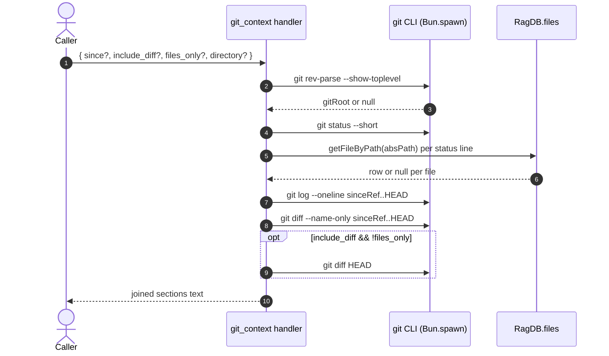

# Tool: git_context

Use this tool to orient at the start of a session — before searching or editing. It runs a small set of plumbing `git` commands against the working tree, then annotates each touched file with whether the mimirs index already knows about it. The combined output tells you what is dirty, what landed recently, and which of those files are searchable through `read_relevant` / `search` versus which would need a re-index first.

The handler is a thin shell wrapper. It does not write to the database, it does not embed anything, and it never modifies git state.

## Flow



1. The caller invokes `git_context` with four optional arguments. The handler resolves the project directory through `resolveProject(directory, getDB)` to get the indexed `RagDB` handle `src/tools/git-tools.ts:44`.
2. The handler shells out to `git rev-parse --show-toplevel` via `findGitRoot` to locate the repository root. If git is not installed, the directory is not a repo, or `git` exits non-zero, the wrapper returns `null` and the tool short-circuits with the literal string `Not a git repository.` `src/tools/git-tools.ts:17-19`, `src/tools/git-tools.ts:46-49`.
3. `git status --short` lists working-tree changes. For each line, the handler parses the file portion (handling the ` -> ` rename arrow by taking the destination), resolves it to an absolute path against the git root, and calls `ragDb.getFileByPath(absPath)`. A row hit yields the `[indexed]` tag; a miss yields `[not indexed]` `src/tools/git-tools.ts:55-67`.
4. Unless `files_only` is set, the handler appends recent commits from `git log --oneline <sinceRef>..HEAD` and the file list from `git diff --name-only <sinceRef>..HEAD`. `sinceRef` defaults to `HEAD~5` `src/tools/git-tools.ts:51`, `src/tools/git-tools.ts:71-82`.
5. When `include_diff` is true and `files_only` is false, `git diff HEAD` is captured and clipped to the first 200 lines, with a trailing `[truncated]` marker if anything was cut `src/tools/git-tools.ts:85-93`.
6. The handler joins the present sections with blank lines. If nothing produced output, it emits `Nothing to report (clean working tree, no recent commits in range).` `src/tools/git-tools.ts:95-100`.

## Inputs

| Name | Type | Default | Notes |
| --- | --- | --- | --- |
| `since` | string | `HEAD~5` | Any value `git log` accepts — commit SHA, branch, tag, or ISO date. Used as `<since>..HEAD` in both `git log` and `git diff --name-only`. |
| `include_diff` | boolean | `false` | When true, adds a fourth section with `git diff HEAD` truncated to 200 lines. Ignored when `files_only` is true. |
| `files_only` | boolean | `false` | Skips recent commits and the diff body; status lines collapse to `<file>  [indexed|not indexed]` instead of the raw porcelain prefix. |
| `directory` | string | `RAG_PROJECT_DIR` env or cwd | Resolved through `resolveProject`. The DB handle used for `[indexed]` lookups is the one for this directory; the git root is detected from the same directory. |

## Outputs

| Output | Shape |
| --- | --- |
| MCP text content | One string with up to four markdown sections joined by blank lines, or a single sentinel line when there is no repo / nothing to report. |

Section headers in order, when populated: `## Uncommitted changes`, `## Recent commits (since <ref>)`, `## Changed files (since <ref>)`, `## Diff` `src/tools/git-tools.ts:66-91`.

## Index annotation

Each uncommitted-change line is tagged with `[indexed]` or `[not indexed]`. The lookup goes through `RagDB.getFileByPath`, which delegates to `getFileByPath` in `src/db/files.ts`. That query matches by exact normalized path against the `files` table, so a hit means mimirs has at least one chunk row for that file and a miss means tools like `read_relevant` will not find it until you run `index_files`. Renamed files (porcelain `R  old -> new`) are tagged using the destination path, since that is what the index will store after the rename is committed and re-indexed.

## Branches and failure cases

- **Not a git repo.** `findGitRoot` returns `null` whenever `git rev-parse --show-toplevel` exits non-zero or `git` itself fails to spawn. The handler returns `Not a git repository.` and does no further work `src/tools/git-tools.ts:46-49`.
- **Empty working tree.** When `git status --short` produces no output, the `## Uncommitted changes` section is omitted entirely rather than rendered with an "empty" placeholder `src/tools/git-tools.ts:55-68`.
- **`files_only` suppresses commits and diff.** Recent-commit and `include_diff` sections are gated on `!files_only`; the changed-files section is always emitted when present `src/tools/git-tools.ts:71-93`.
- **Diff truncation.** Diffs longer than 200 lines are clipped and marked with `[truncated]`. There is no way to raise this cap from arguments — read the raw diff with `git diff` if you need more.
- **Nothing in range.** If every section is empty (clean tree, no commits in `<since>..HEAD`, no changed files), the tool returns the literal `Nothing to report` line so callers do not need to special-case empty text `src/tools/git-tools.ts:95-98`.
- **`runGit` swallows errors.** Any non-zero exit or thrown error from a child `git` invocation returns `null`, which collapses that section silently. There is no error surfaced to the caller for partial failures.

## Example

```json
{
  "name": "git_context",
  "arguments": {
    "since": "HEAD~10",
    "files_only": true
  }
}
```

Illustrative output shape (synthetic paths):

```
## Uncommitted changes
src/example.ts  [indexed]
wiki/new-page.md  [not indexed]

## Changed files (since HEAD~10)
src/example.ts
src/other.ts
```

## Related flows

- [search_commits](search-commits.md) — semantic search over indexed git history.
- [file_history](file-history.md) — commits that touched one file, served from the same indexed `git_commits` table.

## Key source files

- `src/tools/git-tools.ts` — registers `git_context`, runs `git`, annotates lines with index status.
- `src/db/files.ts` — backs `getFileByPath` used for the `[indexed]` lookup.
