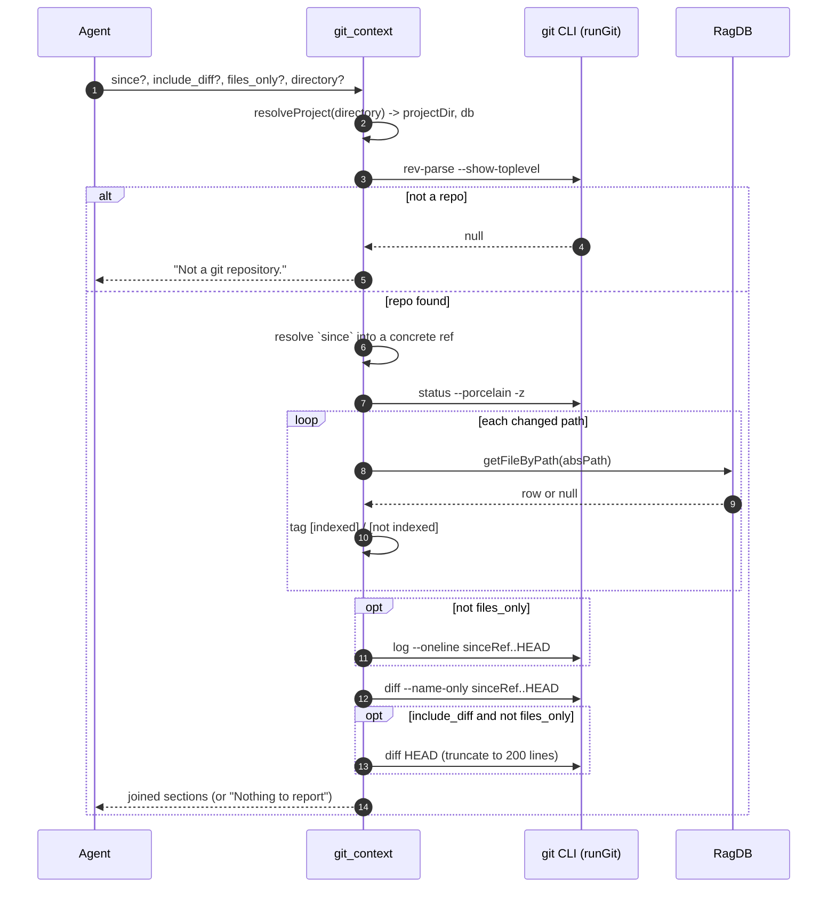

# Tool: git_context

`git_context` gives an agent a fast read on the working tree before it starts
searching or editing. In one call it reports what is uncommitted right now,
what has been committed recently, and which files changed across a range. The
piece that makes it more than a wrapper around `git status` is that every
uncommitted path is tagged with whether the search index already knows about
it, so the agent can tell apart "this file is indexed, I can search it" from
"this file was just created and is not searchable yet."

It is meant to be called at the start of a session to get oriented, so an agent
avoids redundant searches and conflicting edits on files someone is already
working on. The tool reads from live `git` and from the project database; it
writes nothing and changes no state (`src/tools/git-tools.ts:33-136`).

## How it works

The handler is registered as the MCP tool `git_context` inside
`registerGitTools` (`src/tools/git-tools.ts:11-14`). The actual git work goes
through shared helpers in `src/git/exec.ts`, which `git-tools.ts` imports and
re-exports so older importers keep their path (`src/tools/git-tools.ts:6-9`).
`runGit` spawns `git` with the supplied arguments via `Bun.spawn`, drains both
stdout and stderr concurrently — leaving stderr unread can deadlock `git` once
it fills its pipe buffer — and returns trimmed stdout on a clean exit, or `null`
on any non-zero exit or spawn failure (`src/git/exec.ts:13-33`). `findGitRoot`
calls `git rev-parse --show-toplevel` to locate the repository root
(`src/git/exec.ts:36-38`).

When invoked, the handler first resolves the project directory and database
with `resolveProject`, which falls back to the `RAG_PROJECT_DIR` environment
variable or the current working directory when no `directory` argument is given
(`src/tools/git-tools.ts:34`, `src/tools/index.ts:33-47`). It then finds the
git root. If the directory is not inside a git repository, it returns the plain
text `Not a git repository.` and stops (`src/tools/git-tools.ts:36-39`).
Otherwise it resolves the look-back point, builds up to four report sections,
and joins the non-empty ones into a single Markdown block.

Every git command after the root lookup runs with the **git root** as its
working directory, not the originally passed project directory
(`src/tools/git-tools.ts:81`, `:107`, `:114`, `:121`).



1. The agent calls the tool with up to four optional arguments. All four may be
   omitted; the defaults then take over (`src/tools/git-tools.ts:15-32`).
2. `resolveProject` turns the optional `directory` into an absolute path,
   verifies it exists, loads config, and returns the project's `RagDB` handle
   (`src/tools/index.ts:33-47`).
3. `findGitRoot` runs `git rev-parse --show-toplevel` from the resolved project
   directory to discover the repository root
   (`src/git/exec.ts:36-38`, `src/tools/git-tools.ts:36`).
4. If no root comes back — the directory is not a git checkout, or `git` is not
   installed — the handler returns `Not a git repository.` and does no more
   work (`src/tools/git-tools.ts:37-39`).
5. The handler resolves the `since` argument into a concrete commit ref, with
   distinct handling for option-like values, ISO dates, and named refs, then
   falls back to `HEAD~5` (or the root commit) when `since` is omitted
   (`src/tools/git-tools.ts:48-73`).
6. With a root and a ref in hand, the handler runs `git status --porcelain -z`
   to list uncommitted changes (`src/tools/git-tools.ts:81`).
7. For each NUL-separated status entry, the handler extracts the path, resolves
   it against the git root, and asks the database whether that absolute path is
   indexed (`src/tools/git-tools.ts:82-100`).
8. `RagDB.getFileByPath` queries the `files` table by normalized path; a row
   means the file is indexed, `null` means it is not
   (`src/db/index.ts:883-885`, `src/db/files.ts:9-15`).
9. Unless `files_only` is set, the handler appends the recent-commit log for the
   `sinceRef..HEAD` range (`src/tools/git-tools.ts:106-111`).
10. The handler always queries the names of files changed across
    `sinceRef..HEAD` (`src/tools/git-tools.ts:114-117`).
11. When `include_diff` is true and `files_only` is false, the handler appends a
    unified diff of the working tree, truncated to 200 lines
    (`src/tools/git-tools.ts:120-128`).
12. Non-empty sections are joined with blank lines; if nothing was produced, the
    handler returns a clean-tree message instead
    (`src/tools/git-tools.ts:130-135`).

## Inputs

| name | type | required | description |
| --- | --- | --- | --- |
| `since` | string | no | Commit ref, branch, or ISO date to look back to. Defaults to `HEAD~5`. Used as the left side of the `sinceRef..HEAD` range for both the recent-commit log and the changed-files list (`src/tools/git-tools.ts:16-19`, `:48-73`). |
| `include_diff` | boolean | no | When true, appends the full working-tree diff (`git diff HEAD`) truncated to 200 lines. Default false. Ignored when `files_only` is also set (`src/tools/git-tools.ts:20-23`, `:120`). |
| `files_only` | boolean | no | When true, returns paths only: the uncommitted section lists the file path with its index tag, and the recent-commit log and diff sections are skipped entirely. Default false (`src/tools/git-tools.ts:24-27`, `:99`, `:106`, `:120`). |
| `directory` | string | no | Project directory to inspect. Falls back to `RAG_PROJECT_DIR` or the current working directory. Resolved to an absolute path and verified to exist before use (`src/tools/git-tools.ts:28-31`, `src/tools/index.ts:38-47`). |

## Outputs

| output | where it lands / shape / description |
| --- | --- |
| Git context report | A single text block returned in the MCP `content` array (`src/tools/git-tools.ts:135`). It is the non-empty subset of up to four Markdown sections — `## Uncommitted changes`, `## Recent commits (since <ref>)`, `## Changed files (since <ref>)`, and `## Diff` — joined by blank lines (`src/tools/git-tools.ts:101`, `:109`, `:116`, `:126`, `:130-133`). When every section is empty it is replaced by `Nothing to report (clean working tree, no recent commits in range).` (`src/tools/git-tools.ts:133`). |

The tool returns no structured fields and writes nothing to disk or the
database — the report is plain Markdown intended for an agent to read.

## Resolving the `since` reference

Before any section runs, the handler turns the `since` argument into one
concrete commit ref called `sinceRef`. This is a read-only tool, so the
resolution path is also a small guard against turning a stray value into a git
write or a silently empty report (`src/tools/git-tools.ts:41-73`):

- **Option-like values are rejected.** A `since` that starts with `-` would be
  parsed by `git` as an option (for example `--output=...` is a write
  primitive), so the handler returns `Invalid since: "<value>" — must be a
  commit ref, branch, or ISO date.` and stops (`src/tools/git-tools.ts:50-52`).
- **ISO-date shaped values are translated.** When `since` matches a leading
  `YYYY-MM-DD`, the handler runs `git rev-list -1 --before=<since> HEAD` to find
  the newest commit before that date and uses its hash as `sinceRef`. Range
  syntax like `2025-01-01..HEAD` is an unknown-revision error, which is why the
  date is converted to a ref first. If no commit predates the date, it returns
  `No commits found before date <since>.` (`src/tools/git-tools.ts:53-58`).
- **Named refs are verified.** Anything else is validated with
  `git rev-parse --verify --quiet <since>^{commit}`, so a typo'd ref produces a
  loud `Unknown commit ref: "<since>".` instead of silently empty sections
  (`src/tools/git-tools.ts:59-65`).
- **The default look-back is `HEAD~5`, with a shallow-repo fallback.** When
  `since` is omitted, the handler tries `HEAD~5`; in a repo with five or fewer
  commits that ref does not resolve, so it falls back to the root commit
  (`git rev-list --max-parents=0 --first-parent -1 HEAD`), and finally to `HEAD`
  itself, so fresh repos still report history
  (`src/tools/git-tools.ts:66-73`).

## The four report sections

### 1. Uncommitted changes, annotated with index status

The handler runs `git status --porcelain -z` in raw mode and splits the output
on NUL bytes (`src/tools/git-tools.ts:81-84`). The `-z` form is used
deliberately: `--short` C-quotes paths that contain spaces, which then never
match the index lookup, and a worktree-only first entry starts with a leading
space (`" M file"`) that an ordinary trim would eat, corrupting the first
entry's status and path (`src/tools/git-tools.ts:77-80`). Each entry's first two
characters are the XY status code and the path starts at offset 3
(`src/tools/git-tools.ts:87-88`). Renames and copies emit the original path as
the next NUL field, so when either status column is `R` or `C` the handler skips
that extra field; it checks both columns because worktree-only renames report
`" R"`, not `"R "` (`src/tools/git-tools.ts:89-94`).

That relative path is resolved against the git root into an absolute path, and
`RagDB.getFileByPath` decides the tag: a matching `files` row yields
`[indexed]`, otherwise `[not indexed]` (`src/tools/git-tools.ts:96-100`). The
lookup normalizes separators to forward slashes before comparing, so the tag is
correct on Windows where `resolve` produces `\`-separated paths
(`src/db/files.ts:9-14`). In normal mode the tag is appended to the raw status
line (preserving the two-character status prefix); in `files_only` mode the
prefix is dropped and only the path plus tag remains
(`src/tools/git-tools.ts:99`).

This index tag is the reason the tool exists. A file marked `[not indexed]` —
typically a brand-new untracked file — will not appear in `search` or
`read_relevant` results until the index is refreshed, so the tag tells an agent
when it must re-index before relying on semantic search. See
[index_status](./index-status.md) for the broader picture of which files are
indexed and stale.

### 2. Recent commits

Unless `files_only` is set, the handler runs `git log --oneline sinceRef..HEAD`
and appends the result under a `## Recent commits (since <ref>)` heading
(`src/tools/git-tools.ts:106-111`). With the default of `HEAD~5` this shows the
last five commits as one-line subjects. The section is omitted when `git log`
returns nothing — for example when `HEAD` is at or behind the resolved ref so
the range is empty (`src/tools/git-tools.ts:108`). The heading echoes the
caller's original `since` value when one was given, otherwise the resolved
`sinceRef` (`src/tools/git-tools.ts:109`).

### 3. Changed files since the ref

The handler always runs `git diff --name-only sinceRef..HEAD` and, when it
returns output, appends the file list under `## Changed files (since <ref>)`
(`src/tools/git-tools.ts:114-117`). Unlike the commit log, this section is
produced even in `files_only` mode, since it is itself just a list of paths.
Note these paths are **not** annotated with index status — only the
uncommitted-changes section carries `[indexed]`/`[not indexed]` tags.

### 4. Optional truncated diff

When `include_diff` is true and `files_only` is false, the handler runs
`git diff HEAD` to get the unified diff of all uncommitted changes
(`src/tools/git-tools.ts:120-121`). It splits the output on newlines, keeps the
first 200 lines, and appends a `[truncated]` marker if the diff was longer
(`src/tools/git-tools.ts:122-127`). Truncation bounds the token cost of a large
diff; an agent that needs the full diff should fall back to running `git diff`
directly.

## Branches and failure cases

| Branch | Condition | Behavior |
| --- | --- | --- |
| Not a git repo | `findGitRoot` returns `null` | Returns `Not a git repository.` and stops before any section work (`src/tools/git-tools.ts:37-39`). |
| Directory missing | Resolved `directory` does not exist | `resolveProject` throws `Directory does not exist: <path>` before the git root is even looked up (`src/tools/index.ts:45-47`). |
| Option-like `since` | `since` begins with `-` | Returns `Invalid since: "<value>" — must be a commit ref, branch, or ISO date.` (`src/tools/git-tools.ts:50-52`). |
| ISO `since`, no commits before date | `git rev-list --before` finds nothing | Returns `No commits found before date <since>.` (`src/tools/git-tools.ts:54-57`). |
| Unknown `since` ref | `git rev-parse --verify` fails | Returns `Unknown commit ref: "<since>".` (`src/tools/git-tools.ts:60-63`). |
| Shallow repo, default `since` | `HEAD~5` does not resolve | Falls back to the root commit, then to `HEAD`, so history is still reported (`src/tools/git-tools.ts:69-72`). |
| Clean working tree | `git status --porcelain -z` returns empty/null | The uncommitted-changes section is skipped (`src/tools/git-tools.ts:82-103`). |
| Empty commit range | `git log` returns nothing for `sinceRef..HEAD` | The recent-commits section is omitted (`src/tools/git-tools.ts:108`). |
| No changed files | `git diff --name-only` returns nothing | The changed-files section is omitted (`src/tools/git-tools.ts:115`). |
| `files_only` true | caller opts in | Uncommitted lines drop the status prefix; recent-commits and diff sections are skipped regardless of `include_diff` (`src/tools/git-tools.ts:99`, `:106`, `:120`). |
| `include_diff` true, no diff | working tree clean against `HEAD` | `git diff HEAD` returns nothing, so the diff section is omitted (`src/tools/git-tools.ts:122`). |
| Diff over 200 lines | long working-tree diff | Output is cut to the first 200 lines and a `[truncated]` marker is appended (`src/tools/git-tools.ts:124-126`). |
| Everything empty | repo exists but no section produced output | Returns `Nothing to report (clean working tree, no recent commits in range).` (`src/tools/git-tools.ts:133`). |
| `git` not installed / spawn fails | any `runGit` call throws | `runGit` catches and returns `null`, so the affected section is silently skipped rather than erroring (`src/git/exec.ts:28-32`). |

A consequence of the last row: if `git` itself is missing, `findGitRoot` returns
`null` and the tool reports `Not a git repository.` even when the directory is a
valid checkout — the two failure modes are indistinguishable from the caller's
point of view.

## Example

Minimal call — uses every default (`HEAD~5`, no diff, full output):

```json
{}
```

Scope the look-back to a branch and include the diff body:

```json
{
  "since": "origin/main",
  "include_diff": true
}
```

Paths-only orientation for a large change set:

```json
{
  "files_only": true,
  "directory": "/abs/path/to/project"
}
```

Illustrative report shape for the default call (values synthetic):

```
## Uncommitted changes
 M src/example.ts  [indexed]
?? src/new-thing.ts  [not indexed]

## Recent commits (since HEAD~5)
<short-sha> fix: handle empty range
<short-sha> feat: add files_only mode

## Changed files (since HEAD~5)
src/example.ts
src/tools/git-tools.ts
```

## Relationship to other flows

The CLI command `mimirs session-context` does similar git work — it shells out
to `git` for uncommitted changes and recent commits — but bundles in index
counts, search-analytics gaps, and annotations on modified files, and is meant
for human session start rather than agent tool calls. See
[session-context](../cli/session-context.md). `git_context` is the narrower,
agent-facing slice with the per-file index tagging, and it always uses an
explicit `sinceRef..HEAD` range resolved from `since`.

For commit history beyond the recent-log summary, the separate `search_commits`
and `file_history` tools query indexed git history semantically and by file
(`src/tools/git-history-tools.ts:48-49`, `:128-130`). `git_context` does not
touch that indexed history; it always shells out to live `git` for its commit
data. See [search_commits](./search-commits.md) and
[file_history](./file-history.md).

## Key source files

- `src/tools/git-tools.ts` — the `git_context` MCP tool handler, the `since`
  resolution, and the four report sections (`src/tools/git-tools.ts:11-138`).
- `src/git/exec.ts` — `runGit`, `findGitRoot`, and `getHeadSha`, the shared git
  subprocess helpers (`src/git/exec.ts:13-50`).
- `src/tools/index.ts` — `resolveProject`, which resolves the directory and
  database, and registers the git tools (`src/tools/index.ts:33-47`).
- `src/db/files.ts` — `getFileByPath`, the indexed-file lookup behind the
  `[indexed]`/`[not indexed]` tag (`src/db/files.ts:9-15`).
