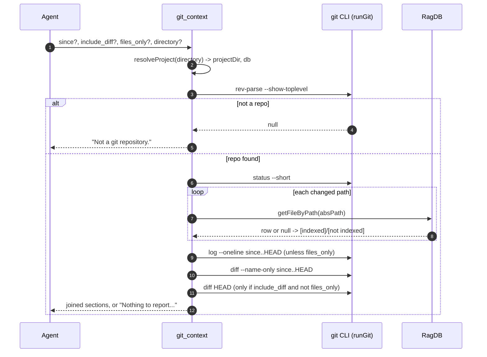

# Tool: git_context

`git_context` gives an agent a quick orientation on the working tree before it
starts searching or editing: what is uncommitted right now, what has been
committed recently, and which files changed over a range. Crucially, every
uncommitted path is tagged with whether the search index already knows about
it, so the agent can tell apart "this file is in the index, I can search it"
from "this file was just created and is not searchable yet". It is meant to be
called at the start of a session to avoid redundant searches and conflicting
edits on files someone is already working on.

The tool shells out to `git` for the actual data and consults the project
database only to decide the index tags. It writes nothing.

## How it works

The handler is registered as the MCP tool `git_context` in
`registerGitTools` (`src/tools/git-tools.ts:21-24`). Two small helpers do the
git work: `runGit` spawns `git` with the given arguments and returns trimmed
stdout on a zero exit code, or `null` on any non-zero exit or spawn failure
(`src/tools/git-tools.ts:6-15`); `findGitRoot` runs
`git rev-parse --show-toplevel` to locate the repository root
(`src/tools/git-tools.ts:17-19`).

After resolving the project directory and database with `resolveProject`
(`src/tools/git-tools.ts:44`), the handler finds the git root. If the
directory is not inside a git repository, it returns `Not a git repository.`
and stops (`src/tools/git-tools.ts:46-49`). Otherwise it builds up to four
report sections and joins the non-empty ones.

The look-back point defaults to `HEAD~5` and can be overridden with `since`
(`src/tools/git-tools.ts:51`). All git commands run with the **git root** as
their working directory, not the originally passed project directory
(`src/tools/git-tools.ts:55`, `src/tools/git-tools.ts:72`).



1. The agent calls the tool with optional `since`, `include_diff`,
   `files_only`, and `directory` (`src/tools/git-tools.ts:25-42`).
2. `resolveProject` resolves the directory (or `RAG_PROJECT_DIR` / cwd) and
   returns the project path plus the database handle
   (`src/tools/git-tools.ts:44`).
3. `findGitRoot` locates the repository top level; a `null` result short-circuits
   to the "Not a git repository." message
   (`src/tools/git-tools.ts:46-49`).
4. `git status --short` lists uncommitted changes; each line is parsed and the
   path is looked up in the index to choose an `[indexed]` or `[not indexed]`
   tag (`src/tools/git-tools.ts:55-67`).
5. Unless `files_only` is set, `git log --oneline <since>..HEAD` produces the
   recent-commits section (`src/tools/git-tools.ts:71-76`).
6. `git diff --name-only <since>..HEAD` produces the changed-files section
   (`src/tools/git-tools.ts:79-82`).
7. When `include_diff` is set and `files_only` is not, `git diff HEAD`
   produces a diff section, truncated to the first 200 lines
   (`src/tools/git-tools.ts:85-93`).
8. Non-empty sections are joined; if there are none, a clean-tree message is
   returned (`src/tools/git-tools.ts:95-100`).

## Inputs

| name | type | required | description |
| --- | --- | --- | --- |
| `since` | string | no | Commit ref, branch, or ISO date marking the start of the range. Defaults to `HEAD~5` (`src/tools/git-tools.ts:26-29`, `src/tools/git-tools.ts:51`). |
| `include_diff` | boolean | no | When true (and `files_only` is false), append a unified diff of uncommitted changes, truncated to 200 lines. Defaults to false (`src/tools/git-tools.ts:30-33`, `src/tools/git-tools.ts:85-93`). |
| `files_only` | boolean | no | When true, return paths only: drop commit messages and the diff body, and print just the file path plus index tag for uncommitted changes. Defaults to false (`src/tools/git-tools.ts:34-37`, `src/tools/git-tools.ts:64`). |
| `directory` | string | no | Project directory. Falls back to `RAG_PROJECT_DIR`, then cwd (`src/tools/git-tools.ts:38-41`). |

## Outputs

| output | where it lands / shape / description |
| --- | --- |
| Uncommitted changes | `## Uncommitted changes` followed by one line per `git status --short` entry. Each line is suffixed with `  [indexed]` or `  [not indexed]`. With `files_only`, the porcelain status code is dropped and only the path plus tag remain (`src/tools/git-tools.ts:56-67`). |
| Recent commits | `## Recent commits (since <ref>)` followed by `git log --oneline` output for `<since>..HEAD`. Omitted entirely when `files_only` is true (`src/tools/git-tools.ts:71-76`). |
| Changed files | `## Changed files (since <ref>)` followed by `git diff --name-only` output for `<since>..HEAD` (`src/tools/git-tools.ts:79-82`). |
| Diff | `## Diff` followed by `git diff HEAD`, capped at 200 lines with a trailing `[truncated]` marker when longer. Only present when `include_diff` is true and `files_only` is false (`src/tools/git-tools.ts:85-93`). |
| Fallback messages | `Not a git repository.` when there is no git root, or `Nothing to report (clean working tree, no recent commits in range).` when every section was empty (`src/tools/git-tools.ts:48`, `src/tools/git-tools.ts:95-98`). |

## Index annotation

The reason this tool reaches into the database at all is the per-path index
tag. For each uncommitted entry it parses the path out of the porcelain status
line (slicing past the two-character status code and a space), follows a rename
arrow `a -> b` to the destination path, resolves it to an absolute path against
the git root, and looks it up with `ragDb.getFileByPath(absPath)`
(`src/tools/git-tools.ts:59-63`). A non-null row means the file is already in
the search index and is tagged `[indexed]`; otherwise `[not indexed]`. This is
what lets the agent know a freshly created file will not yet appear in search
results.

## Branches and failure cases

- **Not a git repository.** When `findGitRoot` returns `null`, the tool
  returns `Not a git repository.` and runs nothing else
  (`src/tools/git-tools.ts:46-49`).
- **Clean tree, empty range.** If every git command yields empty output (no
  status, no commits, no changed files), no section is pushed and the
  "Nothing to report" message is returned (`src/tools/git-tools.ts:95-98`).
- **`files_only` set.** The recent-commits section is skipped and the diff
  section is skipped (the diff is also gated on `include_diff`); uncommitted
  lines print path + tag instead of the full porcelain line
  (`src/tools/git-tools.ts:64`, `src/tools/git-tools.ts:71`,
  `src/tools/git-tools.ts:85`).
- **`include_diff` without changes.** If `git diff HEAD` is empty, no diff
  section is added even when `include_diff` is true
  (`src/tools/git-tools.ts:86-87`).
- **Long diff.** A diff over 200 lines is sliced to 200 and a `[truncated]`
  marker is appended (`src/tools/git-tools.ts:88-91`).
- **A git command fails.** `runGit` returns `null` on any non-zero exit or
  thrown spawn error, and each section is guarded by a truthiness check, so a
  failing or empty command simply omits its section rather than erroring the
  whole call (`src/tools/git-tools.ts:6-15`, `src/tools/git-tools.ts:56`,
  `src/tools/git-tools.ts:73`, `src/tools/git-tools.ts:80`).
- **Renamed files.** A status line of the form `R  old -> new` is annotated by
  the destination path, since that is the path that will exist on disk
  (`src/tools/git-tools.ts:61`).

## Example

Example arguments:

```json
{
  "since": "HEAD~10",
  "files_only": true
}
```

Illustrative output (values synthetic):

```
## Uncommitted changes
src/example.ts  [indexed]
src/new-thing.ts  [not indexed]

## Changed files (since HEAD~10)
src/example.ts
README.md
```

## Key source files

- `src/tools/git-tools.ts` — the MCP tool handler plus the `runGit` and
  `findGitRoot` helpers that wrap the git CLI.
- `src/db/index.ts` — `RagDB.getFileByPath` is consulted to produce the
  `[indexed]` / `[not indexed]` tags.

## Related flows

- [search_commits](search-commits.md) — semantic search over indexed commit
  history, complementary to the raw `git log` shown here.
- [file_history](file-history.md) — commit history for a single file.
