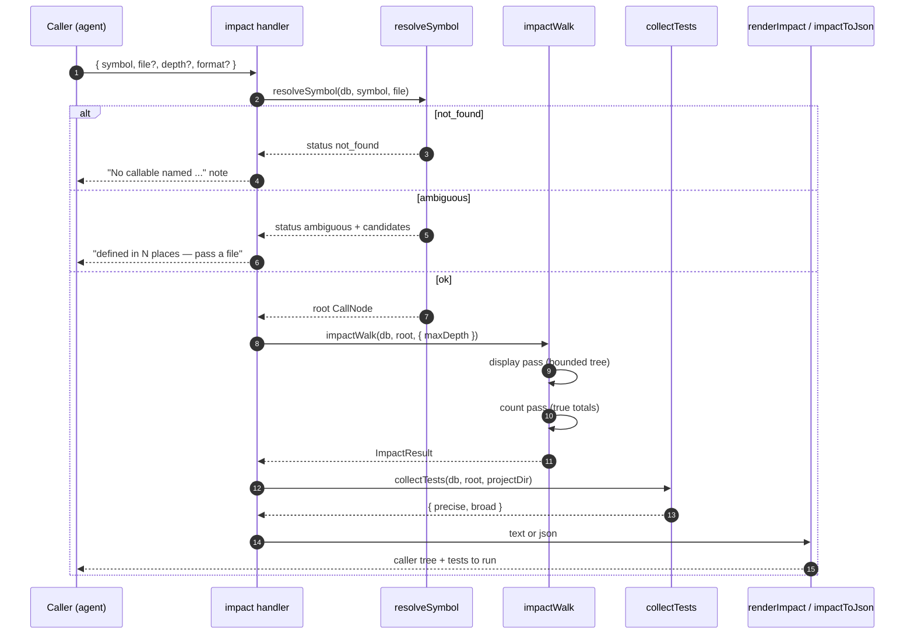

# Tool: impact

`impact` answers the question you ask right before changing a function: *if I touch this, what breaks, and what do I test?* You give it a function or method name and it returns two things — a pruned tree of everything that transitively *calls* that symbol (the blast radius), and the list of test files to run for the change. It works at the symbol level, which is finer than [`dependents`](dependents.md): where `dependents` tells you which *files* import a target, `impact` tells you which *functions* reach it, hop by hop, and stops the dynamic-dispatch handwaving by saying out loud when a chain can't be followed.

Use it before changing a signature or behavior, when "grep the name" gives you call sites but not the call *chain*, and when you want a defensible answer to "which tests cover this." For raw textual references rather than the resolved call tree, reach for [`usages`](usages.md); to ask the opposite question — *how does X reach Y* — use [`trace`](trace.md).

## What runs when you call it



1. The caller invokes the tool with a required `symbol`, plus optional `file` (to disambiguate), `depth`, `directory`, and `format`. The handler is registered inside `registerGraphTools` (`src/tools/graph-tools.ts:212-250`).
2. `resolveSymbol` looks the name up among callable definitions, optionally narrowed by `file`, and returns one of three statuses: `ok` with a single node, `not_found`, or `ambiguous` with the candidate list (`src/graph/trace.ts:175-194`).
3. On `not_found` the tool returns a single explanatory line; on `ambiguous` it lists the candidate files and asks the caller to pass a `file`. Only `ok` proceeds (`src/tools/graph-tools.ts:232-239`).
4. `impactWalk` runs two passes over the call graph: a *display pass* that builds the bounded, pruned tree the agent reads, and a *count pass* that computes the true transitive totals so the headline number stays honest (`src/graph/trace.ts:224-310`).
5. `collectTests` gathers the test files to run, split into "precise" (tests that name the symbol) and "broad" (tests that transitively import the symbol's file) (`src/graph/trace.ts:506-532`).
6. The result is rendered as readable text by `renderImpact`, or as a structured object by `impactToJson` when `format: "json"` is passed (`src/tools/graph-tools.ts:245-248`).

## Resolving the symbol and handling ambiguity

A bare name is not enough — the same function name can be defined in many files, and an "impact" answer for the wrong one is worse than no answer. `resolveSymbol` calls `getCallablesByName`, which queries two sources: exported functions and methods from `file_exports`, and module-private (non-exported) functions and methods from the chunk table that have no matching export row (`src/db/graph.ts:763-817`). Only callable kinds are returned — classes, constants, and types are not tracked, which is why the not-found message says so.

When a `file` argument is given, candidates are filtered to those whose path ends with that (slash-normalized) suffix, so `impact("handle", "routes/users.ts")` keeps only the definition in that file (`src/graph/trace.ts:177-180`). An export and a same-name local in the *same* file collapse to the export, since they are the same declaration seen two ways (`src/graph/trace.ts:184-190`). After that:

| outcome | condition | what the caller sees |
| --- | --- | --- |
| `not_found` | zero candidates after filtering | a line noting it may be a class/constant/type, in an excluded path, or not indexed yet (`src/tools/graph-tools.ts:232-236`) |
| `ambiguous` | more than one distinct candidate | the name "is defined in N places — pass a file to pick one", listing up to 15 candidate paths (`src/tools/graph-tools.ts:23-31`) |
| `ok` | exactly one candidate | the walk proceeds against that node |

## Walking transitive callers: the display pass

The blast radius is computed over a per-walk view of the call graph, `CallGraph`, which loads every callable export and a project-wide map of inbound reference counts once, then memoizes edge lookups so repeated nodes cost no extra database hits (`src/graph/trace.ts:44-57`). A node's *callers* come from the resolved symbol-ref graph: for an exported callable, `getCallersOfExport` returns every distinct enclosing callable that references it; for a module-private one, `getCallersOfLocalSymbol` returns same-file callers only (`src/graph/trace.ts:122-151`, `src/db/graph.ts:717-745`).

The display pass is a breadth-first walk outward from the target, bounded three ways (`src/graph/trace.ts:235-273`):

- **Depth.** It stops expanding past `maxDepth` (default 3). A node at the depth limit that still has callers flips a `truncated` flag, so the tree honestly signals it was cut.
- **Budget.** It expands at most `budget` (80) nodes. Because the walk is breadth-first, the budget is spent on the *nearest* callers first — the ones most likely to matter — and deeper ones are dropped.
- **Already seen.** A node reached twice is shown once and marked `(↑ seen above)`, so cycles and diamonds don't re-expand into duplicate subtrees.

### Ambient pruning by per-export inbound count

Some callables are called from everywhere — a logger, a small string helper — and walking *into* them would explode the tree without telling you anything about the change. The walk prunes these "ambient" nodes: it shows them as a leaf marked `(ambient — not expanded)` and never walks their callers (`src/graph/trace.ts:260-265`). The threshold is `AMBIENT_FANIN = 25` (`src/graph/trace.ts:41`).

The subtle part is *how* fan-in is measured. It is the inbound count for that **specific export id**, from `countInboundRefsByExport`, not a count by name (`src/graph/trace.ts:56`, `src/graph/trace.ts:72-77`, `src/db/graph.ts:827-851`). Counting by name would be wrong: a common method name like `search` would inherit a project-wide tally and get pruned even where a particular `search` has only two real callers. Locals are never ambient — their caller set is same-file only, so it is naturally small (`src/graph/trace.ts:70-74`). Each pruned node's name and inbound count is collected so the renderer can list them under an `ambient (high fan-in, not expanded)` footer (`src/graph/trace.ts:621-626`).

## The count pass: an honest headline

The bounded tree is good to read but a poor count — depth, budget, and ambient pruning all hide callers. So a second pass walks the same caller edges with *no* bounds except a safety cap, accumulating a visited set of distinct callers and the set of files they live in (`src/graph/trace.ts:279-296`). It reuses the edges the display pass already memoized, so overlapping nodes cost nothing extra. The result carries both numbers: `shownCallers` (what the tree printed) and `totalCallers` / `totalFiles` (the true transitive set).

The safety cap is `COUNT_CAP = 2000` (`src/graph/trace.ts:222`). If the count walk hits it, `totalCapped` is set and the headline reports `≥N` rather than an exact figure — a pathological hot symbol can't make the count run unbounded (`src/graph/trace.ts:611`). The header line reflects all of this: it states the true total ("called by N symbols across M files"), and when the printed tree shows fewer, it adds "showing the K nearest (depth ≤ D)" and a hint to raise `depth`, pass `file`, or run `impact` on a node higher up to expand the rest (`src/graph/trace.ts:611-629`).

## Tests to run: precise vs broad

`collectTests` answers "what should I run" with two lists computed differently (`src/graph/trace.ts:506-532`):

| list | how it's built | what it means |
| --- | --- | --- |
| **precise** | test files that *name the symbol* — `getSymbolReferencesByName` filtered to test paths (`src/graph/trace.ts:516`) | tests that exercise this symbol by name; the highest-signal tests to run |
| **broad** | test files in the *transitive importer closure* of the symbol's file, minus the precise ones (`src/graph/trace.ts:520-525`) | tests that don't name the symbol but reach its file through the import graph |

A file counts as a test when its path matches the shared test-path patterns in `isTestPath` (a `tests/`, `__tests__/`, `spec/`, `test_` segment, or a `.test.`/`.spec.` suffix) (`src/utils/test-paths.ts:9-19`). The broad list comes from `transitiveImporters`, the same file-level importer-closure walk the [`affected`](../cli/affected.md) CLI uses (`src/graph/trace.ts:488-504`). Both lists are made project-relative and sorted; the renderer caps each block at 25 entries and appends a `… +N more` line when there are more (`src/graph/trace.ts:636-651`).

## Inputs

| name | type | required | description |
| --- | --- | --- | --- |
| `symbol` | string (1–200 chars) | yes | Function or method name to analyze. Resolved to a callable via `getCallablesByName`; classes, constants, and types are not tracked (`src/tools/graph-tools.ts:216`, `src/db/graph.ts:763-817`). |
| `file` | string | no | Project-relative path used to disambiguate when the name is defined in several places. Matched as a path suffix (`src/graph/trace.ts:177-180`). |
| `depth` | integer 1–6 | no | Caller levels the printed tree walks. Defaults to 3 (`src/tools/graph-tools.ts:221`, `src/graph/trace.ts:229`). |
| `directory` | string | no | Project whose index to query. Defaults to `RAG_PROJECT_DIR` or the current working directory (`src/tools/index.ts:26`). |
| `format` | `"text"` \| `"json"` | no | Output shape. Defaults to `"text"`; `"json"` returns the structured object from `impactToJson` (`src/tools/graph-tools.ts:226`, `src/tools/graph-tools.ts:245-247`). |

## Outputs

| output | where it lands / shape / description |
| --- | --- |
| Pruned caller tree | A text block: a header naming the symbol, its location, the true total callers/files, and (when partial) the shown count and depth, followed by the indented tree with `(↑ seen above)` and `(ambient — not expanded)` markers, an ambient footer, and an expand-the-rest hint (`src/graph/trace.ts:600-633`). |
| Tests to run | A `Tests to run: N` block listing the precise and broad test files, each capped at 25 with a `… +N more` overflow line (`src/graph/trace.ts:636-651`). |
| JSON structured result | When `format: "json"`, an object with `root`, `shownCallers`, `totalCallers`, `totalCapped`, `totalFiles`, `maxDepth`, `truncated`, `ambient[]`, a nested `callers` tree, and `tests` (`src/graph/trace.ts:704-717`). |

This tool only reads the index; it opens no files, runs no parser, and writes nothing back to the database, so it produces no persistent state changes.

## Branches and failure cases

- **Symbol not found.** `resolveSymbol` returns `not_found` when no callable matches; the tool returns the "No callable named …" line and stops (`src/tools/graph-tools.ts:232-236`).
- **Ambiguous symbol.** More than one distinct definition returns `ambiguous`; the tool lists up to 15 candidate paths and asks for a `file` (`src/tools/graph-tools.ts:23-31`, `src/tools/graph-tools.ts:237-239`).
- **No callers found.** When the count pass finds zero callers, `renderImpact` returns a "No callers found" message. For a local symbol it notes only same-file callers are tracked; for an export it notes the symbol looks like an entry point or is reached only via dynamic dispatch (`src/graph/trace.ts:602-608`).
- **Tree truncated by depth.** A node at `maxDepth` with further callers sets `truncated`; the header switches to "showing the K nearest (depth ≤ D)" and prints the expand-the-rest hint (`src/graph/trace.ts:246-248`, `src/graph/trace.ts:616`, `src/graph/trace.ts:627-629`).
- **Tree truncated by budget.** Past 80 expanded nodes, further callers are dropped and `truncated` is set; breadth-first order means the nearest callers survive (`src/graph/trace.ts:266-269`).
- **Ambient callers pruned.** Callers with per-export inbound count over 25 are shown as leaves and listed in the ambient footer, not expanded (`src/graph/trace.ts:260-265`, `src/graph/trace.ts:621-626`).
- **Count cap hit.** If the count pass exceeds 2000 distinct callers, `totalCapped` is set and the header reports `≥N` (`src/graph/trace.ts:288-291`, `src/graph/trace.ts:611`).
- **Dynamic-dispatch limit.** Resolution is static name-match. A callee or caller that doesn't resolve to an indexed callable is a leaf, so a callback, interface→impl, or DI hop ends a chain (`src/graph/trace.ts:11-14`, `src/graph/trace.ts:90-109`). This is stated in the no-callers message rather than hidden.
- **No tests found.** When neither list has entries, the tests block reads "none found (no indexed test references or imports the affected code)" (`src/graph/trace.ts:638-640`).
- **Missing directory.** A non-existent `directory` makes `resolveProject` throw before any walk runs (`src/tools/index.ts:30-32`).

## Example

Analyze a function before changing its signature, walking four caller levels:

```json
{
  "symbol": "resolveProject",
  "depth": 4
}
```

Illustrative text output (paths, names, and line numbers are synthetic):

```
resolveProject  src/example/index.ts:22 — called by 12 symbols across 5 files; showing the 8 nearest (depth ≤ 4):
  searchTool  src/example/search.ts:40
    registerSearchTools  src/example/search.ts:12
  indexTool  src/example/index-tools.ts:18
  logQuery  src/example/hybrid.ts:380  (ambient — not expanded)

── ambient (high fan-in, not expanded): logQuery (31 callers) ──
── raise `depth`, pass `file`, or run impact on a node above to expand the rest ──

Tests to run: 3
  precise (reference the symbol):
    tests/example/resolve.test.ts
  broad (import affected files):
    tests/example/search.test.ts
    tests/example/index.test.ts

── Tip: read_relevant("resolveProject") for the code, or usages("resolveProject") for every raw reference. ──
```

## Key source files

- `src/tools/graph-tools.ts` — registers the `impact` MCP tool, resolves the project and symbol, handles not-found/ambiguous, and renders text or JSON (`src/tools/graph-tools.ts:212-250`).
- `src/graph/trace.ts` — the call-graph engine: `resolveSymbol`, the `CallGraph` view, `impactWalk` (display + count passes, ambient prune), `collectTests`, `transitiveImporters`, and the `renderImpact`/`renderTests`/`impactToJson` renderers.
- `src/db/graph.ts` — the store: `getCallablesByName` (symbol resolution), `getCallersOfExport`/`getCallersOfLocalSymbol` (caller edges), `countInboundRefsByExport` (per-export fan-in), `getSymbolReferencesByName` (precise tests), `getImportersOf` (broad-test closure).
- `src/utils/test-paths.ts` — `isTestPath` and the shared patterns that decide what counts as a test file.
- `src/tools/index.ts` — `resolveProject`, which opens the project index before the walk.
