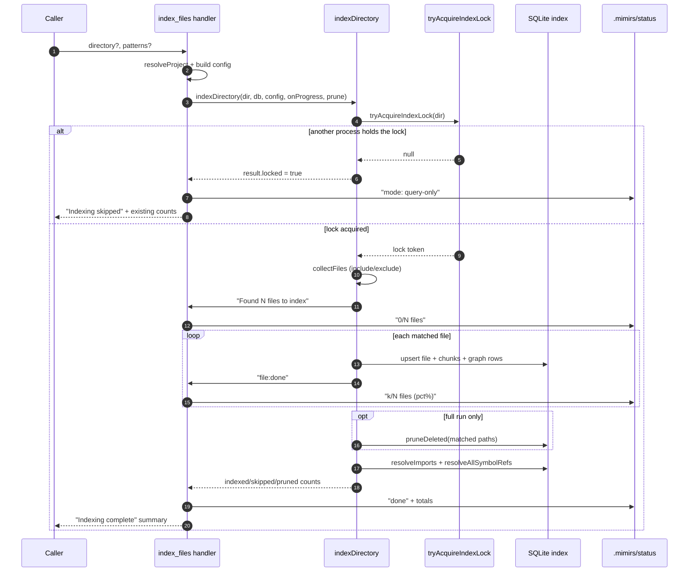

# Tool: index_files

`index_files` rebuilds the semantic search index for a project so that later calls to search, symbol lookup, and the dependency-graph tools see the current state of the code. It is the tool you call after creating or editing files when you want those changes to be findable. It reads files from disk, splits them into chunks, embeds each chunk, and writes the results into the on-disk SQLite database under `.mimirs/index.db`.

The tool has two modes that differ only in one thing: whether it deletes index rows for files that are no longer present. A full run (no `patterns`) reconciles the whole index against the project config and removes stale rows. A scoped run (with `patterns`) refreshes or adds only the matching files and never deletes anything outside that set.

The handler lives in `registerIndexTools` and delegates almost all work to `indexDirectory`; see `src/tools/index-tools.ts:24-91` and `src/indexing/indexer.ts:695-799`.

## How it works



1. The caller passes an optional `directory` and optional `patterns` array. The handler calls `resolveProject` to turn the directory into an absolute path, load `.mimirs/config.json`, and open the database (`src/tools/index.ts:22-37`). When `patterns` are supplied, the handler overrides the config's `include` list with those patterns; otherwise it uses the config as-is (`src/tools/index-tools.ts:25-26`).
2. The handler calls `indexDirectory`, passing a progress callback and `{ prune: !patterns }` so pruning happens only on full runs (`src/tools/index-tools.ts:31-53`).
3. `indexDirectory` first checks the directory is safe to index (not a home or root directory) via `checkIndexDir`, then normalizes the path to forward slashes (`src/indexing/indexer.ts:707-715`).
4. It tries to take a per-directory process lock. If another live mimirs process owns it, indexing is skipped and the result is marked locked (`src/indexing/indexer.ts:722-730`).
5. `collectFiles` walks the directory and keeps files that pass the include filter and fail the exclude filter (`src/indexing/indexer.ts:210-217`, `src/indexing/indexer.ts:734`). The count is reported as `Found N files to index`.
6. For each matched file, `processFile` reads it once, hashes it, and skips it when the stored hash matches — only changed or new files are re-embedded and rewritten (`src/indexing/indexer.ts:404-412`). Each file ends with a `file:done` progress message.
7. On a full run, `pruneDeleted` removes index rows for any file no longer in the matched set (`src/indexing/indexer.ts:774-782`).
8. When at least one file was re-indexed, the indexer resolves cross-file import paths and then symbol references, so the dependency-graph tools have fresh edges (`src/indexing/indexer.ts:785-793`).
9. The handler reads final totals from `getStatus` and returns a plain-text summary; the lock is always released in a `finally` block (`src/tools/index-tools.ts:55-90`, `src/indexing/indexer.ts:796-798`).

## Inputs

| name | type | required | description |
| --- | --- | --- | --- |
| `directory` | string | no | Directory to index. Defaults to the `RAG_PROJECT_DIR` environment variable, then the current working directory. Resolved to an absolute path and must exist (`src/tools/index.ts:26-33`). |
| `patterns` | string[] | no | Include globs such as `["src/**/*.ts", "**/*.md"]`. When present, only matching files are refreshed or added and nothing outside the set is deleted. When absent, the project's configured `include` list is used and a full reconcile (with pruning) runs (`src/tools/index-tools.ts:17-26`). |

## Outputs

| output | where it lands / shape / description |
| --- | --- |
| Result summary | Returned as MCP text content. Normal runs read `Indexing complete:` with `Indexed`, `Skipped (unchanged)`, `Pruned (deleted)`, and an optional `Errors` line (`src/tools/index-tools.ts:83-90`). |
| Locked summary | When another process owns the lock, the text instead reads `Indexing skipped:` with the lock reason and the existing file/chunk counts (`src/tools/index-tools.ts:67-80`). |
| Refreshed index | Rows in the `files`, `chunks`, `file_imports`, `file_exports`, and `symbol_refs` tables are updated for changed files and removed for pruned files (see State changes). |
| Status file | When the server passes a status writer, per-file progress and a final `done` block are written to `.mimirs/status` (`src/server/index.ts:95-108`, `src/tools/index-tools.ts:31-64`). |

## State changes

### `files` and `chunks` rows

Before a run these tables hold the previous index snapshot. After it, every changed file has been rewritten and (on full runs) deleted files are gone.

For a changed file, `upsertFileStart` updates the existing row in place rather than deleting and reinserting, so the `files.id` stays stable and any references that point at it remain valid; it deletes the file's old chunk rows (and their vector embeddings) first, then `insertChunkBatch` writes the new chunks (`src/db/files.ts:39-69`, `src/db/files.ts:82-108`). New files get a fresh `files` row and chunks. Unchanged files (matching hash) are left untouched and counted as skipped.

This matters because chunks are the unit search returns. A stale chunk set would make search point at code that no longer exists.

### `file_imports`, `file_exports`, and `symbol_refs` rows

For each re-indexed file, `upsertFileGraph` deletes the file's existing import and export rows and writes the freshly parsed ones, and the symbol-reference rewrite deletes and repopulates `symbol_refs` for the file (`src/db/graph.ts:720-742`, `src/db/graph.ts:17`). These three tables back the dependency-graph tools ([depends_on](../tools/depends-on.md), [depended_on_by](../tools/depended-on-by.md), and [find_usages](../tools/find-usages.md)).

Although these tables declare `ON DELETE CASCADE` foreign keys in the schema, that cascade is inert: bun:sqlite leaves `PRAGMA foreign_keys` off, so the database never auto-deletes child rows. Every delete here is performed explicitly in code — by `upsertFileGraph`, by the symbol-ref rewrite, and by `pruneDeleted`/`removeFile` — never by the engine (`src/db/graph.ts:727-728`).

### `.mimirs/status` file

Before a run the status file holds whatever the server last wrote. During the run the progress callback rewrites it to `0/N files`, then `k/N files (pct%)` as each file completes, and finally a `done` block listing the indexed/skipped/pruned counts and the database totals (`src/tools/index-tools.ts:34-64`). The file write itself happens in the server's `writeStatus`, which appends a process identifier line and writes to `.mimirs/status` (`src/server/index.ts:100-108`). When the index handler is invoked outside a server context, no status writer is passed and these writes are skipped (`src/tools/index-tools.ts:32`).

## Branches and failure cases

| Condition | Behavior |
| --- | --- |
| No `patterns` (full run) | Uses configured `include`; runs with `prune: true`, so deleted/now-excluded files are removed (`src/tools/index-tools.ts:26`, `src/tools/index-tools.ts:53`). |
| `patterns` provided (scoped run) | Overrides `include` with the patterns; runs with `prune: false`, leaving files outside the set untouched (`src/tools/index-tools.ts:26`, `src/indexing/indexer.ts:774`). |
| Another process holds the lock | `indexDirectory` returns early with `locked: true`; the handler emits the query-only summary and the existing index stays usable (`src/indexing/indexer.ts:722-730`, `src/tools/index-tools.ts:67-80`). |
| Unsafe directory | `checkIndexDir` rejects home/root-style directories and `indexDirectory` throws before any lock or write (`src/indexing/indexer.ts:707-711`). |
| Directory does not exist | `resolveProject` throws `Directory does not exist` before indexing begins (`src/tools/index.ts:30-32`). |
| File unchanged | Hash matches the stored hash, so the file is skipped and counted in `skipped` (`src/indexing/indexer.ts:409-412`). |
| File too large | Files over 50 MB are skipped without reading fully into memory (`src/indexing/indexer.ts:395-402`). |
| Minified/obfuscated file | Average line length over 1000 chars marks the file as unstructured and skips it (`src/indexing/indexer.ts:419-425`). |
| Unsupported extension or empty content | Skipped after parsing (`src/indexing/indexer.ts:432-440`). |
| Per-file error | Caught, appended to `result.errors`, and reported in the summary; other files still process (`src/indexing/indexer.ts:764-768`, `src/tools/index-tools.ts:87`). |
| Abort signal | When an `AbortSignal` (passed by the file watcher, not by this tool) fires, the loop stops between files and pruning/resolution is skipped (`src/indexing/indexer.ts:745-746`, `src/indexing/indexer.ts:772`). |
| No files re-indexed | Import and symbol resolution are skipped entirely, since there is nothing new to resolve (`src/indexing/indexer.ts:785`). |

The tool itself does not abort on large projects; a project exceeding the warn threshold of 200,000 files is logged but still indexed (`src/indexing/indexer.ts:59-63`).

## Example

Full reconcile of the current project:

```json
{}
```

Refresh only Markdown and TypeScript under `src/`, leaving everything else in the index alone:

```json
{
  "directory": "/Users/example/repos/myproject",
  "patterns": ["**/*.md", "src/**/*.ts"]
}
```

A normal completion returns text shaped like:

```
Indexing complete:
  Indexed: 12
  Skipped (unchanged): 340
  Pruned (deleted): 2
```

To shrink the index, edit the `exclude` list in `.mimirs/config.json` and run `index_files` with no `patterns`, so a full run prunes the now-excluded files (`src/tools/index-tools.ts:21`).

## Key source files

- `src/tools/index-tools.ts` — registers `index_files` (and the sibling `index_status` and `remove_file` tools); builds the progress callback and the summary text.
- `src/indexing/indexer.ts` — `indexDirectory` orchestration: locking, file collection, per-file processing, pruning, and graph resolution.
- `src/utils/index-lock.ts` — the per-directory process lock that funnels concurrent indexers into one writer.
- `src/db/files.ts` — `upsertFileStart`, `insertChunkBatch`, `pruneDeleted`, and `getStatus` that read and write the `files`/`chunks` tables.
- `src/db/graph.ts` — `upsertFileGraph` and the symbol-ref rewrite that maintain the import/export/reference tables.

## Related tools

- [index_status](../tools/index-status.md) reports the current counts without changing anything.
- [remove_file](../tools/remove-file.md) deletes one file's rows without a full reconcile.
